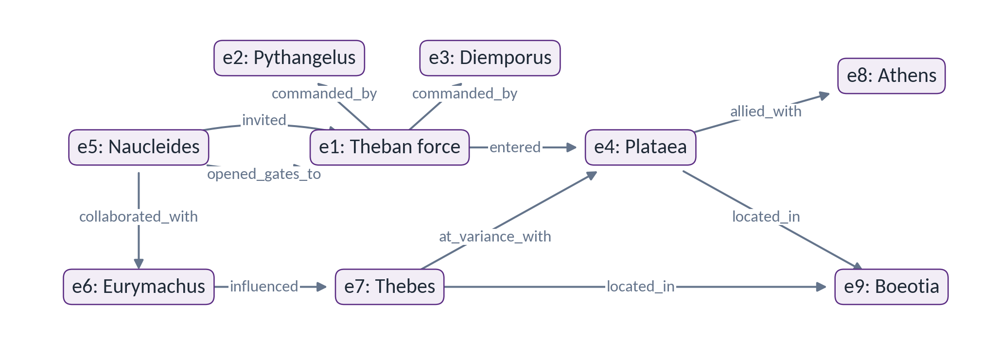
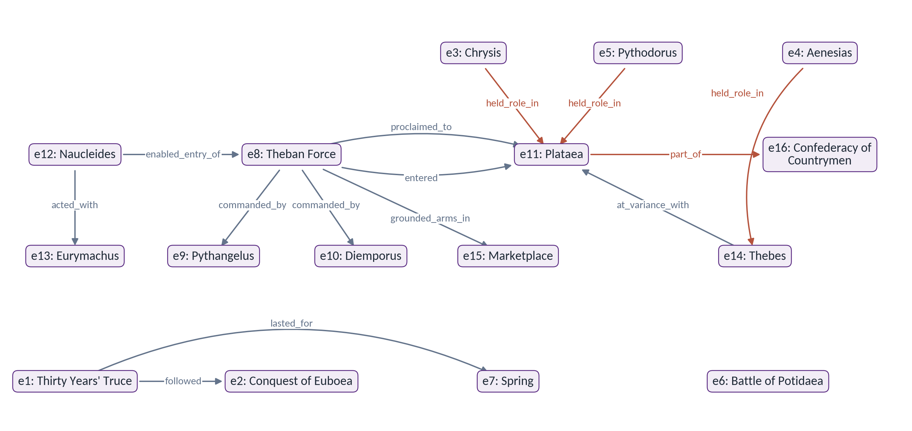
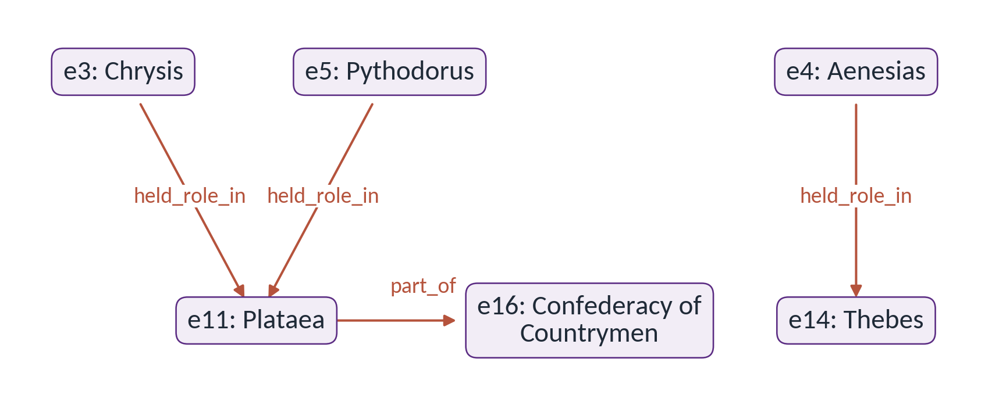

# AI Applications for Language Analysis: worked examples

Stergios Chatzikyriakidis, ILSP. CLARIN:EL Summer School, 24 September 2026.

Complete texts, prompts, recorded outputs and explanations for the eleven activities. Recorded results retain their dates and source credits.

## A. Rhyme: the worked example was already in the prompt


App: <https://greek-app-heaven-rhyme.livelyhill-85880e66.westeurope.azurecontainerapps.io>.


The four-line Seferis stanza below provides a comparison of Few-Shot, Zero-Shot Structured and phonological verification. Both tested rhyme pairs occur in the Few-Shot prompt. The comparison concerns evidence and evaluation design as well as rhyme recognition.

### Exact input and reference analysis


```text
Πάνω στην άμμο την ξανθή
γράψαμε τ' όνομά της·
ωραία που φύσηξεν ο μπάτης
και σβήστηκε η γραφή.
```


| Lines | Pair | Reference from the existing verifier | Explanation |
| --- | --- | --- | --- |
| 1 / 4 | ξανθή / γραφή | PURE, M, IDV | Stress is final. The matching domain starts at the stressed vowel; the preceding vowel also matches. |
| 2 / 3 | όνομά της / μπάτης | PURE, F2, MOSAIC | The rhyme domain crosses the boundary between όνομά and της. Compare the sound sequence from the stressed vowel through the line ending. |


M means final stress; F2 penultimate; F3 antepenultimate. PURE concerns the rhyme
domain from the stressed vowel onward. RICH asks for additional agreement of the onset
before that vowel. IDV is identity of the preceding vowel. MOS or MOSAIC marks a rhyme
spanning words. IMP marks an imperfect match; COPY marks repetition. These dimensions
are not mutually exclusive: a pair can be pure, F2 and mosaic together.

For όνομά της, treating only the final written word της as the rhyme-bearing unit loses
the accent and the cross-word sequence. The onset difference in ['ma tis] versus
['ba-tis] does not prevent the vowel-and-following-material rhyme. A token-based model
can generate plausible terminology without a stable phonological comparison. The
observed prompt overlap, rather than an assertion about hidden training data, is the
specific reason this first result is not an independent test.

### Comparing the three configurations

1. Select one available model associated with the authorised key. Record its displayed
   name. Gemini 3.5 Flash-Lite produced the saved Few-Shot answer on 23 September.
2. Set **Few-Shot**, **RAG off**, **verification off**, paste the exact stanza and click
   **Ανάλυση (Analyze)**. The verification box is normally selected, so explicitly clear it.
3. Save the complete result. Does success on this poem predict success on another?
   Compare the returned labels with the reference analysis.
4. Read the two Seferis examples in the prompt below. Its line numbers 5 to 8 refer to the
   source poem, while the pasted input numbers the same four lines 1 to 4.
5. Select **Zero-Shot Structured**, keep the same model and both switches off, then run
   the same input. Save it. Identify the exact changed claim. A correct answer is also a result; the verification comparison still has value.
6. Keep that strategy and model, turn **verification on**, leave RAG off and Analyze.
   Read **INITIAL LLM ANALYSIS**, **PHONOLOGICAL VERIFICATION**, then
   **LLM REFLECTION & CORRECTION**. This starts a fresh initial model analysis; it does
   not submit the previous run's saved answer. Compare initial and final within this run.
7. If the app or model fails, use the exact prompts and preserved verifier result below.
   The recorded Few-Shot answer appears below. The zero-shot comparison is run in the app.

### Recorded Few-Shot answer, 23 September

Gemini 3.5 Flash-Lite, RAG off, verification off. The live request completed in 14.112 seconds. Both rhyme pairs were already supplied in the prompt.

```text
Here is the systematic analysis of the rhyme pairs in the provided poem, following your framework:

═══════════════════════════════════════════════════
PAIR 1: Line 1 & Line 4

- Line 1: "Πάνω στην άμμο την ξανθή" [pa-no stin 'a-mo tin ksan-'Ti]
- Line 4: "και σβήστηκε η γραφή" [ce 'zvi-sti-ce i Gra-'fi]

→ Classification: M-IDV

Reasoning:
- Both lines have stress on the final syllable → Masculine (M)
- Rhyme domain: ['Ti] vs ['fi]
- Stressed vowels match: [i] = [i] ✓
- No post-stress consonants in either line
- Pre-stress vowel: [A] in [ksAn-Ti] matches [A] in [GrA-fi] → IDV (Pre-vowel Identity)

═══════════════════════════════════════════════════
PAIR 2: Line 2 & Line 3

- Line 2: "γράψαμε τ' όνομά της" ['Gra-psa-me 'to-no-'ma tis]
- Line 3: "ωραία που φύσηξεν ο μπάτης" [o-'re-a pu 'fi-si-ksen o 'ba-tis]

→ Classification: F2-MOS

Reasoning:
- Both lines have stress on the penultimate syllable → Feminine-2 (F2)
- Rhyme domains: ['ma tis] vs ['ba-tis]
- Stressed vowels match: [a] = [a] ✓
- Post-stress consonants match: [tis] = [tis] ✓
- Line 2 rhyme crosses a word boundary (from noun to clitic pronoun: "όνομά" + "της"), whereas Line 3 contains the rhyming material within a single word ("μπάτης") → MOS (Mosaic)

═══════════════════════════════════════════════════

**Summary of Poem Rhyme Scheme:**
- Line 1 & Line 4: **M-IDV** (ξανθή / γραφή)
- Line 2 & Line 3: **F2-MOS** (όνομά της / μπάτης)
```

### Optional Solomos comparison

These are the two public-domain stanzas requested in the original worksheet. They are
additional inputs, not the tested Seferis few-shot reveal. The expected stress classes
are reference classifications for the exercise.


```text
Σε γνωρίζω από την κόψη
του σπαθιού την τρομερή,
σε γνωρίζω από την όψη
που με βία μετράει τη γη.
```


```text
Απ' τα κόκαλα βγαλμένη
των Ελλήνων τα ιερά,
και σαν πρώτα ανδρειωμένη,
χαίρε, ω χαίρε, ελευθεριά!
```


| Pair | Expected stress class |
| --- | --- |
| κόψη / όψη | F2 |
| τρομερή / γη | M |
| βγαλμένη / ανδρειωμένη | F2 |
| ιερά / ελευθεριά | M |


### Complete prompts and exact verifier output

The source prompts below contain the Seferis stanza with RAG off. Examples inside them are supplied to the model.


#### Few-Shot: complete demonstration prompt


```text
You are a Greek rhyme pattern analyzer. Study these examples:

═══════════════════════════════════════════════════
EXAMPLE 1 - Masculine Rich Rhyme with Pre-vowel Identity:

Line 5: "Πάνω στην άμμο την ξανθή" [pa-no stin 'a-mo tin ksan-'Ti]
Line 8: "και σβήστηκε η γραφή" [ce 'zvi-sti-ce i Gra-'fi]

→ Classification: M-IDV

Reasoning:
- Both have stress on final syllable → Masculine (M)
- Rhyme domain: ['Ti] vs ['fi]
- Stressed vowels match: [i] = [i] ✓
- No post-stress consonants in either
- Pre-stress vowel: [A] in [ksAn-Ti] matches [A] in [GrA-fi] → IDV

═══════════════════════════════════════════════════
EXAMPLE 2 - Feminine-2 Mosaic:

Line 6: "γράψαμε τ' όνομά της" ['Gra-psa-me 'to-no-'ma tis]
Line 7: "ωραία που φύσηξεν ο μπάτης" [o-'re-a pu 'fi-si-ksen o 'ba-tis]

→ Classification: F2-MOS

Reasoning:
- Penultimate stress → F2
- Line 6 rhyme crosses words: ['ma tis]
- Line 7 rhyme: ['ba-tis]
- Stressed [a] = [a], following [tis] = [tis] ✓
- Rhyme spans word boundary in L6 → MOS

═══════════════════════════════════════════════════
EXAMPLE 3 - Feminine-3 Imperfect (vowel variation):

Line 1: "χάνετε" ['xa-ne-te]
Line 2: "γίνετε" ['ji-ne-te]

→ Classification: F3-IMP-V

Reasoning:
- Antepenultimate stress → F3
- Rhyme domains: ['a-ne-te] vs ['i-ne-te]
- Stressed vowels differ: [a] ≠ [i] → IMP-V
- Post-stress material matches: [-ne-te] = [-ne-te] ✓
- Imperfect due to vowel difference only

═══════════════════════════════════════════════════
EXAMPLE 4 - F3 Pure Rhyme:

Line X: "στόματα" ['sto-ma-ta]
Line Y: "σώματα" ['so-ma-ta]

→ Classification: F3-PURE

Reasoning:
- Antepenultimate stress → F3
- Rhyme domains: ['o-ma-ta] vs ['o-ma-ta]
- Stressed vowels match: [o] = [o] ✓
- Post-stress material matches: [-ma-ta] = [-ma-ta] ✓
- Perfect rhyme, no imperfection
- Note: Onsets [st] vs [s] differ, so not RICH

═══════════════════════════════════════════════════


Now analyze the following Greek poem using the same systematic approach. For each rhyme pair:
1. Identify line numbers
2. Show phonetic transcription
3. Determine position classification (M/F2/F3)
4. Check for all features (RICH, IDV, MOS, IMP, COPY)
5. Provide final classification code

POEM:
Πάνω στην άμμο την ξανθή
γράψαμε τ' όνομά της·
ωραία που φύσηξεν ο μπάτης
και σβήστηκε η γραφή.
```


#### Zero-Shot Structured: complete demonstration prompt


```text
You are a Greek poetry rhyme analyzer. Your task is to identify rhyme patterns in Modern Greek poetry.

RHYME TAXONOMY:

1. **Position-based Classification:**
   - M (Masculine): Rhyme from final stressed vowel to line end
   - F2 (Feminine-2): Rhyme from penultimate stressed vowel to line end  
   - F3 (Feminine-3): Rhyme from antepenultimate stressed vowel to line end

2. **Complexity Features:**
   
   **RICH (onset consonants match):**
   - TR-S: Total rich with singleton onset (καλά - ξαλά)
   - TR-CC: Total rich with complex onset (αυγή - ναυγή)
   - PR-C1: Partial rich, first consonant matches (στόματα - σώματα)
   - PR-C2: Partial rich, second consonant matches (φοβερίζουν - τρίζουν)
   - PR-CC1/PR-CC2: Partial rich with complex onsets
   
   **IDV (Pre-rhyme vowel identity):**
   - Vowel before stressed syllable matches
   - IDV-2W: Matches across word boundaries
   
   **MOS (Mosaic):**
   - Rhyme domain crosses word boundaries
   
   **IMP (Imperfect):**
   - IMP-V: Stressed vowel differs (χάνετε - γίνετε)
   - IMP-C: Consonants differ (ξαφνίζει - τεχνίτη)
   - IMP-0F: Final consonant-zero alternation
   - IMP-0M: Medial consonant-zero alternation
   
   **COPY:**
   - Complete word/phrase repetition

ANALYSIS PROCEDURE:
1. Identify line-final stress position
2. Extract rhyme domain (from stressed vowel rightward)
3. Compare with other lines (scan 4-line window by default)
4. Classify by position (M/F2/F3) first
5. Then identify features (RICH, IDV, MOS, IMP, COPY)
6. Use phonetic similarity, NOT just orthography

For each rhyme pair, provide:
- Line numbers
- Rhyme domain in phonetic transcription
- Classification (e.g., M-TR-S-IDV, F2-MOS-IDV-2W, F3-IMP-V-PR-C1)
- Brief explanation


POEM TO ANALYZE:
Πάνω στην άμμο την ξανθή
γράψαμε τ' όνομά της·
ωραία που φύσηξεν ο μπάτης
και σβήστηκε η γραφή.
```


#### Exact local verifier report


```text
PHONOLOGICAL ANALYSIS (GROUND TRUTH):
Found 2 valid rhyme pair(s) in the poem:

  ✓ Lines 1-4: ξανθή / γραφή (PURE, M, IDV)
  ✓ Lines 2-3: όνομά της / μπάτης (PURE, F2, MOSAIC)

Please compare this ground truth with your analysis.
Identify any differences:
  - Did you correctly identify all rhyme pairs?
  - Did you correctly classify the rhyme types (M/F2/F3)?
  - Did you correctly classify the rhyme quality (PURE/RICH/IMPERFECT)?
  - Did you correctly identify MOSAIC rhymes (rhyme domain spans word boundaries)?
  - Did you claim any pairs that don't actually rhyme?
```


The report calls its result “GROUND TRUTH”. Here that label denotes the output of phonological rules, whose correctness can itself be assessed.


#### Feedback within a verification run

The second call receives the poem, the fresh initial answer and the phonological report. Compare all three with the final response. No preselected error is required for this comparison.

#### Additional available template: 02_few_shot_cot.txt


```text
Identify Greek rhyme patterns with explicit step-by-step analysis.

═══════════════════════════════════════════════════
WORKED EXAMPLE 1:

Lines:
L5: "Πάνω στην άμμο την ξανθή"
L8: "και σβήστηκε η γραφή"

REASONING PROCESS:

Step 1 - Syllabification & Stress:
L5: [pa-no stin 'a-mo tin ksan-'Ti] → stress on final 'Ti (oxytone)
L8: [ce 'zvi-sti-ce i Gra-'fi] → stress on final 'fi (oxytone)

Step 2 - Rhyme Domain Extraction:
L5: From stress rightward: ['Ti]
L8: From stress rightward: ['fi]

Step 3 - Sound Comparison:
- Stressed vowels: [i] = [i] ✓
- Post-stress consonants: none in both ✓
- RHYME CONFIRMED

Step 4 - Position Classification:
Stress on final syllable → MASCULINE (M)

Step 5 - Feature Analysis:
- Onset check: [T] vs [f] → different, not RICH
- Pre-stress vowel: [A] in [ksAn-'Ti] vs [A] in [GrA-'fi] ✓ → IDV
- No word-boundary crossing
- Perfect vowel/consonant match, not imperfect
- Not a repetition

**FINAL: M-IDV**

═══════════════════════════════════════════════════
WORKED EXAMPLE 2:

Lines:
L6: "γράψαμε τ' όνομά της"
L7: "ωραία που φύσηξεν ο μπάτης"

REASONING PROCESS:

Step 1 - Syllabification & Stress:
L6: ['Gra-psa-me 'to-no-'ma tis] → stress on 'ma (penultimate in phrase)
L7: [o-'re-a pu 'fi-si-ksen o 'ba-tis] → stress on 'ba (penultimate)

Step 2 - Rhyme Domain Extraction:
L6: ['ma tis] - NOTE: crosses word boundary!
L7: ['ba-tis]

Step 3 - Sound Comparison:
- Stressed vowels: [a] = [a] ✓
- Following material: [tis] = [tis] ✓
- RHYME CONFIRMED

Step 4 - Position Classification:
Stress on penultimate → FEMININE-2 (F2)

Step 5 - Feature Analysis:
- Onset check: [m] vs [b] → different, not RICH
- Pre-stress vowel: In L6 [O] (ό-νο-μά), in L7 [A] (μπά-της) → different, no IDV
- Word-boundary: L6 spans "ονομά + της" → MOS
- Perfect match within domain, not imperfect
- Not a repetition

**FINAL: F2-MOS**

═══════════════════════════════════════════════════
WORKED EXAMPLE 3:

Lines:
L1: "στόματα" ['sto-ma-ta]
L2: "σώματα" ['so-ma-ta]

REASONING PROCESS:

Step 1 - Syllabification & Stress:
L1: ['sto-ma-ta] → stress on antepenult 'sto
L2: ['so-ma-ta] → stress on antepenult 'so

Step 2 - Rhyme Domain Extraction:
L1: ['o-ma-ta] (from stressed vowel)
L2: ['o-ma-ta] (from stressed vowel)

Step 3 - Sound Comparison:
- Stressed vowels: [o] = [o] ✓
- Post-stress: [-ma-ta] = [-ma-ta] ✓
- Perfect match!

Step 4 - Position Classification:
Stress on antepenultimate → FEMININE-3 (F3)

Step 5 - Feature Analysis:
- Onset check: [st] vs [s] → different, not RICH
- Pre-stress vowel: none (already at antepenult)
- No word-boundary crossing
- Perfect vowel and consonant match → PURE
- Not a repetition

**FINAL: F3-PURE**

═══════════════════════════════════════════════════


Now analyze the following poem using the same detailed five-step reasoning. Show your work for each rhyme pair:

Πάνω στην άμμο την ξανθή
γράψαμε τ' όνομά της·
ωραία που φύσηξεν ο μπάτης
και σβήστηκε η γραφή.
```


#### Additional available template: 04_zero_shot_cot.txt


```text
Analyze Greek poetry rhyme patterns using step-by-step reasoning.

SYSTEMATIC ANALYSIS FRAMEWORK:

For each potential rhyme pair, work through:

**STEP 1: Phonetic Analysis**
- Break line into syllables
- Locate primary stress (oxytone/paroxytone/proparoxytone)
- Transcribe sounds after stress

**STEP 2: Rhyme Domain Identification**
- Extract from stressed vowel to line end
- Note if domain crosses word boundaries
- Compare with other lines (4-line window default)

**STEP 3: Position Classification**
- Count syllables from stress to end
- 1 syllable from stress → M (Masculine)
- 2 syllables from stress → F2 (Feminine-2)
- 3 syllables from stress → F3 (Feminine-3)

**STEP 4: Feature Detection**
Check each feature systematically:
- Onset consonants match? → RICH (specify type: TR-S/TR-CC/PR-C1/PR-C2)
- Pre-stress vowel matches? → IDV (or IDV-2W if across words)
- Domain spans words? → MOS
- Vowels/consonants differ? → IMP (specify: IMP-V/IMP-C/IMP-0F/IMP-0M)
- Complete repetition? → COPY

**STEP 5: Classification Synthesis**
- Combine position + all applicable features
- Format: POSITION-FEATURE1-FEATURE2-...
- Example: M-TR-S-IDV or F2-MOS-IDV-2W-IMP-C


Now analyze this poem, showing explicit reasoning for each rhyme:

Πάνω στην άμμο την ξανθή
γράψαμε τ' όνομά της·
ωραία που φύσηξεν ο μπάτης
και σβήστηκε η γραφή.
```


### Inconsistencies preserved from the source

- The first Few-Shot example is titled "Masculine Rich Rhyme with Pre-vowel Identity", but its classification is `M-IDV`, without RICH.
- `στόματα / σώματα` is given as the `PR-C1` example in Zero-Shot Structured, but labelled `F3-PURE` and "not RICH" in both few-shot prompts. The generic RAG fallback labels the same pair `F3-IMP-V` and says "vowel variation", despite the matching stressed vowels shown in its own transcription.
- Some examples call strings including the onset consonant, such as `['Ti]` and `['fi]`, the rhyme domain, although the stated definition begins at the stressed vowel.

These notes identify differences within the code. The exported templates intentionally preserve them; no silent correction has been made.


### Questions, answers and limits to explain

- **What did few-shot establish?** That this configuration could use supplied examples;
  both target rhyme pairs were among those examples. It is not an unseen-item evaluation.
- **Why does the boundary matter?** The rhyme-bearing sound sequence includes material
  from two words on one line. Last-word matching alone represents the task incorrectly.
- **What did the symbolic component contribute?** A separately computed comparison of
  rhyme domains and classifications, followed by feedback the model can accept or ignore.
- **Would correct zero-shot output invalidate the exercise?** No. Inspect independent
  agreement and its basis; do not claim an error that did not occur.
- **Does this prove neural models cannot rhyme?** No. The argument is about the observed
  configuration, evidence and evaluation. Do not generalise from this one stanza.


## B. MEDEA emotions: the same passage, theory in prompts and rules


Emotion page: <https://greek-app-heaven-medea.livelyhill-85880e66.westeurope.azurecontainerapps.io/emotions>. NeSy page: <https://greek-app-heaven-medea.livelyhill-85880e66.westeurope.azurecontainerapps.io/emotions-nesy>.


### Exact English input: Iliad 1.172 to 1.224

Use this complete passage for Standard, Cairns and every NeSy mode. Do not use only the short quotations on a slide. A. T. Murray translation, 1924 to 1925, public domain, from Perseus.


```text
Then the king of men, Agamemnon, answered him:

“Flee then, if your heart urges you; I do not beg you to remain for my sake. With me are others who will honour me, and above all Zeus, the lord of counsel. Most hateful to me are you of all the kings that Zeus nurtures, for always strife is dear to you, and wars and battles. If you are very strong, it was a god, I think, who gave you this gift. Go home with your ships and your companions and lord it over the Myrmidons; for you I care not, nor take heed of your wrath. But I will threaten you thus: as Phoebus Apollo takes from me the daughter of Chryses, her with my ship and my companions I will send back, but I will myself come to your tent and take the fair-cheeked Briseis, your prize, so that you will understand how much mightier I am than you, and another may shrink from declaring himself my equal and likening himself to me to my face.”

So he spoke. Grief came upon the son of Peleus, and within his shaggy breast his heart was divided, whether he should draw his sharp sword from beside his thigh, and break up the assembly, and slay the son of Atreus, or stay his anger and curb his spirit. While he pondered this in mind and heart, and was drawing from its sheath his great sword, Athene came from heaven. The white-armed goddess Hera had sent her forth, for in her heart she loved and cared for both men alike. She stood behind him, and seized the son of Peleus by his fair hair, appearing to him alone. No one of the others saw her. Achilles was seized with wonder, and turned around, and immediately recognized Pallas Athene. Terribly her eyes shone. Then he addressed her with winged words, and said:

“Why now, daughter of aegis-bearing Zeus, have you come? Is it so that you might see the arrogance of Agamemnon, son of Atreus? One thing I will tell you, and I think this will be brought to pass: through his own excessive pride shall he presently lose his life.”

Him then the goddess, bright-eyed Athene, answered:

“I have come from heaven to stay your anger, if you will obey, The goddess white-armed Hera sent me forth, for in her heart she loves and cares for both of you. But come, cease from strife, and do not grasp the sword with your hand. With words indeed taunt him, telling him how it shall be. For thus will I speak, and this thing shall truly be brought to pass. Hereafter three times as many glorious gifts shall be yours on account of this arrogance. But refrain, and obey us.”

In answer to her spoke swift-footed Achilles:

“It is necessary, goddess, to observe the words of you two, however angered a man be in his heart, for is it better so. Whoever obeys the gods, to him do they gladly give ear.”

He spoke, and stayed his heavy hand on the silver hilt, and back into its sheath thrust the great sword, and did not disobey the word of Athene. She returned to Olympus to the palace of aegis-bearing Zeus, to join the company of the other gods. But the son of Peleus again addressed with violent words the son of Atreus, and in no way ceased from his wrath:
```


### Greek source, for close reading

This is the corresponding Greek reference. The preserved model runs used English; the Greek-language route was not tested.


```text
τὸν δʼ ἠμείβετʼ ἔπειτα ἄναξ ἀνδρῶν Ἀγαμέμνων·
φεῦγε μάλʼ εἴ τοι θυμὸς ἐπέσσυται, οὐδέ σʼ ἔγωγε
λίσσομαι εἵνεκʼ ἐμεῖο μένειν· πάρʼ ἔμοιγε καὶ ἄλλοι
οἵ κέ με τιμήσουσι, μάλιστα δὲ μητίετα Ζεύς.
ἔχθιστος δέ μοί ἐσσι διοτρεφέων βασιλήων·
αἰεὶ γάρ τοι ἔρις τε φίλη πόλεμοί τε μάχαι τε·
εἰ μάλα καρτερός ἐσσι, θεός που σοὶ τό γʼ ἔδωκεν·
οἴκαδʼ ἰὼν σὺν νηυσί τε σῇς καὶ σοῖς ἑτάροισι
Μυρμιδόνεσσιν ἄνασσε, σέθεν δʼ ἐγὼ οὐκ ἀλεγίζω,
οὐδʼ ὄθομαι κοτέοντος· ἀπειλήσω δέ τοι ὧδε·
ὡς ἔμʼ ἀφαιρεῖται Χρυσηΐδα Φοῖβος Ἀπόλλων,
τὴν μὲν ἐγὼ σὺν νηΐ τʼ ἐμῇ καὶ ἐμοῖς ἑτάροισι
πέμψω, ἐγὼ δέ κʼ ἄγω Βρισηΐδα καλλιπάρῃον
αὐτὸς ἰὼν κλισίην δὲ τὸ σὸν γέρας ὄφρʼ ἐῢ εἰδῇς
ὅσσον φέρτερός εἰμι σέθεν, στυγέῃ δὲ καὶ ἄλλος
ἶσον ἐμοὶ φάσθαι καὶ ὁμοιωθήμεναι ἄντην.
ὣς φάτο· Πηλεΐωνι δʼ ἄχος γένετʼ, ἐν δέ οἱ ἦτορ
στήθεσσιν λασίοισι διάνδιχα μερμήριξεν,
ἢ ὅ γε φάσγανον ὀξὺ ἐρυσσάμενος παρὰ μηροῦ
τοὺς μὲν ἀναστήσειεν, ὃ δʼ Ἀτρεΐδην ἐναρίζοι,
ἦε χόλον παύσειεν ἐρητύσειέ τε θυμόν.
ἧος ὃ ταῦθʼ ὥρμαινε κατὰ φρένα καὶ κατὰ θυμόν,
ἕλκετο δʼ ἐκ κολεοῖο μέγα ξίφος, ἦλθε δʼ Ἀθήνη
οὐρανόθεν· πρὸ γὰρ ἧκε θεὰ λευκώλενος Ἥρη
ἄμφω ὁμῶς θυμῷ φιλέουσά τε κηδομένη τε·
στῆ δʼ ὄπιθεν, ξανθῆς δὲ κόμης ἕλε Πηλεΐωνα
οἴῳ φαινομένη· τῶν δʼ ἄλλων οὔ τις ὁρᾶτο·
θάμβησεν δʼ Ἀχιλεύς, μετὰ δʼ ἐτράπετʼ, αὐτίκα δʼ ἔγνω
Παλλάδʼ Ἀθηναίην· δεινὼ δέ οἱ ὄσσε φάανθεν·
καί μιν φωνήσας ἔπεα πτερόεντα προσηύδα·
τίπτʼ αὖτʼ αἰγιόχοιο Διὸς τέκος εἰλήλουθας;
ἦ ἵνα ὕβριν ἴδῃ Ἀγαμέμνονος Ἀτρεΐδαο;
ἀλλʼ ἔκ τοι ἐρέω, τὸ δὲ καὶ τελέεσθαι ὀΐω·
ᾗς ὑπεροπλίῃσι τάχʼ ἄν ποτε θυμὸν ὀλέσσῃ.
τὸν δʼ αὖτε προσέειπε θεὰ γλαυκῶπις Ἀθήνη·
ἦλθον ἐγὼ παύσουσα τὸ σὸν μένος, αἴ κε πίθηαι,
οὐρανόθεν· πρὸ δέ μʼ ἧκε θεὰ λευκώλενος Ἥρη
ἄμφω ὁμῶς θυμῷ φιλέουσά τε κηδομένη τε·
ἀλλʼ ἄγε λῆγʼ ἔριδος, μηδὲ ξίφος ἕλκεο χειρί·
ἀλλʼ ἤτοι ἔπεσιν μὲν ὀνείδισον ὡς ἔσεταί περ·
ὧδε γὰρ ἐξερέω, τὸ δὲ καὶ τετελεσμένον ἔσται·
καί ποτέ τοι τρὶς τόσσα παρέσσεται ἀγλαὰ δῶρα
ὕβριος εἵνεκα τῆσδε· σὺ δʼ ἴσχεο, πείθεο δʼ ἡμῖν.
τὴν δʼ ἀπαμειβόμενος προσέφη πόδας ὠκὺς Ἀχιλλεύς·
χρὴ μὲν σφωΐτερόν γε θεὰ ἔπος εἰρύσσασθαι
καὶ μάλα περ θυμῷ κεχολωμένον· ὧς γὰρ ἄμεινον·
ὅς κε θεοῖς ἐπιπείθηται μάλα τʼ ἔκλυον αὐτοῦ.
ἦ καὶ ἐπʼ ἀργυρέῃ κώπῃ σχέθε χεῖρα βαρεῖαν,
ἂψ δʼ ἐς κουλεὸν ὦσε μέγα ξίφος, οὐδʼ ἀπίθησε
μύθῳ Ἀθηναίης· ἣ δʼ Οὔλυμπον δὲ βεβήκει
δώματʼ ἐς αἰγιόχοιο Διὸς μετὰ δαίμονας ἄλλους.
Πηλεΐδης δʼ ἐξαῦτις ἀταρτηροῖς ἐπέεσσιν
Ἀτρεΐδην προσέειπε, καὶ οὔ πω λῆγε χόλοιο·
```


### 1. Emotion analysis: what theory adds to a prompt

Use Homer, Iliad 1.172 to 1.224: Agamemnon threatens to take Achilles' prize, Achilles considers killing him, Athene intervenes, and Achilles sheathes the sword while remaining angry. Use `medea_cairns_passage_en.txt` for the shared run; keep `medea_cairns_passage_grc.txt` alongside for the Greek. The input files contain the source passage without teaching labels.

Open [Emotion Knowledge Graph](https://greek-app-heaven-medea.livelyhill-85880e66.westeurope.azurecontainerapps.io/emotions). Keep the same text and AI provider. Set Text Language to English for this shared comparison. Use the same Analysis Mode and visualization settings in both runs; leave Include Negative Emotions enabled.

1. Leave **Enable Script-Based Analysis** unticked. Paste the English passage and choose **Analyze Emotions**. Read the **Emotions** tab. Save the response using **Download JSON** or **Copy Results**.
2. Tick **Enable Script-Based Analysis**, under **Enhanced Analysis (Cairns Framework)**, and choose **Analyze Emotions** again. Read **Emotions**, then the available **Script Flow** and **Annotated Text** views. Save this response too.
3. Compare what is actually supported by the passage: the insult, the appraisal of status, the contemplated retaliation, Athene's intervention and Achilles' continuing anger.
4. Reveal the prompts in `medea_standard_prompt.txt` and `medea_cairns_prompt.txt`. The enhanced prompt explicitly asks for eliciting conditions, appraisals, physiological responses, expressive behaviours, action tendencies, cultural norms and moral evaluations. It also gives metaphor examples and honour/shame instructions.

The teaching point is that theory changes the structure of the question, not merely the length of the answer. The model is asked to relate an emotion to a situation, an interpretation and a possible response. Treat the richer account as a hypothesis to inspect; additional fields are not by themselves evidence of greater accuracy. This is the app's implementation inspired by Cairns, not a claim that every field or rule is a verbatim formulation from Cairns.

**Does putting away the sword mean that the anger has disappeared?** The end of the passage says that Achilles has not ceased from his wrath. Distinguish an action tendency from a completed action. Consider whether the model keeps the emotions of Achilles, Agamemnon and the gods separate, and whether it invents an unsupported emotion such as fear merely to explain obedience.

**Observed in rehearsal:** Standard added relief and described grief as resolved. Cairns added the honour/status appraisals, but also cited “Burning with rage”, “Filled with grief” and “Seized by anger”, examples present in the prompt and absent from the passage. Compare the richer structure with the source and locate each alleged quotation. This makes the power and the risks of theory-rich prompting visible in the actual output.

#### What differs between the emotion configurations?

The Script-Based Analysis checkbox switches between the Standard and Cairns extraction endpoints. The separate NeSy page adds explicit symbolic processing. The six saved comparisons were made with GPT-4o on 16 September. The current app uses the selected direct provider; those historical records do not imply an Azure or cross-provider fallback today. A new run may use a different model within the selected provider's available models.

### 2. All four NeSy modes: where does the theory act?

Open [NeSy Emotions](https://greek-app-heaven-medea.livelyhill-85880e66.westeurope.azurecontainerapps.io/emotions-nesy). Paste the same English passage. Set **Genre Context: Epic**, **Language: English** and the same **AI Provider**. Leave **Enable Feedback Loop** on. Select the assigned mode, then **Analyze (Neuro-Symbolic)**. Use **Download JSON** to preserve the result before another run.

Compare one symbolic rule, revision or disagreement across the four NeSy modes using the same passage.

| Mode in the live UI | What it adds, according to the source | What the group should inspect |
|---|---|---|
| Cairns NeSy1 | Python heuristic grammar: dependencies, score adjustments and inconsistency feedback. | **Emotions**, **Symbolic Trace**, **Feedback Loop**. Which rule fired, on whose emotion, and why? |
| Cairns NeSy2 | pyDatalog rules and transitive inference, with script/label checks. | **Symbolic Trace** and **Feedback Loop**. Which inference follows from which premises? Is its premise supported by this passage? |
| Cairns NeSy3 | A semantic grammar with explicit emotion-family and action-concept categories. | **Emotions**, **Symbolic Trace**, **Feedback Loop**. Does the rule distinguish contemplating retaliation from carrying it out? |
| Cairns NeSy4 | An experimental dialogue between model and grammar, a critic, and proposed ontology amendments for human review. | **Dialogue (NeSy4)**. Does the model accept, defend or remap an interpretation? What textual evidence is offered? Are proposed rule changes justified? |

The live page also has **Normal (Basic LLM Extraction)** and **Cairns (Enhanced Framework)**. The first stage above establishes the standard/enhanced contrast using the dedicated emotion page. NeSy3 is selected by default on the NeSy page; every group must explicitly select its assigned mode.

For NeSy4, the live UI contains **Shape 1**, **Shape 2** and **Shape 3** dialogue displays. Proposed ontology changes are review items, not automatic app changes. In the source, disabling the feedback checkbox skips negotiation but does not disable all model calls for the critic and patch proposal. Do not describe that checkbox as switching the whole NeSy4 process off.

A blank feedback result can mean no actionable inconsistency was detected. Do not invent a correction to make the demonstration work. Distinguish a changed score, a reclassified emotion and a genuine correction supported by the passage. Consider whether an over-simple rule can be wrong even when it is applied consistently.

All four NeSy API runs completed. NeSy1 and NeSy2 took about 25 and 18 seconds; both relabelled explicitly stated grief as anger during feedback. NeSy3 took about 19 seconds and fired no rules. NeSy4 took about 60 seconds, defended six free-reading interpretations and proposed four ontology amendments. Its defence of explicitly stated wonder is a useful example of challenging an incomplete grammar. Inspect the separate critic's replacement of care with pity as well. The main NeSy4 result remains the baseline; dialogue findings are not automatically incorporated into it. Saved responses are in `evidence/medea_rehearsal_20260916/`.


### Measured runs

Times are elapsed client request times, including network and processing.

| Run | Seconds | Observed result |
|---|---:|---|
| Standard emotion analysis | 7.06 | Five labels, including unsupported relief after Athene intervenes. |
| Cairns enhanced prompt | 12.26 | Three labels with honour/status appraisals and scripts, but invented textual evidence. |
| NeSy1 | 24.64 | Ten trace entries, six fired rules, four inconsistency records and four feedback calls. Grief was relabelled anger. |
| NeSy2 | 18.19 | Four trace entries, two fired rules, two inconsistencies and two feedback calls. Grief was again relabelled anger. |
| NeSy3 | 18.85 | Four emotions, zero rule firings and zero inconsistencies. No symbolic correction occurred. |
| NeSy4 | 60.38 | Four baseline emotions, six dialogue turns, all defend, and four proposed ontology amendments. |
| Zeugma, full Thucydides 2.2 | 9.61 | Sixteen entities and fourteen relations. Generated Prolog contained a quotation error. |
| Zeugma, shorter selection from 2.2 | 10.40 | Nine entities and eleven relations. Working queries recovered commanders, gate-opening and collaboration. |

All requests and responses are in `evidence/medea_rehearsal_20260916/`. Each run has `_request.json`, `_response.json` and `_transfer.json` files. The standard, enhanced and NeSy1 file stems are `standard`, `cairns_enhanced` and `cairns_nesy`. Later modes are `cairns_nesy2` through `cairns_nesy4`. Exact values are in these records. Literal long dashes returned inside JSON strings are stored as Unicode escapes without changing the decoded responses.


### What to show in the emotion exercise

**Standard:** The passage ends with Achilles continuing his wrath. The output nevertheless adds relief and says grief is resolved by relief as Athene calms him. Distinguish restraint from emotional resolution.

**Cairns:** The output adds useful appraisals such as “I have been disrespected” and “My status is challenged”. However, its `textual_evidence` includes “Burning with rage”, “Filled with grief” and “Seized by anger”. All three appear in the local prompt's worked examples and none occurs in the submitted passage. “Shrouded in sorrow” is also absent from the passage; the prompt has the related example “Shrouded in grief”. This is evidence consistent with prompt-example contamination, not a controlled causal test. Physiological details such as increased heart rate and tears also exceed the text. Theory gives a richer analytical structure, which still needs checking against the passage.

**NeSy1 and NeSy2:** The rules question grief without co-occurring fear. Feedback changes the grief entity's label to anger even though the text explicitly says “Grief came upon the son of Peleus”. The feedback also discusses Agamemnon while the target grief belongs to Achilles. A feedback item marked resolved therefore does not establish correction. Inspect the premise, character attribution and final label together.

**NeSy3:** The labels are wrath, grief, indignation and helplessness. The displayed grammar compliance is 1.0, with no rule firings. This is compatibility with the representation's categories, not verified historical or literary accuracy. The constrained extraction misses the explicitly named wonder and adds interpretations such as helplessness that require discussion.

**NeSy4:** The free reading recovers wonder, care and Achilles' continuing wrath. Its dialogue defends wonder using “Achilles was seized with wonder” and proposes a new wonder family. This is a strong example of questioning the grammar's coverage. The separate critic revises care to pity and obedience to submission to fit the vocabulary. Consider whether those revisions preserve the interpretation. The main four-emotion result remains the baseline; the dialogue and critic results are separate, not an automatically corrected final graph. The ontology proposals were not applied.


### Complete Standard and Cairns prompts

The complete English input is inserted below. Schema examples and worked examples belong to the prompt; they are not outputs for this passage.

#### Standard

```text
Analyze this text for emotional content and return ONLY valid JSON.

Extract ALL emotions present, including negative ones like disgust, hatred, contempt, etc.

TEXT TO ANALYZE:
Then the king of men, Agamemnon, answered him:

“Flee then, if your heart urges you; I do not beg you to remain for my sake. With me are others who will honour me, and above all Zeus, the lord of counsel. Most hateful to me are you of all the kings that Zeus nurtures, for always strife is dear to you, and wars and battles. If you are very strong, it was a god, I think, who gave you this gift. Go home with your ships and your companions and lord it over the Myrmidons; for you I care not, nor take heed of your wrath. But I will threaten you thus: as Phoebus Apollo takes from me the daughter of Chryses, her with my ship and my companions I will send back, but I will myself come to your tent and take the fair-cheeked Briseis, your prize, so that you will understand how much mightier I am than you, and another may shrink from declaring himself my equal and likening himself to me to my face.”

So he spoke. Grief came upon the son of Peleus, and within his shaggy breast his heart was divided, whether he should draw his sharp sword from beside his thigh, and break up the assembly, and slay the son of Atreus, or stay his anger and curb his spirit. While he pondered this in mind and heart, and was drawing from its sheath his great sword, Athene came from heaven. The white-armed goddess Hera had sent her forth, for in her heart she loved and cared for both men alike. She stood behind him, and seized the son of Peleus by his fair hair, appearing to him alone. No one of the others saw her. Achilles was seized with wonder, and turned around, and immediately recognized Pallas Athene. Terribly her eyes shone. Then he addressed her with winged words, and said:

“Why now, daughter of aegis-bearing Zeus, have you come? Is it so that you might see the arrogance of Agamemnon, son of Atreus? One thing I will tell you, and I think this will be brought to pass: through his own excessive pride shall he presently lose his life.”

Him then the goddess, bright-eyed Athene, answered:

“I have come from heaven to stay your anger, if you will obey, The goddess white-armed Hera sent me forth, for in her heart she loves and cares for both of you. But come, cease from strife, and do not grasp the sword with your hand. With words indeed taunt him, telling him how it shall be. For thus will I speak, and this thing shall truly be brought to pass. Hereafter three times as many glorious gifts shall be yours on account of this arrogance. But refrain, and obey us.”

In answer to her spoke swift-footed Achilles:

“It is necessary, goddess, to observe the words of you two, however angered a man be in his heart, for is it better so. Whoever obeys the gods, to him do they gladly give ear.”

He spoke, and stayed his heavy hand on the silver hilt, and back into its sheath thrust the great sword, and did not disobey the word of Athene. She returned to Olympus to the palace of aegis-bearing Zeus, to join the company of the other gods. But the son of Peleus again addressed with violent words the son of Atreus, and in no way ceased from his wrath:

Return ONLY this JSON structure with NO additional text:
{
    "emotions": [
        {
            "id": "emotion_1",
            "label": "disappointment",
            "emotion_type": "primary_emotion",
            "intensity": 0.8,
            "sentiment_score": -0.6,
            "context": "brief context where emotion appears",
            "triggers": ["failure", "unmet expectations"],
            "manifestations": ["sighing", "drooping shoulders"],
            "associated_entities": ["person", "situation"]
        }
    ],
    "relations": [
        {
            "source": "emotion_1",
            "target": "emotion_2", 
            "relation_type": "leads_to",
            "strength": 0.9,
            "description": "disappointment leads to sadness"
        }
    ],
    "overall_sentiment": -0.2,
    "dominant_emotions": ["disappointment"],
    "sentiment_distribution": {
        "positive": 0.2,
        "negative": 0.7,
        "neutral": 0.1
    }
}

CRITICAL INTENSITY RULES - INTENSITY = HOW MUCH THIS EMOTION DOMINATES THE TEXT:

- intensity 0.9-1.0: This emotion COMPLETELY DOMINATES the text
  * Mentioned repeatedly throughout
  * Central theme of the entire text
  * Most important emotional element
  * Examples: Main character's overwhelming grief, pervasive fear in horror story

- intensity 0.7-0.8: This emotion is HIGHLY PROMINENT in the text
  * Mentioned multiple times
  * Major theme but not the only one
  * Significantly influences the narrative
  * Examples: Strong anger that drives plot, recurring joy in celebration scene

- intensity 0.5-0.6: This emotion is MODERATELY PRESENT
  * Mentioned several times or emphasized once
  * Important but not central
  * One of multiple emotional themes
  * Examples: Background sadness, supporting character's fear

- intensity 0.3-0.4: This emotion is MINOR in the text
  * Mentioned briefly or once
  * Not a major theme
  * Small part of emotional landscape
  * Examples: Fleeting annoyance, brief moment of surprise

- intensity 0.1-0.2: This emotion is BARELY DETECTABLE
  * Mentioned very briefly or implied
  * Minimal impact on text
  * Almost negligible presence
  * Examples: Subtle hint of unease, passing moment of contentment

IMPORTANT: Do NOT consider the "strength" of the emotion type itself. Consider ONLY how much space/emphasis this emotion takes up in the text.

Examples:
- If "mild disappointment" is the main theme throughout the text = intensity 0.9
- If "overwhelming rage" is mentioned once briefly = intensity 0.2
- If "gentle contentment" pervades the entire story = intensity 0.9
- If "devastating grief" appears in one sentence = intensity 0.3

sentiment_score: -1.0 to 1.0 (separate from intensity - affects color only)
- Very negative emotions: -1.0 to -0.5 (disgust, hatred, rage)
- Negative emotions: -0.5 to -0.1 (sadness, fear, anger)
- Neutral: -0.1 to 0.1
- Positive emotions: 0.1 to 0.5 (contentment, mild joy)
- Very positive emotions: 0.5 to 1.0 (ecstasy, bliss, love)

Return ONLY JSON, no markdown, no explanations
```

#### Cairns script-based prompt

```text
Analyze this text for emotional content using SCRIPT-BASED REPRESENTATION with METAPHOR DETECTION.

TEXT TO ANALYZE:
Then the king of men, Agamemnon, answered him:

“Flee then, if your heart urges you; I do not beg you to remain for my sake. With me are others who will honour me, and above all Zeus, the lord of counsel. Most hateful to me are you of all the kings that Zeus nurtures, for always strife is dear to you, and wars and battles. If you are very strong, it was a god, I think, who gave you this gift. Go home with your ships and your companions and lord it over the Myrmidons; for you I care not, nor take heed of your wrath. But I will threaten you thus: as Phoebus Apollo takes from me the daughter of Chryses, her with my ship and my companions I will send back, but I will myself come to your tent and take the fair-cheeked Briseis, your prize, so that you will understand how much mightier I am than you, and another may shrink from declaring himself my equal and likening himself to me to my face.”

So he spoke. Grief came upon the son of Peleus, and within his shaggy breast his heart was divided, whether he should draw his sharp sword from beside his thigh, and break up the assembly, and slay the son of Atreus, or stay his anger and curb his spirit. While he pondered this in mind and heart, and was drawing from its sheath his great sword, Athene came from heaven. The white-armed goddess Hera had sent her forth, for in her heart she loved and cared for both men alike. She stood behind him, and seized the son of Peleus by his fair hair, appearing to him alone. No one of the others saw her. Achilles was seized with wonder, and turned around, and immediately recognized Pallas Athene. Terribly her eyes shone. Then he addressed her with winged words, and said:

“Why now, daughter of aegis-bearing Zeus, have you come? Is it so that you might see the arrogance of Agamemnon, son of Atreus? One thing I will tell you, and I think this will be brought to pass: through his own excessive pride shall he presently lose his life.”

Him then the goddess, bright-eyed Athene, answered:

“I have come from heaven to stay your anger, if you will obey, The goddess white-armed Hera sent me forth, for in her heart she loves and cares for both of you. But come, cease from strife, and do not grasp the sword with your hand. With words indeed taunt him, telling him how it shall be. For thus will I speak, and this thing shall truly be brought to pass. Hereafter three times as many glorious gifts shall be yours on account of this arrogance. But refrain, and obey us.”

In answer to her spoke swift-footed Achilles:

“It is necessary, goddess, to observe the words of you two, however angered a man be in his heart, for is it better so. Whoever obeys the gods, to him do they gladly give ear.”

He spoke, and stayed his heavy hand on the silver hilt, and back into its sheath thrust the great sword, and did not disobey the word of Athene. She returned to Olympus to the palace of aegis-bearing Zeus, to join the company of the other gods. But the son of Peleus again addressed with violent words the son of Atreus, and in no way ceased from his wrath:

LANGUAGE: English

CRITICAL: Extract ALL emotions present in the text. Do not limit yourself to 2-3 emotions. 
If the text contains 5, 10, or 15 different emotions, extract ALL of them with complete scripts.

METAPHOR DETECTION FRAMEWORK (based on Douglas Cairns):
Emotions are expressed through EMBODIED METAPHORS rooted in physical experience. Detect BOTH literal and metaphorical expressions.

FEW-SHOT EXAMPLES OF EMOTION METAPHORS:

1. TEMPERATURE METAPHORS (fear, anger, passion):
   - Literal: "She shivered" → FEAR (physical symptom)
   - Metaphor: "Cold fear gripped him" → FEAR (temperature as emotion quality)
   - Metaphor: "His blood ran cold" → FEAR (bodily temperature change)
   - Metaphor: "Burning with rage" → ANGER (heat as intensity)
   - Greek example: φρίκη (phrikê, shuddering) → both physical cold AND fear

2. CONTAINER METAPHORS (all emotions):
   - Metaphor: "Filled with grief" → GRIEF (emotion as substance in container)
   - Metaphor: "Overflowing with joy" → JOY (emotion exceeds container)
   - Metaphor: "Empty of hope" → DESPAIR (absence of emotion-substance)
   - Greek example: ἄχος περικαλύπτει (grief covers/envelops) → emotion as enveloping substance

3. GARMENT/COVERING METAPHORS (grief, shame, death):
   - Literal: "She veiled her face" → SHAME/GRIEF (physical gesture)
   - Metaphor: "Clothed in shame" → SHAME (emotion as garment worn)
   - Metaphor: "Shrouded in grief" → GRIEF (emotion as covering)
   - Metaphor: "Cloud of sorrow descended" → GRIEF (emotion as enveloping cloud)
   - Greek example: αἰδὼς ὡς ἱμάτιον (aidōs as a garment) → shame as clothing

4. FORCE/OPPONENT METAPHORS (overwhelming emotions):
   - Metaphor: "Seized by anger" → ANGER (emotion as external force)
   - Metaphor: "Overcome by grief" → GRIEF (emotion as opponent in struggle)
   - Metaphor: "Held back by fear" → FEAR (emotion as restraining force)
   - Greek example: ἔρως δαμάζει (erōs subdues) → love as conquering force

5. PHYSICAL SYMPTOM METONYMIES (fear, grief, anger):
   - Literal: "His hands trembled" → FEAR (visible symptom)
   - Metonymy: "I shudder to think" → FEAR (symptom stands for emotion)
   - Metonymy: "She tore her hair" → GRIEF (ritual gesture = emotion)
   - Greek example: φρίσσω (I shudder) + direct object → "I fear X"

6. DARKNESS/LIGHT METAPHORS (despair, hope, death):
   - Metaphor: "Darkness fell over his mind" → DESPAIR (loss of clarity)
   - Metaphor: "Light of hope" → HOPE (positive emotion as illumination)
   - Greek example: σκότος καλύπτει (darkness covers) → death/grief as darkness

TASK: For each emotion, detect and report:
1. Is it expressed LITERALLY (direct statement, physical symptom)?
2. Is it expressed METAPHORICALLY (through imagery, comparison)?
3. What metaphor TYPE is used (if any)?
4. What is the SOURCE DOMAIN (temperature, container, garment, force, etc.)?
5. Does the metaphor reflect CULTURAL PRACTICES (veiling, ritual gestures)?

Return ONLY valid JSON with this structure:

{
    "emotions": [
        {
            "id": "emotion_1",
            "label": "grief",
            "category": "complex",
            "intensity": 0.8,
            "sentiment_score": -0.7,
            "context": "brief context from text",
            "triggers": ["loss", "death"],
            "manifestations": ["crying", "withdrawal"],
            
            "expression_mode": {
                "literal": true,
                "metaphorical": true,
                "metaphor_types": ["garment", "darkness"],
                "source_domains": ["clothing", "visual_perception"],
                "textual_evidence": [
                    {"type": "literal", "text": "she wept", "explanation": "Direct expression of grief"},
                    {"type": "metaphor", "text": "shrouded in sorrow", "source": "garment", "explanation": "Grief as enveloping covering"},
                    {"type": "metonymy", "text": "veiled her face", "explanation": "Physical gesture stands for grief"}
                ],
                "cultural_embedding": "Veiling is ritual expression of grief in this culture"
            },
            
            "script": {
                "eliciting_conditions": ["Loss of loved one", "Permanent separation"],
                "appraisals": ["Someone I love is gone", "I will never see them again"],
                "physiological_responses": ["Crying", "Heaviness in chest", "Shuddering"],
                "expressive_behaviors": ["Tears", "Lamentation", "Veiling face"],
                "action_tendencies": ["Mourn", "Seek comfort", "Withdraw"],
                "cultural_norms": ["Appropriate for close relationships", "Veiling expected", "Time-limited mourning"],
                "moral_evaluations": ["Grief is natural", "Excessive grief problematic"]
            },
            
            "cultural_context": {
                "appropriateness_conditions": ["Death of family member"],
                "inappropriateness_conditions": [],
                "honor_related": false,
                "shame_related": false,
                "ritual_practices": ["veiling", "lamentation"],
                "cultural_specificity": "Greek mourning customs with gendered expectations"
            },
            
            "prototypicality": 0.85
        }
    ]
}

METAPHOR DETECTION GUIDELINES:
1. GENERALIZE from examples - don't just look for exact matches
2. RESPECT cultural context - metaphors vary by culture/language
3. DETECT novel metaphors - use the pattern, not just the examples
4. DISTINGUISH literal from metaphorical - "cold" can be both!
5. NOTE when BOTH literal and metaphorical occur together
6. IDENTIFY source domain even for unfamiliar metaphors
7. EXPLAIN cultural embedding when relevant

HONOR vs SHAME CLASSIFICATION (CRITICAL):

HONOR-RELATED (timē) - Mark TRUE only if emotion involves:
- Defending reputation, status, or public image
- Asserting dominance or superiority
- Responding to insults or challenges to one's position
- Pride in achievements or status
- Anger at being dishonored or disrespected

SHAME-RELATED (aidōs) - Mark TRUE only if emotion involves:
- Fear of social disapproval or judgment
- Feelings of inadequacy or inferiority
- Embarrassment or loss of face
- Anxiety about failing to meet expectations
- Guilt about wrongdoing

NEITHER - Mark BOTH false if emotion is:
- Pure cognitive assessment (distrust, cynicism)
- Not socially oriented (grief for loved one, joy at nature)
- Purely physiological (hunger, pain)

PROTOTYPICALITY (0.0-1.0): How typical is this instance?
- 0.9-1.0: Perfect textbook example
- 0.7-0.8: Clear typical case
- 0.5-0.6: Recognizable but not ideal
- 0.3-0.4: Peripheral, atypical
- 0.1-0.2: Borderline case

CATEGORIES: basic (anger, fear, joy, sadness), complex (jealousy, pride, shame, guilt), social (contempt, admiration)

CRITICAL JSON FORMATTING RULES:
- Return ONLY valid JSON, no markdown, no explanations
- All strings must use double quotes, not single quotes
- Escape all special characters in strings (quotes, newlines, backslashes)
- Greek text must be properly escaped
- No trailing commas
- No comments (//) in JSON
- Test your JSON is valid before returning

IMPORTANT: 
- Extract ALL emotions, not just 2-3
- Detect ALL metaphors, even novel ones
- Explain cultural context when relevant
- Note language-specific idioms
- ENSURE JSON IS VALID - this is critical!

Return ONLY JSON, no markdown.
```

### Comparing the analyses

1. Read the threat to Briseis, Achilles' contemplated killing, his grief, Athene's
   intervention, explicit wonder, and the final persistence of wrath. Establish the
   distinction between an emotion, an action tendency and a completed action.
2. Read Standard's relief and resolved-grief claims. Locate the sentence supporting
   emotional resolution. Putting the sword away does not itself establish that anger ended.
3. Read the added honour/status appraisals in Cairns. They make a theory-guided reading
   more inspectable. Then search for “Burning with rage”, “Filled with grief” and
   “Seized by anger”: the alleged evidence comes from prompt examples, not this input.
4. For NeSy1 and NeSy2, follow the same entity ID through the inconsistency and feedback
   records below. The explicit grief is relabelled anger. Consider whether the dependency rule,
   extraction or attribution needed revision. A resolved flag is not a historical verdict.
5. For NeSy3, read the four returned labels and the empty trace. Compliance 1.0 with no
   fired rule does not establish completeness. Consider where the explicit wonder went.
6. For NeSy4, read the wonder defence, all dialogue decisions, critic revisions and patch
   proposals below. Separate the baseline, free reading, critic and proposed amendments.
   Consider whether care entails pity and whether chosen obedience is helpless submission.
7. A proposed ontology extension needs human review. Do not describe its proposal as
   an applied rule change. The output's six defences and four proposals belong to this run.

The source texts and preserved responses make this exercise possible without another
generation. Future outputs may differ. The four-mode comparison illustrates different
architectures and theoretical assumptions; it is not a controlled performance benchmark.

### Complete saved semantic outputs and reasoning traces

Every returned semantic field is transcribed below. Field paths preserve the nesting of
the saved response. The duplicate visualization wrapper is represented by the same
entities and relationships; the original JSON remains in the evidence folder. These are
model statements to assess, including invented details and unsupported quotations.


#### Standard


##### entities


- **`entities[0].id`**: emotion\_1
- **`entities[0].label`**: anger
- **`entities[0].emotion_type`**: primary\_emotion
- **`entities[0].intensity`**: 0.8
- **`entities[0].sentiment_score`**: -0.6
- **`entities[0].context`**: Agamemnon's speech to Achilles, filled with insults and threats
- **`entities[0].triggers`**: \["insults", "threats", "arrogance"\]
- **`entities[0].manifestations`**: \["raised voice", "violent words", "threatening tone"\]
- **`entities[0].associated_entities`**: \["Agamemnon", "Achilles"\]
- **`entities[1].id`**: emotion\_2
- **`entities[1].label`**: grief
- **`entities[1].emotion_type`**: primary\_emotion
- **`entities[1].intensity`**: 0.7
- **`entities[1].sentiment_score`**: -0.5
- **`entities[1].context`**: Achilles' internal conflict after Agamemnon's speech
- **`entities[1].triggers`**: \["betrayal", "loss of honor"\]
- **`entities[1].manifestations`**: \["divided heart", "emotional turmoil"\]
- **`entities[1].associated_entities`**: \["Achilles"\]
- **`entities[2].id`**: emotion\_3
- **`entities[2].label`**: hatred
- **`entities[2].emotion_type`**: negative\_emotion
- **`entities[2].intensity`**: 0.6
- **`entities[2].sentiment_score`**: -0.7
- **`entities[2].context`**: Agamemnon's declaration of hatred towards Achilles
- **`entities[2].triggers`**: \["strife", "conflict"\]
- **`entities[2].manifestations`**: \["harsh words", "dismissive attitude"\]
- **`entities[2].associated_entities`**: \["Agamemnon", "Achilles"\]
- **`entities[3].id`**: emotion\_4
- **`entities[3].label`**: wonder
- **`entities[3].emotion_type`**: positive\_emotion
- **`entities[3].intensity`**: 0.4
- **`entities[3].sentiment_score`**: 0.3
- **`entities[3].context`**: Achilles' reaction to Athene's sudden appearance
- **`entities[3].triggers`**: \["divine intervention", "unexpected event"\]
- **`entities[3].manifestations`**: \["seized with wonder", "recognition of Athene"\]
- **`entities[3].associated_entities`**: \["Achilles", "Athene"\]
- **`entities[4].id`**: emotion\_5
- **`entities[4].label`**: relief
- **`entities[4].emotion_type`**: positive\_emotion
- **`entities[4].intensity`**: 0.5
- **`entities[4].sentiment_score`**: 0.4
- **`entities[4].context`**: Achilles calming down and obeying Athene's advice
- **`entities[4].triggers`**: \["divine guidance", "avoiding violence"\]
- **`entities[4].manifestations`**: \["staying his hand", "sheathing his sword"\]
- **`entities[4].associated_entities`**: \["Achilles", "Athene"\]


##### relations


- **`relations[0].source`**: emotion\_1
- **`relations[0].target`**: emotion\_2
- **`relations[0].relation_type`**: leads\_to
- **`relations[0].strength`**: 0.8
- **`relations[0].description`**: Anger leads to grief as Achilles feels betrayed and dishonored.
- **`relations[1].source`**: emotion\_2
- **`relations[1].target`**: emotion\_5
- **`relations[1].relation_type`**: resolved\_by
- **`relations[1].strength`**: 0.7
- **`relations[1].description`**: Grief is resolved by relief as Athene intervenes and calms Achilles.
- **`relations[2].source`**: emotion\_4
- **`relations[2].target`**: emotion\_5
- **`relations[2].relation_type`**: leads\_to
- **`relations[2].strength`**: 0.6
- **`relations[2].description`**: Wonder at Athene's appearance leads to relief as Achilles heeds her advice.


##### overall sentiment


- **`overall_sentiment`**: -0.3


##### dominant emotions


- **`dominant_emotions`**: \["anger", "grief"\]


##### sentiment distribution


- **`sentiment_distribution.positive`**: 0.3
- **`sentiment_distribution.negative`**: 0.6
- **`sentiment_distribution.neutral`**: 0.1


##### analysis notes


- **`analysis_notes`**: LLM-powered emotion extraction completed. Found 5 emotions with overall sentiment -0.30. Dominant emotions: anger, grief. Detected 3 negative emotions including: anger, grief, hatred.


##### processing time


- **`processing_time`**: 6.5930867195129395


#### Cairns enhanced


##### entities


- **`entities[0].id`**: emotion\_1
- **`entities[0].label`**: anger
- **`entities[0].emotion_type`**: primary\_emotion
- **`entities[0].intensity`**: 0.9
- **`entities[0].sentiment_score`**: -0.8
- **`entities[0].prototypicality`**: 0.95
- **`entities[0].category`**: basic
- **`entities[0].context`**: Agamemnon insults Achilles and threatens to take Briseis.
- **`entities[0].triggers`**: \["insult", "threat", "loss of honor"\]
- **`entities[0].manifestations`**: \["violent speech", "desire for revenge"\]
- **`entities[0].associated_entities`**: \[\]
- **`entities[0].script.eliciting_conditions`**: \["Insult to honor", "Threat to possessions"\]
- **`entities[0].script.appraisals`**: \["I have been disrespected", "My status is challenged"\]
- **`entities[0].script.physiological_responses`**: \["Increased heart rate", "Tension in muscles"\]
- **`entities[0].script.expressive_behaviors`**: \["Shouting", "Threatening gestures"\]
- **`entities[0].script.action_tendencies`**: \["Confront", "Seek revenge", "Assert dominance"\]
- **`entities[0].script.cultural_norms`**: \["Anger is justified in defense of honor", "Public displays of anger are acceptable"\]
- **`entities[0].script.moral_evaluations`**: \["Anger is righteous when defending one's status"\]
- **`entities[0].cultural_context.appropriateness_conditions`**: \["Challenge to honor"\]
- **`entities[0].cultural_context.inappropriateness_conditions`**: \["Minor disagreements"\]
- **`entities[0].cultural_context.honor_related`**: true
- **`entities[0].cultural_context.shame_related`**: false
- **`entities[0].cultural_context.ritual_practices`**: \["Verbal confrontation", "Physical threats"\]
- **`entities[0].cultural_context.cultural_specificity`**: Greek honor culture prioritizes defense of status and possessions.
- **`entities[0].expression_mode.literal`**: true
- **`entities[0].expression_mode.metaphorical`**: true
- **`entities[0].expression_mode.metaphor_types`**: \["force", "temperature"\]
- **`entities[0].expression_mode.source_domains`**: \["opponent", "heat"\]
- **`entities[0].expression_mode.textual_evidence[0].type`**: literal
- **`entities[0].expression_mode.textual_evidence[0].text`**: Grief came upon the son of Peleus, and within his shaggy breast his heart was divided.
- **`entities[0].expression_mode.textual_evidence[0].explanation`**: Direct description of emotional turmoil.
- **`entities[0].expression_mode.textual_evidence[1].type`**: metaphor
- **`entities[0].expression_mode.textual_evidence[1].text`**: Seized by anger
- **`entities[0].expression_mode.textual_evidence[1].source`**: force
- **`entities[0].expression_mode.textual_evidence[1].explanation`**: Anger as an external force overpowering the individual.
- **`entities[0].expression_mode.textual_evidence[2].type`**: metaphor
- **`entities[0].expression_mode.textual_evidence[2].text`**: Burning with rage
- **`entities[0].expression_mode.textual_evidence[2].source`**: heat
- **`entities[0].expression_mode.textual_evidence[2].explanation`**: Anger described as intense heat.
- **`entities[0].expression_mode.cultural_embedding`**: Anger is often depicted as a force or heat in Greek literature, reflecting its overwhelming and destructive nature.
- **`entities[1].id`**: emotion\_2
- **`entities[1].label`**: grief
- **`entities[1].emotion_type`**: complex\_emotion
- **`entities[1].intensity`**: 0.7
- **`entities[1].sentiment_score`**: -0.6
- **`entities[1].prototypicality`**: 0.85
- **`entities[1].category`**: complex
- **`entities[1].context`**: Achilles feels grief and emotional turmoil after Agamemnon's insult.
- **`entities[1].triggers`**: \["loss of honor", "betrayal"\]
- **`entities[1].manifestations`**: \["withdrawal", "internal conflict"\]
- **`entities[1].associated_entities`**: \[\]
- **`entities[1].script.eliciting_conditions`**: \["Loss of status", "Betrayal by a leader"\]
- **`entities[1].script.appraisals`**: \["I have been wronged", "My honor is diminished"\]
- **`entities[1].script.physiological_responses`**: \["Heaviness in chest", "Tears"\]
- **`entities[1].script.expressive_behaviors`**: \["Withdrawal", "Lamentation"\]
- **`entities[1].script.action_tendencies`**: \["Mourn", "Seek justice"\]
- **`entities[1].script.cultural_norms`**: \["Grief is appropriate for loss of honor", "Public displays of grief are acceptable"\]
- **`entities[1].script.moral_evaluations`**: \["Grief is natural and justified"\]
- **`entities[1].cultural_context.appropriateness_conditions`**: \["Loss of honor or possessions"\]
- **`entities[1].cultural_context.inappropriateness_conditions`**: \["Trivial losses"\]
- **`entities[1].cultural_context.honor_related`**: true
- **`entities[1].cultural_context.shame_related`**: false
- **`entities[1].cultural_context.ritual_practices`**: \["Lamentation", "Withdrawal"\]
- **`entities[1].cultural_context.cultural_specificity`**: Greek culture views grief as a natural response to dishonor or betrayal.
- **`entities[1].expression_mode.literal`**: true
- **`entities[1].expression_mode.metaphorical`**: true
- **`entities[1].expression_mode.metaphor_types`**: \["container", "garment"\]
- **`entities[1].expression_mode.source_domains`**: \["substance", "clothing"\]
- **`entities[1].expression_mode.textual_evidence[0].type`**: literal
- **`entities[1].expression_mode.textual_evidence[0].text`**: Grief came upon the son of Peleus.
- **`entities[1].expression_mode.textual_evidence[0].explanation`**: Direct statement of emotional experience.
- **`entities[1].expression_mode.textual_evidence[1].type`**: metaphor
- **`entities[1].expression_mode.textual_evidence[1].text`**: Shrouded in sorrow
- **`entities[1].expression_mode.textual_evidence[1].source`**: garment
- **`entities[1].expression_mode.textual_evidence[1].explanation`**: Grief described as an enveloping covering.
- **`entities[1].expression_mode.textual_evidence[2].type`**: metaphor
- **`entities[1].expression_mode.textual_evidence[2].text`**: Filled with grief
- **`entities[1].expression_mode.textual_evidence[2].source`**: container
- **`entities[1].expression_mode.textual_evidence[2].explanation`**: Grief described as a substance filling a container.
- **`entities[1].expression_mode.cultural_embedding`**: Greek mourning practices often involve metaphors of covering and containment, reflecting the pervasive nature of grief.
- **`entities[2].id`**: emotion\_3
- **`entities[2].label`**: wonder
- **`entities[2].emotion_type`**: primary\_emotion
- **`entities[2].intensity`**: 0.6
- **`entities[2].sentiment_score`**: 0.4
- **`entities[2].prototypicality`**: 0.75
- **`entities[2].category`**: basic
- **`entities[2].context`**: Achilles is amazed when Athene appears to him.
- **`entities[2].triggers`**: \["divine intervention", "unexpected event"\]
- **`entities[2].manifestations`**: \["staring", "questioning"\]
- **`entities[2].associated_entities`**: \[\]
- **`entities[2].script.eliciting_conditions`**: \["Unexpected divine appearance"\]
- **`entities[2].script.appraisals`**: \["This is extraordinary", "I am in the presence of a god"\]
- **`entities[2].script.physiological_responses`**: \["Wide eyes", "Stillness"\]
- **`entities[2].script.expressive_behaviors`**: \["Staring", "Questioning"\]
- **`entities[2].script.action_tendencies`**: \["Seek understanding", "Show respect"\]
- **`entities[2].script.cultural_norms`**: \["Wonder is appropriate in response to divine intervention"\]
- **`entities[2].script.moral_evaluations`**: \["Wonder reflects reverence for the gods"\]
- **`entities[2].cultural_context.appropriateness_conditions`**: \["Divine intervention"\]
- **`entities[2].cultural_context.inappropriateness_conditions`**: \["Mundane events"\]
- **`entities[2].cultural_context.honor_related`**: false
- **`entities[2].cultural_context.shame_related`**: false
- **`entities[2].cultural_context.ritual_practices`**: \["Prayer", "Acknowledgment of divine presence"\]
- **`entities[2].cultural_context.cultural_specificity`**: Greek culture emphasizes reverence for the gods and their interventions.
- **`entities[2].expression_mode.literal`**: true
- **`entities[2].expression_mode.metaphorical`**: false
- **`entities[2].expression_mode.metaphor_types`**: \[\]
- **`entities[2].expression_mode.source_domains`**: \[\]
- **`entities[2].expression_mode.textual_evidence[0].type`**: literal
- **`entities[2].expression_mode.textual_evidence[0].text`**: Achilles was seized with wonder, and turned around, and immediately recognized Pallas Athene.
- **`entities[2].expression_mode.textual_evidence[0].explanation`**: Direct description of amazement.
- **`entities[2].expression_mode.cultural_embedding`**: Divine intervention is often met with awe in Greek literature, reflecting the gods' power and mystery.


##### relations


- **`relations`**: \[\]


##### interpretations


- **`interpretations[0].primary_emotion`**: anger
- **`interpretations[0].primary_confidence`**: 0.8
- **`interpretations[0].alternatives[0]`**: \["grief", 0.6\]
- **`interpretations[0].interpretation_notes`**: Could be interpreted as multiple emotions


##### emotion mappings


- **`emotion_mappings`**: \[\]


##### overall sentiment


- **`overall_sentiment`**: -0.4090909090909091


##### dominant emotions


- **`dominant_emotions`**: \["anger", "grief", "wonder"\]


##### sentiment distribution


- **`sentiment_distribution.positive`**: 0.3333333333333333
- **`sentiment_distribution.negative`**: 0.6666666666666666
- **`sentiment_distribution.neutral`**: 0.0


##### processing time


- **`processing_time`**: 11.965241193771362


##### extraction method


- **`extraction_method`**: enhanced\_llm


##### analysis notes


- **`analysis_notes`**: Enhanced analysis with Cairns framework. Extracted 3 emotions with context-specific scripts and cultural context.


#### NeSy1


##### entities


- **`entities[0].id`**: emotion\_1
- **`entities[0].label`**: anger
- **`entities[0].emotion_type`**: primary\_emotion
- **`entities[0].intensity`**: 0.906
- **`entities[0].sentiment_score`**: -0.8
- **`entities[0].prototypicality`**: 0.95
- **`entities[0].category`**: basic
- **`entities[0].context`**: Agamemnon insults Achilles and threatens to take Briseis.
- **`entities[0].triggers`**: \["insult", "threat", "loss of honor"\]
- **`entities[0].manifestations`**: \["violent speech", "desire for revenge", "Tension", "Increased heart rate", "Heat sensation", "Shouting", "Threatening", "Physical aggression"\]
- **`entities[0].associated_entities`**: \[\]
- **`entities[0].script.eliciting_conditions`**: \["Insult to honor", "Threat to possessions"\]
- **`entities[0].script.appraisals`**: \["I am being disrespected", "My status is being challenged"\]
- **`entities[0].script.physiological_responses`**: \["Tension", "Increased heart rate", "Heat sensation"\]
- **`entities[0].script.expressive_behaviors`**: \["Shouting", "Threatening", "Physical aggression"\]
- **`entities[0].script.action_tendencies`**: \["Confront", "Defend honor", "Seek revenge"\]
- **`entities[0].script.cultural_norms`**: \["Anger is justified in defense of honor", "Public displays of anger are acceptable in disputes"\]
- **`entities[0].script.moral_evaluations`**: \["Anger is appropriate when honor is at stake", "Excessive anger can lead to rash actions"\]
- **`entities[0].cultural_context.appropriateness_conditions`**: \["Challenge to honor", "Public insult"\]
- **`entities[0].cultural_context.inappropriateness_conditions`**: \["Minor disagreements"\]
- **`entities[0].cultural_context.honor_related`**: true
- **`entities[0].cultural_context.shame_related`**: false
- **`entities[0].cultural_context.ritual_practices`**: \["Verbal confrontation", "Physical threats"\]
- **`entities[0].cultural_context.cultural_specificity`**: Greek honor culture emphasizes defense of status and possessions.
- **`entities[0].expression_mode.literal`**: true
- **`entities[0].expression_mode.metaphorical`**: true
- **`entities[0].expression_mode.metaphor_types`**: \["force", "temperature"\]
- **`entities[0].expression_mode.source_domains`**: \["opponent", "heat"\]
- **`entities[0].expression_mode.textual_evidence[0].type`**: literal
- **`entities[0].expression_mode.textual_evidence[0].text`**: Grief came upon the son of Peleus, and within his shaggy breast his heart was divided
- **`entities[0].expression_mode.textual_evidence[0].explanation`**: Direct description of internal conflict and anger.
- **`entities[0].expression_mode.textual_evidence[1].type`**: metaphor
- **`entities[0].expression_mode.textual_evidence[1].text`**: Seized by anger
- **`entities[0].expression_mode.textual_evidence[1].source`**: force
- **`entities[0].expression_mode.textual_evidence[1].explanation`**: Anger as an external force overpowering Achilles.
- **`entities[0].expression_mode.textual_evidence[2].type`**: metaphor
- **`entities[0].expression_mode.textual_evidence[2].text`**: Burning with rage
- **`entities[0].expression_mode.textual_evidence[2].source`**: heat
- **`entities[0].expression_mode.textual_evidence[2].explanation`**: Anger described as intense heat.
- **`entities[0].expression_mode.cultural_embedding`**: Anger is often depicted as a force or heat in Greek literature, reflecting its overwhelming nature.
- **`entities[0].neural_score`**: 0.9
- **`entities[0].adjusted_score`**: 0.906
- **`entities[0].symbolic_adjustment`**: 0.0059999999999999845
- **`entities[0].feedback_explanation`**:

  Yes, related emotion does appear in the text. In ancient Greek emotion psychology, anger often co-occurs with emotions such as pride, disdain, or resentment. These emotions can be subtly expressed through tone, word choice, or implied interpersonal dynamics.

  In the provided text, Agamemnon's respon

- **`entities[1].id`**: emotion\_2
- **`entities[1].label`**: anger
- **`entities[1].emotion_type`**: complex\_emotion
- **`entities[1].intensity`**: 0.9275
- **`entities[1].sentiment_score`**: -0.7
- **`entities[1].prototypicality`**: 0.85
- **`entities[1].category`**: complex
- **`entities[1].context`**: Achilles feels grief and internal conflict after Agamemnon's insult.
- **`entities[1].triggers`**: \["loss of honor", "betrayal"\]
- **`entities[1].manifestations`**: \["withdrawal", "internal conflict", "Heaviness in chest", "Tears", "Shuddering", "Withdrawal", "Lamentation", "Internal conflict"\]
- **`entities[1].associated_entities`**: \[\]
- **`entities[1].script.eliciting_conditions`**: \["Loss of status", "Betrayal by a leader"\]
- **`entities[1].script.appraisals`**: \["I have been wronged", "My honor is diminished"\]
- **`entities[1].script.physiological_responses`**: \["Heaviness in chest", "Tears", "Shuddering"\]
- **`entities[1].script.expressive_behaviors`**: \["Withdrawal", "Lamentation", "Internal conflict"\]
- **`entities[1].script.action_tendencies`**: \["Mourn", "Seek resolution", "Withdraw from conflict"\]
- **`entities[1].script.cultural_norms`**: \["Grief is appropriate in response to loss of honor", "Public displays of grief are acceptable"\]
- **`entities[1].script.moral_evaluations`**: \["Grief is natural in this context", "Excessive grief may be seen as weakness"\]
- **`entities[1].cultural_context.appropriateness_conditions`**: \["Loss of honor", "Betrayal"\]
- **`entities[1].cultural_context.inappropriateness_conditions`**: \["Minor setbacks"\]
- **`entities[1].cultural_context.honor_related`**: true
- **`entities[1].cultural_context.shame_related`**: false
- **`entities[1].cultural_context.ritual_practices`**: \["Lamentation", "Withdrawal"\]
- **`entities[1].cultural_context.cultural_specificity`**: Greek culture values expressions of grief in response to significant losses.
- **`entities[1].expression_mode.literal`**: true
- **`entities[1].expression_mode.metaphorical`**: true
- **`entities[1].expression_mode.metaphor_types`**: \["container", "force"\]
- **`entities[1].expression_mode.source_domains`**: \["substance", "opponent"\]
- **`entities[1].expression_mode.textual_evidence[0].type`**: literal
- **`entities[1].expression_mode.textual_evidence[0].text`**: Grief came upon the son of Peleus
- **`entities[1].expression_mode.textual_evidence[0].explanation`**: Direct description of grief affecting Achilles.
- **`entities[1].expression_mode.textual_evidence[1].type`**: metaphor
- **`entities[1].expression_mode.textual_evidence[1].text`**: His heart was divided
- **`entities[1].expression_mode.textual_evidence[1].source`**: container
- **`entities[1].expression_mode.textual_evidence[1].explanation`**: Grief described as splitting his emotional state.
- **`entities[1].expression_mode.textual_evidence[2].type`**: metaphor
- **`entities[1].expression_mode.textual_evidence[2].text`**: Overcome by grief
- **`entities[1].expression_mode.textual_evidence[2].source`**: force
- **`entities[1].expression_mode.textual_evidence[2].explanation`**: Grief as an overpowering opponent.
- **`entities[1].expression_mode.cultural_embedding`**: Grief is often depicted as a force or substance in Greek literature, reflecting its pervasive and overwhelming nature.
- **`entities[1].neural_score`**: 0.8
- **`entities[1].adjusted_score`**: 0.9275
- **`entities[1].symbolic_adjustment`**: 0.1275
- **`entities[1].feedback_label_change.from`**: grief
- **`entities[1].feedback_label_change.to`**: anger
- **`entities[1].feedback_label_change.confidence`**: 0.5
- **`entities[1].feedback_explanation`**:

  Yes, related emotion does appear in the text, albeit subtly. In ancient Greek emotion psychology, grief often co-occurs with anger, frustration, or resentment, as these emotions can arise in response to interpersonal conflict or perceived disrespect. 

  In the text, Agamemnon's response to the idea o

- **`entities[2].id`**: emotion\_3
- **`entities[2].label`**: wonder
- **`entities[2].emotion_type`**: primary\_emotion
- **`entities[2].intensity`**: 0.7
- **`entities[2].sentiment_score`**: 0.5
- **`entities[2].prototypicality`**: 0.8
- **`entities[2].category`**: basic
- **`entities[2].context`**: Achilles is amazed when Athene appears to him.
- **`entities[2].triggers`**: \["divine intervention", "unexpected event"\]
- **`entities[2].manifestations`**: \["staring", "questioning", "Wide eyes", "Stillness", "Staring", "Questioning"\]
- **`entities[2].associated_entities`**: \[\]
- **`entities[2].script.eliciting_conditions`**: \["Unexpected divine appearance", "Unusual events"\]
- **`entities[2].script.appraisals`**: \["This is extraordinary", "I am witnessing something divine"\]
- **`entities[2].script.physiological_responses`**: \["Wide eyes", "Stillness"\]
- **`entities[2].script.expressive_behaviors`**: \["Staring", "Questioning"\]
- **`entities[2].script.action_tendencies`**: \["Seek understanding", "Show reverence"\]
- **`entities[2].script.cultural_norms`**: \["Wonder is appropriate in response to divine intervention", "Reverence is expected"\]
- **`entities[2].script.moral_evaluations`**: \["Wonder is a sign of respect for the gods", "Failure to show wonder may be seen as impiety"\]
- **`entities[2].cultural_context.appropriateness_conditions`**: \["Divine intervention", "Extraordinary events"\]
- **`entities[2].cultural_context.inappropriateness_conditions`**: \["Mundane occurrences"\]
- **`entities[2].cultural_context.honor_related`**: false
- **`entities[2].cultural_context.shame_related`**: false
- **`entities[2].cultural_context.ritual_practices`**: \["Reverence", "Questioning"\]
- **`entities[2].cultural_context.cultural_specificity`**: Greek culture emphasizes awe and reverence for divine actions.
- **`entities[2].expression_mode.literal`**: true
- **`entities[2].expression_mode.metaphorical`**: false
- **`entities[2].expression_mode.metaphor_types`**: \[\]
- **`entities[2].expression_mode.source_domains`**: \[\]
- **`entities[2].expression_mode.textual_evidence[0].type`**: literal
- **`entities[2].expression_mode.textual_evidence[0].text`**: Achilles was seized with wonder
- **`entities[2].expression_mode.textual_evidence[0].explanation`**: Direct description of amazement.
- **`entities[2].expression_mode.cultural_embedding`**: Divine intervention often elicits wonder in Greek literature, reflecting the awe inspired by gods.
- **`entities[2].neural_score`**: 0.7
- **`entities[2].adjusted_score`**: 0.7
- **`entities[2].symbolic_adjustment`**: 0.0


##### relations


- **`relations`**: \[\]


##### interpretations


- **`interpretations[0].primary_emotion`**: anger
- **`interpretations[0].primary_confidence`**: 0.8
- **`interpretations[0].alternatives[0]`**: \["anger", 0.6\]
- **`interpretations[0].alternatives[1]`**: \["wonder", 0.6\]


##### emotion mappings


- **`emotion_mappings`**: \[\]


##### overall sentiment


- **`overall_sentiment`**: -0.4042036708111308


##### dominant emotions


- **`dominant_emotions`**: \["anger", "anger", "wonder"\]


##### sentiment distribution


- **`sentiment_distribution.positive`**: 0.3333333333333333
- **`sentiment_distribution.negative`**: 0.6666666666666666
- **`sentiment_distribution.neutral`**: 0.0


##### processing time


- **`processing_time`**: 24.368616104125977


##### extraction method


- **`extraction_method`**: neuro\_symbolic


##### analysis notes


- **`analysis_notes`**: Full neuro-symbolic analysis: 3 emotions, 10 rules, 4 inconsistencies detected, 4 feedback loops.


##### analysis mode


- **`analysis_mode`**: cairns\_nesy


##### symbolic trace


- **`symbolic_trace[0].rule_type`**: dependency
- **`symbolic_trace[0].rule_id`**: dep\_indignation\_transgression
- **`symbolic_trace[0].rule_label`**: Righteous indignation requires prior transgression (ὕβρις → νέμεσις)
- **`symbolic_trace[0].emotion_id`**: emotion\_1
- **`symbolic_trace[0].emotion_label`**: anger
- **`symbolic_trace[0].fired`**: false
- **`symbolic_trace[0].adjustment`**: -0.04000000000000001
- **`symbolic_trace[0].confidence`**: 0.8
- **`symbolic_trace[0].explanation`**: Expected co-occurring 'transgression' not found for 'anger' (-0.04)
- **`symbolic_trace[1].rule_type`**: dependency
- **`symbolic_trace[1].rule_id`**: dep\_anger\_transgression
- **`symbolic_trace[1].rule_label`**: Anger requires perceived wrong/transgression (ὀργή responds to ὕβρις/ἀδικία)
- **`symbolic_trace[1].emotion_id`**: emotion\_1
- **`symbolic_trace[1].emotion_label`**: anger
- **`symbolic_trace[1].fired`**: false
- **`symbolic_trace[1].adjustment`**: -0.04000000000000001
- **`symbolic_trace[1].confidence`**: 0.8
- **`symbolic_trace[1].explanation`**: Expected co-occurring 'transgression' not found for 'anger' (-0.04)
- **`symbolic_trace[2].rule_type`**: causal
- **`symbolic_trace[2].rule_id`**: causal\_dishonor\_anger
- **`symbolic_trace[2].rule_label`**: Dishonour triggers anger (ἀτιμία → ὀργή/χόλος)
- **`symbolic_trace[2].emotion_id`**: emotion\_1
- **`symbolic_trace[2].emotion_label`**: anger
- **`symbolic_trace[2].fired`**: true
- **`symbolic_trace[2].adjustment`**: 0.036
- **`symbolic_trace[2].confidence`**: 0.8
- **`symbolic_trace[2].explanation`**: Cause 'dishonor' present → boosting 'anger' by +0.036 (headroom-scaled)
- **`symbolic_trace[3].rule_type`**: causal
- **`symbolic_trace[3].rule_id`**: causal\_missing\_anger\_fear
- **`symbolic_trace[3].rule_label`**: Anger in others provokes fear (ὀργή → φόβος, threat of retaliation)
- **`symbolic_trace[3].emotion_id`**: emotion\_1
- **`symbolic_trace[3].emotion_label`**: anger
- **`symbolic_trace[3].fired`**: false
- **`symbolic_trace[3].adjustment`**: 0.0
- **`symbolic_trace[3].confidence`**: 0.6
- **`symbolic_trace[3].explanation`**: Cause 'anger' is present but expected effect 'fear' not detected
- **`symbolic_trace[4].rule_type`**: manifestation
- **`symbolic_trace[4].rule_id`**: manifest\_emotion\_1
- **`symbolic_trace[4].rule_label`**: Physical Corroboration
- **`symbolic_trace[4].emotion_id`**: emotion\_1
- **`symbolic_trace[4].emotion_label`**: anger
- **`symbolic_trace[4].fired`**: true
- **`symbolic_trace[4].adjustment`**: 0.05
- **`symbolic_trace[4].confidence`**: 0.9
- **`symbolic_trace[4].explanation`**: Strong physical manifestations detected in script, corroborating emotion (+0.05)
- **`symbolic_trace[5].rule_type`**: dependency
- **`symbolic_trace[5].rule_id`**: dep\_grief\_anger
- **`symbolic_trace[5].rule_label`**: Grief and anger intertwine \[U+2014\] mourning fuels fury (ἄχος → μῆνις, cf. Achilles)
- **`symbolic_trace[5].emotion_id`**: emotion\_2
- **`symbolic_trace[5].emotion_label`**: grief
- **`symbolic_trace[5].fired`**: true
- **`symbolic_trace[5].adjustment`**: 0.055999999999999994
- **`symbolic_trace[5].confidence`**: 0.7
- **`symbolic_trace[5].explanation`**: Dependency satisfied: 'anger' found alongside 'grief' (+0.06)
- **`symbolic_trace[6].rule_type`**: dependency
- **`symbolic_trace[6].rule_id`**: dep\_grief\_fear
- **`symbolic_trace[6].rule_label`**: Grief co-occurs with fear of further loss (πένθος alongside φόβος)
- **`symbolic_trace[6].emotion_id`**: emotion\_2
- **`symbolic_trace[6].emotion_label`**: grief
- **`symbolic_trace[6].fired`**: false
- **`symbolic_trace[6].adjustment`**: -0.0325
- **`symbolic_trace[6].confidence`**: 0.65
- **`symbolic_trace[6].explanation`**: Expected co-occurring 'fear' not found for 'grief' (-0.03)
- **`symbolic_trace[7].rule_type`**: causal
- **`symbolic_trace[7].rule_id`**: causal\_loss\_grief
- **`symbolic_trace[7].rule_label`**: Loss produces grief (πένθος, ἄχος)
- **`symbolic_trace[7].emotion_id`**: emotion\_2
- **`symbolic_trace[7].emotion_label`**: grief
- **`symbolic_trace[7].fired`**: true
- **`symbolic_trace[7].adjustment`**: 0.03
- **`symbolic_trace[7].confidence`**: 0.8
- **`symbolic_trace[7].explanation`**: Cause 'loss' present → boosting 'grief' by +0.030 (headroom-scaled)
- **`symbolic_trace[8].rule_type`**: causal
- **`symbolic_trace[8].rule_id`**: causal\_anger\_grief
- **`symbolic_trace[8].rule_label`**: Anger at injustice deepens suffering (ὀργή → ἄλγος)
- **`symbolic_trace[8].emotion_id`**: emotion\_2
- **`symbolic_trace[8].emotion_label`**: grief
- **`symbolic_trace[8].fired`**: true
- **`symbolic_trace[8].adjustment`**: 0.024
- **`symbolic_trace[8].confidence`**: 0.8
- **`symbolic_trace[8].explanation`**: Cause 'anger' present → boosting 'grief' by +0.024 (headroom-scaled)
- **`symbolic_trace[9].rule_type`**: manifestation
- **`symbolic_trace[9].rule_id`**: manifest\_emotion\_2
- **`symbolic_trace[9].rule_label`**: Physical Corroboration
- **`symbolic_trace[9].emotion_id`**: emotion\_2
- **`symbolic_trace[9].emotion_label`**: grief
- **`symbolic_trace[9].fired`**: true
- **`symbolic_trace[9].adjustment`**: 0.05
- **`symbolic_trace[9].confidence`**: 0.9
- **`symbolic_trace[9].explanation`**: Strong physical manifestations detected in script, corroborating emotion (+0.05)


##### inconsistencies detected


- **`inconsistencies_detected[0].inconsistency_type`**: missing\_dependency
- **`inconsistencies_detected[0].primary_emotion`**: emotion\_1
- **`inconsistencies_detected[0].referenced_emotion`**: null
- **`inconsistencies_detected[0].severity`**: 0.8
- **`inconsistencies_detected[0].explanation`**: Expected co-occurring 'transgression' not found for 'anger' (-0.04)
- **`inconsistencies_detected[0].suggested_label`**: null
- **`inconsistencies_detected[0].greek_term`**: null
- **`inconsistencies_detected[1].inconsistency_type`**: missing\_dependency
- **`inconsistencies_detected[1].primary_emotion`**: emotion\_1
- **`inconsistencies_detected[1].referenced_emotion`**: null
- **`inconsistencies_detected[1].severity`**: 0.8
- **`inconsistencies_detected[1].explanation`**: Expected co-occurring 'transgression' not found for 'anger' (-0.04)
- **`inconsistencies_detected[1].suggested_label`**: null
- **`inconsistencies_detected[1].greek_term`**: null
- **`inconsistencies_detected[2].inconsistency_type`**: missing\_dependency
- **`inconsistencies_detected[2].primary_emotion`**: emotion\_2
- **`inconsistencies_detected[2].referenced_emotion`**: null
- **`inconsistencies_detected[2].severity`**: 0.65
- **`inconsistencies_detected[2].explanation`**: Expected co-occurring 'fear' not found for 'grief' (-0.03)
- **`inconsistencies_detected[2].suggested_label`**: null
- **`inconsistencies_detected[2].greek_term`**: null
- **`inconsistencies_detected[3].inconsistency_type`**: missing\_dependency
- **`inconsistencies_detected[3].primary_emotion`**: emotion\_1
- **`inconsistencies_detected[3].referenced_emotion`**: null
- **`inconsistencies_detected[3].severity`**: 0.6
- **`inconsistencies_detected[3].explanation`**: Cause 'anger' is present but expected effect 'fear' not detected
- **`inconsistencies_detected[3].suggested_label`**: null
- **`inconsistencies_detected[3].greek_term`**: null


##### feedback results


- **`feedback_results[0].inconsistency_id`**: 0
- **`feedback_results[0].target_emotion`**: emotion\_1
- **`feedback_results[0].question_type`**: dependency\_check
- **`feedback_results[0].expected_resolution`**: Confirm presence of related emotion or flag as unexpectedly absent
- **`feedback_results[0].resolved`**: false
- **`feedback_results[0].new_label`**: null
- **`feedback_results[0].new_intensity`**: null
- **`feedback_results[0].confidence`**: 0.5
- **`feedback_results[0].explanation`**:

  Yes, related emotion does appear in the text. In ancient Greek emotion psychology, anger often co-occurs with emotions such as pride, disdain, or resentment. These emotions can be subtle but are evident in Agamemnon's response.

  \#\#\# Evidence of Related Emotion:
  1. \*\*Disdain and Pride\*\*: Agamemnon's 

- **`feedback_results[0].inconsistency`**: Expected co-occurring 'transgression' not found for 'anger' (-0.04)
- **`feedback_results[0].focused_query`**: Dependency Check for anger
- **`feedback_results[0].response`**:

  Yes, related emotion does appear in the text. In ancient Greek emotion psychology, anger often co-occurs with emotions such as pride, disdain, or resentment. These emotions can be subtle but are evident in Agamemnon's response.

  \#\#\# Evidence of Related Emotion:
  1. \*\*Disdain and Pride\*\*: Agamemnon's 

- **`feedback_results[0].before_score`**: 0.906
- **`feedback_results[0].after_score`**: 0.906
- **`feedback_results[1].inconsistency_id`**: 1
- **`feedback_results[1].target_emotion`**: emotion\_1
- **`feedback_results[1].question_type`**: dependency\_check
- **`feedback_results[1].expected_resolution`**: Confirm presence of related emotion or flag as unexpectedly absent
- **`feedback_results[1].resolved`**: true
- **`feedback_results[1].new_label`**: null
- **`feedback_results[1].new_intensity`**: 1.0
- **`feedback_results[1].confidence`**: 0.5
- **`feedback_results[1].explanation`**:

  Yes, related emotion does appear in the text. In ancient Greek emotion psychology, anger often co-occurs with emotions such as pride, disdain, or frustration. These emotions can be subtly expressed through dismissive or confrontational language.

  In the provided text, Agamemnon's response contains m

- **`feedback_results[1].inconsistency`**: Expected co-occurring 'transgression' not found for 'anger' (-0.04)
- **`feedback_results[1].focused_query`**: Dependency Check for anger
- **`feedback_results[1].response`**:

  Yes, related emotion does appear in the text. In ancient Greek emotion psychology, anger often co-occurs with emotions such as pride, disdain, or frustration. These emotions can be subtly expressed through dismissive or confrontational language.

  In the provided text, Agamemnon's response contains m

- **`feedback_results[1].before_score`**: 0.906
- **`feedback_results[1].after_score`**: 0.906
- **`feedback_results[2].inconsistency_id`**: 2
- **`feedback_results[2].target_emotion`**: emotion\_2
- **`feedback_results[2].question_type`**: dependency\_check
- **`feedback_results[2].expected_resolution`**: Confirm presence of related emotion or flag as unexpectedly absent
- **`feedback_results[2].resolved`**: true
- **`feedback_results[2].new_label`**: anger
- **`feedback_results[2].new_intensity`**: null
- **`feedback_results[2].confidence`**: 0.5
- **`feedback_results[2].explanation`**:

  Yes, related emotion does appear in the text, albeit subtly. In ancient Greek emotion psychology, grief often co-occurs with anger, frustration, or resentment, as these emotions can arise in response to interpersonal conflict or perceived disrespect. 

  In the text, Agamemnon's response to the idea o

- **`feedback_results[2].inconsistency`**: Expected co-occurring 'fear' not found for 'grief' (-0.03)
- **`feedback_results[2].focused_query`**: Dependency Check for grief
- **`feedback_results[2].response`**:

  Yes, related emotion does appear in the text, albeit subtly. In ancient Greek emotion psychology, grief often co-occurs with anger, frustration, or resentment, as these emotions can arise in response to interpersonal conflict or perceived disrespect. 

  In the text, Agamemnon's response to the idea o

- **`feedback_results[2].before_score`**: 0.9275
- **`feedback_results[2].after_score`**: 0.9275
- **`feedback_results[3].inconsistency_id`**: 3
- **`feedback_results[3].target_emotion`**: emotion\_1
- **`feedback_results[3].question_type`**: dependency\_check
- **`feedback_results[3].expected_resolution`**: Confirm presence of related emotion or flag as unexpectedly absent
- **`feedback_results[3].resolved`**: false
- **`feedback_results[3].new_label`**: null
- **`feedback_results[3].new_intensity`**: null
- **`feedback_results[3].confidence`**: 0.5
- **`feedback_results[3].explanation`**:

  Yes, related emotion does appear in the text. In ancient Greek emotion psychology, anger often co-occurs with emotions such as pride, disdain, or resentment. These emotions can be subtly expressed through tone, word choice, or implied interpersonal dynamics.

  In the provided text, Agamemnon's respon

- **`feedback_results[3].inconsistency`**: Cause 'anger' is present but expected effect 'fear' not detected
- **`feedback_results[3].focused_query`**: Dependency Check for anger
- **`feedback_results[3].response`**:

  Yes, related emotion does appear in the text. In ancient Greek emotion psychology, anger often co-occurs with emotions such as pride, disdain, or resentment. These emotions can be subtly expressed through tone, word choice, or implied interpersonal dynamics.

  In the provided text, Agamemnon's respon

- **`feedback_results[3].before_score`**: 0.906
- **`feedback_results[3].after_score`**: 0.906


##### grammar compliance


- **`grammar_compliance`**: 0.6


##### script validations


- **`script_validations.total_emotions`**: 3
- **`script_validations.with_scripts`**: 3
- **`script_validations.script_label_mismatches`**: 0


#### NeSy2


##### entities


- **`entities[0].id`**: emotion\_1
- **`entities[0].label`**: anger
- **`entities[0].emotion_type`**: primary\_emotion
- **`entities[0].intensity`**: 0.8600000001490117
- **`entities[0].sentiment_score`**: -0.8
- **`entities[0].prototypicality`**: 0.95
- **`entities[0].category`**: basic
- **`entities[0].context`**: Agamemnon's insult and threat to take Briseis.
- **`entities[0].triggers`**: \["insult", "threat", "loss of honor"\]
- **`entities[0].manifestations`**: \["violent speech", "desire for revenge"\]
- **`entities[0].associated_entities`**: \[\]
- **`entities[0].script.eliciting_conditions`**: \["Insult to honor", "Threat to possessions"\]
- **`entities[0].script.appraisals`**: \["I have been disrespected", "My status is challenged"\]
- **`entities[0].script.physiological_responses`**: \["Tension", "Increased heart rate", "Heat sensation"\]
- **`entities[0].script.expressive_behaviors`**: \["Shouting", "Threatening", "Physical aggression"\]
- **`entities[0].script.action_tendencies`**: \["Confront", "Defend honor", "Seek revenge"\]
- **`entities[0].script.cultural_norms`**: \["Anger is justified in defense of honor", "Public confrontation is acceptable"\]
- **`entities[0].script.moral_evaluations`**: \["Anger is appropriate in response to dishonor", "Excessive anger may lead to rash actions"\]
- **`entities[0].cultural_context.appropriateness_conditions`**: \["Insult to honor", "Challenge to authority"\]
- **`entities[0].cultural_context.inappropriateness_conditions`**: \["Minor disagreements"\]
- **`entities[0].cultural_context.honor_related`**: true
- **`entities[0].cultural_context.shame_related`**: false
- **`entities[0].cultural_context.ritual_practices`**: \["Public confrontation"\]
- **`entities[0].cultural_context.cultural_specificity`**: Greek heroic culture emphasizes defense of honor and status.
- **`entities[0].expression_mode.literal`**: true
- **`entities[0].expression_mode.metaphorical`**: true
- **`entities[0].expression_mode.metaphor_types`**: \["temperature", "force"\]
- **`entities[0].expression_mode.source_domains`**: \["heat", "opponent"\]
- **`entities[0].expression_mode.textual_evidence[0].type`**: literal
- **`entities[0].expression_mode.textual_evidence[0].text`**: Grief came upon the son of Peleus, and within his shaggy breast his heart was divided
- **`entities[0].expression_mode.textual_evidence[0].explanation`**: Direct description of emotional turmoil.
- **`entities[0].expression_mode.textual_evidence[1].type`**: metaphor
- **`entities[0].expression_mode.textual_evidence[1].text`**: Seized by anger
- **`entities[0].expression_mode.textual_evidence[1].source`**: force
- **`entities[0].expression_mode.textual_evidence[1].explanation`**: Anger as an external force overpowering the individual.
- **`entities[0].expression_mode.textual_evidence[2].type`**: metaphor
- **`entities[0].expression_mode.textual_evidence[2].text`**: Burning with rage
- **`entities[0].expression_mode.textual_evidence[2].source`**: heat
- **`entities[0].expression_mode.textual_evidence[2].explanation`**: Anger described as intense heat.
- **`entities[0].expression_mode.cultural_embedding`**: Anger is often expressed through metaphors of heat and physical struggle in Greek culture.
- **`entities[0].neural_score`**: 0.9
- **`entities[0].adjusted_score`**: 0.8600000001490117
- **`entities[0].symbolic_adjustment`**: -0.03999999985098839
- **`entities[0].family`**: anger
- **`entities[0].feedback_explanation`**:

  Yes, related emotion does appear in the text. In ancient Greek emotion psychology, anger often co-occurs with emotions such as pride, disdain, or resentment. These emotions can be subtly expressed through tone, word choice, or implied attitudes.

  In the provided text, Agamemnon's response to the oth

- **`entities[1].id`**: emotion\_2
- **`entities[1].label`**: anger
- **`entities[1].emotion_type`**: complex\_emotion
- **`entities[1].intensity`**: 0.8475000003352762
- **`entities[1].sentiment_score`**: -0.7
- **`entities[1].prototypicality`**: 0.85
- **`entities[1].category`**: complex
- **`entities[1].context`**: Achilles' internal struggle after Agamemnon's insult.
- **`entities[1].triggers`**: \["loss of honor", "betrayal"\]
- **`entities[1].manifestations`**: \["withdrawal", "emotional turmoil"\]
- **`entities[1].associated_entities`**: \[\]
- **`entities[1].script.eliciting_conditions`**: \["Loss of status", "Betrayal by ally"\]
- **`entities[1].script.appraisals`**: \["I have been wronged", "My honor is diminished"\]
- **`entities[1].script.physiological_responses`**: \["Heaviness in chest", "Tears", "Shuddering"\]
- **`entities[1].script.expressive_behaviors`**: \["Withdrawal", "Lamentation", "Internal conflict"\]
- **`entities[1].script.action_tendencies`**: \["Mourn", "Seek resolution", "Withdraw from conflict"\]
- **`entities[1].script.cultural_norms`**: \["Grief is appropriate in response to loss of honor", "Public expression of grief is acceptable"\]
- **`entities[1].script.moral_evaluations`**: \["Grief is natural", "Excessive grief may hinder action"\]
- **`entities[1].cultural_context.appropriateness_conditions`**: \["Loss of honor", "Betrayal"\]
- **`entities[1].cultural_context.inappropriateness_conditions`**: \["Minor setbacks"\]
- **`entities[1].cultural_context.honor_related`**: true
- **`entities[1].cultural_context.shame_related`**: false
- **`entities[1].cultural_context.ritual_practices`**: \["Lamentation"\]
- **`entities[1].cultural_context.cultural_specificity`**: Greek heroic culture ties grief to loss of honor and status.
- **`entities[1].expression_mode.literal`**: true
- **`entities[1].expression_mode.metaphorical`**: true
- **`entities[1].expression_mode.metaphor_types`**: \["container", "force"\]
- **`entities[1].expression_mode.source_domains`**: \["substance", "opponent"\]
- **`entities[1].expression_mode.textual_evidence[0].type`**: literal
- **`entities[1].expression_mode.textual_evidence[0].text`**: Grief came upon the son of Peleus
- **`entities[1].expression_mode.textual_evidence[0].explanation`**: Direct description of emotional experience.
- **`entities[1].expression_mode.textual_evidence[1].type`**: metaphor
- **`entities[1].expression_mode.textual_evidence[1].text`**: His heart was divided
- **`entities[1].expression_mode.textual_evidence[1].source`**: container
- **`entities[1].expression_mode.textual_evidence[1].explanation`**: Grief as a substance causing internal conflict.
- **`entities[1].expression_mode.textual_evidence[2].type`**: metaphor
- **`entities[1].expression_mode.textual_evidence[2].text`**: Overcome by grief
- **`entities[1].expression_mode.textual_evidence[2].source`**: force
- **`entities[1].expression_mode.textual_evidence[2].explanation`**: Grief as an overpowering opponent.
- **`entities[1].expression_mode.cultural_embedding`**: Grief is often described as an overwhelming force or substance in Greek literature.
- **`entities[1].neural_score`**: 0.8
- **`entities[1].adjusted_score`**: 0.8475000003352762
- **`entities[1].symbolic_adjustment`**: 0.04750000033527613
- **`entities[1].family`**: grief
- **`entities[1].feedback_label_change.from`**: grief
- **`entities[1].feedback_label_change.to`**: anger
- **`entities[1].feedback_label_change.confidence`**: 0.5
- **`entities[1].feedback_explanation`**:

  Yes, related emotion does appear in the text. In ancient Greek emotion psychology, grief often co-occurs with anger, resentment, or wounded pride. These emotions are subtly expressed in Agamemnon's response.

  \#\#\# Evidence of Related Emotion:
  1. \*\*Anger or Resentment\*\*: Agamemnon's tone is dismissive

- **`entities[2].id`**: emotion\_3
- **`entities[2].label`**: wonder
- **`entities[2].emotion_type`**: primary\_emotion
- **`entities[2].intensity`**: 0.6
- **`entities[2].sentiment_score`**: 0.4
- **`entities[2].prototypicality`**: 0.75
- **`entities[2].category`**: basic
- **`entities[2].context`**: Achilles' reaction to Athene's sudden appearance.
- **`entities[2].triggers`**: \["divine intervention", "unexpected event"\]
- **`entities[2].manifestations`**: \["staring", "questioning"\]
- **`entities[2].associated_entities`**: \[\]
- **`entities[2].script.eliciting_conditions`**: \["Unexpected divine appearance", "Unusual phenomena"\]
- **`entities[2].script.appraisals`**: \["This is extraordinary", "I must understand this"\]
- **`entities[2].script.physiological_responses`**: \["Wide eyes", "Stillness"\]
- **`entities[2].script.expressive_behaviors`**: \["Staring", "Questioning"\]
- **`entities[2].script.action_tendencies`**: \["Seek explanation", "Show reverence"\]
- **`entities[2].script.cultural_norms`**: \["Wonder is appropriate in response to divine intervention", "Reverence is expected"\]
- **`entities[2].script.moral_evaluations`**: \["Wonder is a sign of respect for the gods"\]
- **`entities[2].cultural_context.appropriateness_conditions`**: \["Divine intervention", "Extraordinary events"\]
- **`entities[2].cultural_context.inappropriateness_conditions`**: \["Ordinary occurrences"\]
- **`entities[2].cultural_context.honor_related`**: false
- **`entities[2].cultural_context.shame_related`**: false
- **`entities[2].cultural_context.ritual_practices`**: \["Reverence for gods"\]
- **`entities[2].cultural_context.cultural_specificity`**: Greek culture emphasizes awe and respect for divine beings.
- **`entities[2].expression_mode.literal`**: true
- **`entities[2].expression_mode.metaphorical`**: false
- **`entities[2].expression_mode.metaphor_types`**: \[\]
- **`entities[2].expression_mode.source_domains`**: \[\]
- **`entities[2].expression_mode.textual_evidence[0].type`**: literal
- **`entities[2].expression_mode.textual_evidence[0].text`**: Achilles was seized with wonder
- **`entities[2].expression_mode.textual_evidence[0].explanation`**: Direct description of emotional reaction.
- **`entities[2].expression_mode.cultural_embedding`**: Wonder at divine intervention is a common theme in Greek literature.
- **`entities[2].symbolic_adjustment`**: 0.0
- **`entities[2].neural_score`**: 0.6
- **`entities[2].adjusted_score`**: 0.6
- **`entities[2].family`**: null


##### relations


- **`relations`**: \[\]


##### interpretations


- **`interpretations[0].primary_emotion`**: anger
- **`interpretations[0].primary_confidence`**: 0.8
- **`interpretations[0].alternatives[0]`**: \["anger", 0.6\]
- **`interpretations[0].alternatives[1]`**: \["wonder", 0.6\]


##### emotion mappings


- **`emotion_mappings`**: \[\]


##### overall sentiment


- **`overall_sentiment`**: -0.45124593722009526


##### dominant emotions


- **`dominant_emotions`**: \["anger", "anger", "wonder"\]


##### sentiment distribution


- **`sentiment_distribution.positive`**: 0.3333333333333333
- **`sentiment_distribution.negative`**: 0.6666666666666666
- **`sentiment_distribution.neutral`**: 0.0


##### processing time


- **`processing_time`**: 17.951374292373657


##### extraction method


- **`extraction_method`**: neuro\_symbolic\_prolog


##### analysis notes


- **`analysis_notes`**: NeSy2 (pyDatalog) analysis: 3 emotions, 4 rules (2 fired), 2 inconsistencies, 2 feedback loops. Engine: 12 families, transitive causal inference, exclusion rules.


##### analysis mode


- **`analysis_mode`**: cairns\_nesy2


##### symbolic trace


- **`symbolic_trace[0].rule_type`**: dependency
- **`symbolic_trace[0].rule_id`**: dep\_anger\_hubris
- **`symbolic_trace[0].rule_label`**: ὀργή responds to ὕβρις/ἀδικία \[U+2014\] anger requires perceived wrong
- **`symbolic_trace[0].emotion_id`**: emotion\_1
- **`symbolic_trace[0].emotion_label`**: anger
- **`symbolic_trace[0].fired`**: false
- **`symbolic_trace[0].adjustment`**: -0.03999999985098839
- **`symbolic_trace[0].confidence`**: 0.7999999970197678
- **`symbolic_trace[0].explanation`**: Missing dependency: 'hubris' family not found for 'anger' (-0.040)
- **`symbolic_trace[0].chain`**: null
- **`symbolic_trace[1].rule_type`**: dependency
- **`symbolic_trace[1].rule_id`**: dep\_grief\_fear
- **`symbolic_trace[1].rule_label`**: πένθος alongside φόβος \[U+2014\] grief with fear of further loss
- **`symbolic_trace[1].emotion_id`**: emotion\_2
- **`symbolic_trace[1].emotion_label`**: grief
- **`symbolic_trace[1].fired`**: false
- **`symbolic_trace[1].adjustment`**: -0.0324999999254942
- **`symbolic_trace[1].confidence`**: 0.6499999985098839
- **`symbolic_trace[1].explanation`**: Missing dependency: 'fear' family not found for 'grief' (-0.032)
- **`symbolic_trace[1].chain`**: null
- **`symbolic_trace[2].rule_type`**: dependency
- **`symbolic_trace[2].rule_id`**: dep\_grief\_anger
- **`symbolic_trace[2].rule_label`**: ἄχος → μῆνις \[U+2014\] mourning fuels fury (cf. Achilles)
- **`symbolic_trace[2].emotion_id`**: emotion\_2
- **`symbolic_trace[2].emotion_label`**: grief
- **`symbolic_trace[2].fired`**: true
- **`symbolic_trace[2].adjustment`**: 0.05600000023841858
- **`symbolic_trace[2].confidence`**: 0.7000000029802322
- **`symbolic_trace[2].explanation`**: Dependency satisfied: 'anger' family present alongside 'grief' (+0.056)
- **`symbolic_trace[2].chain`**: null
- **`symbolic_trace[3].rule_type`**: causal
- **`symbolic_trace[3].rule_id`**: causal\_anger\_grief
- **`symbolic_trace[3].rule_label`**: ὀργή → ἄλγος \[U+2014\] anger at injustice deepens suffering
- **`symbolic_trace[3].emotion_id`**: emotion\_2
- **`symbolic_trace[3].emotion_label`**: grief
- **`symbolic_trace[3].fired`**: true
- **`symbolic_trace[3].adjustment`**: 0.024000000022351742
- **`symbolic_trace[3].confidence`**: 0.8
- **`symbolic_trace[3].explanation`**: Causal: 'anger' → 'grief' (+0.024)
- **`symbolic_trace[3].chain`**: null


##### inconsistencies detected


- **`inconsistencies_detected[0].inconsistency_type`**: missing\_dependency
- **`inconsistencies_detected[0].primary_emotion`**: emotion\_1
- **`inconsistencies_detected[0].referenced_emotion`**: null
- **`inconsistencies_detected[0].severity`**: 0.7999999970197678
- **`inconsistencies_detected[0].explanation`**: Expected 'hubris' family not found alongside 'anger' (ὀργή responds to ὕβρις/ἀδικία \[U+2014\] anger requires perceived wrong)
- **`inconsistencies_detected[0].suggested_label`**: null
- **`inconsistencies_detected[0].greek_term`**: null
- **`inconsistencies_detected[1].inconsistency_type`**: missing\_dependency
- **`inconsistencies_detected[1].primary_emotion`**: emotion\_2
- **`inconsistencies_detected[1].referenced_emotion`**: null
- **`inconsistencies_detected[1].severity`**: 0.6499999985098839
- **`inconsistencies_detected[1].explanation`**: Expected 'fear' family not found alongside 'grief' (πένθος alongside φόβος \[U+2014\] grief with fear of further loss)
- **`inconsistencies_detected[1].suggested_label`**: null
- **`inconsistencies_detected[1].greek_term`**: null


##### feedback results


- **`feedback_results[0].inconsistency_id`**: 0
- **`feedback_results[0].target_emotion`**: emotion\_1
- **`feedback_results[0].question_type`**: dependency\_check
- **`feedback_results[0].expected_resolution`**: Confirm presence of related emotion or flag as unexpectedly absent
- **`feedback_results[0].resolved`**: false
- **`feedback_results[0].new_label`**: null
- **`feedback_results[0].new_intensity`**: null
- **`feedback_results[0].confidence`**: 0.5
- **`feedback_results[0].explanation`**:

  Yes, related emotion does appear in the text. In ancient Greek emotion psychology, anger often co-occurs with emotions such as pride, disdain, or resentment. These emotions can be subtly expressed through tone, word choice, or implied attitudes.

  In the provided text, Agamemnon's response to the oth

- **`feedback_results[0].inconsistency`**: Expected 'hubris' family not found alongside 'anger' (ὀργή responds to ὕβρις/ἀδικία \[U+2014\] anger requires perceived wrong)
- **`feedback_results[0].focused_query`**: Dependency Check for anger
- **`feedback_results[0].response`**:

  Yes, related emotion does appear in the text. In ancient Greek emotion psychology, anger often co-occurs with emotions such as pride, disdain, or resentment. These emotions can be subtly expressed through tone, word choice, or implied attitudes.

  In the provided text, Agamemnon's response to the oth

- **`feedback_results[0].before_score`**: 0.8600000001490117
- **`feedback_results[0].after_score`**: 0.8600000001490117
- **`feedback_results[1].inconsistency_id`**: 1
- **`feedback_results[1].target_emotion`**: emotion\_2
- **`feedback_results[1].question_type`**: dependency\_check
- **`feedback_results[1].expected_resolution`**: Confirm presence of related emotion or flag as unexpectedly absent
- **`feedback_results[1].resolved`**: true
- **`feedback_results[1].new_label`**: anger
- **`feedback_results[1].new_intensity`**: null
- **`feedback_results[1].confidence`**: 0.5
- **`feedback_results[1].explanation`**:

  Yes, related emotion does appear in the text. In ancient Greek emotion psychology, grief often co-occurs with anger, resentment, or wounded pride. These emotions are subtly expressed in Agamemnon's response.

  \#\#\# Evidence of Related Emotion:
  1. \*\*Anger or Resentment\*\*: Agamemnon's tone is dismissive

- **`feedback_results[1].inconsistency`**: Expected 'fear' family not found alongside 'grief' (πένθος alongside φόβος \[U+2014\] grief with fear of further loss)
- **`feedback_results[1].focused_query`**: Dependency Check for grief
- **`feedback_results[1].response`**:

  Yes, related emotion does appear in the text. In ancient Greek emotion psychology, grief often co-occurs with anger, resentment, or wounded pride. These emotions are subtly expressed in Agamemnon's response.

  \#\#\# Evidence of Related Emotion:
  1. \*\*Anger or Resentment\*\*: Agamemnon's tone is dismissive

- **`feedback_results[1].before_score`**: 0.8475000003352762
- **`feedback_results[1].after_score`**: 0.8475000003352762


##### grammar compliance


- **`grammar_compliance`**: 0.5


##### nesy2 engine status


- **`nesy2_engine_status.engine`**: NeSy2 (Prolog/pyDatalog)
- **`nesy2_engine_status.families`**: 12
- **`nesy2_engine_status.dependency_rules`**: 13
- **`nesy2_engine_status.causal_rules`**: 17
- **`nesy2_engine_status.exclusion_rules`**: 5
- **`nesy2_engine_status.proportionality_rules`**: 10
- **`nesy2_engine_status.capabilities`**: \["transitive\_causal\_inference", "negation\_as\_failure", "exclusion\_rules", "12\_emotion\_families", "genre\_aware\_proportionality"\]


##### script validations


- **`script_validations.total_emotions`**: 3
- **`script_validations.with_scripts`**: 3
- **`script_validations.script_label_mismatches`**: 0


#### NeSy3


##### entities


- **`entities[0].id`**: emotion\_1
- **`entities[0].label`**: wrath
- **`entities[0].emotion_type`**: primary\_emotion
- **`entities[0].intensity`**: 0.9
- **`entities[0].sentiment_score`**: -0.7
- **`entities[0].prototypicality`**: 0.9
- **`entities[0].category`**: basic
- **`entities[0].context`**: Agamemnon insults Achilles and threatens to take Briseis.
- **`entities[0].triggers`**: \["public insult", "threat to personal honour"\]
- **`entities[0].manifestations`**: \["verbal hostility", "raised voice"\]
- **`entities[0].associated_entities`**: \[\]
- **`entities[0].script.eliciting_conditions`**: \["public insult", "threat to personal honour"\]
- **`entities[0].script.appraisals`**: \["my honour has been violated", "my status is being undermined"\]
- **`entities[0].script.physiological_responses`**: \["flushed face", "increased heart rate"\]
- **`entities[0].script.expressive_behaviors`**: \["shouting", "hostile tone"\]
- **`entities[0].script.action_tendencies`**: \["confront the offender", "assert dominance"\]
- **`entities[0].script.cultural_norms`**: \["honour-based response expected"\]
- **`entities[0].script.moral_evaluations`**: \["the insult is unjust and must be addressed"\]
- **`entities[0].cultural_context.appropriateness_conditions`**: \["honour culture", "warrior ethos"\]
- **`entities[0].cultural_context.honor_related`**: true
- **`entities[0].cultural_context.shame_related`**: false
- **`entities[0].cultural_context.ritual_practices`**: \[\]
- **`entities[0].cultural_context.cultural_specificity`**: Ancient Greek heroic code
- **`entities[0].expression_mode.literal`**: true
- **`entities[0].expression_mode.metaphorical`**: false
- **`entities[0].expression_mode.metaphor_types`**: \[\]
- **`entities[0].expression_mode.source_domains`**: \[\]
- **`entities[0].expression_mode.textual_evidence`**: \["'Most hateful to me are you of all the kings that Zeus nurtures'"\]
- **`entities[0].expression_mode.cultural_embedding`**: 
- **`entities[0].family`**: anger
- **`entities[0].action_concepts`**: \["AGGRESSION", "CONFRONTATION"\]
- **`entities[0].neural_score`**: 0.9
- **`entities[0].adjusted_score`**: 0.9
- **`entities[0].symbolic_adjustment`**: 0.0
- **`entities[0].resolved_action_concepts`**: \["AGGRESSION", "CONFRONTATION"\]
- **`entities[1].id`**: emotion\_2
- **`entities[1].label`**: grief
- **`entities[1].emotion_type`**: primary\_emotion
- **`entities[1].intensity`**: 0.7
- **`entities[1].sentiment_score`**: -0.5
- **`entities[1].prototypicality`**: 0.8
- **`entities[1].category`**: basic
- **`entities[1].context`**: Achilles feels grief as he contemplates the insult and his divided heart.
- **`entities[1].triggers`**: \["insult to honour", "loss of respect"\]
- **`entities[1].manifestations`**: \["inner turmoil", "hesitation"\]
- **`entities[1].associated_entities`**: \[\]
- **`entities[1].script.eliciting_conditions`**: \["insult to honour", "loss of respect"\]
- **`entities[1].script.appraisals`**: \["I have been wronged", "my pride is wounded"\]
- **`entities[1].script.physiological_responses`**: \["tightness in chest", "lowered energy"\]
- **`entities[1].script.expressive_behaviors`**: \["silent brooding", "hesitation"\]
- **`entities[1].script.action_tendencies`**: \["withdraw from the situation", "reflect on the insult"\]
- **`entities[1].script.cultural_norms`**: \["grief over dishonour is expected"\]
- **`entities[1].script.moral_evaluations`**: \["the insult is a source of deep sorrow"\]
- **`entities[1].cultural_context.appropriateness_conditions`**: \["warrior ethos", "honour culture"\]
- **`entities[1].cultural_context.honor_related`**: true
- **`entities[1].cultural_context.shame_related`**: false
- **`entities[1].cultural_context.ritual_practices`**: \[\]
- **`entities[1].cultural_context.cultural_specificity`**: Ancient Greek heroic code
- **`entities[1].expression_mode.literal`**: true
- **`entities[1].expression_mode.metaphorical`**: false
- **`entities[1].expression_mode.metaphor_types`**: \[\]
- **`entities[1].expression_mode.source_domains`**: \[\]
- **`entities[1].expression_mode.textual_evidence`**: \["'Grief came upon the son of Peleus, and within his shaggy breast his heart was divided'"\]
- **`entities[1].expression_mode.cultural_embedding`**: 
- **`entities[1].family`**: grief
- **`entities[1].action_concepts`**: \["WITHDRAWAL", "SILENCING"\]
- **`entities[1].neural_score`**: 0.7
- **`entities[1].adjusted_score`**: 0.7
- **`entities[1].symbolic_adjustment`**: 0.0
- **`entities[1].resolved_action_concepts`**: \["SILENCING", "WITHDRAWAL"\]
- **`entities[2].id`**: emotion\_3
- **`entities[2].label`**: indignation
- **`entities[2].emotion_type`**: primary\_emotion
- **`entities[2].intensity`**: 0.85
- **`entities[2].sentiment_score`**: -0.6
- **`entities[2].prototypicality`**: 0.85
- **`entities[2].category`**: basic
- **`entities[2].context`**: Achilles expresses moral outrage at Agamemnon's arrogance.
- **`entities[2].triggers`**: \["perceived arrogance", "unjust behavior"\]
- **`entities[2].manifestations`**: \["verbal denunciation", "hostile tone"\]
- **`entities[2].associated_entities`**: \[\]
- **`entities[2].script.eliciting_conditions`**: \["perceived arrogance", "unjust behavior"\]
- **`entities[2].script.appraisals`**: \["this behavior is morally wrong", "he has overstepped his bounds"\]
- **`entities[2].script.physiological_responses`**: \["tightened jaw", "increased tension"\]
- **`entities[2].script.expressive_behaviors`**: \["denouncing the offender", "hostile tone"\]
- **`entities[2].script.action_tendencies`**: \["call out the wrongdoing", "assert moral superiority"\]
- **`entities[2].script.cultural_norms`**: \["moral outrage at hubris is expected"\]
- **`entities[2].script.moral_evaluations`**: \["arrogance must be condemned"\]
- **`entities[2].cultural_context.appropriateness_conditions`**: \["honour culture", "moral hierarchy"\]
- **`entities[2].cultural_context.honor_related`**: true
- **`entities[2].cultural_context.shame_related`**: false
- **`entities[2].cultural_context.ritual_practices`**: \[\]
- **`entities[2].cultural_context.cultural_specificity`**: Ancient Greek heroic code
- **`entities[2].expression_mode.literal`**: true
- **`entities[2].expression_mode.metaphorical`**: false
- **`entities[2].expression_mode.metaphor_types`**: \[\]
- **`entities[2].expression_mode.source_domains`**: \[\]
- **`entities[2].expression_mode.textual_evidence`**: \["'through his own excessive pride shall he presently lose his life'"\]
- **`entities[2].expression_mode.cultural_embedding`**: 
- **`entities[2].family`**: indignation
- **`entities[2].action_concepts`**: \["MORAL\_CONDEMNATION", "DENUNCIATION"\]
- **`entities[2].neural_score`**: 0.85
- **`entities[2].adjusted_score`**: 0.85
- **`entities[2].symbolic_adjustment`**: 0.0
- **`entities[2].resolved_action_concepts`**: \["DENUNCIATION", "MORAL\_CONDEMNATION"\]
- **`entities[3].id`**: emotion\_4
- **`entities[3].label`**: helplessness
- **`entities[3].emotion_type`**: primary\_emotion
- **`entities[3].intensity`**: 0.6
- **`entities[3].sentiment_score`**: -0.4
- **`entities[3].prototypicality`**: 0.75
- **`entities[3].category`**: basic
- **`entities[3].context`**: Achilles feels torn and powerless as he debates whether to act on his anger.
- **`entities[3].triggers`**: \["internal conflict", "lack of clear resolution"\]
- **`entities[3].manifestations`**: \["hesitation", "inaction"\]
- **`entities[3].associated_entities`**: \[\]
- **`entities[3].script.eliciting_conditions`**: \["internal conflict", "lack of clear resolution"\]
- **`entities[3].script.appraisals`**: \["I am unsure how to act", "I feel powerless to resolve this"\]
- **`entities[3].script.physiological_responses`**: \["tension in body", "hesitation"\]
- **`entities[3].script.expressive_behaviors`**: \["pausing", "inaction"\]
- **`entities[3].script.action_tendencies`**: \["freeze in indecision", "withdraw from immediate action"\]
- **`entities[3].script.cultural_norms`**: \["deliberation in moments of conflict is expected"\]
- **`entities[3].script.moral_evaluations`**: \["uncertainty is a natural response to conflict"\]
- **`entities[3].cultural_context.appropriateness_conditions`**: \["moments of high-stakes conflict"\]
- **`entities[3].cultural_context.honor_related`**: false
- **`entities[3].cultural_context.shame_related`**: false
- **`entities[3].cultural_context.ritual_practices`**: \[\]
- **`entities[3].cultural_context.cultural_specificity`**: Ancient Greek heroic code
- **`entities[3].expression_mode.literal`**: true
- **`entities[3].expression_mode.metaphorical`**: false
- **`entities[3].expression_mode.metaphor_types`**: \[\]
- **`entities[3].expression_mode.source_domains`**: \[\]
- **`entities[3].expression_mode.textual_evidence`**: \["'his heart was divided, whether he should draw his sharp sword'"\]
- **`entities[3].expression_mode.cultural_embedding`**: 
- **`entities[3].family`**: helplessness
- **`entities[3].action_concepts`**: \["FREEZING", "WITHDRAWAL"\]
- **`entities[3].neural_score`**: 0.6
- **`entities[3].adjusted_score`**: 0.6
- **`entities[3].symbolic_adjustment`**: 0.0
- **`entities[3].resolved_action_concepts`**: \["FREEZING", "WITHDRAWAL"\]


##### relations


- **`relations`**: \[\]


##### interpretations


- **`interpretations[0].primary_emotion`**: wrath
- **`interpretations[0].primary_confidence`**: 0.85
- **`interpretations[0].alternatives`**: \[\]


##### emotion mappings


- **`emotion_mappings`**: \[\]


##### overall sentiment


- **`overall_sentiment`**: -0.5672131147540983


##### dominant emotions


- **`dominant_emotions`**: \["wrath", "indignation", "grief", "helplessness"\]


##### sentiment distribution


- **`sentiment_distribution.positive`**: 0.0
- **`sentiment_distribution.negative`**: 1.0
- **`sentiment_distribution.neutral`**: 0.0


##### processing time


- **`processing_time`**: 18.651690006256104


##### extraction method


- **`extraction_method`**: nesy3\_semantic\_grammar


##### analysis notes


- **`analysis_notes`**: NeSy3 semantic-grammar analysis: 4 emotions, 0 rule firings, 0 inconsistencies. Closed-set ontology (39 action concepts, 14 families).


##### analysis mode


- **`analysis_mode`**: cairns\_nesy3


##### symbolic trace


- **`symbolic_trace`**: \[\]


##### inconsistencies detected


- **`inconsistencies_detected`**: \[\]


##### feedback results


- **`feedback_results`**: \[\]


##### grammar compliance


- **`grammar_compliance`**: 1.0


##### script validations


- **`script_validations.total_emotions`**: 4
- **`script_validations.with_family`**: 4
- **`script_validations.with_action_concepts`**: 4
- **`script_validations.script_label_mismatches`**: 0
- **`script_validations.unmapped_labels`**: 0
- **`script_validations.unmapped_actions`**: 0


#### NeSy4


##### entities


- **`entities[0].id`**: emotion\_1
- **`entities[0].label`**: wrath
- **`entities[0].emotion_type`**: primary\_emotion
- **`entities[0].intensity`**: 0.9
- **`entities[0].sentiment_score`**: -0.7
- **`entities[0].prototypicality`**: 0.9
- **`entities[0].category`**: basic
- **`entities[0].context`**: Agamemnon insults Achilles and threatens to take Briseis.
- **`entities[0].triggers`**: \["public insult", "threat to personal honour"\]
- **`entities[0].manifestations`**: \["verbal hostility", "tense posture"\]
- **`entities[0].associated_entities`**: \[\]
- **`entities[0].script.eliciting_conditions`**: \["public insult", "threat to personal honour"\]
- **`entities[0].script.appraisals`**: \["my honour has been violated", "my status is challenged"\]
- **`entities[0].script.physiological_responses`**: \["increased heart rate", "flushed face"\]
- **`entities[0].script.expressive_behaviors`**: \["verbal hostility", "tense posture"\]
- **`entities[0].script.action_tendencies`**: \["confront the offender", "assert dominance"\]
- **`entities[0].script.cultural_norms`**: \["honour-based response expected"\]
- **`entities[0].script.moral_evaluations`**: \["the insult is unjust and must be addressed"\]
- **`entities[0].cultural_context.appropriateness_conditions`**: \["warrior culture values honour"\]
- **`entities[0].cultural_context.honor_related`**: true
- **`entities[0].cultural_context.shame_related`**: false
- **`entities[0].cultural_context.ritual_practices`**: \[\]
- **`entities[0].cultural_context.cultural_specificity`**: Ancient Greek heroic code
- **`entities[0].expression_mode.literal`**: true
- **`entities[0].expression_mode.metaphorical`**: false
- **`entities[0].expression_mode.metaphor_types`**: \[\]
- **`entities[0].expression_mode.source_domains`**: \[\]
- **`entities[0].expression_mode.textual_evidence`**: \["'Most hateful to me are you of all the kings'"\]
- **`entities[0].expression_mode.cultural_embedding`**: 
- **`entities[0].family`**: anger
- **`entities[0].action_concepts`**: \["AGGRESSION", "CONFRONTATION"\]
- **`entities[0].neural_score`**: 0.9
- **`entities[0].adjusted_score`**: 0.9
- **`entities[0].symbolic_adjustment`**: 0.0
- **`entities[0].resolved_action_concepts`**: \["AGGRESSION", "CONFRONTATION"\]
- **`entities[1].id`**: emotion\_2
- **`entities[1].label`**: grief
- **`entities[1].emotion_type`**: primary\_emotion
- **`entities[1].intensity`**: 0.7
- **`entities[1].sentiment_score`**: -0.5
- **`entities[1].prototypicality`**: 0.8
- **`entities[1].category`**: basic
- **`entities[1].context`**: Achilles feels grief as he contemplates the insult and his divided heart.
- **`entities[1].triggers`**: \["insult to honour", "internal conflict"\]
- **`entities[1].manifestations`**: \["silent contemplation", "tense body language"\]
- **`entities[1].associated_entities`**: \[\]
- **`entities[1].script.eliciting_conditions`**: \["insult to honour", "internal conflict"\]
- **`entities[1].script.appraisals`**: \["I am torn between action and restraint"\]
- **`entities[1].script.physiological_responses`**: \["tightened chest", "lowered gaze"\]
- **`entities[1].script.expressive_behaviors`**: \["silent contemplation", "tense body language"\]
- **`entities[1].script.action_tendencies`**: \["withdraw to process emotions"\]
- **`entities[1].script.cultural_norms`**: \["grief over dishonour is expected"\]
- **`entities[1].script.moral_evaluations`**: \["the situation is deeply distressing"\]
- **`entities[1].cultural_context.appropriateness_conditions`**: \["grief over dishonour is culturally validated"\]
- **`entities[1].cultural_context.honor_related`**: true
- **`entities[1].cultural_context.shame_related`**: false
- **`entities[1].cultural_context.ritual_practices`**: \[\]
- **`entities[1].cultural_context.cultural_specificity`**: Ancient Greek heroic code
- **`entities[1].expression_mode.literal`**: true
- **`entities[1].expression_mode.metaphorical`**: false
- **`entities[1].expression_mode.metaphor_types`**: \[\]
- **`entities[1].expression_mode.source_domains`**: \[\]
- **`entities[1].expression_mode.textual_evidence`**: \["'Grief came upon the son of Peleus'"\]
- **`entities[1].expression_mode.cultural_embedding`**: 
- **`entities[1].family`**: grief
- **`entities[1].action_concepts`**: \["WITHDRAWAL", "SILENCING"\]
- **`entities[1].neural_score`**: 0.7
- **`entities[1].adjusted_score`**: 0.7
- **`entities[1].symbolic_adjustment`**: 0.0
- **`entities[1].resolved_action_concepts`**: \["SILENCING", "WITHDRAWAL"\]
- **`entities[2].id`**: emotion\_3
- **`entities[2].label`**: indignation
- **`entities[2].emotion_type`**: complex\_emotion
- **`entities[2].intensity`**: 0.85
- **`entities[2].sentiment_score`**: -0.6
- **`entities[2].prototypicality`**: 0.85
- **`entities[2].category`**: moral
- **`entities[2].context`**: Achilles expresses moral outrage at Agamemnon's arrogance.
- **`entities[2].triggers`**: \["perceived arrogance", "violation of moral order"\]
- **`entities[2].manifestations`**: \["verbal denunciation", "sharp tone"\]
- **`entities[2].associated_entities`**: \[\]
- **`entities[2].script.eliciting_conditions`**: \["perceived arrogance", "violation of moral order"\]
- **`entities[2].script.appraisals`**: \["this behavior is unjust and unacceptable"\]
- **`entities[2].script.physiological_responses`**: \["tightened jaw", "raised voice"\]
- **`entities[2].script.expressive_behaviors`**: \["verbal denunciation", "sharp tone"\]
- **`entities[2].script.action_tendencies`**: \["condemn the offender", "assert moral superiority"\]
- **`entities[2].script.cultural_norms`**: \["moral outrage at arrogance is expected"\]
- **`entities[2].script.moral_evaluations`**: \["the arrogance must be called out"\]
- **`entities[2].cultural_context.appropriateness_conditions`**: \["moral condemnation of hubris is culturally validated"\]
- **`entities[2].cultural_context.honor_related`**: true
- **`entities[2].cultural_context.shame_related`**: false
- **`entities[2].cultural_context.ritual_practices`**: \[\]
- **`entities[2].cultural_context.cultural_specificity`**: Ancient Greek heroic code
- **`entities[2].expression_mode.literal`**: true
- **`entities[2].expression_mode.metaphorical`**: false
- **`entities[2].expression_mode.metaphor_types`**: \[\]
- **`entities[2].expression_mode.source_domains`**: \[\]
- **`entities[2].expression_mode.textual_evidence`**: \["'through his own excessive pride shall he presently lose his life'"\]
- **`entities[2].expression_mode.cultural_embedding`**: 
- **`entities[2].family`**: indignation
- **`entities[2].action_concepts`**: \["MORAL\_CONDEMNATION", "DENUNCIATION"\]
- **`entities[2].neural_score`**: 0.85
- **`entities[2].adjusted_score`**: 0.85
- **`entities[2].symbolic_adjustment`**: 0.0
- **`entities[2].resolved_action_concepts`**: \["DENUNCIATION", "MORAL\_CONDEMNATION"\]
- **`entities[3].id`**: emotion\_4
- **`entities[3].label`**: helplessness
- **`entities[3].emotion_type`**: primary\_emotion
- **`entities[3].intensity`**: 0.6
- **`entities[3].sentiment_score`**: -0.4
- **`entities[3].prototypicality`**: 0.75
- **`entities[3].category`**: basic
- **`entities[3].context`**: Achilles feels torn and powerless as he debates whether to act on his anger.
- **`entities[3].triggers`**: \["internal conflict", "divided heart"\]
- **`entities[3].manifestations`**: \["hesitation", "inaction"\]
- **`entities[3].associated_entities`**: \[\]
- **`entities[3].script.eliciting_conditions`**: \["internal conflict", "divided heart"\]
- **`entities[3].script.appraisals`**: \["I am unsure how to act"\]
- **`entities[3].script.physiological_responses`**: \["tense muscles", "hesitation"\]
- **`entities[3].script.expressive_behaviors`**: \["hesitation", "inaction"\]
- **`entities[3].script.action_tendencies`**: \["pause to deliberate"\]
- **`entities[3].script.cultural_norms`**: \["deliberation before action is valued"\]
- **`entities[3].script.moral_evaluations`**: \["the situation is paralyzing"\]
- **`entities[3].cultural_context.appropriateness_conditions`**: \["deliberation before action is culturally validated"\]
- **`entities[3].cultural_context.honor_related`**: true
- **`entities[3].cultural_context.shame_related`**: false
- **`entities[3].cultural_context.ritual_practices`**: \[\]
- **`entities[3].cultural_context.cultural_specificity`**: Ancient Greek heroic code
- **`entities[3].expression_mode.literal`**: true
- **`entities[3].expression_mode.metaphorical`**: false
- **`entities[3].expression_mode.metaphor_types`**: \[\]
- **`entities[3].expression_mode.source_domains`**: \[\]
- **`entities[3].expression_mode.textual_evidence`**: \["'his heart was divided'"\]
- **`entities[3].expression_mode.cultural_embedding`**: 
- **`entities[3].family`**: helplessness
- **`entities[3].action_concepts`**: \["FREEZING", "WITHDRAWAL"\]
- **`entities[3].neural_score`**: 0.6
- **`entities[3].adjusted_score`**: 0.6
- **`entities[3].symbolic_adjustment`**: 0.0
- **`entities[3].resolved_action_concepts`**: \["FREEZING", "WITHDRAWAL"\]


##### relations


- **`relations`**: \[\]


##### interpretations


- **`interpretations[0].primary_emotion`**: wrath
- **`interpretations[0].primary_confidence`**: 0.85
- **`interpretations[0].alternatives`**: \[\]


##### emotion mappings


- **`emotion_mappings`**: \[\]


##### overall sentiment


- **`overall_sentiment`**: -0.5672131147540983


##### dominant emotions


- **`dominant_emotions`**: \["wrath", "indignation", "grief", "helplessness"\]


##### sentiment distribution


- **`sentiment_distribution.positive`**: 0.0
- **`sentiment_distribution.negative`**: 1.0
- **`sentiment_distribution.neutral`**: 0.0


##### processing time


- **`processing_time`**: 60.11634373664856


##### extraction method


- **`extraction_method`**: nesy4\_dialogic\_grammar


##### analysis notes


- **`analysis_notes`**: NeSy4 dialogic-grammar analysis: 4 baseline emotions, 6 dialogue turns (accept=0, defend=6, remap=0), fold\_rate=0.00, 4 patch proposals.


##### analysis mode


- **`analysis_mode`**: cairns\_nesy4


##### symbolic trace


- **`symbolic_trace`**: \[\]


##### inconsistencies detected


- **`inconsistencies_detected`**: \[\]


##### feedback results


- **`feedback_results`**: \[\]


##### grammar compliance


- **`grammar_compliance`**: 1.0


##### script validations


- **`script_validations.total_emotions`**: 4
- **`script_validations.with_family`**: 4
- **`script_validations.with_action_concepts`**: 4


##### nesy4


- **`nesy4.neural_snapshot[0].id`**: emotion\_1
- **`nesy4.neural_snapshot[0].label`**: wrath
- **`nesy4.neural_snapshot[0].emotion_type`**: primary\_emotion
- **`nesy4.neural_snapshot[0].intensity`**: 0.9
- **`nesy4.neural_snapshot[0].sentiment_score`**: -0.7
- **`nesy4.neural_snapshot[0].prototypicality`**: 0.9
- **`nesy4.neural_snapshot[0].category`**: basic
- **`nesy4.neural_snapshot[0].context`**: Agamemnon insults Achilles and threatens to take Briseis.
- **`nesy4.neural_snapshot[0].triggers`**: \["public insult", "threat to personal honour"\]
- **`nesy4.neural_snapshot[0].manifestations`**: \["verbal hostility", "tense posture"\]
- **`nesy4.neural_snapshot[0].associated_entities`**: \[\]
- **`nesy4.neural_snapshot[0].script.eliciting_conditions`**: \["public insult", "threat to personal honour"\]
- **`nesy4.neural_snapshot[0].script.appraisals`**: \["my honour has been violated", "my status is challenged"\]
- **`nesy4.neural_snapshot[0].script.physiological_responses`**: \["increased heart rate", "flushed face"\]
- **`nesy4.neural_snapshot[0].script.expressive_behaviors`**: \["verbal hostility", "tense posture"\]
- **`nesy4.neural_snapshot[0].script.action_tendencies`**: \["confront the offender", "assert dominance"\]
- **`nesy4.neural_snapshot[0].script.cultural_norms`**: \["honour-based response expected"\]
- **`nesy4.neural_snapshot[0].script.moral_evaluations`**: \["the insult is unjust and must be addressed"\]
- **`nesy4.neural_snapshot[0].cultural_context.appropriateness_conditions`**: \["warrior culture values honour"\]
- **`nesy4.neural_snapshot[0].cultural_context.honor_related`**: true
- **`nesy4.neural_snapshot[0].cultural_context.shame_related`**: false
- **`nesy4.neural_snapshot[0].cultural_context.ritual_practices`**: \[\]
- **`nesy4.neural_snapshot[0].cultural_context.cultural_specificity`**: Ancient Greek heroic code
- **`nesy4.neural_snapshot[0].expression_mode.literal`**: true
- **`nesy4.neural_snapshot[0].expression_mode.metaphorical`**: false
- **`nesy4.neural_snapshot[0].expression_mode.metaphor_types`**: \[\]
- **`nesy4.neural_snapshot[0].expression_mode.source_domains`**: \[\]
- **`nesy4.neural_snapshot[0].expression_mode.textual_evidence`**: \["'Most hateful to me are you of all the kings'"\]
- **`nesy4.neural_snapshot[0].expression_mode.cultural_embedding`**: 
- **`nesy4.neural_snapshot[0].family`**: anger
- **`nesy4.neural_snapshot[0].action_concepts`**: \["AGGRESSION", "CONFRONTATION"\]
- **`nesy4.neural_snapshot[1].id`**: emotion\_2
- **`nesy4.neural_snapshot[1].label`**: grief
- **`nesy4.neural_snapshot[1].emotion_type`**: primary\_emotion
- **`nesy4.neural_snapshot[1].intensity`**: 0.7
- **`nesy4.neural_snapshot[1].sentiment_score`**: -0.5
- **`nesy4.neural_snapshot[1].prototypicality`**: 0.8
- **`nesy4.neural_snapshot[1].category`**: basic
- **`nesy4.neural_snapshot[1].context`**: Achilles feels grief as he contemplates the insult and his divided heart.
- **`nesy4.neural_snapshot[1].triggers`**: \["insult to honour", "internal conflict"\]
- **`nesy4.neural_snapshot[1].manifestations`**: \["silent contemplation", "tense body language"\]
- **`nesy4.neural_snapshot[1].associated_entities`**: \[\]
- **`nesy4.neural_snapshot[1].script.eliciting_conditions`**: \["insult to honour", "internal conflict"\]
- **`nesy4.neural_snapshot[1].script.appraisals`**: \["I am torn between action and restraint"\]
- **`nesy4.neural_snapshot[1].script.physiological_responses`**: \["tightened chest", "lowered gaze"\]
- **`nesy4.neural_snapshot[1].script.expressive_behaviors`**: \["silent contemplation", "tense body language"\]
- **`nesy4.neural_snapshot[1].script.action_tendencies`**: \["withdraw to process emotions"\]
- **`nesy4.neural_snapshot[1].script.cultural_norms`**: \["grief over dishonour is expected"\]
- **`nesy4.neural_snapshot[1].script.moral_evaluations`**: \["the situation is deeply distressing"\]
- **`nesy4.neural_snapshot[1].cultural_context.appropriateness_conditions`**: \["grief over dishonour is culturally validated"\]
- **`nesy4.neural_snapshot[1].cultural_context.honor_related`**: true
- **`nesy4.neural_snapshot[1].cultural_context.shame_related`**: false
- **`nesy4.neural_snapshot[1].cultural_context.ritual_practices`**: \[\]
- **`nesy4.neural_snapshot[1].cultural_context.cultural_specificity`**: Ancient Greek heroic code
- **`nesy4.neural_snapshot[1].expression_mode.literal`**: true
- **`nesy4.neural_snapshot[1].expression_mode.metaphorical`**: false
- **`nesy4.neural_snapshot[1].expression_mode.metaphor_types`**: \[\]
- **`nesy4.neural_snapshot[1].expression_mode.source_domains`**: \[\]
- **`nesy4.neural_snapshot[1].expression_mode.textual_evidence`**: \["'Grief came upon the son of Peleus'"\]
- **`nesy4.neural_snapshot[1].expression_mode.cultural_embedding`**: 
- **`nesy4.neural_snapshot[1].family`**: grief
- **`nesy4.neural_snapshot[1].action_concepts`**: \["WITHDRAWAL", "SILENCING"\]
- **`nesy4.neural_snapshot[2].id`**: emotion\_3
- **`nesy4.neural_snapshot[2].label`**: indignation
- **`nesy4.neural_snapshot[2].emotion_type`**: complex\_emotion
- **`nesy4.neural_snapshot[2].intensity`**: 0.85
- **`nesy4.neural_snapshot[2].sentiment_score`**: -0.6
- **`nesy4.neural_snapshot[2].prototypicality`**: 0.85
- **`nesy4.neural_snapshot[2].category`**: moral
- **`nesy4.neural_snapshot[2].context`**: Achilles expresses moral outrage at Agamemnon's arrogance.
- **`nesy4.neural_snapshot[2].triggers`**: \["perceived arrogance", "violation of moral order"\]
- **`nesy4.neural_snapshot[2].manifestations`**: \["verbal denunciation", "sharp tone"\]
- **`nesy4.neural_snapshot[2].associated_entities`**: \[\]
- **`nesy4.neural_snapshot[2].script.eliciting_conditions`**: \["perceived arrogance", "violation of moral order"\]
- **`nesy4.neural_snapshot[2].script.appraisals`**: \["this behavior is unjust and unacceptable"\]
- **`nesy4.neural_snapshot[2].script.physiological_responses`**: \["tightened jaw", "raised voice"\]
- **`nesy4.neural_snapshot[2].script.expressive_behaviors`**: \["verbal denunciation", "sharp tone"\]
- **`nesy4.neural_snapshot[2].script.action_tendencies`**: \["condemn the offender", "assert moral superiority"\]
- **`nesy4.neural_snapshot[2].script.cultural_norms`**: \["moral outrage at arrogance is expected"\]
- **`nesy4.neural_snapshot[2].script.moral_evaluations`**: \["the arrogance must be called out"\]
- **`nesy4.neural_snapshot[2].cultural_context.appropriateness_conditions`**: \["moral condemnation of hubris is culturally validated"\]
- **`nesy4.neural_snapshot[2].cultural_context.honor_related`**: true
- **`nesy4.neural_snapshot[2].cultural_context.shame_related`**: false
- **`nesy4.neural_snapshot[2].cultural_context.ritual_practices`**: \[\]
- **`nesy4.neural_snapshot[2].cultural_context.cultural_specificity`**: Ancient Greek heroic code
- **`nesy4.neural_snapshot[2].expression_mode.literal`**: true
- **`nesy4.neural_snapshot[2].expression_mode.metaphorical`**: false
- **`nesy4.neural_snapshot[2].expression_mode.metaphor_types`**: \[\]
- **`nesy4.neural_snapshot[2].expression_mode.source_domains`**: \[\]
- **`nesy4.neural_snapshot[2].expression_mode.textual_evidence`**: \["'through his own excessive pride shall he presently lose his life'"\]
- **`nesy4.neural_snapshot[2].expression_mode.cultural_embedding`**: 
- **`nesy4.neural_snapshot[2].family`**: indignation
- **`nesy4.neural_snapshot[2].action_concepts`**: \["MORAL\_CONDEMNATION", "DENUNCIATION"\]
- **`nesy4.neural_snapshot[3].id`**: emotion\_4
- **`nesy4.neural_snapshot[3].label`**: helplessness
- **`nesy4.neural_snapshot[3].emotion_type`**: primary\_emotion
- **`nesy4.neural_snapshot[3].intensity`**: 0.6
- **`nesy4.neural_snapshot[3].sentiment_score`**: -0.4
- **`nesy4.neural_snapshot[3].prototypicality`**: 0.75
- **`nesy4.neural_snapshot[3].category`**: basic
- **`nesy4.neural_snapshot[3].context`**: Achilles feels torn and powerless as he debates whether to act on his anger.
- **`nesy4.neural_snapshot[3].triggers`**: \["internal conflict", "divided heart"\]
- **`nesy4.neural_snapshot[3].manifestations`**: \["hesitation", "inaction"\]
- **`nesy4.neural_snapshot[3].associated_entities`**: \[\]
- **`nesy4.neural_snapshot[3].script.eliciting_conditions`**: \["internal conflict", "divided heart"\]
- **`nesy4.neural_snapshot[3].script.appraisals`**: \["I am unsure how to act"\]
- **`nesy4.neural_snapshot[3].script.physiological_responses`**: \["tense muscles", "hesitation"\]
- **`nesy4.neural_snapshot[3].script.expressive_behaviors`**: \["hesitation", "inaction"\]
- **`nesy4.neural_snapshot[3].script.action_tendencies`**: \["pause to deliberate"\]
- **`nesy4.neural_snapshot[3].script.cultural_norms`**: \["deliberation before action is valued"\]
- **`nesy4.neural_snapshot[3].script.moral_evaluations`**: \["the situation is paralyzing"\]
- **`nesy4.neural_snapshot[3].cultural_context.appropriateness_conditions`**: \["deliberation before action is culturally validated"\]
- **`nesy4.neural_snapshot[3].cultural_context.honor_related`**: true
- **`nesy4.neural_snapshot[3].cultural_context.shame_related`**: false
- **`nesy4.neural_snapshot[3].cultural_context.ritual_practices`**: \[\]
- **`nesy4.neural_snapshot[3].cultural_context.cultural_specificity`**: Ancient Greek heroic code
- **`nesy4.neural_snapshot[3].expression_mode.literal`**: true
- **`nesy4.neural_snapshot[3].expression_mode.metaphorical`**: false
- **`nesy4.neural_snapshot[3].expression_mode.metaphor_types`**: \[\]
- **`nesy4.neural_snapshot[3].expression_mode.source_domains`**: \[\]
- **`nesy4.neural_snapshot[3].expression_mode.textual_evidence`**: \["'his heart was divided'"\]
- **`nesy4.neural_snapshot[3].expression_mode.cultural_embedding`**: 
- **`nesy4.neural_snapshot[3].family`**: helplessness
- **`nesy4.neural_snapshot[3].action_concepts`**: \["FREEZING", "WITHDRAWAL"\]
- **`nesy4.dialogue_turns[0].source`**: free\_read\_delta
- **`nesy4.dialogue_turns[0].emotion_id`**: free\_0
- **`nesy4.dialogue_turns[0].original_label`**: contempt
- **`nesy4.dialogue_turns[0].original_family`**: disdain
- **`nesy4.dialogue_turns[0].textual_evidence`**: Most hateful to me are you of all the kings that Zeus nurtures, for always strife is dear to you, and wars and battles.
- **`nesy4.dialogue_turns[0].grammar_finding`**: You proposed this emotion in your FREE reading (no ontology constraint), but the constrained grammar pass did not include it. Either the constrained vocabulary has no slot for it, or you were seeing noise. Adjudicate honestly.
- **`nesy4.dialogue_turns[0].llm_choice`**: defend
- **`nesy4.dialogue_turns[0].llm_new_label`**: null
- **`nesy4.dialogue_turns[0].llm_new_family`**: null
- **`nesy4.dialogue_turns[0].llm_defense_evidence`**: Most hateful to me are you of all the kings that Zeus nurtures, for always strife is dear to you, and wars and battles.
- **`nesy4.dialogue_turns[0].llm_rationale`**: The phrase explicitly conveys disdain and dismissal, aligning with the emotion of contempt as originally proposed.
- **`nesy4.dialogue_turns[1].source`**: free\_read\_delta
- **`nesy4.dialogue_turns[1].emotion_id`**: free\_2
- **`nesy4.dialogue_turns[1].original_label`**: rage
- **`nesy4.dialogue_turns[1].original_family`**: anger
- **`nesy4.dialogue_turns[1].textual_evidence`**: ...whether he should draw his sharp sword from beside his thigh, and break up the assembly, and slay the son of Atreus...
- **`nesy4.dialogue_turns[1].grammar_finding`**: You proposed this emotion in your FREE reading (no ontology constraint), but the constrained grammar pass did not include it. Either the constrained vocabulary has no slot for it, or you were seeing noise. Adjudicate honestly.
- **`nesy4.dialogue_turns[1].llm_choice`**: defend
- **`nesy4.dialogue_turns[1].llm_new_label`**: null
- **`nesy4.dialogue_turns[1].llm_new_family`**: null
- **`nesy4.dialogue_turns[1].llm_defense_evidence`**: whether he should draw his sharp sword from beside his thigh, and break up the assembly, and slay the son of Atreus
- **`nesy4.dialogue_turns[1].llm_rationale`**: The passage explicitly describes Achilles contemplating violent retaliation, which is a clear indicator of rage within the anger family.
- **`nesy4.dialogue_turns[2].source`**: free\_read\_delta
- **`nesy4.dialogue_turns[2].emotion_id`**: free\_3
- **`nesy4.dialogue_turns[2].original_label`**: wonder
- **`nesy4.dialogue_turns[2].original_family`**: astonishment
- **`nesy4.dialogue_turns[2].textual_evidence`**: Achilles was seized with wonder, and turned around, and immediately recognized Pallas Athene.
- **`nesy4.dialogue_turns[2].grammar_finding`**: You proposed this emotion in your FREE reading (no ontology constraint), but the constrained grammar pass did not include it. Either the constrained vocabulary has no slot for it, or you were seeing noise. Adjudicate honestly.
- **`nesy4.dialogue_turns[2].llm_choice`**: defend
- **`nesy4.dialogue_turns[2].llm_new_label`**: null
- **`nesy4.dialogue_turns[2].llm_new_family`**: null
- **`nesy4.dialogue_turns[2].llm_defense_evidence`**: Achilles was seized with wonder, and turned around, and immediately recognized Pallas Athene.
- **`nesy4.dialogue_turns[2].llm_rationale`**: The passage explicitly states that Achilles was 'seized with wonder,' which directly supports the proposed emotion of wonder and aligns with the cited evidence.
- **`nesy4.dialogue_turns[3].source`**: free\_read\_delta
- **`nesy4.dialogue_turns[3].emotion_id`**: free\_4
- **`nesy4.dialogue_turns[3].original_label`**: obedience
- **`nesy4.dialogue_turns[3].original_family`**: submission
- **`nesy4.dialogue_turns[3].textual_evidence`**: It is necessary, goddess, to observe the words of you two, however angered a man be in his heart, for is it better so.
- **`nesy4.dialogue_turns[3].grammar_finding`**: You proposed this emotion in your FREE reading (no ontology constraint), but the constrained grammar pass did not include it. Either the constrained vocabulary has no slot for it, or you were seeing noise. Adjudicate honestly.
- **`nesy4.dialogue_turns[3].llm_choice`**: defend
- **`nesy4.dialogue_turns[3].llm_new_label`**: null
- **`nesy4.dialogue_turns[3].llm_new_family`**: null
- **`nesy4.dialogue_turns[3].llm_defense_evidence`**: It is necessary, goddess, to observe the words of you two, however angered a man be in his heart, for is it better so.
- **`nesy4.dialogue_turns[3].llm_rationale`**: The quoted phrase explicitly demonstrates Achilles' act of compliance and self-restraint in response to Athena's intervention, aligning with the proposed label of obedience.
- **`nesy4.dialogue_turns[4].source`**: free\_read\_delta
- **`nesy4.dialogue_turns[4].emotion_id`**: free\_6
- **`nesy4.dialogue_turns[4].original_label`**: arrogance
- **`nesy4.dialogue_turns[4].original_family`**: pride
- **`nesy4.dialogue_turns[4].textual_evidence`**: Through his own excessive pride shall he presently lose his life.
- **`nesy4.dialogue_turns[4].grammar_finding`**: You proposed this emotion in your FREE reading (no ontology constraint), but the constrained grammar pass did not include it. Either the constrained vocabulary has no slot for it, or you were seeing noise. Adjudicate honestly.
- **`nesy4.dialogue_turns[4].llm_choice`**: defend
- **`nesy4.dialogue_turns[4].llm_new_label`**: null
- **`nesy4.dialogue_turns[4].llm_new_family`**: null
- **`nesy4.dialogue_turns[4].llm_defense_evidence`**: so that you will understand how much mightier I am than you, and another may shrink from declaring himself my equal and likening himself to me to my face.
- **`nesy4.dialogue_turns[4].llm_rationale`**: Agamemnon's explicit assertion of superiority and desire to dominate Achilles supports the reading of arrogance as an emotion rooted in pride and self-assertion.
- **`nesy4.dialogue_turns[5].source`**: free\_read\_delta
- **`nesy4.dialogue_turns[5].emotion_id`**: free\_7
- **`nesy4.dialogue_turns[5].original_label`**: care
- **`nesy4.dialogue_turns[5].original_family`**: affection
- **`nesy4.dialogue_turns[5].textual_evidence`**: The white-armed goddess Hera had sent her forth, for in her heart she loved and cared for both men alike.
- **`nesy4.dialogue_turns[5].grammar_finding`**: You proposed this emotion in your FREE reading (no ontology constraint), but the constrained grammar pass did not include it. Either the constrained vocabulary has no slot for it, or you were seeing noise. Adjudicate honestly.
- **`nesy4.dialogue_turns[5].llm_choice`**: defend
- **`nesy4.dialogue_turns[5].llm_new_label`**: null
- **`nesy4.dialogue_turns[5].llm_new_family`**: null
- **`nesy4.dialogue_turns[5].llm_defense_evidence`**: The white-armed goddess Hera had sent her forth, for in her heart she loved and cared for both men alike.
- **`nesy4.dialogue_turns[5].llm_rationale`**: The passage explicitly states that Hera 'loved and cared for both men alike,' which directly supports the proposed label of 'care' under the family of 'affection.'
- **`nesy4.dialogue_stats.total_turns`**: 6
- **`nesy4.dialogue_stats.accept`**: 0
- **`nesy4.dialogue_stats.defend`**: 6
- **`nesy4.dialogue_stats.remap`**: 0
- **`nesy4.dialogue_stats.fold_rate`**: 0.0
- **`nesy4.critic_pass.free_emotions[0].label`**: contempt
- **`nesy4.critic_pass.free_emotions[0].family_guess`**: disdain
- **`nesy4.critic_pass.free_emotions[0].action_concepts_guess`**: \["dismissal", "belittling"\]
- **`nesy4.critic_pass.free_emotions[0].intensity`**: 0.9
- **`nesy4.critic_pass.free_emotions[0].textual_evidence`**: Most hateful to me are you of all the kings that Zeus nurtures, for always strife is dear to you, and wars and battles.
- **`nesy4.critic_pass.free_emotions[0].rationale`**: Agamemnon's words express disdain and scorn for Achilles, emphasizing his hatred and criticism of Achilles' love for conflict.
- **`nesy4.critic_pass.free_emotions[1].label`**: grief
- **`nesy4.critic_pass.free_emotions[1].family_guess`**: sorrow
- **`nesy4.critic_pass.free_emotions[1].action_concepts_guess`**: \["internal conflict", "mourning"\]
- **`nesy4.critic_pass.free_emotions[1].intensity`**: 0.8
- **`nesy4.critic_pass.free_emotions[1].textual_evidence`**: Grief came upon the son of Peleus, and within his shaggy breast his heart was divided...
- **`nesy4.critic_pass.free_emotions[1].rationale`**: Achilles experiences deep emotional pain and inner turmoil as he contemplates his response to Agamemnon's insult.
- **`nesy4.critic_pass.free_emotions[2].label`**: rage
- **`nesy4.critic_pass.free_emotions[2].family_guess`**: anger
- **`nesy4.critic_pass.free_emotions[2].action_concepts_guess`**: \["violence", "retaliation"\]
- **`nesy4.critic_pass.free_emotions[2].intensity`**: 1.0
- **`nesy4.critic_pass.free_emotions[2].textual_evidence`**: ...whether he should draw his sharp sword from beside his thigh, and break up the assembly, and slay the son of Atreus...
- **`nesy4.critic_pass.free_emotions[2].rationale`**: Achilles is consumed by intense anger, to the point of considering violent action against Agamemnon.
- **`nesy4.critic_pass.free_emotions[3].label`**: wonder
- **`nesy4.critic_pass.free_emotions[3].family_guess`**: astonishment
- **`nesy4.critic_pass.free_emotions[3].action_concepts_guess`**: \["pausing", "recognition"\]
- **`nesy4.critic_pass.free_emotions[3].intensity`**: 0.7
- **`nesy4.critic_pass.free_emotions[3].textual_evidence`**: Achilles was seized with wonder, and turned around, and immediately recognized Pallas Athene.
- **`nesy4.critic_pass.free_emotions[3].rationale`**: Achilles is momentarily struck by awe and surprise upon realizing the divine presence of Athene.
- **`nesy4.critic_pass.free_emotions[4].label`**: obedience
- **`nesy4.critic_pass.free_emotions[4].family_guess`**: submission
- **`nesy4.critic_pass.free_emotions[4].action_concepts_guess`**: \["compliance", "self-restraint"\]
- **`nesy4.critic_pass.free_emotions[4].intensity`**: 0.9
- **`nesy4.critic_pass.free_emotions[4].textual_evidence`**: It is necessary, goddess, to observe the words of you two, however angered a man be in his heart, for is it better so.
- **`nesy4.critic_pass.free_emotions[4].rationale`**: Achilles expresses a strong sense of duty and compliance to the divine will, despite his anger.
- **`nesy4.critic_pass.free_emotions[5].label`**: wrath
- **`nesy4.critic_pass.free_emotions[5].family_guess`**: anger
- **`nesy4.critic_pass.free_emotions[5].action_concepts_guess`**: \["resentment", "verbal aggression"\]
- **`nesy4.critic_pass.free_emotions[5].intensity`**: 0.8
- **`nesy4.critic_pass.free_emotions[5].textual_evidence`**: But the son of Peleus again addressed with violent words the son of Atreus, and in no way ceased from his wrath.
- **`nesy4.critic_pass.free_emotions[5].rationale`**: Although Achilles refrains from physical violence, his anger persists and manifests in harsh words.
- **`nesy4.critic_pass.free_emotions[6].label`**: arrogance
- **`nesy4.critic_pass.free_emotions[6].family_guess`**: pride
- **`nesy4.critic_pass.free_emotions[6].action_concepts_guess`**: \["self-assertion", "dominance"\]
- **`nesy4.critic_pass.free_emotions[6].intensity`**: 0.85
- **`nesy4.critic_pass.free_emotions[6].textual_evidence`**: Through his own excessive pride shall he presently lose his life.
- **`nesy4.critic_pass.free_emotions[6].rationale`**: Achilles criticizes Agamemnon's hubris, reflecting his perception of Agamemnon's overbearing pride.
- **`nesy4.critic_pass.free_emotions[7].label`**: care
- **`nesy4.critic_pass.free_emotions[7].family_guess`**: affection
- **`nesy4.critic_pass.free_emotions[7].action_concepts_guess`**: \["protection", "intervention"\]
- **`nesy4.critic_pass.free_emotions[7].intensity`**: 0.7
- **`nesy4.critic_pass.free_emotions[7].textual_evidence`**: The white-armed goddess Hera had sent her forth, for in her heart she loved and cared for both men alike.
- **`nesy4.critic_pass.free_emotions[7].rationale`**: Hera's intervention through Athene demonstrates her concern for both Achilles and Agamemnon.
- **`nesy4.critic_pass.critique`**:

  Grammar compliance of your free reading: 1.00
    \[unmapped\_label\] free\_0: Label 'contempt' did not resolve to any family in grammar 'ancient\_greek'. This is a diagnostic, not a violation.
    \[unmapped\_action\] free\_0: Action concept 'dismissal' is not in the ontology; recorded as diagnostic.
    \[unmapped\_action\] free\_0: Action concept 'belittling' is not in the ontology; recorded as diagnostic.
    \[unmapped\_action\] free\_1: Action concept 'internal conflict' is not in the ontology; recorded as diagnostic.
    \[unmapped\_action\] free\_1: Action concept 'mourning' is not in the ontology; recorded as diagnostic.
    \[unmapped\_action\] free\_2: Action concept 'violence' is not in the ontology; recorded as diagnostic.
    \[unmapped\_label\] free\_3: Label 'wonder' did not resolve to any family in grammar 'ancient\_greek'. This is a diagnostic, not a violation.
    \[unmapped\_action\] free\_3: Action concept 'pausing' is not in the ontology; recorded as diagnostic.
    \[unmapped\_action\] free\_3: Action concept 'recognition' is not in the ontology; recorded as diagnostic.
    \[unmapped\_label\] free\_4: Label 'obedience' did not resolve to any family in grammar 'ancient\_greek'. This is a diagnostic, not a violation.
    \[unmapped\_action\] free\_4: Action concept 'compliance' is not in the ontology; recorded as diagnostic.
    \[unmapped\_action\] free\_4: Action concept 'self-restraint' is not in the ontology; recorded as diagnostic.
    \[unmapped\_action\] free\_5: Action concept 'resentment' is not in the ontology; recorded as diagnostic.
    \[unmapped\_action\] free\_5: Action concept 'verbal aggression' is not in the ontology; recorded as diagnostic.
    \[unmapped\_label\] free\_6: Label 'arrogance' did not resolve to any family in grammar 'ancient\_greek'. This is a diagnostic, not a violation.
    \[unmapped\_action\] free\_6: Action concept 'self-assertion' is not in the ontology; recorded as diagnostic.
    \[unmapped\_action\] free\_6: Action concept 'dominance' is not in the ontology; recorded as diagnostic.
    \[unmapped\_label\] free\_7: Label 'care' did not resolve to any family in grammar 'ancient\_greek'. This is a diagnostic, not a violation.
    \[unmapped\_action\] free\_7: Action concept 'protection' is not in the ontology; recorded as diagnostic.
    \[unmapped\_action\] free\_7: Action concept 'intervention' is not in the ontology; recorded as diagnostic.

- **`nesy4.critic_pass.revised.revised_emotions[0].label`**: wrath
- **`nesy4.critic_pass.revised.revised_emotions[0].family`**: anger
- **`nesy4.critic_pass.revised.revised_emotions[0].action_concepts`**: \["AGGRESSION", "CONFRONTATION"\]
- **`nesy4.critic_pass.revised.revised_emotions[0].intensity`**: 0.9
- **`nesy4.critic_pass.revised.revised_emotions[0].textual_evidence`**: Most hateful to me are you of all the kings that Zeus nurtures, for always strife is dear to you, and wars and battles.
- **`nesy4.critic_pass.revised.revised_emotions[0].pushback`**: Explicit pushback: The label 'contempt' was revised to 'wrath' to align with the grammar's closed vocabulary, as 'wrath' captures Agamemnon's anger and hostility toward Achilles.
- **`nesy4.critic_pass.revised.revised_emotions[1].label`**: grief
- **`nesy4.critic_pass.revised.revised_emotions[1].family`**: grief
- **`nesy4.critic_pass.revised.revised_emotions[1].action_concepts`**: \["WITHDRAWAL\_OF\_GRIEF", "MOURNING\_GESTURE"\]
- **`nesy4.critic_pass.revised.revised_emotions[1].intensity`**: 0.8
- **`nesy4.critic_pass.revised.revised_emotions[1].textual_evidence`**: Grief came upon the son of Peleus, and within his shaggy breast his heart was divided...
- **`nesy4.critic_pass.revised.revised_emotions[1].pushback`**: \<empty\>
- **`nesy4.critic_pass.revised.revised_emotions[2].label`**: rage
- **`nesy4.critic_pass.revised.revised_emotions[2].family`**: anger
- **`nesy4.critic_pass.revised.revised_emotions[2].action_concepts`**: \["RETALIATION", "ATTACK"\]
- **`nesy4.critic_pass.revised.revised_emotions[2].intensity`**: 1.0
- **`nesy4.critic_pass.revised.revised_emotions[2].textual_evidence`**: ...whether he should draw his sharp sword from beside his thigh, and break up the assembly, and slay the son of Atreus...
- **`nesy4.critic_pass.revised.revised_emotions[2].pushback`**: \<empty\>
- **`nesy4.critic_pass.revised.revised_emotions[3].label`**: wonder
- **`nesy4.critic_pass.revised.revised_emotions[3].family`**: compound
- **`nesy4.critic_pass.revised.revised_emotions[3].action_concepts`**: \["GAZE", "APPROACH"\]
- **`nesy4.critic_pass.revised.revised_emotions[3].intensity`**: 0.7
- **`nesy4.critic_pass.revised.revised_emotions[3].textual_evidence`**: Achilles was seized with wonder, and turned around, and immediately recognized Pallas Athene.
- **`nesy4.critic_pass.revised.revised_emotions[3].pushback`**: Explicit pushback: Retaining 'wonder' as a label under the 'compound' family, as it reflects Achilles' awe and recognition of divine presence, which is distinct from other emotions in the grammar.
- **`nesy4.critic_pass.revised.revised_emotions[4].label`**: submission
- **`nesy4.critic_pass.revised.revised_emotions[4].family`**: helplessness
- **`nesy4.critic_pass.revised.revised_emotions[4].action_concepts`**: \["SUBMISSION", "SUPPLICATION"\]
- **`nesy4.critic_pass.revised.revised_emotions[4].intensity`**: 0.9
- **`nesy4.critic_pass.revised.revised_emotions[4].textual_evidence`**: It is necessary, goddess, to observe the words of you two, however angered a man be in his heart, for is it better so.
- **`nesy4.critic_pass.revised.revised_emotions[4].pushback`**: Explicit pushback: 'obedience' was revised to 'submission' under the 'helplessness' family, as Achilles yields to divine authority despite his anger.
- **`nesy4.critic_pass.revised.revised_emotions[5].label`**: wrath
- **`nesy4.critic_pass.revised.revised_emotions[5].family`**: anger
- **`nesy4.critic_pass.revised.revised_emotions[5].action_concepts`**: \["AGGRESSION", "DENUNCIATION"\]
- **`nesy4.critic_pass.revised.revised_emotions[5].intensity`**: 0.8
- **`nesy4.critic_pass.revised.revised_emotions[5].textual_evidence`**: But the son of Peleus again addressed with violent words the son of Atreus, and in no way ceased from his wrath.
- **`nesy4.critic_pass.revised.revised_emotions[5].pushback`**: \<empty\>
- **`nesy4.critic_pass.revised.revised_emotions[6].label`**: hubris
- **`nesy4.critic_pass.revised.revised_emotions[6].family`**: hubris
- **`nesy4.critic_pass.revised.revised_emotions[6].action_concepts`**: \["MORAL\_CONDEMNATION", "BOAST"\]
- **`nesy4.critic_pass.revised.revised_emotions[6].intensity`**: 0.85
- **`nesy4.critic_pass.revised.revised_emotions[6].textual_evidence`**: Through his own excessive pride shall he presently lose his life.
- **`nesy4.critic_pass.revised.revised_emotions[6].pushback`**: \<empty\>
- **`nesy4.critic_pass.revised.revised_emotions[7].label`**: pity
- **`nesy4.critic_pass.revised.revised_emotions[7].family`**: pity
- **`nesy4.critic_pass.revised.revised_emotions[7].action_concepts`**: \["SUPPLICATION", "INTERVENTION"\]
- **`nesy4.critic_pass.revised.revised_emotions[7].intensity`**: 0.7
- **`nesy4.critic_pass.revised.revised_emotions[7].textual_evidence`**: The white-armed goddess Hera had sent her forth, for in her heart she loved and cared for both men alike.
- **`nesy4.critic_pass.revised.revised_emotions[7].pushback`**: Explicit pushback: 'care' was revised to 'pity' under the grammar's vocabulary, as Hera's intervention reflects compassion for both men.
- **`nesy4.critic_pass.revised.conceded_points`**: \["Label 'contempt' revised to 'wrath'", "Label 'obedience' revised to 'submission'", "Label 'care' revised to 'pity'"\]
- **`nesy4.critic_pass.revised.contested_points`**: \["Retaining 'wonder' under the 'compound' family despite its absence in the grammar"\]
- **`nesy4.critic_pass.critique_inconsistency_count`**: 20
- **`nesy4.critic_pass.critique_compliance`**: 1.0
- **`nesy4.patch_queue[0].type`**: new\_family
- **`nesy4.patch_queue[0].proposed_slug`**: wonder
- **`nesy4.patch_queue[0].belongs_to_family`**: null
- **`nesy4.patch_queue[0].gloss`**: Awe, amazement, marvel at the extraordinary (θαῦμα / δέος / ἔκπληξις)
- **`nesy4.patch_queue[0].evidence_quote`**: Achilles was seized with wonder, and turned around, and immediately recognized Pallas Athene.
- **`nesy4.patch_queue[0].justification`**: The explicit mention of Achilles being 'seized with wonder' suggests a distinct emotional state not covered by existing families, aligning with ancient Greek concepts of awe and amazement.
- **`nesy4.patch_queue[1].type`**: new\_concept
- **`nesy4.patch_queue[1].proposed_slug`**: dismissal
- **`nesy4.patch_queue[1].belongs_to_family`**: hubris
- **`nesy4.patch_queue[1].gloss`**: Belittling or disregarding another's worth or authority.
- **`nesy4.patch_queue[1].evidence_quote`**: For you I care not, nor take heed of your wrath.
- **`nesy4.patch_queue[1].justification`**: Agamemnon's explicit dismissal of Achilles' importance reflects an action concept tied to arrogance and insolence, fitting within the hubris family.
- **`nesy4.patch_queue[2].type`**: new\_concept
- **`nesy4.patch_queue[2].proposed_slug`**: internal\_conflict
- **`nesy4.patch_queue[2].belongs_to_family`**: anger
- **`nesy4.patch_queue[2].gloss`**: Struggle within oneself over whether to act on anger or restrain it.
- **`nesy4.patch_queue[2].evidence_quote`**: Grief came upon the son of Peleus, and within his shaggy breast his heart was divided, whether he should draw his sharp sword... or stay his anger and curb his spirit.
- **`nesy4.patch_queue[2].justification`**: Achilles' deliberation over violent retaliation versus restraint highlights a nuanced emotional struggle within the anger family.
- **`nesy4.patch_queue[3].type`**: new\_concept
- **`nesy4.patch_queue[3].proposed_slug`**: mourning
- **`nesy4.patch_queue[3].belongs_to_family`**: grief
- **`nesy4.patch_queue[3].gloss`**: Expression of sorrow or lamentation for a loss or perceived injustice.
- **`nesy4.patch_queue[3].evidence_quote`**: Grief came upon the son of Peleus...
- **`nesy4.patch_queue[3].justification`**: The passage explicitly describes Achilles experiencing grief, which aligns with the broader concept of mourning within the grief family.


## C. Zeugma: source, graph, exact queries and actual answers


### 3. Zeugma: query the proposed historical account

**Complete reference:** `zeugma_materials.pdf` contains both source texts, both saved graphs, every returned entity and relation, literal properties, all six queries and their actual answers. Its companion folder `zeugma_materials/` contains copyable inputs and original JSON. The shorter graph supplies the queries; the separate full-passage graph supplies the historical-error discussion. The graphs are also embedded in both slide decks.

Open [Zeugma](https://greek-app-heaven-medea.livelyhill-85880e66.westeurope.azurecontainerapps.io/zeugma). Switch to Thucydides 2.2, the Theban attack on Plataea. **Use `medea_zeugma_passage_short_en.txt` for the tested working sequence.** It is a verbatim selection beginning “a Theban force”, omitting the chronological opening. The complete passage and Greek remain in `medea_zeugma_passage_en.txt` and `medea_zeugma_passage_grc.txt`.

The backend stores a shared Prolog graph. Use one shared extraction for these queries; simultaneous extractions can overwrite it.

1. Paste the passage into **Step 1: Ancient Text for Graph Extraction**. Keep **Reasoning Mode: Basic - General logical reasoning** and choose the provider.
2. Select **Step 1: Extract Knowledge Graph**. Read the extraction output and **Available Predicates**. No passage selector or automatic historical-violation button is required by this plan.
3. Identify one named actor, one place and one asserted relationship. Compare the claims with the passage before querying.
4. Under **Step 2: Zeugma Symbolic Queries**, use a predicate that actually appears in **Available Predicates**, with the displayed arity. Enter one query per line and select **Run Queries**. Read **Detailed Output Log** and the returned bindings.
5. Begin with a simple relationship query, then combine two supported predicates sharing a variable. The precise predicate names depend on that extraction, so do not distribute invented fixed names as executable queries.
6. Discuss what follows from the extracted facts and what remains unknown. Failure to find a fact does not establish its historical falsity. In particular, Prolog negation as failure concerns this graph, not every fact about the past.

The transition is: **theory in the prompt, theory in separate rules, then explicit queries over a proposed account**. A rule can check or derive a consequence from the representation; the source text is still needed to judge the representation.

**Passage and queries together:** `medea_zeugma_text_and_queries.txt` contains the exact shorter passage followed by all six copyable query lines. The same queries now immediately follow the Thucydides source passage in both demonstration decks.

**Tested queries:** `medea_zeugma_rehearsal_queries.txt` contains six lines that succeeded against the shorter extraction. They recover the commanders, Naucleides opening the gates to Plataea, the alliance with Athens, and collaboration with Eurymachus. Check names and IDs against a fresh extraction. Use `alliance`, not the failing `allied_with` rule, if both appear. The full passage triggered an unescaped apostrophe in Prolog; the shorter passage avoided that observed failure. These are input/query workarounds, not app fixes.

The full extraction also attached offices to the wrong cities while reporting zero contradictions. That display does not perform the paper's historical validation. Both exported RDF strings failed a local Turtle syntax check. Treat the saved graph as a proposal to inspect and query; do not promise valid RDF export or automatic historical correction in this UI. Full details and error logs are in `medea_rehearsal_report.md`.


### Keep the two recorded runs separate

The shorter passage supplies the successful query exercise. The full passage supplies
the membership and wrong-office-location discussion. Entity IDs are local to each run:
Plataea is e4 in the short graph and e11 in the full graph; Thebes is e7 and e14 respectively.
The live app's existing UI does not perform the paper's historical validation and automatic
correction workflow. The exercise here examines what the actual extracted graph asserts.


### Shorter passage: working exercise


```text
a Theban force a little over three hundred strong, under the command of their Boeotarchs, Pythangelus, son of Phyleides, and Diemporus, son of Onetorides, about the first watch of the night, made an armed entry into Plataea, a town of Boeotia in alliance with Athens. The gates were opened to them by a Plataean called Naucleides, who, with his party, had invited them in, meaning to put to death the citizens of the opposite party, bring over the city to Thebes, and thus obtain power for themselves. This was arranged through Eurymachus, son of Leontiades, a person of great influence at Thebes. For Plataea had always been at variance with Thebes; and the latter, foreseeing that war was at hand, wished to surprise her old enemy in time of peace, before hostilities had actually broken out. Indeed this was how they got in so easily without being observed, as no guard had been posted. After the soldiers had grounded arms in the marketplace, those who had invited them in wished them to set to work at once and go to their enemies' houses. This, however, the Thebans refused to do, but determined to make a conciliatory proclamation, and if possible to come to a friendly understanding with the citizens. Their herald accordingly invited any who wished to resume their old place in the confederacy of their countrymen to ground arms with them, for they thought that in this way the city would readily join them.
```


{width=95%}


#### All entities, relations and literal properties, in copyable Prolog notation

These are safely quoted inspection transcriptions of the returned data, not recovered copies of the server program. The full original program was not returned.


```prolog
% Inspection transcription of the returned graph and literal properties.
% Not the server-generated Prolog program.
entity(e1, 'Theban force', militaryunit).
entity(e2, 'Pythangelus', person).
entity(e3, 'Diemporus', person).
entity(e4, 'Plataea', place).
entity(e5, 'Naucleides', person).
entity(e6, 'Eurymachus', person).
entity(e7, 'Thebes', place).
entity(e8, 'Athens', place).
entity(e9, 'Boeotia', region).

% Relationships, exactly as asserted in the returned graph.
commanded_by(e1, e2).
commanded_by(e1, e3).
entered(e1, e4).
allied_with(e4, e8).
opened_gates_to(e5, e1).
invited(e5, e1).
collaborated_with(e5, e6).
influenced(e6, e7).
at_variance_with(e7, e4).
located_in(e7, e9).
located_in(e4, e9).

% Literal properties in the returned RDF text.
size(e1, 'a little over three hundred').
role(e2, 'Boeotarch').
father(e2, 'Phyleides').
role(e3, 'Boeotarch').
father(e3, 'Onetorides').
region(e4, 'Boeotia').
alliance(e4, 'Athens').
role(e5, 'Plataean citizen').
role(e6, 'Influential Theban').
father(e6, 'Leontiades').
region(e7, 'Boeotia').
```


### Full passage: historical error discussion


```text
[2.2] The thirty years' truce which was entered into after the conquest of Euboea lasted fourteen years. In the fifteenth, in the forty-eighth year of the priestess-ship of Chrysis at Argos, in the Ephorate of Aenesias at Sparta, in the last month but two of the Archonship of Pythodorus at Athens, and six months after the battle of Potidaea, just at the beginning of spring, a Theban force a little over three hundred strong, under the command of their Boeotarchs, Pythangelus, son of Phyleides, and Diemporus, son of Onetorides, about the first watch of the night, made an armed entry into Plataea, a town of Boeotia in alliance with Athens. The gates were opened to them by a Plataean called Naucleides, who, with his party, had invited them in, meaning to put to death the citizens of the opposite party, bring over the city to Thebes, and thus obtain power for themselves. This was arranged through Eurymachus, son of Leontiades, a person of great influence at Thebes. For Plataea had always been at variance with Thebes; and the latter, foreseeing that war was at hand, wished to surprise her old enemy in time of peace, before hostilities had actually broken out. Indeed this was how they got in so easily without being observed, as no guard had been posted. After the soldiers had grounded arms in the marketplace, those who had invited them in wished them to set to work at once and go to their enemies' houses. This, however, the Thebans refused to do, but determined to make a conciliatory proclamation, and if possible to come to a friendly understanding with the citizens. Their herald accordingly invited any who wished to resume their old place in the confederacy of their countrymen to ground arms with them, for they thought that in this way the city would readily join them.
```


{width=95%}


#### All entities, relations and literal properties, in copyable Prolog notation

These are safely quoted inspection transcriptions of the returned data, not recovered copies of the server program. The full original program was not returned.


```prolog
% Inspection transcription of the returned graph and literal properties.
% Not the server-generated Prolog program.
entity(e1, 'Thirty Years\' Truce', event).
entity(e2, 'Conquest of Euboea', event).
entity(e3, 'Chrysis', person).
entity(e4, 'Aenesias', person).
entity(e5, 'Pythodorus', person).
entity(e6, 'Battle of Potidaea', event).
entity(e7, 'Spring', timeperiod).
entity(e8, 'Theban Force', organization).
entity(e9, 'Pythangelus', person).
entity(e10, 'Diemporus', person).
entity(e11, 'Plataea', place).
entity(e12, 'Naucleides', person).
entity(e13, 'Eurymachus', person).
entity(e14, 'Thebes', place).
entity(e15, 'Marketplace', place).
entity(e16, 'Confederacy of Countrymen', organization).

% Relationships, exactly as asserted in the returned graph.
followed(e1, e2).
lasted_for(e1, e7).
held_role_in(e3, e11).
held_role_in(e4, e14).
held_role_in(e5, e11).
commanded_by(e8, e9).
commanded_by(e8, e10).
entered(e8, e11).
enabled_entry_of(e12, e8).
acted_with(e12, e13).
at_variance_with(e14, e11).
grounded_arms_in(e8, e15).
proclaimed_to(e8, e11).
part_of(e11, e16).

% Literal properties in the returned RDF text.
duration(e1, '14 years').
role(e3, 'Priestess').
location(e3, 'Argos').
duration(e3, '48 years').
role(e4, 'Ephor').
location(e4, 'Sparta').
role(e5, 'Archon').
location(e5, 'Athens').
time_relative(e6, '6 months before').
time_relative(e7, 'beginning').
size(e8, 'a little over 300').
role(e9, 'Boeotarch').
parentage(e9, 'son of Phyleides').
role(e10, 'Boeotarch').
parentage(e10, 'son of Onetorides').
region(e11, 'Boeotia').
alliance(e11, 'Athens').
role(e12, 'Plataean citizen').
action(e12, 'opened gates to Thebans').
parentage(e13, 'son of Leontiades').
role(e13, 'influential person at Thebes').
relationship_with_Plataea(e14, 'at variance').
location(e15, 'Plataea').
```


### All six queries and exact saved answers

Paste one complete query per line into **Step 2: Zeugma Symbolic Queries**, then **Run Queries**. Use the shorter graph for these saved IDs.


#### Query 1


```prolog
commanded_by(Force, Commander), entity(Commander, Name, person)
```


```json
[
  {
    "Force": "e1",
    "Commander": "e2",
    "Name": "Pythangelus"
  },
  {
    "Force": "e1",
    "Commander": "e3",
    "Name": "Diemporus"
  }
]
```


#### Query 2


```prolog
opened_gates_to(Person, Force), entered(Force, Place), entity(Person, Name, person), entity(Place, City, place)
```


```json
[
  {
    "Person": "e5",
    "Force": "e1",
    "Place": "e4",
    "Name": "Naucleides",
    "City": "Plataea"
  }
]
```


#### Query 3


```prolog
alliance(Place, AllyName), entity(Place, City, place)
```


```json
[
  {
    "Place": "e4",
    "AllyName": "Athens",
    "City": "Plataea"
  }
]
```


#### Query 4


```prolog
collaborated_with(Person, Partner), entity(Person, Name, person), entity(Partner, PartnerName, person)
```


```json
[
  {
    "Person": "e5",
    "Partner": "e6",
    "Name": "Naucleides",
    "PartnerName": "Eurymachus"
  }
]
```


#### Query 5


```prolog
located_in(Place, Region), entity(Place, City, place), entity(Region, RegionName, region)
```


```json
[
  {
    "Place": "e4",
    "Region": "e9",
    "City": "Plataea",
    "RegionName": "Boeotia"
  },
  {
    "Place": "e7",
    "Region": "e9",
    "City": "Thebes",
    "RegionName": "Boeotia"
  }
]
```


#### Query 6


```prolog
at_variance_with(e7, e4)
```


```json
[
  {
    "result": "true"
  }
]
```


{width=95%}


### What exactly changed in meaning?

The herald invites the Plataeans to resume their place in the confederacy; the Thebans
hope that the city will join. The passage does not report acceptance. Yet the full graph
asserts `part_of(e11, e16)`, making Plataea a member of the Confederacy of Countrymen.
An invitation has become an established fact. Do not conflate “resume” with evidence
that the invitation was accepted at this moment.

The other disputed edges are `held_role_in(e3, e11)`, `held_role_in(e4, e14)` and
`held_role_in(e5, e11)`. They put Chrysis in Plataea, Aenesias in Thebes and Pythodorus
in Plataea. The opening puts their offices in Argos, Sparta and Athens. The returned
literal properties actually preserve those correct cities, alongside the conflicting edges.

The displayed score is 1.0 and the contradiction count is zero. The inspected implementation
checks whether relation endpoints exist and assigns the contradiction count zero. It does
not verify the historical meaning against the passage. A sound inference over a false
or oversimplified premise can give a wrong historical answer.

“What assertion would preserve the invitation, its speaker and its intended outcome?”
A proposed representation should describe an invitation event and the membership it seeks,
without asserting achieved membership. That is a design suggestion for discussion, not an
additional predicate returned by this extraction.

### Execution failures and the fallback to use

The full run displayed `entity(e1, 'Thirty Years' Truce', 'event').` with an unescaped
apostrophe. Seven of eight queries returned no solutions. This is an execution/serialization
failure, not evidence that the historical facts are absent. The shorter passage avoided
that observed error. The generated `allied_with` rule then referred to undefined `ally_of/2`;
the direct `alliance` property query succeeded. Both exact RDF exports also failed Turtle
parsing. The records below preserve those strings without repairing them silently.

The saved diagrams, facts and answers provide a stable record for comparison. All six successful answers are actual query responses from the original batch and the successful alliance retry.


#### Exact short returned RDF text


```text
@prefix ste: <http://www.example.org/ste#> .
@prefix rdfs: <http://www.w3.org/2000/01/rdf-schema#> .
@prefix emotion: <http://www.example.org/emotion#> .

ste:e1 a ste:MilitaryUnit ;
    rdfs:label "Theban force" .
    ste:size "a little over three hundred" .

ste:e2 a ste:Person ;
    rdfs:label "Pythangelus" .
    ste:role "Boeotarch" .
    ste:father "Phyleides" .

ste:e3 a ste:Person ;
    rdfs:label "Diemporus" .
    ste:role "Boeotarch" .
    ste:father "Onetorides" .

ste:e4 a ste:Place ;
    rdfs:label "Plataea" .
    ste:region "Boeotia" .
    ste:alliance "Athens" .

ste:e5 a ste:Person ;
    rdfs:label "Naucleides" .
    ste:role "Plataean citizen" .

ste:e6 a ste:Person ;
    rdfs:label "Eurymachus" .
    ste:role "Influential Theban" .
    ste:father "Leontiades" .

ste:e7 a ste:Place ;
    rdfs:label "Thebes" .
    ste:region "Boeotia" .

ste:e8 a ste:Place ;
    rdfs:label "Athens" .

ste:e9 a ste:Region ;
    rdfs:label "Boeotia" .

ste:e1 ste:commanded_by ste:e2 .
ste:e1 ste:commanded_by ste:e3 .
ste:e1 ste:entered ste:e4 .
ste:e4 ste:allied_with ste:e8 .
ste:e5 ste:opened_gates_to ste:e1 .
ste:e5 ste:invited ste:e1 .
ste:e5 ste:collaborated_with ste:e6 .
ste:e6 ste:influenced ste:e7 .
ste:e7 ste:at_variance_with ste:e4 .
ste:e7 ste:located_in ste:e9 .
ste:e4 ste:located_in ste:e9 .
```


#### Exact full returned RDF text


```text
@prefix ste: <http://www.example.org/ste#> .
@prefix rdfs: <http://www.w3.org/2000/01/rdf-schema#> .
@prefix emotion: <http://www.example.org/emotion#> .

ste:e1 a ste:Event ;
    rdfs:label "Thirty Years' Truce" .
    ste:duration "14 years" .

ste:e2 a ste:Event ;
    rdfs:label "Conquest of Euboea" .

ste:e3 a ste:Person ;
    rdfs:label "Chrysis" .
    ste:role "Priestess" .
    ste:location "Argos" .
    ste:duration "48 years" .

ste:e4 a ste:Person ;
    rdfs:label "Aenesias" .
    ste:role "Ephor" .
    ste:location "Sparta" .

ste:e5 a ste:Person ;
    rdfs:label "Pythodorus" .
    ste:role "Archon" .
    ste:location "Athens" .

ste:e6 a ste:Event ;
    rdfs:label "Battle of Potidaea" .
    ste:time_relative "6 months before" .

ste:e7 a ste:TimePeriod ;
    rdfs:label "Spring" .
    ste:time_relative "beginning" .

ste:e8 a ste:Organization ;
    rdfs:label "Theban Force" .
    ste:size "a little over 300" .

ste:e9 a ste:Person ;
    rdfs:label "Pythangelus" .
    ste:role "Boeotarch" .
    ste:parentage "son of Phyleides" .

ste:e10 a ste:Person ;
    rdfs:label "Diemporus" .
    ste:role "Boeotarch" .
    ste:parentage "son of Onetorides" .

ste:e11 a ste:Place ;
    rdfs:label "Plataea" .
    ste:region "Boeotia" .
    ste:alliance "Athens" .

ste:e12 a ste:Person ;
    rdfs:label "Naucleides" .
    ste:role "Plataean citizen" .
    ste:action "opened gates to Thebans" .

ste:e13 a ste:Person ;
    rdfs:label "Eurymachus" .
    ste:parentage "son of Leontiades" .
    ste:role "influential person at Thebes" .

ste:e14 a ste:Place ;
    rdfs:label "Thebes" .
    ste:relationship_with_Plataea "at variance" .

ste:e15 a ste:Place ;
    rdfs:label "Marketplace" .
    ste:location "Plataea" .

ste:e16 a ste:Organization ;
    rdfs:label "Confederacy of Countrymen" .

ste:e1 ste:followed ste:e2 .
ste:e1 ste:lasted_for ste:e7 .
ste:e3 ste:held_role_in ste:e11 .
ste:e4 ste:held_role_in ste:e14 .
ste:e5 ste:held_role_in ste:e11 .
ste:e8 ste:commanded_by ste:e9 .
ste:e8 ste:commanded_by ste:e10 .
ste:e8 ste:entered ste:e11 .
ste:e12 ste:enabled_entry_of ste:e8 .
ste:e12 ste:acted_with ste:e13 .
ste:e14 ste:at_variance_with ste:e11 .
ste:e8 ste:grounded_arms_in ste:e15 .
ste:e8 ste:proclaimed_to ste:e11 .
ste:e11 ste:part_of ste:e16 .
```


#### Original Greek reference


```text
[2.2] τέσσαρα μὲν γὰρ καὶ δέκα ἔτη ἐνέμειναν αἱ τριακοντούτεις σπονδαὶ αἳ ἐγένοντο μετ’ Εὐβοίας ἅλωσιν· τῷ δὲ πέμπτῳ καὶ δεκάτῳ ἔτει, ἐπὶ Χρυσίδος ἐν Ἄργει τότε πεντήκοντα δυοῖν δέοντα ἔτη ἱερωμένης καὶ Αἰνησίου ἐφόρου ἐν Σπάρτῃ καὶ Πυθοδώρου ἔτι δύο μῆνας ἄρχοντος Ἀθηναίοις, μετὰ τὴν ἐν Ποτειδαίᾳ μάχην μηνὶ ἕκτῳ καὶ ἅμα ἦρι ἀρχομένῳ Θηβαίων ἄνδρες ὀλίγῳ πλείους τριακοσίων (ἡγοῦντο δὲ αὐτῶν βοιωταρχοῦντες Πυθάγγελός τε ὁ Φυλείδου καὶ Διέμπορος ὁ Ὀνητορίδου) ἐσῆλθον περὶ πρῶτον ὕπνον ξὺν ὅπλοις ἐς Πλάταιαν τῆς Βοιωτίας οὖσαν Ἀθηναίων ξυμμαχίδα. ἐπηγάγοντο δὲ καὶ ἀνέῳξαν τὰς πύλας Πλαταιῶν ἄνδρες, Ναυκλείδης τε καὶ οἱ μετ’ αὐτοῦ, βουλόμενοι ἰδίας ἕνεκα δυνάμεως ἄνδρας τε τῶν πολιτῶν τοὺς σφίσιν ὑπεναντίους διαφθεῖραι καὶ τὴν πόλιν Θηβαίοις προσποιῆσαι. ἔπραξαν δὲ ταῦτα δι’ Εὐρυμάχου τοῦ Λεοντιάδου, ἀνδρὸς Θηβαίων δυνατωτάτου. προϊδόντες γὰρ οἱ Θηβαῖοι ὅτι ἔσοιτο ὁ πόλεμος ἐβούλοντο τὴν Πλάταιαν αἰεὶ σφίσι διάφορον οὖσαν ἔτι ἐν εἰρήνῃ τε καὶ τοῦ πολέμου μήπω φανεροῦ καθεστῶτος προκαταλαβεῖν. ᾗ καὶ ῥᾷον ἔλαθον ἐσελθόντες, φυλακῆς οὐ προκαθεστηκυίας. θέμενοι δὲ ἐς τὴν ἀγορὰν τὰ ὅπλα τοῖς μὲν ἐπαγαγομένοις οὐκ ἐπείθοντο ὥστε εὐθὺς ἔργου ἔχεσθαι καὶ ἰέναι ἐπὶ τὰς οἰκίας τῶν ἐχθρῶν, γνώμην δ’ ἐποιοῦντο κηρύγμασί τε χρήσασθαι ἐπιτηδείοις καὶ ἐς ξύμβασιν μᾶλλον καὶ φιλίαν τὴν πόλιν ἀγαγεῖν (καὶ ἀνεῖπεν ὁ κῆρυξ, εἴ τις βούλεται κατὰ τὰ πάτρια τῶν πάντων Βοιωτῶν ξυμμαχεῖν, τίθεσθαι παρ᾽ αὑτοὺς τὰ ὅπλα), νομίζοντες σφίσι ῥᾳδίως τούτῳ τῷ τρόπῳ προσχωρήσειν τὴν πόλιν.
```


Source: Thucydides 2.2, Richard Crawley translation and Greek text from Perseus Digital Library, Tufts University, CC BY-SA 4.0. <https://github.com/PerseusDL/canonical-greekLit/tree/master/data/tlg0003/tlg001>.


## D. Nature Analysis: exact inputs, model prompt and interpretations


App: <https://greek-app-heaven-nature.livelyhill-85880e66.westeurope.azurecontainerapps.io>.


### Run in the existing app

The saved Claude Sonnet 5 analysis of the 342-word text completed on 20 September in 33.567 seconds, with nature presence 0.75 and metaphorical usage 0.4. The separate 500-word Papadiamantis selection completed in 36.271 seconds, with scores 0.9 and 0.6. These are model judgements for the stated selections.

1. Paste the complete workshop fiction under **Paste your text here:**.
2. Choose **Whole Text**, **Minimum words: 5**, and **Nature threshold: 0.2**.
3. Select the provider and model associated with the key being used. Choose **Analyze Nature Content**.
4. Inspect the extracted elements, metaphors, personification, religious dimension and quoted passages. Compare every quotation with the source.
5. Save with **Export JSON** or **Export CSV**. The raw JSON includes results that may be absent from the displayed list because of the threshold.
6. For a segmentation comparison, change only **Segmentation** to **Paragraphs** and preserve both outputs. Record the model used.

### Complete original teaching passage

This is workshop fiction, not a published literary source. Preserve its five paragraph breaks when comparing segmentation.


```text
Όταν η Ελένη επέστρεψε στο χωριό, ο δρόμος προς το λιμάνι μύριζε βρεγμένο χώμα. Τα αλμυρίκια έγερναν πάνω από την άμμο και ένας γλάρος στεκόταν στην άκρη του μόλου. Ο νοτιάς έφερνε μικρά κύματα ως τα σκαλοπάτια των σπιτιών. Πίσω από τις αυλές, τα πεύκα κρατούσαν ακόμη τις σταγόνες της νυχτερινής βροχής. Τίποτε δεν έμοιαζε έκτακτο, κι όμως εκείνη σταμάτησε σαν να έβλεπε τον τόπο πρώτη φορά.

Στο κοινοτικό γραφείο, η υπάλληλος της ζήτησε την ταυτότητά της και τον αριθμό της αίτησης. Η Ελένη περίμενε ώσπου να τελειώσει ένα τηλεφώνημα. Έπειτα παρέλαβε δύο αντίγραφα της απόφασης, υπέγραψε στο σχετικό βιβλίο και ρώτησε πότε είχε εγκριθεί η σύμβαση. Η υπάλληλος της έδειξε την ημερομηνία. Το όνομα του πατέρα της δεν υπήρχε στον κατάλογο των ιδιοκτητών, παρόλο που εμφανιζόταν στο παλαιότερο συμβόλαιο.

Στο καφενείο, η απόφαση είχε σηκώσει θύελλα αντιδράσεων. Ένα κύμα διαμαρτυρίας περνούσε από τραπέζι σε τραπέζι, αλλά κανείς δεν συμφωνούσε για το επόμενο βήμα. Ο αδελφός της έλεγε πως το πρόβλημα είχε βαθιές ρίζες και πως οι υποσχέσεις του προέδρου ήταν μόνο καπνός. Εκείνη άκουγε χωρίς να μιλά. Όταν κάποιος τη ρώτησε αν θα προσέφευγε στο δικαστήριο, απάντησε ότι ήθελε πρώτα να διαβάσει τα έγγραφα.

Το απόγευμα κατέβηκε ξανά στην ακτή. Η θάλασσα την περίμενε θυμωμένη και χτυπούσε επίμονα την κλειστή πόρτα μιας αποθήκης. Στο ρέμα δεν υπήρχαν πια καλάμια. Ο πατέρας της έγραφε στο ημερολόγιό του ότι τις ανοιξιάτικες νύχτες δεν μπορούσε να κοιμηθεί από τα βατράχια. Τώρα ακουγόταν μόνο η αντλία του εργοταξίου. Η Ελένη έψαξε με το βλέμμα τις όχθες, χωρίς να ξέρει αν περίμενε να βρει κάτι ή να επιβεβαιώσει την απουσία του.

Από το ξωκλήσι ακούστηκε η καμπάνα και μια ηλικιωμένη γυναίκα σταυροκοπήθηκε. Λίγο πιο πέρα, ένας εργάτης έδενε κόκκινες κορδέλες στους κορμούς των ελιών που θα κόβονταν για να περάσει ο νέος δρόμος. Η Ελένη θυμήθηκε τη μητέρα της να απλώνει τα δίχτυα για τη συγκομιδή και να παραπονιέται για τη μικρή σοδειά. Για την ίδια, εκείνα τα δέντρα ήταν μαζί δουλειά, περιουσία και μνήμη. Δεν ήξερε ποια από τις τρεις λέξεις θα χωρούσε στην ένσταση.
```


### What participants should inspect

| Paragraph | Material in the passage | Question for the reader |
|---|---|---|
| 1 | Literal coastal setting: tamarisks, sand, a gull, wind, waves, pines and rain. | Does extraction preserve these specific elements without adding plausible scenery? |
| 2 | Administrative exchange, copies, a contract and an ownership list. | Does the app distinguish this paragraph from the surrounding landscape description? |
| 3 | A storm of reactions, a wave of protest, deep roots and promises described as smoke. | Does it recognise figurative nature language? What would it mean to count these alongside literal weather, plants or smoke? |
| 4 | An angry sea, absent reeds, frogs recalled in a diary, and present construction noise. | Can the annotation distinguish personification, absence, remembered presence and the present scene? |
| 5 | A chapel bell, a religious gesture, olive trees marked for felling, harvest labour and family memory. | Does a religious gesture establish a religious attitude towards nature? How should cultivated trees and an economic relationship with them be represented? |

Nature language remains present in a metaphor and in a statement of absence. Extracting a mention of reeds or frogs is therefore not automatically an error. First decide whether the research question concerns mentions, literal entities in the current scene, remembered environments, or figurative language. Judge the output against that declared annotation policy.

The final paragraph supports overlapping economic, affective and environmental interpretations. A single attitude or positive/negative tone can erase that complexity. Propose a better annotation before looking for agreement with the model.


### What the statistics mean

In the inspected source, the nature percentage is the proportion of successfully analysed segments whose model-generated nature-presence score exceeds the chosen threshold. Failed segments are reported and excluded from the statistics. It is not the proportion of words about nature. With Whole Text there is one segment, so this percentage loses the paragraph-level distinction. The scores are model judgements; this app supplies no independent symbolic verification or demonstrated calibration.

Changing segmentation changes both the model's context and the units counted. A difference between the runs therefore does not establish that either run is more accurate. The purpose is to make the annotation and counting choices visible.


### Comparing segmentation

The saved examples use Whole Text. Paragraph segmentation changes the context supplied to the model and the units being counted. Compare extracted passages and explanations before interpreting aggregate differences.

### Complete Papadiamantis story, reused in Voyant and PlotAnalyzer


### Source

Alexandros Papadiamantis, **Τὸ Μυρολόγι τῆς φώκιας** (1908). The [Society for Papadiamantis Studies](https://www.papadiamantis.net/aleksandros-papadiamantis/syggrafiko-ergo/diigimata/257-t-myrologi-t-s-fokias-1908) supplies the complete text and identifies its edition as *Apanta*, volume 4, edited by N. D. Triantafyllopoulos, Domos, Athens 1985, pages 297 to 300. Retrieved 16 September 2026.

The participant file preserves the polytonic spelling, story wording and the editorial supplement in angle brackets. Navigation, section ornaments, two glossary asterisk markers and the final publication date were removed. Two paired horizontal-bar asides became parentheses; the opening dialogue bar was removed. Whitespace was normalised and the final verse kept together with its line breaks. No long dashes appear in the prepared text. These are typographic changes, not modernisation of the language.

The initially retrieved Wikisource version contained apparent transcription errors and omissions, including its opening phrase. The participant file uses the Society's edition transcription instead. Source metadata and transformation details are in `evidence/papadiamantis_seal_source_record.json`.


```text
Κάτω ἀπὸ τὸν κρημνόν, ὁποὺ βρέχουν τὰ κύματα, ὅπου κατέρχεται τὸ μονοπάτι, τὸ ἀρχίζον ἀπὸ τὸν ἀνεμόμυλον τοῦ Μαμογιάννη, ὁποὺ ἀντικρύζει τὰ Μνημούρια, καὶ δυτικῶς, δίπλα εἰς τὴν χαμηλὴν προεξοχὴν τοῦ γιαλοῦ, τὴν ὁποίαν τὰ μαγκόπαιδα τοῦ χωρίου, ὁποὺ δὲν παύουν ἀπὸ πρωίας μέχρις ἑσπέρας, ὅλον τὸ θέρος, νὰ κολυμβοῦν ἐκεῖ τριγύρω, ὀνομάζουν τὸ Κοχύλι (φαίνεται νὰ ἔχῃ τοιοῦτον σχῆμα) κατέβαινε τὸ βράδυ-βράδυ ἡ γρια-Λούκαινα, μία χαροκαμένη πτωχὴ γραῖα, κρατοῦσα ὑπὸ τὴν μασχάλην μίαν ἀβασταγήν, διὰ νὰ πλύνῃ τὰ μάλλινα σινδόνια της εἰς τὸ κῦμα τὸ ἁλμυρόν, εἶτα νὰ τὰ ξεγλυκάνῃ εἰς τὴν μικρὰν βρύσιν, τὸ Γλυφονέρι, ὁποὺ δακρύζει ἀπὸ τὸν βράχον τοῦ σχιστολίθου, καὶ χύνεται ἠρέμα εἰς τὰ κύματα. Κατέβαινε σιγὰ τὸν κατήφορον, τὸ μονοπάτι, καὶ μὲ ψίθυρον φωνὴν ἔμελπεν ἓν πένθιμον βαθὺ μυρολόγι, φέρουσα ἅμα τὴν παλάμην εἰς τὸ μέτωπόν της, διὰ νὰ σκεπάσῃ τὰ ὄμματα ἀπὸ τὸ θάμβος τοῦ ἡλίου, ὁποὺ ἐβασίλευεν εἰς τὸ βουνὸν ἀντικρύ, κ᾽ αἱ ἀκτῖνές του ἐθώπευον κατέναντί της τὸν μικρὸν περίβολον καὶ τὰ μνήματα τῶν νεκρῶν, πάλλευκα, ἀσβεστωμένα, λάμποντα εἰς τὰς τελευταίας του ἀκτῖνας.

Ἐνθυμεῖτο τὰ πέντε παιδιά της, τὰ ὁποῖα εἶχε θάψει εἰς τὸ ἁλώνι ἐκεῖνο τοῦ χάρου, εἰς τὸν κῆπον ἐκεῖνον τῆς φθορᾶς, τὸ ἓν μετὰ τὸ ἄλλο, πρὸ χρόνων πολλῶν, ὅταν ἦτο νέα ἀκόμη. Δύο κοράσια καὶ τρία ἀγόρια, ὅλα εἰς μικρὰν ἡλικίαν τῆς εἶχε θερίσει ὁ χάρος ὁ ἀχόρταστος.

Τελευταῖον ἐπῆρε καὶ τὸν ἄνδρα της, καὶ τῆς εἶχον μείνει μόνον δύο υἱοί, ξενιτευμένοι τώρα· ὁ εἷς εἶχεν ὑπάγει, τῆς εἶπον, εἰς τὴν Αὐστραλίαν, καὶ δὲν εἶχε στείλει γράμμα ἀπὸ τριῶν ἐτῶν· αὐτὴ δὲν ἤξευρε τί εἶχεν ἀπογίνει· ὁ ἄλλος ὁ μικρότερος ἐταξίδευε μὲ τὰ καράβια ἐντὸς τῆς Μεσογείου, καὶ κάποτε τὴν ἐνθυμεῖτο ἀκόμη. Τῆς εἶχε μείνει καὶ μία κόρη, ὑπανδρευμένη τώρα, μὲ μισὴν δωδεκάδα παιδιά.

Πλησίον αὐτῆς, ἡ γρια-Λούκαινα ἐθήτευε τώρα, εἰς τὸ γῆράς της, καὶ δι᾿ αὐτὴν ἐπήγαινε τὸν κατήφορον, τὸ μονοπάτι, διὰ νὰ πλύνῃ τὰ χράμια καὶ ἄλλα διάφορα σκουτιὰ εἰς τὸ κῦμα τὸ ἁλμυρόν, καὶ νὰ τὰ ξεγλυκάνῃ στὸ Γλυφονέρι.

Ἡ γραῖα ἔκυψεν εἰς τὴν ἄκρην χθαμαλοῦ, θαλασσοφαγωμένου βράχου, καὶ ἤρχισε νὰ πλύνῃ τὰ ροῦχα. Δεξιά της κατήρχετο ὁμαλώτερος, πλαγιαστός, ὁ κρημνὸς τοῦ γηλόφου, ἐφ᾿ οὗ ἦτο τὸ Κοιμητήριον, καὶ εἰς τὰ κλίτη τοῦ ὁποίου ἐκυλίοντο ἀενάως πρὸς τὴν θάλασσαν τὴν πανδέγμονα τεμάχια σαπρῶν ξύλων ἀπὸ ξεχώματα, ἤτοι ἀνακομιδὰς ἀνθρωπίνων σκελετῶν, λείψανα ἀπὸ χρυσὲς γόβες ἢ χρυσοκέντητα ὑποκάμισα νεαρῶν γυναικῶν, συνταφέντα ποτὲ μαζί των, βόστρυχοι ἀπὸ κόμας ξανθάς, καὶ ἄλλα τοῦ θανάτου λάφυρα. Ὑπεράνω τῆς κεφαλῆς της, ὀλίγον πρὸς τὰ δεξιά, ἐντὸς μικρᾶς κρυπτῆς λάκκας, παραπλεύρως τοῦ Κοιμητηρίου, εἶχε καθίσει νεαρὸς βοσκός, ἐπιστρέφων μὲ τὸ μικρὸν κοπάδι του ἀπὸ τοὺς ἀγρούς, καί, χωρὶς ν᾿ ἀναλογισθῇ τὸ πένθιμον τοῦ τόπου, εἶχε βγάλει τὸ σουραύλι ἀπὸ τὸ μαρσίπιόν του, καὶ ἤρχισε νὰ μέλπῃ φαιδρὸν ποιμενικὸν ᾆσμα. Τὸ μυρολόγι τῆς γραίας ἐκόπασεν εἰς τὸν θόρυβον τοῦ αὐλοῦ, καὶ οἱ ἐπιστρέφοντες ἀπὸ τοὺς ἀγροὺς τὴν ὥραν ἐκείνην (εἶχε δύσει ἐν τῷ μεταξὺ ὁ ἥλιος) ἤκουον μόνον τὴν φλογέραν, κ᾿ ἐκοίταζον νὰ ἴδωσι ποῦ ἦτο ὁ αὐλητής, ὅστις δὲν ἐφαίνετο, κρυμμένος μεταξὺ τῶν θάμνων, μέσα εἰς τὸ βαθὺ κοίλωμα τοῦ κρημνοῦ.

Μία γολέτα ἦτο σηκωμένη στὰ πανιά, κ᾿ ἔκαμνε βόλτες ἐντὸς τοῦ λιμένος. Ἀλλὰ δὲν ἔπαιρναν τὰ πανιά της, καὶ δὲν ἔκαμπτε ποτὲ τὸν κάβον τὸν δυτικόν. Μία φώκη, βόσκουσα ἐκεῖ πλησίον, εἰς τὰ βαθιὰ νερά, ἤκουσεν ἴσως τὸ σιγανὸν μυρολόγι τῆς γραίας, κ᾿ ἐθέλχθη ἀπὸ τὸν θορυβώδη αὐλὸν τοῦ μικροῦ βοσκοῦ, καὶ ἦλθε παραέξω, εἰς τὰ ρηχά, κ᾿ ἐτέρπετο εἰς τὸν ἦχον, κ᾿ ἐλικνίζετο εἰς 〈τὰ〉 κύματα. Μία μικρά κόρη, ἦτο ἡ μεγαλυτέρα ἐγγονὴ τῆς γραίας, ἡ Ἀκριβούλα, ἐννέα ἐτῶν, ἴσως τὴν εἶχε στείλει ἡ μάννα της, ἢ μᾶλλον εἶχε ξεκλεφθῆ ἀπὸ τὴν ἄγρυπνον ἐπιτήρησίν της, καὶ μαθοῦσα ὅτι ἡ μάμμη εὑρίσκετο εἰς τὸ Κοχύλι, πλύνουσα εἰς τὸν αἰγιαλόν, ἦλθε νὰ τὴν εὕρῃ, διὰ νὰ παίξῃ ὀλίγον εἰς τὰ κύματα. Ἀλλὰ δὲν ἤξευρεν ὅμως πόθεν ἤρχιζε τὸ μονοπάτι, ἀπὸ τοῦ Μαμογιάννη τὸν μύλον, ἀντικρὺ στὰ Μνημούρια, καὶ ἅμα ἤκουσε τὴν φλογέραν, ἐπῆγε πρὸς τὰ ἐκεῖ καὶ ἀνεκάλυψε τὸν κρυμμένον αὐλητήν· καὶ ἀφοῦ ἐχόρτασε ν᾿ ἀκούῃ τὸ ὄργανόν του καὶ νὰ καμαρώνῃ τὸν μικρὸν βοσκόν, εἶδεν ἐκεῖ που, εἰς τὴν ἀμφιλύκην τοῦ νυκτώματος, ἓν μικρὸν μονοπάτι, πολὺ ἀπότομον, πολὺ κατηφορικόν, κ᾿ ἐνόμισεν ὅτι αὐτὸ ἦτο τὸ μονοπάτι, καὶ ὅτι ἐκεῖθεν εἶχε κατέλθει ἡ γραῖα ἡ μάμμη της· κ᾿ ἐπῆρε τὸ κατηφορικὸν ἀπότομον μονοπάτι διὰ νὰ φθάσῃ εἰς τὸν αἰγιαλὸν νὰ τὴν ἀνταμώσῃ. Καὶ εἶχε νυκτώσει ἤδη.

Ἡ μικρὰ κατέβη ὀλίγα βήματα κάτω, εἶτα εἶδεν ὅτι ὁ δρομίσκος ἐγίνετο ἀκόμη πλέον ἀπόκρημνος. Ἐβαλε μίαν φωνήν, κ᾿ ἐπροσπάθει ν᾿ ἀναβῇ, νὰ ἐπιστρέψῃ ὀπίσω. Εὑρίσκετο ἐπάνω εἰς τὴν ὀφρὺν ἑνὸς προεξέχοντος βράχου, ὣς δύο ἀναστήματα ἀνδρὸς ὑπεράνω τῆς θαλάσσης. Ὁ οὐρανὸς ἐσκοτείνιαζε, σύννεφα ἔκρυπταν τὰ ἄστρα, καὶ ἦτον στὴν χάσιν τοῦ φεγγαριοῦ. Ἐπροσπάθησε καὶ δὲν εὕρισκε πλέον τὸν δρόμον πόθεν εἶχε κατέλθει. Ἐγύρισε πάλιν πρὸς τὰ κάτω, κ᾿ ἐδοκίμασε νὰ καταβῇ. Ἐγλίστρησε κ᾿ ἔπεσε, μπλούμ! εἰς τὸ κῦμα. Ἦτο τόσον βαθὺ ὅσον καὶ ὁ βράχος ὑψηλός. Δύο ὀργυιὲς ὡς ἔγγιστα. Ὁ θόρυβος τοῦ αὐλοῦ ἔκαμε νὰ μὴ ἀκουσθῇ ἡ κραυγή. Ὁ βοσκὸς ἤκουσεν ἕνα πλαταγισμόν, ἀλλὰ ἐκεῖθεν ὅπου ἦτο, δὲν ἔβλεπε τὴν βάσιν τοῦ βράχου καὶ τὴν ἄκρην τοῦ γιαλοῦ. Ἄλλως δὲν εἶχε προσέξει εἰς τὴν μικρὰν κόρην καὶ σχεδὸν δὲν εἶχεν αἰσθανθῆ τὴν παρουσίαν της.

Καθὼς εἶχε νυκτώσει ἤδη, ἡ γραῖα Λούκαινα εἶχε κάμει τὴν ἀβασταγήν της, καὶ ἤρχισε ν᾿ ἀνέρχεται τὸ μονοπάτι, ἐπιστρέφουσα κατ᾿ οἶκον. Εἰς τὴν μέσην τοῦ δρομίσκου ἤκουσε τὸν πλαταγισμόν, ἐστράφη κ᾿ ἐκοίταξεν εἰς τὸ σκότος, πρὸς τὸ μέρος ὅπου ἦτο ὁ αὐλητής.

Κεῖνος ὁ Σουραυλὴς θὰ εἶναι, εἶπε, διότι τὸν ἐγνώριζε. Δὲν τοῦ φτάνει νὰ ξυπνᾷ τοὺς πεθαμένους μὲ τὴ φλογέρα του, μόνο ρίχνει καὶ βράχια στὸ γιαλὸ γιὰ νὰ χαζεύῃ… Σημαδιακὸς κι ἀταίριαστος εἶναι.

Κ᾿ ἐξηκολούθησε τὸν δρόμον της.

Κ᾿ ἡ γολέτα ἐξηκολούθει ἀκόμη νὰ βολταντζάρῃ εἰς τὸν λιμένα. Κι ὁ μικρὸς βοσκὸς ἐξηκολούθει νὰ φυσᾷ τὸν αὐλόν του εἰς τὴν σιγὴν τῆς νυκτός.

Κ᾿ ἡ φώκη, καθὼς εἶχεν ἔλθει ἔξω εἰς τὰ ρηχά, ηὗρε τὸ μικρὸν πνιγμένον σῶμα τῆς πτωχῆς Ἀκριβούλας, καὶ ἤρχισε νὰ τὸ περιτριγυρίζῃ καὶ νὰ τὸ μυρολογᾷ, πρὶν ἀρχίσῃ τὸ ἑσπερινὸν δεῖπνόν της.

Τὸ μυρολόγι τῆς φώκης, τὸ ὁποῖον μετέφρασεν εἰς ἀνθρώπινα λόγια εἷς γέρων ψαράς, ἐντριβὴς εἰς τὴν ἄφωνον γλῶσσαν τῶν φωκῶν, ἔλεγε περίπου τὰ ἑξῆς:

Αὐτὴ ἦτον ἡ Ἀκριβούλα
ἡ ἐγγόνα τῆς γρια-Λούκαινας.
Φύκια ᾽ναι τὰ στεφάνια της,
κοχύλια τὰ προικιά της…
Κ᾿ ἡ γριὰ ἀκόμα μυρολογᾷ
τὰ γεννοβόλια της τὰ παλιά.
Σὰν νά ᾽χαν ποτὲ τελειωμὸ
τὰ πάθια κ᾿ οἱ καημοὶ τοῦ κόσμου.
```


### Why this story fits

The grandmother's lament, the shepherd's cheerful music and the granddaughter's unheard drowning share the same coastal setting. The seal responds to sound, discovers the child and is given a lament through the narrator's account of a fisherman's translation. The reference to its evening meal complicates an exclusively compassionate reading. Nature is simultaneously physical environment, nonhuman life and a vehicle for human mourning.


The complete story supplies reading context. The saved Nature output uses only the first 500 words and does not cover the closing seal lament.

Discuss physical sea and rock, funeral imagery, remembered human lives, the shepherd's
pleasure, the grandmother's grief, and the seal's attributed voice and evening meal.
The same seaweed can be an environmental element and a funeral adornment. A single tone
label may flatten those perspectives. These are interpretive questions, not all observed
model errors. The tool uses LLM interpretation and arithmetic, with no independent
symbolic verification of its reading.

### Exact tested 500-word selection


```text
Κάτω ἀπὸ τὸν κρημνόν, ὁποὺ βρέχουν τὰ κύματα, ὅπου κατέρχεται τὸ μονοπάτι, τὸ ἀρχίζον ἀπὸ τὸν ἀνεμόμυλον τοῦ Μαμογιάννη, ὁποὺ ἀντικρύζει τὰ Μνημούρια, καὶ δυτικῶς, δίπλα εἰς τὴν χαμηλὴν προεξοχὴν τοῦ γιαλοῦ, τὴν ὁποίαν τὰ μαγκόπαιδα τοῦ χωρίου, ὁποὺ δὲν παύουν ἀπὸ πρωίας μέχρις ἑσπέρας, ὅλον τὸ θέρος, νὰ κολυμβοῦν ἐκεῖ τριγύρω, ὀνομάζουν τὸ Κοχύλι (φαίνεται νὰ ἔχῃ τοιοῦτον σχῆμα) κατέβαινε τὸ βράδυ-βράδυ ἡ γρια-Λούκαινα, μία χαροκαμένη πτωχὴ γραῖα, κρατοῦσα ὑπὸ τὴν μασχάλην μίαν ἀβασταγήν, διὰ νὰ πλύνῃ τὰ μάλλινα σινδόνια της εἰς τὸ κῦμα τὸ ἁλμυρόν, εἶτα νὰ τὰ ξεγλυκάνῃ εἰς τὴν μικρὰν βρύσιν, τὸ Γλυφονέρι, ὁποὺ δακρύζει ἀπὸ τὸν βράχον τοῦ σχιστολίθου, καὶ χύνεται ἠρέμα εἰς τὰ κύματα. Κατέβαινε σιγὰ τὸν κατήφορον, τὸ μονοπάτι, καὶ μὲ ψίθυρον φωνὴν ἔμελπεν ἓν πένθιμον βαθὺ μυρολόγι, φέρουσα ἅμα τὴν παλάμην εἰς τὸ μέτωπόν της, διὰ νὰ σκεπάσῃ τὰ ὄμματα ἀπὸ τὸ θάμβος τοῦ ἡλίου, ὁποὺ ἐβασίλευεν εἰς τὸ βουνὸν ἀντικρύ, κ᾽ αἱ ἀκτῖνές του ἐθώπευον κατέναντί της τὸν μικρὸν περίβολον καὶ τὰ μνήματα τῶν νεκρῶν, πάλλευκα, ἀσβεστωμένα, λάμποντα εἰς τὰς τελευταίας του ἀκτῖνας.

Ἐνθυμεῖτο τὰ πέντε παιδιά της, τὰ ὁποῖα εἶχε θάψει εἰς τὸ ἁλώνι ἐκεῖνο τοῦ χάρου, εἰς τὸν κῆπον ἐκεῖνον τῆς φθορᾶς, τὸ ἓν μετὰ τὸ ἄλλο, πρὸ χρόνων πολλῶν, ὅταν ἦτο νέα ἀκόμη. Δύο κοράσια καὶ τρία ἀγόρια, ὅλα εἰς μικρὰν ἡλικίαν τῆς εἶχε θερίσει ὁ χάρος ὁ ἀχόρταστος.

Τελευταῖον ἐπῆρε καὶ τὸν ἄνδρα της, καὶ τῆς εἶχον μείνει μόνον δύο υἱοί, ξενιτευμένοι τώρα· ὁ εἷς εἶχεν ὑπάγει, τῆς εἶπον, εἰς τὴν Αὐστραλίαν, καὶ δὲν εἶχε στείλει γράμμα ἀπὸ τριῶν ἐτῶν· αὐτὴ δὲν ἤξευρε τί εἶχεν ἀπογίνει· ὁ ἄλλος ὁ μικρότερος ἐταξίδευε μὲ τὰ καράβια ἐντὸς τῆς Μεσογείου, καὶ κάποτε τὴν ἐνθυμεῖτο ἀκόμη. Τῆς εἶχε μείνει καὶ μία κόρη, ὑπανδρευμένη τώρα, μὲ μισὴν δωδεκάδα παιδιά.

Πλησίον αὐτῆς, ἡ γρια-Λούκαινα ἐθήτευε τώρα, εἰς τὸ γῆράς της, καὶ δι᾿ αὐτὴν ἐπήγαινε τὸν κατήφορον, τὸ μονοπάτι, διὰ νὰ πλύνῃ τὰ χράμια καὶ ἄλλα διάφορα σκουτιὰ εἰς τὸ κῦμα τὸ ἁλμυρόν, καὶ νὰ τὰ ξεγλυκάνῃ στὸ Γλυφονέρι.

Ἡ γραῖα ἔκυψεν εἰς τὴν ἄκρην χθαμαλοῦ, θαλασσοφαγωμένου βράχου, καὶ ἤρχισε νὰ πλύνῃ τὰ ροῦχα. Δεξιά της κατήρχετο ὁμαλώτερος, πλαγιαστός, ὁ κρημνὸς τοῦ γηλόφου, ἐφ᾿ οὗ ἦτο τὸ Κοιμητήριον, καὶ εἰς τὰ κλίτη τοῦ ὁποίου ἐκυλίοντο ἀενάως πρὸς τὴν θάλασσαν τὴν πανδέγμονα τεμάχια σαπρῶν ξύλων ἀπὸ ξεχώματα, ἤτοι ἀνακομιδὰς ἀνθρωπίνων σκελετῶν, λείψανα ἀπὸ χρυσὲς γόβες ἢ χρυσοκέντητα ὑποκάμισα νεαρῶν γυναικῶν, συνταφέντα ποτὲ μαζί των, βόστρυχοι ἀπὸ κόμας ξανθάς, καὶ ἄλλα τοῦ θανάτου λάφυρα. Ὑπεράνω τῆς κεφαλῆς της, ὀλίγον πρὸς τὰ δεξιά, ἐντὸς μικρᾶς κρυπτῆς λάκκας, παραπλεύρως τοῦ Κοιμητηρίου, εἶχε καθίσει νεαρὸς βοσκός, ἐπιστρέφων μὲ τὸ μικρὸν κοπάδι του ἀπὸ τοὺς ἀγρούς, καί, χωρὶς ν᾿ ἀναλογισθῇ τὸ πένθιμον τοῦ τόπου, εἶχε βγάλει τὸ σουραύλι ἀπὸ τὸ μαρσίπιόν του, καὶ ἤρχισε νὰ μέλπῃ φαιδρὸν ποιμενικὸν ᾆσμα. Τὸ μυρολόγι τῆς γραίας ἐκόπασεν εἰς τὸν θόρυβον τοῦ αὐλοῦ, καὶ οἱ ἐπιστρέφοντες ἀπὸ τοὺς ἀγροὺς τὴν ὥραν ἐκείνην (εἶχε δύσει ἐν τῷ μεταξὺ ὁ ἥλιος) ἤκουον μόνον τὴν φλογέραν, κ᾿ ἐκοίταζον νὰ ἴδωσι ποῦ ἦτο ὁ αὐλητής, ὅστις δὲν ἐφαίνετο, κρυμμένος μεταξὺ τῶν θάμνων, μέσα εἰς τὸ βαθὺ κοίλωμα τοῦ
```


### Complete Nature prompt for the workshop fiction

The complete 342-word workshop fiction is inserted below for Whole Text analysis. The numeric and categorical values in the JSON schema are prompt examples, not measured outputs.


```text
Αναλύστε αυτό το ελληνικό κείμενο για περιεχόμενο φύσης. Εξάγετε και κατηγοριοποιήστε ΟΛΑ τα στοιχεία φύσης που βρίσκετε.

ΚΕΙΜΕΝΟ: "Όταν η Ελένη επέστρεψε στο χωριό, ο δρόμος προς το λιμάνι μύριζε βρεγμένο χώμα. Τα αλμυρίκια έγερναν πάνω από την άμμο και ένας γλάρος στεκόταν στην άκρη του μόλου. Ο νοτιάς έφερνε μικρά κύματα ως τα σκαλοπάτια των σπιτιών. Πίσω από τις αυλές, τα πεύκα κρατούσαν ακόμη τις σταγόνες της νυχτερινής βροχής. Τίποτε δεν έμοιαζε έκτακτο, κι όμως εκείνη σταμάτησε σαν να έβλεπε τον τόπο πρώτη φορά.

Στο κοινοτικό γραφείο, η υπάλληλος της ζήτησε την ταυτότητά της και τον αριθμό της αίτησης. Η Ελένη περίμενε ώσπου να τελειώσει ένα τηλεφώνημα. Έπειτα παρέλαβε δύο αντίγραφα της απόφασης, υπέγραψε στο σχετικό βιβλίο και ρώτησε πότε είχε εγκριθεί η σύμβαση. Η υπάλληλος της έδειξε την ημερομηνία. Το όνομα του πατέρα της δεν υπήρχε στον κατάλογο των ιδιοκτητών, παρόλο που εμφανιζόταν στο παλαιότερο συμβόλαιο.

Στο καφενείο, η απόφαση είχε σηκώσει θύελλα αντιδράσεων. Ένα κύμα διαμαρτυρίας περνούσε από τραπέζι σε τραπέζι, αλλά κανείς δεν συμφωνούσε για το επόμενο βήμα. Ο αδελφός της έλεγε πως το πρόβλημα είχε βαθιές ρίζες και πως οι υποσχέσεις του προέδρου ήταν μόνο καπνός. Εκείνη άκουγε χωρίς να μιλά. Όταν κάποιος τη ρώτησε αν θα προσέφευγε στο δικαστήριο, απάντησε ότι ήθελε πρώτα να διαβάσει τα έγγραφα.

Το απόγευμα κατέβηκε ξανά στην ακτή. Η θάλασσα την περίμενε θυμωμένη και χτυπούσε επίμονα την κλειστή πόρτα μιας αποθήκης. Στο ρέμα δεν υπήρχαν πια καλάμια. Ο πατέρας της έγραφε στο ημερολόγιό του ότι τις ανοιξιάτικες νύχτες δεν μπορούσε να κοιμηθεί από τα βατράχια. Τώρα ακουγόταν μόνο η αντλία του εργοταξίου. Η Ελένη έψαξε με το βλέμμα τις όχθες, χωρίς να ξέρει αν περίμενε να βρει κάτι ή να επιβεβαιώσει την απουσία του.

Από το ξωκλήσι ακούστηκε η καμπάνα και μια ηλικιωμένη γυναίκα σταυροκοπήθηκε. Λίγο πιο πέρα, ένας εργάτης έδενε κόκκινες κορδέλες στους κορμούς των ελιών που θα κόβονταν για να περάσει ο νέος δρόμος. Η Ελένη θυμήθηκε τη μητέρα της να απλώνει τα δίχτυα για τη συγκομιδή και να παραπονιέται για τη μικρή σοδειά. Για την ίδια, εκείνα τα δέντρα ήταν μαζί δουλειά, περιουσία και μνήμη. Δεν ήξερε ποια από τις τρεις λέξεις θα χωρούσε στην ένσταση."

Απαντήστε ΜΟΝΟ σε έγκυρη μορφή JSON:
{
    "nature_presence": 0.8,
    "metaphorical_usage": 0.3,
    "attitude_towards_nature": "θρησκευτική",
    "emotional_tone": "θετικός",
    "nature_elements": {
        "fauna": ["όλα τα ζώα, πουλιά, ψάρια, έντομα που βρίσκετε"],
        "flora": ["όλα τα φυτά, δέντρα, λουλούδια που βρίσκετε"],
        "sea": ["όλα τα στοιχεία θάλασσας, ωκεανού, κυμάτων που βρίσκετε"],
        "land": ["όλα τα βουνά, λόφους, γη που βρίσκετε"],
        "weather": ["όλα τα στοιχεία καιρού: άνεμος, βροχή, ήλιος που βρίσκετε"],
        "other": ["άλλα στοιχεία φύσης όπως φως, σκιά κλπ"]
    },
    "metaphors_found": ["λίστα με όλες τις μεταφορές φύσης"],
    "religious_dimension": true,
    "personification": false,
    "nature_text_extracted": "το ακριβές τμήμα του κειμένου που περιέχει φύση",
    "explanation": "σύντομη εξήγηση της ανάλυσης στα ελληνικά"
}

Αν δεν βρεθεί περιεχόμενο φύσης, θέστε nature_presence σε 0.0 και αφήστε τους πίνακες κενούς. 
ΣΗΜΑΝΤΙΚΟ: Η εξήγηση πρέπει να είναι στα ελληνικά.
```


### Complete saved analysis: 342-word original fiction


Observed browser completion: 33.567 seconds; HTTP 200.


- **`index`**: 0
- **`word_count`**: 342
- **`nature_presence`**: 0.75
- **`metaphorical_usage`**: 0.4
- **`attitude_towards_nature`**: νοσταλγική-μελαγχολική
- **`emotional_tone`**: μελαγχολικός
- **`nature_elements.fauna`**: \["γλάρος", "βατράχια"\]
- **`nature_elements.flora`**: \["αλμυρίκια", "πεύκα", "καλάμια", "ελιές", "δίχτυα για συγκομιδή (ελιάς)"\]
- **`nature_elements.sea`**: \["λιμάνι", "άμμος", "κύματα", "θάλασσα", "μόλος", "ρέμα", "όχθες"\]
- **`nature_elements.land`**: \["χωριό", "αυλές", "ακτή"\]
- **`nature_elements.weather`**: \["νοτιάς", "βρεγμένο χώμα", "νυχτερινή βροχή", "σταγόνες"\]
- **`nature_elements.other`**: \["χώμα"\]
- **`metaphors_found`**: \["η απόφαση είχε σηκώσει θύελλα αντιδράσεων", "ένα κύμα διαμαρτυρίας περνούσε από τραπέζι σε τραπέζι", "το πρόβλημα είχε βαθιές ρίζες", "οι υποσχέσεις του προέδρου ήταν μόνο καπνός", "η θάλασσα την περίμενε θυμωμένη και χτυπούσε επίμονα την κλειστή πόρτα"\]
- **`religious_dimension`**: true
- **`personification`**: true
- **`nature_text_extracted`**: ο δρόμος προς το λιμάνι μύριζε βρεγμένο χώμα. Τα αλμυρίκια έγερναν πάνω από την άμμο και ένας γλάρος στεκόταν στην άκρη του μόλου. Ο νοτιάς έφερνε μικρά κύματα ως τα σκαλοπάτια των σπιτιών. Πίσω από τις αυλές, τα πεύκα κρατούσαν ακόμη τις σταγόνες της νυχτερινής βροχής... Η θάλασσα την περίμενε θυμωμένη και χτυπούσε επίμονα την κλειστή πόρτα μιας αποθήκης. Στο ρέμα δεν υπήρχαν πια καλάμια... τις ανοιξιάτικες νύχτες δεν μπορούσε να κοιμηθεί από τα βατράχια... ένας εργάτης έδενε κόκκινες κορδέλες στους κορμούς των ελιών που θα κόβονταν
- **`explanation`**: Το κείμενο περιέχει πλούσια φυσικά στοιχεία (θάλασσα, δέντρα, πουλιά, καιρικά φαινόμενα) που συνδέονται στενά με τη μνήμη, την ιδιοκτησία και την απώλεια. Η φύση παρουσιάζεται με νοσταλγικό και μελαγχολικό τόνο, καθώς η ηρωίδα συγκρίνει το παρελθόν (βατράχια, καλάμια) με το παρόν (αντλία εργοταξίου, κομμένες ελιές). Υπάρχει έντονη προσωποποίηση της θάλασσας ως θυμωμένης, καθώς και πολλές μεταφορές φύσης (θύελλα, κύμα, ρίζες, καπνός) που περιγράφουν κοινωνικές καταστάσεις. Η θρησκευτική διάσταση εμφανίζεται μέσω του ξωκλησιού και της καμπάνας.
- **`all_nature_elements`**: \["γλάρος", "βατράχια", "αλμυρίκια", "πεύκα", "καλάμια", "ελιές", "δίχτυα για συγκομιδή (ελιάς)", "λιμάνι", "άμμος", "κύματα", "θάλασσα", "μόλος", "ρέμα", "όχθες", "χωριό", "αυλές", "ακτή", "νοτιάς", "βρεγμένο χώμα", "νυχτερινή βροχή", "σταγόνες", "χώμα"\]
- **`model_used`**: claude-sonnet-5
- **`usage.input_tokens`**: 2107
- **`usage.cache_creation_input_tokens`**: 0
- **`usage.cache_read_input_tokens`**: 0
- **`usage.cache_creation.ephemeral_5m_input_tokens`**: 0
- **`usage.cache_creation.ephemeral_1h_input_tokens`**: 0
- **`usage.output_tokens`**: 1834
- **`usage.output_tokens_details.thinking_tokens`**: 568
- **`usage.service_tier`**: standard
- **`usage.inference_geo`**: global
- **`analysis_status`**: ok


#### Aggregates and higher-level interpretation


- **`statistics.overview.total_segments`**: 1
- **`statistics.overview.nature_segments`**: 1
- **`statistics.overview.nature_percentage`**: 100.0
- **`statistics.overview.avg_nature_presence`**: 0.75
- **`statistics.overview.avg_metaphorical_usage`**: 0.4
- **`statistics.attitudes.νοσταλγική-μελαγχολική`**: 1
- **`statistics.emotional_tones.μελαγχολικός`**: 1
- **`statistics.categorized_elements.fauna.elements.γλάρος`**: 1
- **`statistics.categorized_elements.fauna.elements.βατράχια`**: 1
- **`statistics.categorized_elements.fauna.count`**: 2
- **`statistics.categorized_elements.fauna.percentage`**: 9.090909090909092
- **`statistics.categorized_elements.flora.elements.αλμυρίκια`**: 1
- **`statistics.categorized_elements.flora.elements.πεύκα`**: 1
- **`statistics.categorized_elements.flora.elements.καλάμια`**: 1
- **`statistics.categorized_elements.flora.elements.ελιές`**: 1
- **`statistics.categorized_elements.flora.elements.δίχτυα για συγκομιδή (ελιάς)`**: 1
- **`statistics.categorized_elements.flora.count`**: 5
- **`statistics.categorized_elements.flora.percentage`**: 22.727272727272727
- **`statistics.categorized_elements.sea.elements.λιμάνι`**: 1
- **`statistics.categorized_elements.sea.elements.άμμος`**: 1
- **`statistics.categorized_elements.sea.elements.κύματα`**: 1
- **`statistics.categorized_elements.sea.elements.θάλασσα`**: 1
- **`statistics.categorized_elements.sea.elements.μόλος`**: 1
- **`statistics.categorized_elements.sea.elements.ρέμα`**: 1
- **`statistics.categorized_elements.sea.elements.όχθες`**: 1
- **`statistics.categorized_elements.sea.count`**: 7
- **`statistics.categorized_elements.sea.percentage`**: 31.818181818181817
- **`statistics.categorized_elements.land.elements.χωριό`**: 1
- **`statistics.categorized_elements.land.elements.αυλές`**: 1
- **`statistics.categorized_elements.land.elements.ακτή`**: 1
- **`statistics.categorized_elements.land.count`**: 3
- **`statistics.categorized_elements.land.percentage`**: 13.636363636363635
- **`statistics.categorized_elements.weather.elements.νοτιάς`**: 1
- **`statistics.categorized_elements.weather.elements.βρεγμένο χώμα`**: 1
- **`statistics.categorized_elements.weather.elements.νυχτερινή βροχή`**: 1
- **`statistics.categorized_elements.weather.elements.σταγόνες`**: 1
- **`statistics.categorized_elements.weather.count`**: 4
- **`statistics.categorized_elements.weather.percentage`**: 18.181818181818183
- **`statistics.categorized_elements.other.elements.χώμα`**: 1
- **`statistics.categorized_elements.other.count`**: 1
- **`statistics.categorized_elements.other.percentage`**: 4.545454545454546
- **`statistics.metaphors.η απόφαση είχε σηκώσει θύελλα αντιδράσεων`**: 1
- **`statistics.metaphors.ένα κύμα διαμαρτυρίας περνούσε από τραπέζι σε τραπέζι`**: 1
- **`statistics.metaphors.το πρόβλημα είχε βαθιές ρίζες`**: 1
- **`statistics.metaphors.οι υποσχέσεις του προέδρου ήταν μόνο καπνός`**: 1
- **`statistics.metaphors.η θάλασσα την περίμενε θυμωμένη και χτυπούσε επίμονα την κλειστή πόρτα`**: 1
- **`statistics.religious_dimension.count`**: 1
- **`statistics.religious_dimension.percentage`**: 100.0
- **`statistics.personification.count`**: 1
- **`statistics.personification.percentage`**: 100.0


- **`higher_level_analysis.summary.total_unique_nature_elements`**: 22
- **`higher_level_analysis.summary.metaphor_complexity_score`**: 5
- **`higher_level_analysis.summary.average_nature_density`**: 0.06432748538011696
- **`higher_level_analysis.summary.nature_coverage_percentage`**: 100.0
- **`higher_level_analysis.summary.thematic_consistency`**: 1
- **`higher_level_analysis.distributions.nature_presence.mean`**: 0.75
- **`higher_level_analysis.distributions.nature_presence.median`**: 0.75
- **`higher_level_analysis.distributions.nature_presence.std_dev`**: 0
- **`higher_level_analysis.distributions.nature_presence.range`**: \[0.75, 0.75\]
- **`higher_level_analysis.distributions.metaphorical_usage.mean`**: 0.4
- **`higher_level_analysis.distributions.metaphorical_usage.median`**: 0.4
- **`higher_level_analysis.distributions.metaphorical_usage.std_dev`**: 0
- **`higher_level_analysis.distributions.segment_lengths.all_segments_avg`**: 342
- **`higher_level_analysis.distributions.segment_lengths.nature_segments_avg`**: 342
- **`higher_level_analysis.distributions.segment_lengths.length_correlation`**: similar\_length
- **`higher_level_analysis.intensity_analysis.high_intensity_segments`**: 1
- **`higher_level_analysis.intensity_analysis.moderate_intensity_segments`**: 0
- **`higher_level_analysis.intensity_analysis.low_intensity_segments`**: 0
- **`higher_level_analysis.intensity_analysis.intensity_distribution.high`**: 100.0
- **`higher_level_analysis.intensity_analysis.intensity_distribution.moderate`**: 0.0
- **`higher_level_analysis.intensity_analysis.intensity_distribution.low`**: 0.0
- **`higher_level_analysis.thematic_patterns.dominant_attitude`**: νοσταλγική-μελαγχολική
- **`higher_level_analysis.thematic_patterns.attitude_consistency`**: true
- **`higher_level_analysis.thematic_patterns.dominant_tone`**: μελαγχολικός
- **`higher_level_analysis.thematic_patterns.tone_consistency`**: true
- **`higher_level_analysis.insights`**: \["High nature density: More than half of the text contains nature references", "Moderate metaphorical usage: Nature serves both literal and symbolic purposes", "Consistent attitude: All nature references show 'νοσταλγική-μελαγχολική' attitude", "Intense nature focus: Most nature passages are highly concentrated"\]


### Complete saved analysis: 500-word Papadiamantis selection


Observed browser completion: 36.271 seconds; HTTP 200.


- **`index`**: 0
- **`word_count`**: 500
- **`nature_presence`**: 0.9
- **`metaphorical_usage`**: 0.6
- **`attitude_towards_nature`**: μελαγχολική-ποιητική
- **`emotional_tone`**: θρηνητικός/μελαγχολικός
- **`nature_elements.fauna`**: \["κοπάδι"\]
- **`nature_elements.flora`**: \["θάμνων"\]
- **`nature_elements.sea`**: \["κύματα", "τὸ κῦμα τὸ ἁλμυρόν", "γιαλοῦ", "θάλασσαν τὴν πανδέγμονα"\]
- **`nature_elements.land`**: \["κρημνόν", "βράχον", "σχιστολίθου", "βουνὸν", "γηλόφου", "χθαμαλοῦ θαλασσοφαγωμένου βράχου", "κλίτη"\]
- **`nature_elements.weather`**: \["ἡλίου", "θάμβος τοῦ ἡλίου", "ἀκτῖνές του", "ἐβασίλευεν"\]
- **`nature_elements.other`**: \["Γλυφονέρι (βρύσιν)", "φῶς", "κοίλωμα"\]
- **`metaphors_found`**: \["τὸ ἁλώνι ἐκεῖνο τοῦ χάρου (το κοιμητήριο ως αλώνι του θανάτου)", "τὸν κῆπον ἐκεῖνον τῆς φθορᾶς (το κοιμητήριο ως κήπος της φθοράς)", "ὁ χάρος ὁ ἀχόρταστος (ο θάνατος ως αχόρταγο ζωντανό ον)", "θάλασσαν τὴν πανδέγμονα (η θάλασσα που δέχεται/απορροφά όλα)"\]
- **`religious_dimension`**: false
- **`personification`**: true
- **`nature_text_extracted`**: Κάτω ἀπὸ τὸν κρημνόν, ὁποὺ βρέχουν τὰ κύματα... τὸ Γλυφονέρι, ὁποὺ δακρύζει ἀπὸ τὸν βράχον τοῦ σχιστολίθου, καὶ χύνεται ἠρέμα εἰς τὰ κύματα... ὁ ἥλιος, ὁποὺ ἐβασίλευεν εἰς τὸ βουνὸν ἀντικρύ, κ᾽ αἱ ἀκτῖνές του ἐθώπευον κατέναντί της τὸν μικρὸν περίβολον... Δεξιά της κατήρχετο ὁμαλώτερος, πλαγιαστός, ὁ κρημνὸς τοῦ γηλόφου... τεμάχια σαπρῶν ξύλων... κρυμμένος μεταξὺ τῶν θάμνων
- **`explanation`**: Το κείμενο περιέχει πλούσια στοιχεία φύσης που συνδέονται στενά με θέματα θανάτου, μνήμης και ανθρώπινου πόνου. Η φύση (θάλασσα, βράχοι, ήλιος, νερό) περιγράφεται με έντονη προσωποποίηση - το νερό 'δακρύζει', ο ήλιος 'βασιλεύει' και οι ακτίνες 'χαϊδεύουν'. Υπάρχουν ισχυρές μεταφορές που συνδέουν το νεκροταφείο με στοιχεία φύσης (αλώνι του χάρου, κήπος της φθοράς), δημιουργώντας μια μελαγχολική ατμόσφαιρα όπου η φύση γίνεται σύμβολο θανάτου και μνήμης παρά θρησκευτικό στοιχείο.
- **`all_nature_elements`**: \["κοπάδι", "θάμνων", "κύματα", "τὸ κῦμα τὸ ἁλμυρόν", "γιαλοῦ", "θάλασσαν τὴν πανδέγμονα", "κρημνόν", "βράχον", "σχιστολίθου", "βουνὸν", "γηλόφου", "χθαμαλοῦ θαλασσοφαγωμένου βράχου", "κλίτη", "ἡλίου", "θάμβος τοῦ ἡλίου", "ἀκτῖνές του", "ἐβασίλευεν", "Γλυφονέρι (βρύσιν)", "φῶς", "κοίλωμα"\]
- **`model_used`**: claude-sonnet-5
- **`usage.input_tokens`**: 3635
- **`usage.cache_creation_input_tokens`**: 0
- **`usage.cache_read_input_tokens`**: 0
- **`usage.cache_creation.ephemeral_5m_input_tokens`**: 0
- **`usage.cache_creation.ephemeral_1h_input_tokens`**: 0
- **`usage.output_tokens`**: 2135
- **`usage.output_tokens_details.thinking_tokens`**: 830
- **`usage.service_tier`**: standard
- **`usage.inference_geo`**: global
- **`analysis_status`**: ok


#### Aggregates and higher-level interpretation


- **`statistics.overview.total_segments`**: 1
- **`statistics.overview.nature_segments`**: 1
- **`statistics.overview.nature_percentage`**: 100.0
- **`statistics.overview.avg_nature_presence`**: 0.9
- **`statistics.overview.avg_metaphorical_usage`**: 0.6
- **`statistics.attitudes.μελαγχολική-ποιητική`**: 1
- **`statistics.emotional_tones.θρηνητικός/μελαγχολικός`**: 1
- **`statistics.categorized_elements.fauna.elements.κοπάδι`**: 1
- **`statistics.categorized_elements.fauna.count`**: 1
- **`statistics.categorized_elements.fauna.percentage`**: 5.0
- **`statistics.categorized_elements.flora.elements.θάμνων`**: 1
- **`statistics.categorized_elements.flora.count`**: 1
- **`statistics.categorized_elements.flora.percentage`**: 5.0
- **`statistics.categorized_elements.sea.elements.κύματα`**: 1
- **`statistics.categorized_elements.sea.elements.τὸ κῦμα τὸ ἁλμυρόν`**: 1
- **`statistics.categorized_elements.sea.elements.γιαλοῦ`**: 1
- **`statistics.categorized_elements.sea.elements.θάλασσαν τὴν πανδέγμονα`**: 1
- **`statistics.categorized_elements.sea.count`**: 4
- **`statistics.categorized_elements.sea.percentage`**: 20.0
- **`statistics.categorized_elements.land.elements.κρημνόν`**: 1
- **`statistics.categorized_elements.land.elements.βράχον`**: 1
- **`statistics.categorized_elements.land.elements.σχιστολίθου`**: 1
- **`statistics.categorized_elements.land.elements.βουνὸν`**: 1
- **`statistics.categorized_elements.land.elements.γηλόφου`**: 1
- **`statistics.categorized_elements.land.elements.χθαμαλοῦ θαλασσοφαγωμένου βράχου`**: 1
- **`statistics.categorized_elements.land.elements.κλίτη`**: 1
- **`statistics.categorized_elements.land.count`**: 7
- **`statistics.categorized_elements.land.percentage`**: 35.0
- **`statistics.categorized_elements.weather.elements.ἡλίου`**: 1
- **`statistics.categorized_elements.weather.elements.θάμβος τοῦ ἡλίου`**: 1
- **`statistics.categorized_elements.weather.elements.ἀκτῖνές του`**: 1
- **`statistics.categorized_elements.weather.elements.ἐβασίλευεν`**: 1
- **`statistics.categorized_elements.weather.count`**: 4
- **`statistics.categorized_elements.weather.percentage`**: 20.0
- **`statistics.categorized_elements.other.elements.Γλυφονέρι (βρύσιν)`**: 1
- **`statistics.categorized_elements.other.elements.φῶς`**: 1
- **`statistics.categorized_elements.other.elements.κοίλωμα`**: 1
- **`statistics.categorized_elements.other.count`**: 3
- **`statistics.categorized_elements.other.percentage`**: 15.0
- **`statistics.metaphors.τὸ ἁλώνι ἐκεῖνο τοῦ χάρου (το κοιμητήριο ως αλώνι του θανάτου)`**: 1
- **`statistics.metaphors.τὸν κῆπον ἐκεῖνον τῆς φθορᾶς (το κοιμητήριο ως κήπος της φθοράς)`**: 1
- **`statistics.metaphors.ὁ χάρος ὁ ἀχόρταστος (ο θάνατος ως αχόρταγο ζωντανό ον)`**: 1
- **`statistics.metaphors.θάλασσαν τὴν πανδέγμονα (η θάλασσα που δέχεται/απορροφά όλα)`**: 1
- **`statistics.religious_dimension.count`**: 0
- **`statistics.religious_dimension.percentage`**: 0.0
- **`statistics.personification.count`**: 1
- **`statistics.personification.percentage`**: 100.0


- **`higher_level_analysis.summary.total_unique_nature_elements`**: 20
- **`higher_level_analysis.summary.metaphor_complexity_score`**: 4
- **`higher_level_analysis.summary.average_nature_density`**: 0.04
- **`higher_level_analysis.summary.nature_coverage_percentage`**: 100.0
- **`higher_level_analysis.summary.thematic_consistency`**: 1
- **`higher_level_analysis.distributions.nature_presence.mean`**: 0.9
- **`higher_level_analysis.distributions.nature_presence.median`**: 0.9
- **`higher_level_analysis.distributions.nature_presence.std_dev`**: 0
- **`higher_level_analysis.distributions.nature_presence.range`**: \[0.9, 0.9\]
- **`higher_level_analysis.distributions.metaphorical_usage.mean`**: 0.6
- **`higher_level_analysis.distributions.metaphorical_usage.median`**: 0.6
- **`higher_level_analysis.distributions.metaphorical_usage.std_dev`**: 0
- **`higher_level_analysis.distributions.segment_lengths.all_segments_avg`**: 500
- **`higher_level_analysis.distributions.segment_lengths.nature_segments_avg`**: 500
- **`higher_level_analysis.distributions.segment_lengths.length_correlation`**: similar\_length
- **`higher_level_analysis.intensity_analysis.high_intensity_segments`**: 1
- **`higher_level_analysis.intensity_analysis.moderate_intensity_segments`**: 0
- **`higher_level_analysis.intensity_analysis.low_intensity_segments`**: 0
- **`higher_level_analysis.intensity_analysis.intensity_distribution.high`**: 100.0
- **`higher_level_analysis.intensity_analysis.intensity_distribution.moderate`**: 0.0
- **`higher_level_analysis.intensity_analysis.intensity_distribution.low`**: 0.0
- **`higher_level_analysis.thematic_patterns.dominant_attitude`**: μελαγχολική-ποιητική
- **`higher_level_analysis.thematic_patterns.attitude_consistency`**: true
- **`higher_level_analysis.thematic_patterns.dominant_tone`**: θρηνητικός/μελαγχολικός
- **`higher_level_analysis.thematic_patterns.tone_consistency`**: true
- **`higher_level_analysis.insights`**: \["High nature density: More than half of the text contains nature references", "Strong metaphorical usage: Nature is primarily used symbolically", "Consistent attitude: All nature references show 'μελαγχολική-ποιητική' attitude", "Intense nature focus: Most nature passages are highly concentrated"\]


### What to challenge in the actual output

The original-fiction run assigns harvesting nets to flora. Consider whether the category captures a plant, a material object, or contextual association. Nature presence 0.75 and metaphorical usage 0.4 are model scores, not annotation accuracy. The 500-word run gives 0.9 and 0.6 for a different text; those numbers are not a controlled improvement. Use the explanations and extracted strings above to locate each claim in its source.


## E. Voyant-NLP: literal search and an unsuitable sentiment default


### Voyant-NLP: finding the seal (about 5 minutes)

App: https://greek-app-heaven-voyant.livelyhill-85880e66.westeurope.azurecontainerapps.io

Use the complete polytonic story in `papadiamantis_seal.txt`. Source and transcription details are in `papadiamantis_seal_notes.md`.

1. Open **Upload**. Under **Paste Text**, enter a title and paste the story into **Text**. Click **Add to Corpus**.
2. Open **Concordance**. In **Search word or phrase...**, enter `φώκια` and click **Search**. The tested result was zero matches.
3. Search `φώκ`. The tested result was three passages containing `φώκη` or `φώκης`.
4. Search `φωκ`. This finds one additional passage containing `φωκῶν`. The unaccented search fragment matters. The two searches together recover four explicit word-form matches, not every reference to the animal.
5. Read the contexts against the complete story: feeding, hearing music, finding the drowned child, lamenting, and the fisherman translating the animal's lament. Consider how a search result supports an interpretation, and what it cannot establish.
6. Open **Sentiment & Clusters**, then click **Analyze** under **Sentiment Analysis**. The tested output had average polarity and subjectivity both zero, and every returned segment also scored zero. Consider whether a story about bereavement and drowning has thereby been demonstrated to be emotionally neutral.

The source implements literal case-insensitive substring concordance. It does not automatically group historical spellings, accent variants or inflections. Its sentiment endpoint uses default TextBlob sentiment, whose default analyzer is English-oriented, on Greek text. This provides a concrete explanation for questioning the scores. A sentiment score is also a different construct from grief, mourning or literary tone.

Voyant combines corpus statistics, spaCy annotation and traditional machine learning. It does not use a generative LLM in this inspected implementation. Word2Vec/FastText training, topics, collocations and clustering are available, but this single short story is better suited to concordance than to claims about robust learned semantic structure.

Additional API observation: the frequency list retained polytonic function words, headed by `τὸ`, `καὶ` and `εἰς`. Do not assume the Modern Greek stop-word treatment removes the function words in this historical text.


The full input is the Papadiamantis story in section D. Use all of it. The prepared slide module is four minutes; the original workflow allowed about five.


### Exact browser queries and all matching contexts


#### Search `φώκια`: 0 matches


#### Search `φώκ`: 3 matches


```text
, καὶ δὲν ἔκαμπτε ποτὲ τὸν κάβον τὸν δυτικόν. Μία [φώκ]η, βόσκουσα ἐκεῖ πλησίον, εἰς τὰ βαθιὰ νερά, ἤκουσ
```


```text
ᾷ τὸν αὐλόν του εἰς τὴν σιγὴν τῆς νυκτός.

Κ᾿ ἡ [φώκ]η, καθὼς εἶχεν ἔλθει ἔξω εἰς τὰ ρηχά, ηὗρε τὸ μικρ
```


```text
χίσῃ τὸ ἑσπερινὸν δεῖπνόν της.

Τὸ μυρολόγι τῆς [φώκ]ης, τὸ ὁποῖον μετέφρασεν εἰς ἀνθρώπινα λόγια εἷς γ
```


#### Search `φωκ`: 1 matches


```text
γέρων ψαράς, ἐντριβὴς εἰς τὴν ἄφωνον γλῶσσαν τῶν [φωκ]ῶν, ἔλεγε περίπου τὰ ἑξῆς:

Αὐτὴ ἦτον ἡ Ἀκριβούλ
```


### Complete returned sentiment record


- **`results[0].document`**: Papadiamantis workshop rehearsal
- **`results[0].avg_polarity`**: 0.0
- **`results[0].avg_subjectivity`**: 0.0
- **`results[0].sentences[0].text`**: Κάτω ἀπὸ τὸν κρημνόν, ὁποὺ βρέχουν τὰ κύματα, ὅπου κατέρχεται τὸ μονοπάτι, τὸ ἀρχίζον ἀπὸ τὸν ἀνεμόμυλον τοῦ Μαμογιάννη, ὁποὺ ἀντικρύζει τὰ Μνημούρια, καὶ δυτικῶς, δίπλα εἰς τὴν χαμηλὴν προεξοχὴν τοῦ 
- **`results[0].sentences[0].polarity`**: 0.0
- **`results[0].sentences[0].subjectivity`**: 0.0
- **`results[0].sentences[1].text`**: Κατέβαινε σιγὰ τὸν κατήφορον, τὸ μονοπάτι, καὶ μὲ ψίθυρον φωνὴν ἔμελπεν ἓν πένθιμον βαθὺ μυρολόγι, φέρουσα ἅμα τὴν παλάμην εἰς τὸ μέτωπόν της, διὰ νὰ σκεπάσῃ τὰ ὄμματα ἀπὸ τὸ θάμβος τοῦ ἡλίου, ὁποὺ ἐβ
- **`results[0].sentences[1].polarity`**: 0.0
- **`results[0].sentences[1].subjectivity`**: 0.0
- **`results[0].sentences[2].text`**: Ἐνθυμεῖτο τὰ πέντε παιδιά της, τὰ ὁποῖα εἶχε θάψει εἰς τὸ ἁλώνι ἐκεῖνο τοῦ χάρου, εἰς τὸν κῆπον ἐκεῖνον τῆς φθορᾶς, τὸ ἓν μετὰ τὸ ἄλλο, πρὸ χρόνων πολλῶν
- **`results[0].sentences[2].polarity`**: 0.0
- **`results[0].sentences[2].subjectivity`**: 0.0
- **`results[0].sentences[3].text`**: , ὅταν ἦτο νέα ἀκόμη
- **`results[0].sentences[3].polarity`**: 0.0
- **`results[0].sentences[3].subjectivity`**: 0.0
- **`results[0].sentences[4].text`**: .
- **`results[0].sentences[4].polarity`**: 0.0
- **`results[0].sentences[4].subjectivity`**: 0.0
- **`results[0].sentences[5].text`**: Δύο κοράσια καὶ τρία ἀγόρια, ὅλα εἰς μικρὰν ἡλικίαν τῆς εἶχε θερίσει ὁ χάρος ὁ ἀχόρταστος.
- **`results[0].sentences[5].polarity`**: 0.0
- **`results[0].sentences[5].subjectivity`**: 0.0
- **`results[0].sentences[6].text`**:


  Τελευταῖον ἐπῆρε καὶ τὸν ἄνδρα της

- **`results[0].sentences[6].polarity`**: 0.0
- **`results[0].sentences[6].subjectivity`**: 0.0
- **`results[0].sentences[7].text`**: , καὶ τῆς εἶχον μείνει μόνον δύο υἱοί
- **`results[0].sentences[7].polarity`**: 0.0
- **`results[0].sentences[7].subjectivity`**: 0.0
- **`results[0].sentences[8].text`**: , ξενιτευμένοι τώρα·
- **`results[0].sentences[8].polarity`**: 0.0
- **`results[0].sentences[8].subjectivity`**: 0.0
- **`results[0].sentences[9].text`**: ὁ εἷς εἶχεν ὑπάγει,
- **`results[0].sentences[9].polarity`**: 0.0
- **`results[0].sentences[9].subjectivity`**: 0.0
- **`results[0].sentences[10].text`**: τῆς εἶπον, εἰς τὴν Αὐστραλίαν, καὶ δὲν εἶχε στείλει γράμμα ἀπὸ τριῶν ἐτῶν· αὐτὴ δὲν ἤξευρε τί εἶχεν ἀπογίνει· ὁ ἄλλος ὁ μικρότερος ἐταξίδευε μὲ τὰ καράβια ἐντὸς τῆς Μεσογείου, καὶ κάποτε τὴν ἐνθυμεῖτο
- **`results[0].sentences[10].polarity`**: 0.0
- **`results[0].sentences[10].subjectivity`**: 0.0
- **`results[0].sentences[11].text`**: Τῆς εἶχε μείνει καὶ μία κόρη, ὑπανδρευμένη τώρα, μὲ μισὴν δωδεκάδα παιδιά.
- **`results[0].sentences[11].polarity`**: 0.0
- **`results[0].sentences[11].subjectivity`**: 0.0
- **`results[0].sentences[12].text`**:


- **`results[0].sentences[12].polarity`**: 0.0
- **`results[0].sentences[12].subjectivity`**: 0.0
- **`results[0].sentences[13].text`**: Πλησίον αὐτῆς
- **`results[0].sentences[13].polarity`**: 0.0
- **`results[0].sentences[13].subjectivity`**: 0.0
- **`results[0].sentences[14].text`**: , ἡ γρια-Λούκαινα ἐθήτευε τώρα, εἰς τὸ γῆράς της
- **`results[0].sentences[14].polarity`**: 0.0
- **`results[0].sentences[14].subjectivity`**: 0.0
- **`results[0].sentences[15].text`**: , καὶ δι᾿ αὐτὴν ἐπήγαινε τὸν κατήφορον, τὸ μονοπάτι, διὰ νὰ πλύνῃ τὰ χράμια καὶ ἄλλα διάφορα σκουτιὰ εἰς τὸ κῦμα τὸ ἁλμυρόν, καὶ νὰ τὰ ξεγλυκάνῃ στὸ Γλυφονέρι.
- **`results[0].sentences[15].polarity`**: 0.0
- **`results[0].sentences[15].subjectivity`**: 0.0
- **`results[0].sentences[16].text`**:


- **`results[0].sentences[16].polarity`**: 0.0
- **`results[0].sentences[16].subjectivity`**: 0.0
- **`results[0].sentences[17].text`**: Ἡ γραῖα ἔκυψεν εἰς τὴν ἄκρην χθαμαλοῦ, θαλασσοφαγωμένου βράχου, καὶ ἤρχισε νὰ πλύνῃ τὰ ροῦχα.
- **`results[0].sentences[17].polarity`**: 0.0
- **`results[0].sentences[17].subjectivity`**: 0.0
- **`results[0].sentences[18].text`**: Δεξιά της κατήρχετο ὁμαλώτερος, πλαγιαστός, ὁ κρημνὸς τοῦ γηλόφου, ἐφ᾿ οὗ ἦτο τὸ Κοιμητήριον, καὶ εἰς τὰ κλίτη τοῦ ὁποίου ἐκυλίοντο ἀενάως πρὸς τὴν θάλασσαν τὴν πανδέγμονα τεμάχια σαπρῶν ξύλων ἀπὸ ξεχ
- **`results[0].sentences[18].polarity`**: 0.0
- **`results[0].sentences[18].subjectivity`**: 0.0
- **`results[0].sentences[19].text`**: Ὑπεράνω τῆς κεφαλῆς της, ὀλίγον πρὸς τὰ δεξιά, ἐντὸς μικρᾶς κρυπτῆς λάκκας, παραπλεύρως τοῦ Κοιμητηρίου, εἶχε καθίσει νεαρὸς βοσκός, ἐπιστρέφων μὲ τὸ μικρὸν κοπάδι του ἀπὸ τοὺς ἀγρούς, καί, χωρὶς ν᾿ ἀ
- **`results[0].sentences[19].polarity`**: 0.0
- **`results[0].sentences[19].subjectivity`**: 0.0
- **`results[0].sentences[20].text`**: Τὸ μυρολόγι τῆς γραίας ἐκόπασεν εἰς τὸν θόρυβον τοῦ αὐλοῦ, καὶ οἱ ἐπιστρέφοντες ἀπὸ τοὺς ἀγροὺς τὴν ὥραν ἐκείνην (εἶχε δύσει ἐν τῷ μεταξὺ ὁ ἥλιος)
- **`results[0].sentences[20].polarity`**: 0.0
- **`results[0].sentences[20].subjectivity`**: 0.0
- **`results[0].sentences[21].text`**:

  ἤκουον μόνον τὴν φλογέραν, κ᾿ ἐκοίταζον νὰ ἴδωσι ποῦ ἦτο ὁ αὐλητής, ὅστις δὲν ἐφαίνετο, κρυμμένος μεταξὺ τῶν θάμνων, μέσα εἰς τὸ βαθὺ κοίλωμα τοῦ κρημνοῦ.

  Μία γολέτα ἦτο σηκωμένη στὰ πανιά, κ᾿

- **`results[0].sentences[21].polarity`**: 0.0
- **`results[0].sentences[21].subjectivity`**: 0.0
- **`results[0].sentences[22].text`**: ἔκαμνε βόλτες ἐντὸς τοῦ λιμένος.
- **`results[0].sentences[22].polarity`**: 0.0
- **`results[0].sentences[22].subjectivity`**: 0.0
- **`results[0].sentences[23].text`**: Ἀλλὰ δὲν ἔπαιρναν τὰ πανιά της, καὶ δὲν ἔκαμπτε ποτὲ τὸν κάβον τὸν δυτικόν.
- **`results[0].sentences[23].polarity`**: 0.0
- **`results[0].sentences[23].subjectivity`**: 0.0
- **`results[0].sentences[24].text`**: Μία φώκη, βόσκουσα ἐκεῖ πλησίον, εἰς τὰ βαθιὰ νερά, ἤκουσεν ἴσως τὸ σιγανὸν μυρολόγι τῆς γραίας, κ᾿ ἐθέλχθη ἀπὸ τὸν θορυβώδη αὐλὸν τοῦ μικροῦ βοσκοῦ, καὶ ἦλθε παραέξω, εἰς τὰ ρηχά, κ᾿ ἐτέρπετο εἰς τὸν
- **`results[0].sentences[24].polarity`**: 0.0
- **`results[0].sentences[24].subjectivity`**: 0.0
- **`results[0].sentences[25].text`**: Μία μικρά κόρη, ἦτο ἡ μεγαλυτέρα ἐγγονὴ τῆς γραίας, ἡ Ἀκριβούλα, ἐννέα ἐτῶν, ἴσως τὴν εἶχε στείλει ἡ μάννα της, ἢ μᾶλλον εἶχε ξεκλεφθῆ ἀπὸ τὴν ἄγρυπνον ἐπιτήρησίν της, καὶ μαθοῦσα ὅτι ἡ μάμμη εὑρίσκετ
- **`results[0].sentences[25].polarity`**: 0.0
- **`results[0].sentences[25].subjectivity`**: 0.0
- **`results[0].sentences[26].text`**: Ἀλλὰ δὲν ἤξευρεν ὅμως πόθεν ἤρχιζε τὸ μονοπάτι, ἀπὸ τοῦ Μαμογιάννη τὸν μύλον, ἀντικρὺ στὰ Μνημούρια, καὶ ἅμα ἤκουσε τὴν φλογέραν, ἐπῆγε πρὸς τὰ ἐκεῖ καὶ ἀνεκάλυψε τὸν κρυμμένον αὐλητήν· καὶ ἀφοῦ ἐχόρτ
- **`results[0].sentences[26].polarity`**: 0.0
- **`results[0].sentences[26].subjectivity`**: 0.0
- **`results[0].sentences[27].text`**:


- **`results[0].sentences[27].polarity`**: 0.0
- **`results[0].sentences[27].subjectivity`**: 0.0
- **`results[0].sentences[28].text`**: Ἡ μικρὰ κατέβη ὀλίγα βήματα κάτω, εἶτα εἶδεν ὅτι ὁ δρομίσκος ἐγίνετο ἀκόμη πλέον ἀπόκρημνος.
- **`results[0].sentences[28].polarity`**: 0.0
- **`results[0].sentences[28].subjectivity`**: 0.0
- **`results[0].sentences[29].text`**: Ἐβαλε μίαν φωνήν, κ᾿ ἐπροσπάθει ν᾿ ἀναβῇ, νὰ ἐπιστρέψῃ ὀπίσω.
- **`results[0].sentences[29].polarity`**: 0.0
- **`results[0].sentences[29].subjectivity`**: 0.0
- **`results[0].sentences[30].text`**: Εὑρίσκετο ἐπάνω εἰς τὴν ὀφρὺν ἑνὸς προεξέχοντος βράχου, ὣς δύο ἀναστήματα ἀνδρὸς ὑπεράνω τῆς θαλάσσης.
- **`results[0].sentences[30].polarity`**: 0.0
- **`results[0].sentences[30].subjectivity`**: 0.0
- **`results[0].sentences[31].text`**: Ὁ οὐρανὸς ἐσκοτείνιαζε, σύννεφα ἔκρυπταν τὰ ἄστρα, καὶ ἦτον στὴν χάσιν τοῦ φεγγαριοῦ. Ἐπροσπάθησε καὶ δὲν εὕρισκε πλέον τὸν δρόμον πόθεν εἶχε κατέλθει.
- **`results[0].sentences[31].polarity`**: 0.0
- **`results[0].sentences[31].subjectivity`**: 0.0
- **`results[0].sentences[32].text`**: Ἐγύρισε πάλιν πρὸς τὰ κάτω, κ᾿ ἐδοκίμασε νὰ καταβῇ. Ἐγλίστρησε κ᾿ ἔπεσε, μπλούμ!
- **`results[0].sentences[32].polarity`**: 0.0
- **`results[0].sentences[32].subjectivity`**: 0.0
- **`results[0].sentences[33].text`**: εἰς τὸ κῦμα.
- **`results[0].sentences[33].polarity`**: 0.0
- **`results[0].sentences[33].subjectivity`**: 0.0
- **`results[0].sentences[34].text`**: Ἦτο τόσον βαθὺ ὅσον καὶ ὁ βράχος ὑψηλός.
- **`results[0].sentences[34].polarity`**: 0.0
- **`results[0].sentences[34].subjectivity`**: 0.0
- **`results[0].sentences[35].text`**: Δύο ὀργυιὲς ὡς ἔγγιστα.
- **`results[0].sentences[35].polarity`**: 0.0
- **`results[0].sentences[35].subjectivity`**: 0.0
- **`results[0].sentences[36].text`**: Ὁ θόρυβος τοῦ αὐλοῦ ἔκαμε νὰ μὴ ἀκουσθῇ ἡ κραυγή.
- **`results[0].sentences[36].polarity`**: 0.0
- **`results[0].sentences[36].subjectivity`**: 0.0
- **`results[0].sentences[37].text`**: Ὁ βοσκὸς ἤκουσεν ἕνα πλαταγισμόν, ἀλλὰ ἐκεῖθεν ὅπου ἦτο, δὲν ἔβλεπε τὴν βάσιν τοῦ βράχου καὶ τὴν ἄκρην τοῦ γιαλοῦ. Ἄλλως δὲν εἶχε προσέξει εἰς τὴν μικρὰν κόρην καὶ σχεδὸν δὲν εἶχεν αἰσθανθῆ τὴν παρουσ
- **`results[0].sentences[37].polarity`**: 0.0
- **`results[0].sentences[37].subjectivity`**: 0.0
- **`results[0].sentences[38].text`**:


- **`results[0].sentences[38].polarity`**: 0.0
- **`results[0].sentences[38].subjectivity`**: 0.0
- **`results[0].sentences[39].text`**: Καθὼς εἶχε
- **`results[0].sentences[39].polarity`**: 0.0
- **`results[0].sentences[39].subjectivity`**: 0.0
- **`results[0].sentences[40].text`**: νυκτώσει ἤδη, ἡ γραῖα Λούκαινα εἶχε κάμει τὴν ἀβασταγήν της, καὶ ἤρχισε ν᾿ ἀνέρχεται τὸ μονοπάτι, ἐπιστρέφουσα κατ᾿ οἶκον.
- **`results[0].sentences[40].polarity`**: 0.0
- **`results[0].sentences[40].subjectivity`**: 0.0
- **`results[0].sentences[41].text`**: Εἰς τὴν μέσην τοῦ δρομίσκου ἤκουσε τὸν πλαταγισμόν, ἐστράφη κ᾿ ἐκοίταξεν εἰς τὸ σκότος, πρὸς τὸ μέρος ὅπου ἦτο ὁ αὐλητής.
- **`results[0].sentences[41].polarity`**: 0.0
- **`results[0].sentences[41].subjectivity`**: 0.0
- **`results[0].sentences[42].text`**:


- **`results[0].sentences[42].polarity`**: 0.0
- **`results[0].sentences[42].subjectivity`**: 0.0
- **`results[0].sentences[43].text`**: Κεῖνος ὁ Σουραυλὴς θὰ εἶναι
- **`results[0].sentences[43].polarity`**: 0.0
- **`results[0].sentences[43].subjectivity`**: 0.0
- **`results[0].sentences[44].text`**: , εἶπε, διότι τὸν ἐγνώριζε
- **`results[0].sentences[44].polarity`**: 0.0
- **`results[0].sentences[44].subjectivity`**: 0.0
- **`results[0].sentences[45].text`**: .
- **`results[0].sentences[45].polarity`**: 0.0
- **`results[0].sentences[45].subjectivity`**: 0.0
- **`results[0].sentences[46].text`**:

  Δὲν τοῦ φτάνει νὰ ξυπνᾷ τοὺς πεθαμένους μὲ τὴ φλογέρα του, μόνο ρίχνει καὶ βράχια στὸ γιαλὸ γιὰ νὰ χαζεύῃ… Σημαδιακὸς κι ἀταίριαστος εἶναι.


- **`results[0].sentences[46].polarity`**: 0.0
- **`results[0].sentences[46].subjectivity`**: 0.0
- **`results[0].sentences[47].text`**: Κ᾿
- **`results[0].sentences[47].polarity`**: 0.0
- **`results[0].sentences[47].subjectivity`**: 0.0
- **`results[0].sentences[48].text`**:

  ἐξηκολούθησε τὸν δρόμον της.

  Κ᾿

- **`results[0].sentences[48].polarity`**: 0.0
- **`results[0].sentences[48].subjectivity`**: 0.0
- **`results[0].sentences[49].text`**: ἡ γολέτα ἐξηκολούθει ἀκόμη νὰ βολταντζάρῃ εἰς τὸν λιμένα.
- **`results[0].sentences[49].polarity`**: 0.0
- **`results[0].sentences[49].subjectivity`**: 0.0
- **`results[0].sentences[50].text`**:

  Κι ὁ μικρὸς βοσκὸς ἐξηκολούθει νὰ φυσᾷ τὸν αὐλόν του εἰς τὴν σιγὴν τῆς νυκτός.

  Κ᾿

- **`results[0].sentences[50].polarity`**: 0.0
- **`results[0].sentences[50].subjectivity`**: 0.0
- **`results[0].sentences[51].text`**:

  ἡ φώκη, καθὼς εἶχεν ἔλθει ἔξω εἰς τὰ ρηχά, ηὗρε τὸ μικρὸν πνιγμένον σῶμα τῆς πτωχῆς Ἀκριβούλας, καὶ ἤρχισε νὰ τὸ περιτριγυρίζῃ καὶ νὰ τὸ μυρολογᾷ, πρὶν ἀρχίσῃ τὸ ἑσπερινὸν δεῖπνόν της.


- **`results[0].sentences[51].polarity`**: 0.0
- **`results[0].sentences[51].subjectivity`**: 0.0
- **`results[0].sentences[52].text`**:

  Τὸ μυρολόγι τῆς φώκης, τὸ ὁποῖον μετέφρασεν εἰς ἀνθρώπινα λόγια εἷς γέρων ψαράς, ἐντριβὴς εἰς τὴν ἄφωνον γλῶσσαν τῶν φωκῶν, ἔλεγε περίπου τὰ ἑξῆς:

  Αὐτὴ ἦτον ἡ Ἀκριβούλα

- **`results[0].sentences[52].polarity`**: 0.0
- **`results[0].sentences[52].subjectivity`**: 0.0
- **`results[0].sentences[53].text`**: ἡ ἐγγόνα τῆς γρια-Λούκαινας.
- **`results[0].sentences[53].polarity`**: 0.0
- **`results[0].sentences[53].subjectivity`**: 0.0
- **`results[0].sentences[54].text`**:


- **`results[0].sentences[54].polarity`**: 0.0
- **`results[0].sentences[54].subjectivity`**: 0.0
- **`results[0].sentences[55].text`**:

  Φύκια ᾽ναι τὰ στεφάνια της,
  κοχύλια τὰ προικιά της…
  Κ᾿

- **`results[0].sentences[55].polarity`**: 0.0
- **`results[0].sentences[55].subjectivity`**: 0.0
- **`results[0].sentences[56].text`**:

  ἡ γριὰ ἀκόμα μυρολογᾷ
  τὰ γεννοβόλια της τὰ παλιά.

- **`results[0].sentences[56].polarity`**: 0.0
- **`results[0].sentences[56].subjectivity`**: 0.0
- **`results[0].sentences[57].text`**:

  Σὰν νά ᾽χαν ποτὲ τελειωμὸ
  τὰ πάθια κ᾿ οἱ καημοὶ τοῦ κόσμου.

- **`results[0].sentences[57].polarity`**: 0.0
- **`results[0].sentences[57].subjectivity`**: 0.0


### Explanation and fallback

A literal search for φώκια does not automatically find φώκη, φώκης or φωκῶν. The two shorter searches recover four explicit forms; pronouns and other indirect mentions are not thereby resolved. The zero sentiment result uses default English-oriented TextBlob analysis on Greek. It does not establish emotional neutrality. If live lookup stalls, read the complete saved concordance contexts above and locate them in the story. No generation or provider key is needed.


## F. Svarna: corpus examples, dialect filters and the LLM input


App: <https://greek-corpus-workbench.wonderfulhill-e1c9f1a0.westeurope.azurecontainerapps.io>. Svarna is separate from Swiss Knife.


### Svarna: what is `λοιπόν` doing? (about 6 minutes)

Separate app: https://greek-corpus-workbench.wonderfulhill-e1c9f1a0.westeurope.azurecontainerapps.io

Svarna searches existing indexed corpora. Its database selector advertises available **corpus**, **literature** and **dialectal** databases. The tested exercise used **corpus** only. The other databases support separate literature and dialectal investigations.

1. Keep the top database selector on **corpus**. Open **Concordancer**.
2. Enter `λοιπόν`. Under **Corpus**, select **europarl**. Leave Register and Mode unrestricted and Speaker empty. Click the search button beside the query field.
3. Read several results, including longer rows further down the page. Observed examples include `Συμφωνούμε, λοιπόν.`, `Παραδεχτείτε το λοιπόν!`, `Εκεί λοιπόν καταλήξαμε!` and `Λοιπόν;`.
4. Change **Corpus** to **opensubtitles** and run the same search. Observed examples include `Λοιπόν, λοιπόν, λοιπόν.` and `Λοιπόν;`.
5. For selected rows, propose a function: conclusion/inference, transition, interactional prompt, or insufficient context. Defend each interpretation using the actual words. A parliamentary source does not guarantee an inferential function.
6. Discuss whether subtitles represent spontaneous conversation, whether repeated rows are independent evidence, and whether the first ranked search results represent the distribution of functions in a corpus.

The browser requests returned 14,965 matching rows for Europarl and 11,275 for OpenSubtitles. These totals count matching sentence rows, not individual occurrences of the marker. They are not directly comparable rates because corpus sizes differ. For example, one row can contain `λοιπόν` three times.

Preload the two result pages before a projected demonstration. The browser searches took 32.715 seconds and 20.863 seconds respectively. An earlier Europarl API request timed out at 45 seconds, and the general frequency request timed out at 60 seconds. This is not a demonstrated 30-person workload.

**Frequencies**, **Discourse Markers**, **Text Analysis** and an optional key-based **LLM** layer exist in the live interface. A three-sentence classification completed on 23 September with Gemini 3.5 Flash-Lite. The inspected live frontend requests a fresh sample for LLM classification without carrying over the Concordancer's corpus/register filters, so do not promise that it classifies the same filtered rows students just inspected.

The public backend's frequency implementation counts matching sentence rows, then divides by the corpus token total. Until deployment equivalence and counting behavior are checked, do not describe its per-million output as a verified lexical occurrence rate. The public README and live database metadata also differ in corpus sizes, so no headline corpus-size claim is needed for this exercise.


### Svarna dialectal extension: from examples to an LLM interpretation

Browser-checked on 19 September 2026, starting at the demos page. This is a short bridge to the later dialect session.

1. Change the top database selector to **dialectal**.
2. In **Concordancer**, search `ίντα` with **Corpus** set to **grdd_cretan**. The browser returned 333 matching rows in 1.470 seconds.
3. Change **Corpus** to **grdd_cypriot** and repeat. The browser returned 179 matching rows in 1.722 seconds.
4. Compare direct questions, embedded questions and exclamations. For example, the Cretan selection includes `ίντα μιλείς;` and `και δεν κατέχω, ίντα να πω`, while the Cypriot selection includes `Ίντα κλαίεις;` and `Ίντα μμάθκια!!`. The second Cretan quotation is a fragment of a longer retrieved line.
5. Consider which surrounding forms support a dialect identification, whether one Modern Greek gloss works in every example, and whether genre or spelling differences might explain some contrasts. The Cretan sample includes verse; some Cypriot rows contain web residue such as `Διαγραφή`. These are not controlled, balanced samples.

The live dialectal inventory lists Cretan, Eptanisian, Griko, Northern, Pontic, Cypriot, Katharevousa, Maniot and Tsakonian collections. Katharevousa is a historical language variety, not a regional dialect. Do not interpret a row's collection label as a guaranteed linguistic classification of every word in it.

#### LLM pattern synthesis

With **dialectal** still selected, open **LLM**, select a provider and enter a valid key for that provider. Open the second subtab, **Σύνθεση Μοτίβων** (Pattern Synthesis), enter `ίντα`, and click **Ανάλυση** (Analysis).

The inspected interface retrieves up to 30 matching sentence rows and frequency data before submitting them to the LLM. The public backend prompt asks for an English analysis with Greek examples covering distribution, syntactic position, pragmatic functions, collocations and variation. Students can check each claim against actual examples, particularly questions versus exclamations and unsupported explanations of dialect differences.

The browser's actual proposed input was recorded without sending it to the LLM: 13 Cretan and 17 Cypriot rows, although **grdd_cypriot** remained selected in the Concordancer. The database selector is respected; the narrower corpus and register filters are omitted. Individual source labels are also dropped from the sentence list. The separate frequency table carries corpus labels, but it does not identify the source of each sentence. Present this as synthesis over a mixed dialectal sample.

The dialectal frequency request succeeded and returned 333 Cretan, 179 Cypriot and two Tsakonian matching rows. These are sentence-row counts. Repeated instances of `ίντα` in one row do not each contribute to that count.

#### LLM marker classification

In **LLM**, open the first subtab, **Ταξινόμηση Δεικτών** (Marker Classification), enter `λοιπόν`, and click **Ταξινόμηση** (Classification). This retrieves up to 50 rows and asks for a pragmatic-function label, a self-reported confidence and an explanation in Greek for each sentence. The source prompt supplies categories such as consecutive, topic-shift and interactional. A displayed confidence is a model claim, not measured accuracy.

The actual proposed dialectal input contained six Katharevousa, 28 Cypriot, 13 Tsakonian and three Cretan rows. The Cypriot Concordancer filter was again omitted. Have students judge selected examples before reading the LLM labels, and permit "insufficient context" in their own annotations even when the model assigns a definite function.

These are LLM interpretations of retrieved corpus evidence. No symbolic checker verifies their linguistic conclusions. They complement the earlier MEDEA demonstration by showing how a supplied classification scheme structures a prompt.

The corpus searches and captured input samples below were recorded on 19 September. A three-sentence Google classification completed on 23 September; its actual input and output appear below. The 30-sentence synthesis sample is input evidence, not a generated interpretation.


### Saved examples for the projected corpus comparison

The following first returned rows are a saved retrieval sample, not a balanced dataset or an annotation key. Repeated rows are preserved. The complete LLM inputs follow separately.


#### svarna_europarl: 14965 matching rows, 32.715 seconds


| Returned text | Corpus | Register |
| --- | --- | --- |
| Λοιπόν! | europarl | institutional |
| Λοιπόν; | europarl | institutional |
| Συγχαρητήρια λοιπόν! | europarl | institutional |
| Συμφωνούμε, λοιπόν. | europarl | institutional |
| Ευχαριστώ λοιπόν. | europarl | institutional |
| Λοιπόν, ευχαριστώ! | europarl | institutional |
| Ορίστε, λοιπόν. | europarl | institutional |
| Και λοιπόν; | europarl | institutional |
| Ωραία, λοιπόν! | europarl | institutional |
| Λοιπόν, συμφωνώ. | europarl | institutional |


#### svarna_subtitles: 11275 matching rows, 20.863 seconds


| Returned text | Corpus | Register |
| --- | --- | --- |
| Λοιπόν, λοιπόν, λοιπόν. | opensubtitles | dialogue |
| Λοιπόν, λοιπόν, λοιπόν. | opensubtitles | dialogue |
| Λοιπόν, λοιπόν, λοιπόν. | opensubtitles | dialogue |
| Λοιπόν, λοιπόν... | opensubtitles | dialogue |
| Λοιπόν, λοιπόν.... | opensubtitles | dialogue |
| Λοιπόν, λοιπόν.... | opensubtitles | dialogue |
| Λοιπόν, λοιπόν. | opensubtitles | dialogue |
| - Λοιπόν, λοιπόν. | opensubtitles | dialogue |
| - Λοιπόν; | opensubtitles | dialogue |
| Λοιπόν. | opensubtitles | dialogue |


#### grdd_cretan


| Returned text | Corpus |
| --- | --- |
| και δεν κατέχω, ίντα να πω, κ' ίντα ν' αποφασίσω, κ' ίντα μαντάτο του πηγός σε τούτο να μηνύσω. | grdd_cretan |
| ίντα να κάμει, ίντα να πει, κ' ίντα βουλή να πιάσει, κι απιλογιά του βασιλιού να δώσει, πρι' βραδιάσει. | grdd_cretan |
| ίντα. | grdd_cretan |
| ίντα κακό σου γύρεψα, ίντα κακό γυρεύω, γυρεύω μόνο ταπεινά να σε κρυφολατρεύω. | grdd_cretan |
| καλούνται να τριτώσουνε, κι ακούσετε ίντα εγίνη, κ' ίντα κονταροκτύπημα ήτον την ώρα εκείνη. | grdd_cretan |
| ίντα δηγάσαι; | grdd_cretan |
| ίντα μιλείς; | grdd_cretan |
| Ίντα θαρρείς; | grdd_cretan |
| ήβανε χίλιους λογισμούς, ίντα ν' αποφασίσει, κ' ίντα να κάμει προς αυτόν της αρετής η κρίση. | grdd_cretan |
| σα φρόνιμος ελόγιαζε, σα γνωστικός εγρίκα, εις ίντα πάθη θέ' να μπει, σ' ίντα καημόν και πρίκα. | grdd_cretan |


#### grdd_cypriot


| Returned text | Corpus |
| --- | --- |
| Ίντα...! | grdd_cypriot |
| Ίντα??Διαγραφή | grdd_cypriot |
| Ίντα μμάθκια!! | grdd_cypriot |
| «Ίντα πράμα;» | grdd_cypriot |
| «Ίντα ΠΡΑΜΑΝ; | grdd_cypriot |
| «Ίντα πράμα?» | grdd_cypriot |
| Ίντα ψυσιη! | grdd_cypriot |
| Ίντα κλαίεις; | grdd_cypriot |
| -Ίντα πράμα; | grdd_cypriot |
| «Ίντα πράμαν; | grdd_cypriot |


### Svarna: complete prompts for the selected examples

Assembled from the captured deployed backend and the saved input records. Classification uses the three sentences submitted successfully on 23 September. Synthesis uses the captured 30-sentence sample for ίντα; it is an input example, with no generated synthesis answer attached. The JSON object inside the classification prompt is the requested format, not a result.

#### Marker classification

```text
You are an expert in Greek linguistics, specifically discourse marker analysis.

For each sentence below, classify the pragmatic function of the discourse marker "λοιπόν".

Possible functions (adapt based on the marker category):
- adversative (contrast/opposition)
- concessive (unexpected outcome)
- corrective (correction of previous statement)
- causal (reason/cause)
- consecutive (result/consequence)
- additive (addition)
- elaborative (further detail)
- topic-shift (changing subject)
- hedging (softening/uncertainty)
- interactional (engaging listener)
- evidential (source of information)
- temporal (time sequence)

Return a JSON array with one object per sentence:
[{"sentence_index": 0, "function": "adversative", "confidence": 0.9, "explanation_el": "brief explanation in Greek"}]

Sentences:

0. ανέπαφοι υπό την έποψιν λοιπόν ταύτην έμενε λοιπόν η ακατάπαυστος εκείνη
1. κατακλυσμού ηθέλησε λοιπόν ν αντιστή κατ αυτού λοιπόν τότε εξεμάνησαν οι
2. λοιπόν και ητένισε την πριγκήπισσαν λοιπόν χαίρε ωραία μου είπεν η μπέτσυ
```

#### Pattern synthesis

```text
You are an expert in Modern Greek corpus linguistics.

Analyze the usage patterns of "ίντα" based on the concordance data below.

Write a concise linguistic analysis (200-300 words) covering:
1. Register distribution (where is it most/least frequent and why)
2. Typical syntactic position (sentence-initial, medial, final)
3. Pragmatic functions observed in the examples
4. Notable collocations or co-occurrence patterns
5. Any register-specific variation in meaning or function

Write in English with Greek examples. Be specific and cite examples.


Frequency data:
{
  "query": "ίντα",
  "frequencies": [
    {
      "corpus": "grdd_cretan",
      "register": "dialectal",
      "mode": "written",
      "raw_count": 333,
      "total_sentences": 82401,
      "total_tokens": 1363496,
      "per_million": 244.23
    },
    {
      "corpus": "grdd_cypriot",
      "register": "dialectal",
      "mode": "written",
      "raw_count": 179,
      "total_sentences": 95028,
      "total_tokens": 1205962,
      "per_million": 148.43
    },
    {
      "corpus": "grdd_tsakonian",
      "register": "dialectal",
      "mode": "written",
      "raw_count": 2,
      "total_sentences": 37629,
      "total_tokens": 353452,
      "per_million": 5.66
    }
  ]
}

Sample concordance lines:

1. και δεν κατέχω, ίντα να πω, κ' ίντα ν' αποφασίσω, κ' ίντα μαντάτο του πηγός σε τούτο να μηνύσω.
2. ίντα να κάμει, ίντα να πει, κ' ίντα βουλή να πιάσει, κι απιλογιά του βασιλιού να δώσει, πρι' βραδιάσει.
3. ίντα κακό σου γύρεψα, ίντα κακό γυρεύω, γυρεύω μόνο ταπεινά να σε κρυφολατρεύω.
4. καλούνται να τριτώσουνε, κι ακούσετε ίντα εγίνη, κ' ίντα κονταροκτύπημα ήτον την ώρα εκείνη.
5. ήβανε χίλιους λογισμούς, ίντα ν' αποφασίσει, κ' ίντα να κάμει προς αυτόν της αρετής η κρίση.
6. ίντα.
7. Ίντα...!
8. σα φρόνιμος ελόγιαζε, σα γνωστικός εγρίκα, εις ίντα πάθη θέ' να μπει, σ' ίντα καημόν και πρίκα.
9. Καλάν σιόρ, αφου παρουσιάζει την εκπομπήν Κυπρίων νόστος, ίντα, λαλέι το ο τίτλος, ίντα μασιετε να καλαμαρίσει;
10. Αρώτούσαν πρώτα ίντα καλόν τζαι ίντα κακόν κάμνει η κάθε ψατζιή πριν να κρίνουν αν πρεπει να ψεκάσουν.
11. Τζι επολοήθην τζι είπεν της τζιαί λέει τζιαί λαλεί της: - Ίντα ΄σσιεις, ίντα ΄μ ’ πόπαθες, κόρη, τζ’ αναστενάζεις;
12. ίντα δηγάσαι;
13. ίντα μιλείς;
14. Ίντα θαρρείς;
15. Ίντα??Διαγραφή
16. Ίντα μμάθκια!!
17. «Ίντα πράμα;»
18. «Ίντα ΠΡΑΜΑΝ;
19. «Ίντα πράμα?»
20. Ίντα ψυσιη!
21. Ίντα κλαίεις;
22. -Ίντα πράμα;
23. «Ίντα πράμαν;
24. Ίντα όμορφη;
25. «Ίντα έεεεεε;»
26. και δεν κατέχω ίντα να πω, κ' ίντα ν' αποφασίσω, τίνος να κάμω θέλημα, και πάλι ποιού ν' αφήσω.
27. άχι και ίντα θα γενώ κι’ ίντα στράτα θα πάρω, για να µπορέσω να χωστώ, του κερατά του χάρο.
28. χριστέ κ’ίντα μου τά ‘μπεψες τσή πέρδικας τα κάλλη και ρίζικο δε μού ‘μπεψες, τα κάλλη’ ίντα τα θέλω;
29. Με ίντα όπλα.
30. Ίντα μάρκα ένι?
```

### Recorded Google classification, 23 September

Gemini 3.5 Flash-Lite returned the following labels and explanations in 10.980 seconds. Confidence is reported by the model, not independently calibrated. These short corpus windows need wider context to assess their pragmatic interpretation.

**Sentence 1**

```text
ανέπαφοι υπό την έποψιν λοιπόν ταύτην έμενε λοιπόν η ακατάπαυστος εκείνη
```

Function: consecutive. Confidence: 0.85.

Το 'λοιπόν' λειτουργεί ως συμπέρασμα (consecutive) που συνδέει τα προηγούμενα δεδομένα με το αποτέλεσμα ότι η κατάσταση έμενε αναπαφής.

**Sentence 2**

```text
κατακλυσμού ηθέλησε λοιπόν ν αντιστή κατ αυτού λοιπόν τότε εξεμάνησαν οι
```

Function: consecutive. Confidence: 0.9.

Εκφράζει αιτιολογικό/συμπερασματικό αποτέλεσμα (consecutive) των προηγούμενων γεγονότων, οδηγώντας στην αντίδραση των προσώπων.

**Sentence 3**

```text
λοιπόν και ητένισε την πριγκήπισσαν λοιπόν χαίρε ωραία μου είπεν η μπέτσυ
```

Function: temporal. Confidence: 0.8.

Χρησιμοποιείται για να δηλώσει τη μετάβαση σε μια νέα χρονική στιγμή ή δράση στην αφήγηση (temporal/sequential).

### Every sentence actually prepared for the two LLM requests

These payloads were captured before model submission, with the key omitted. The selected database was retained, but the Concordancer corpus filter was not. The later three-sentence classification result is supplied separately; no synthesis output is attached to these captured inputs.


#### Marker classification


- **`marker`**: λοιπόν
- **`provider`**: google
- **`model`**: 


**Input sentence 1:** ανέπαφοι υπό την έποψιν λοιπόν ταύτην έμενε λοιπόν η ακατάπαυστος εκείνη


**Input sentence 2:** κατακλυσμού ηθέλησε λοιπόν ν αντιστή κατ αυτού λοιπόν τότε εξεμάνησαν οι


**Input sentence 3:** λοιπόν και ητένισε την πριγκήπισσαν λοιπόν χαίρε ωραία μου είπεν η μπέτσυ


**Input sentence 4:** λοιπόν δεν πιστεύεις κατηραμένε ότι οι θεοί τιμ τι λέγεις όλα λοιπόν


**Input sentence 5:** κρύπτω χμ είπον εγώ τότε συνωφρυωμένος αυτό λοιπόν ήτο λοιπόν ο πατήρ σου


**Input sentence 6:** εγνώριζα αλλά δεν είχα λοιπόν έπρεπε διά τούτο να μη χαρ μόνον συ λοιπόν


**Input sentence 7:** Λοιπόν:


**Input sentence 8:** Λοιπόν,


**Input sentence 9:** Λοιπόν..…


**Input sentence 10:** Λοιπόν!


**Input sentence 11:** Λοιπόν.


**Input sentence 12:** Λοιπόν .


**Input sentence 13:** αρχίζει λοιπόν...


**Input sentence 14:** αρχίζει λοιπόν.


**Input sentence 15:** Υπομονήν λοιπόν...


**Input sentence 16:** Λοιπόν άκου.


**Input sentence 17:** Ξαναγράφω λοιπόν:


**Input sentence 18:** Ιδού λοιπόν;


**Input sentence 19:** Καλλορίζικος λοιπόν.


**Input sentence 20:** Ποίηση λοιπόν....


**Input sentence 21:** Έγραφα λοιπόν....


**Input sentence 22:** Πάμεν λοιπόν.


**Input sentence 23:** Το λοιπόν.


**Input sentence 24:** Το λοιπόν...


**Input sentence 25:** ΄Εχουμεν λοιπόν:


**Input sentence 26:** Λοιπόν κοπέλια.


**Input sentence 27:** Εχκίστε λοιπόν


**Input sentence 28:** εμπίστευθείτε με λοιπόν!


**Input sentence 29:** Αναλόγως λοιπόν προτείνω:


**Input sentence 30:** Συγκινητέ σάμερε λοιπόν


**Input sentence 31:** Τσι εσοφίστε λοιπόν ;


**Input sentence 32:** Ερέτσε λοιπόν νία


**Input sentence 33:** Ε λοιπόν ναι …


**Input sentence 34:** Εζάκαει λοιπόν τσαί


**Input sentence 35:** -Το λοιπόν το


**Input sentence 36:** Έτζε το λοιπόν .


**Input sentence 37:** Έπιασα λοιπόν άλλην στρατηγικήν.


**Input sentence 38:** Να λοιπόν μερικές συμβουλές..


**Input sentence 39:** Εμπρός λοιπόν Καραμανλή Κωστάκη


**Input sentence 40:** Εμάζεψα λοιπόν μισόν κιλόν.


**Input sentence 41:** Λοιπόν, λαλει το τέστ.


**Input sentence 42:** Λοιπόν κοπέλλες και κοπέλια.


**Input sentence 43:** Λοιπόν έχουμε και λέμε:


**Input sentence 44:** Καλή σου μέρα λοιπόν!


**Input sentence 45:** Μπαίννει λοιπόν το ερώτημαν.


**Input sentence 46:** Ας κάμουμεν λοιπόν χαλλούμιν.


**Input sentence 47:** Κα νάμου εβδημά λοιπόν .


**Input sentence 48:** Σάμερε λοιπόν ένει ογή


**Input sentence 49:** Ε τότθε λοιπόν έτθα .


**Input sentence 50:** Α τσυρά Μαριώ λοιπόν


#### Pattern synthesis


- **`query`**: ίντα
- **`frequency_data.query`**: ίντα
- **`frequency_data.frequencies[0].corpus`**: grdd\_cretan
- **`frequency_data.frequencies[0].register`**: dialectal
- **`frequency_data.frequencies[0].mode`**: written
- **`frequency_data.frequencies[0].raw_count`**: 333
- **`frequency_data.frequencies[0].total_sentences`**: 82401
- **`frequency_data.frequencies[0].total_tokens`**: 1363496
- **`frequency_data.frequencies[0].per_million`**: 244.23
- **`frequency_data.frequencies[1].corpus`**: grdd\_cypriot
- **`frequency_data.frequencies[1].register`**: dialectal
- **`frequency_data.frequencies[1].mode`**: written
- **`frequency_data.frequencies[1].raw_count`**: 179
- **`frequency_data.frequencies[1].total_sentences`**: 95028
- **`frequency_data.frequencies[1].total_tokens`**: 1205962
- **`frequency_data.frequencies[1].per_million`**: 148.43
- **`frequency_data.frequencies[2].corpus`**: grdd\_tsakonian
- **`frequency_data.frequencies[2].register`**: dialectal
- **`frequency_data.frequencies[2].mode`**: written
- **`frequency_data.frequencies[2].raw_count`**: 2
- **`frequency_data.frequencies[2].total_sentences`**: 37629
- **`frequency_data.frequencies[2].total_tokens`**: 353452
- **`frequency_data.frequencies[2].per_million`**: 5.66
- **`provider`**: google
- **`model`**: 


**Input sentence 1:** και δεν κατέχω, ίντα να πω, κ' ίντα ν' αποφασίσω, κ' ίντα μαντάτο του πηγός σε τούτο να μηνύσω.


**Input sentence 2:** ίντα να κάμει, ίντα να πει, κ' ίντα βουλή να πιάσει, κι απιλογιά του βασιλιού να δώσει, πρι' βραδιάσει.


**Input sentence 3:** ίντα κακό σου γύρεψα, ίντα κακό γυρεύω, γυρεύω μόνο ταπεινά να σε κρυφολατρεύω.


**Input sentence 4:** καλούνται να τριτώσουνε, κι ακούσετε ίντα εγίνη, κ' ίντα κονταροκτύπημα ήτον την ώρα εκείνη.


**Input sentence 5:** ήβανε χίλιους λογισμούς, ίντα ν' αποφασίσει, κ' ίντα να κάμει προς αυτόν της αρετής η κρίση.


**Input sentence 6:** ίντα.


**Input sentence 7:** Ίντα...!


**Input sentence 8:** σα φρόνιμος ελόγιαζε, σα γνωστικός εγρίκα, εις ίντα πάθη θέ' να μπει, σ' ίντα καημόν και πρίκα.


**Input sentence 9:** Καλάν σιόρ, αφου παρουσιάζει την εκπομπήν Κυπρίων νόστος, ίντα, λαλέι το ο τίτλος, ίντα μασιετε να καλαμαρίσει;


**Input sentence 10:** Αρώτούσαν πρώτα ίντα καλόν τζαι ίντα κακόν κάμνει η κάθε ψατζιή πριν να κρίνουν αν πρεπει να ψεκάσουν.


**Input sentence 11:** Τζι επολοήθην τζι είπεν της τζιαί λέει τζιαί λαλεί της: - Ίντα ΄σσιεις, ίντα ΄μ ’ πόπαθες, κόρη, τζ’ αναστενάζεις;


**Input sentence 12:** ίντα δηγάσαι;


**Input sentence 13:** ίντα μιλείς;


**Input sentence 14:** Ίντα θαρρείς;


**Input sentence 15:** Ίντα??Διαγραφή


**Input sentence 16:** Ίντα μμάθκια!!


**Input sentence 17:** «Ίντα πράμα;»


**Input sentence 18:** «Ίντα ΠΡΑΜΑΝ;


**Input sentence 19:** «Ίντα πράμα?»


**Input sentence 20:** Ίντα ψυσιη!


**Input sentence 21:** Ίντα κλαίεις;


**Input sentence 22:** -Ίντα πράμα;


**Input sentence 23:** «Ίντα πράμαν;


**Input sentence 24:** Ίντα όμορφη;


**Input sentence 25:** «Ίντα έεεεεε;»


**Input sentence 26:** και δεν κατέχω ίντα να πω, κ' ίντα ν' αποφασίσω, τίνος να κάμω θέλημα, και πάλι ποιού ν' αφήσω.


**Input sentence 27:** άχι και ίντα θα γενώ κι’ ίντα στράτα θα πάρω, για να µπορέσω να χωστώ, του κερατά του χάρο.


**Input sentence 28:** χριστέ κ’ίντα μου τά ‘μπεψες τσή πέρδικας τα κάλλη και ρίζικο δε μού ‘μπεψες, τα κάλλη’ ίντα τα θέλω;


**Input sentence 29:** Με ίντα όπλα.


**Input sentence 30:** Ίντα μάρκα ένι?


### Discussion and fallback

Read “Συμφωνούμε, λοιπόν.” as a candidate inferential use and “Λοιπόν;” as underdetermined without interactional context. These are suggested interpretations, not saved LLM labels. A corpus name does not force a pragmatic function. For ίντα, consider whether interrogative and exclamatory uses occur in both varieties and whether a single form can identify one dialect. If the provider rejects the key, use the exact retrieved sentences and classification categories above for human annotation. Do not substitute an invented model answer or describe the selected corpus as the full LLM sample.


## G. PlotAnalyzer: theory-guided reading, rules and feedback


App: <https://greek-app-heaven-plot.livelyhill-85880e66.westeurope.azurecontainerapps.io>. The complete Greek story is in section D.


### NeSy analysis

Open [PlotAnalyzer](https://greek-app-heaven-plot.livelyhill-85880e66.westeurope.azurecontainerapps.io) from the Svarna demos page. Have an authorized OpenRouter key available for this app. A direct Google AI Studio key cannot be pasted into the OpenRouter field.

1. Paste `papadiamantis_seal.txt`, the complete Greek story. Select **Short Story**, then **Aristotelian (Poetics)**. Mode comes first because changing it can reset the theory.
2. Enable **NeSy (Multi-LLM + Symbolic)**, select one model and configure **OpenRouter API Key**. Turn **Heuristic** and **Contrastive** off. Keep Adaptive Weights and Penalty fixed and record their values.
3. Start with **Feedback Loop** off. Click **Analyze Plot**, inspect the model's element scores, reasons and positions, and **Export** the result as `plot_aristotle_feedback_off.json`. Symbolic scoring still runs with feedback off. This is not an LLM-only control.
4. Read **Symbolic Reasoning Trace**. Find the named dependency, ordering, causal or proportionality rules and their score adjustments. For this story, inspect suffering, flaw and recognition. A rule is not guaranteed to fire; use what the app actually returns.
5. Turn **Feedback Loop** on with the same text, theory and model. Analyze and export as `plot_aristotle_feedback_on.json`. Open **Symbolic Feedback Loop** and follow one inconsistency, its targeted question, the model's response and the integrated score. Then inspect the second symbolic pass.
6. A rerun makes a new initial model call. Do not attribute every difference between runs to feedback. The within-run trace is the evidence for a particular feedback revision. If the system finds no inconsistency, it may make no feedback call.
7. Keep the input, model and engine settings fixed. Select **Russian Formalism**, analyze, and export as `plot_formalism_feedback_on.json`. Compare the questions, evidence and reasons, not overall grades across different schemas.


### Inputs and interpretation

- `papadiamantis_seal.txt`: complete public-domain Greek story, with source and transcription details in `papadiamantis_seal_notes.md`.
- `plot_papadiamantis_synopsis_en.txt`: a 280-word English synopsis prepared for this exercise from that Greek text. It is not a published translation or a substitute edition of the story. It retains the main events, the grandmother's mistaken explanation of the splash, the reader's knowledge, and the seal's translated lament. Details such as the circling schooner are omitted. The synopsis's explanatory language affects keyword scores.
- `plot_keyword_starter.json`: an importable starter computed with the unchanged local keyword engine. It is explicitly labelled as a local result, not a neural result or a prior live export. Its sole workshop purpose is to make the Heuristic result view accessible. All reported results below were recomputed in the live browser after importing it.

Read the Greek story first. Under an Aristotelian reading, consider suffering, reversal, error and recognition. Distinguish what the child, grandmother, reader and seal know. Under Russian Formalism, consider the presentation of simultaneous events, sound, framing, and the animal's lament rendered in human words. These are questions for interpretation, not a gold-standard annotation or a claim that either theory must fit.


### Interpreting the PlotAnalyzer comparison

The grandmother misattributes the splash while the reader learns that the child has drowned. The seal is given a lament in human words. Distinguish character recognition, reader knowledge and narrative framing.

The Aristotelian dependency “Suffering needs Flaw” is the app's operational rule. Whose error counts, and should this story's suffering depend on a flaw? Russian Formalism instead directs attention to devices such as framing and defamiliarization. The saved PlotAnalyzer exports are keyword results. Run the NeSy comparison in the app and inspect its actual feedback; no NeSy output for this story is supplied here.

### PlotAnalyzer: theory prompts and the feedback mechanism

These are the theory-profile prompts from the existing app source inspected on 23 September 2026. Both profile strings also match the captured live JavaScript bundle exactly before punctuation normalization. Punctuation is normalized to avoid em dashes. The numeric examples in their JSON schemas demonstrate the response format; they are not outputs for Papadiamantis. The engine adds scoring calibration, any genre overlay and the selected text.

#### Aristotelian (Poetics)

```text
You are the neural perception layer of a Neuro-Symbolic (NeSy) plot analysis system using Aristotelian dramatic theory from the Poetics.

Score each of these 12 Aristotelian elements from 0-100 based on how strongly they are present and well-executed in the text. Focus on CAUSAL CHAINS : does each event arise necessarily from what precedes it? Provide brief reasoning and position for each.

Elements:
1. unity_of_action : Every event is causally necessary; removing any part would break the whole
2. beginning : Starting condition from which events necessarily follow
3. middle : Causal chain in action: events follow from beginning and lead to end
4. end : Conclusion following necessarily from the middle
5. hamartia : Protagonist's error/flaw that drives the causal chain
6. peripeteia : Sudden reversal of fortune arising from the plot's own logic
7. anagnorisis : Moment of critical discovery (ignorance → knowledge)
8. pathos : Scenes of suffering that evoke pity and fear
9. catharsis : Emotional purging through pity and fear
10. necessity_probability : Events happen by necessity/probability, not chance
11. complex_plot : Plot combines reversal and/or recognition with fortune change
12. magnitude : Appropriate scope and completeness

KEY ARISTOTELIAN PRINCIPLE: The best plots are those where peripeteia and anagnorisis coincide : the reversal IS the recognition. Look for this specifically.

Also provide:
- An overall narrative quality assessment through an Aristotelian lens (2-3 sentences)
- The primary theme you detected
- Whether this is a simple or complex plot, and whether it achieves catharsis

Respond ONLY with valid JSON:
{
  "elements": [
    {"id": "unity_of_action", "score": 70, "reasoning": "...", "position": "throughout"},
    {"id": "beginning", "score": 75, "reasoning": "...", "position": "beginning"},
    {"id": "middle", "score": 65, "reasoning": "...", "position": "middle"},
    {"id": "end", "score": 60, "reasoning": "...", "position": "end"},
    {"id": "hamartia", "score": 55, "reasoning": "...", "position": "beginning"},
    {"id": "peripeteia", "score": 70, "reasoning": "...", "position": "middle"},
    {"id": "anagnorisis", "score": 65, "reasoning": "...", "position": "middle"},
    {"id": "pathos", "score": 60, "reasoning": "...", "position": "middle"},
    {"id": "catharsis", "score": 55, "reasoning": "...", "position": "end"},
    {"id": "necessity_probability", "score": 60, "reasoning": "...", "position": "throughout"},
    {"id": "complex_plot", "score": 65, "reasoning": "...", "position": "throughout"},
    {"id": "magnitude", "score": 50, "reasoning": "...", "position": "throughout"}
  ],
  "qualitativeAssessment": "...",
  "detectedTheme": "...",
  "storyStructure": "..."
}
```

#### Russian Formalism

```text
You are the neural perception layer of a Neuro-Symbolic (NeSy) narrative analysis system. Your job is to provide raw semantic scores for narrative DEVICES and FORMAL TECHNIQUES : not themes, morals, or character psychology.

This analysis uses Russian Formalist theory (Shklovsky, Propp, Tomashevsky, Jakobson, Tynianov). Focus on HOW the text is constructed, not WHAT it is about.

Score each of these 12 formal elements from 0-100 based on how strongly they are present and well-executed in the text. Also provide brief reasoning for each score, and identify where in the text (beginning/middle/end) each element primarily appears.

Elements:
1. fabula : The recoverable chronological sequence of events (Story Material)
2. syuzhet : Deliberate rearrangement/transformation of events (Plot Arrangement): flashbacks, delays, non-linear order, withholding, fragmentation
3. character_function : Characters defined by structural role (Proppian): hero, villain, donor, helper, dispatcher : NOT psychological depth
4. denouement_device : The formal mechanism of resolution: recognition, reversal, revelation, unmasking, structural return
5. ostranenie : Defamiliarization (Shklovsky): making the familiar strange through unusual perspective, description, or language
6. retardation : Deliberate delay/slowing: digressions, embedded stories, elaborate descriptions, postponement of resolution
7. motivation : Motivirovka (Tomashevsky): narrative justification for devices : realistic, compositional, or aesthetic motivation
8. dominant : The Dominant (Jakobson/Tynianov): the single foregrounded device that organizes and subordinates all others
9. parallelism : Structural repetition, mirroring, patterning across scenes, characters, images, or phrases
10. rhythm : Prose rhythm, sentence-level tempo variation, sonic texture
11. framing : Frame narratives, story-within-story, nested narrators, embedded tales
12. laying_bare : Obnazhenie Priema: the text exposes its own devices, self-referential narration, metafictional awareness

IMPORTANT: You are analyzing DEVICES, not content. A text about love is not automatically high on "theme" : score based on formal technique.

Also provide:
- An overall assessment of the text's formal sophistication (2-3 sentences)
- What you identify as the DOMINANT device in this text
- Whether the text primarily foregrounds SYUZHET (plot arrangement) or FABULA (raw storytelling)

Respond ONLY with valid JSON:
{
  "elements": [
    {"id": "fabula", "score": 75, "reasoning": "...", "position": "beginning"},
    {"id": "syuzhet", "score": 80, "reasoning": "...", "position": "throughout"},
    {"id": "character_function", "score": 70, "reasoning": "...", "position": "beginning"},
    {"id": "denouement_device", "score": 65, "reasoning": "...", "position": "end"},
    {"id": "ostranenie", "score": 70, "reasoning": "...", "position": "throughout"},
    {"id": "retardation", "score": 55, "reasoning": "...", "position": "middle"},
    {"id": "motivation", "score": 60, "reasoning": "...", "position": "throughout"},
    {"id": "dominant", "score": 85, "reasoning": "...", "position": "throughout"},
    {"id": "parallelism", "score": 50, "reasoning": "...", "position": "throughout"},
    {"id": "rhythm", "score": 55, "reasoning": "...", "position": "throughout"},
    {"id": "framing", "score": 30, "reasoning": "...", "position": "beginning"},
    {"id": "laying_bare", "score": 40, "reasoning": "...", "position": "end"}
  ],
  "qualitativeAssessment": "...",
  "detectedTheme": "...",
  "storyStructure": "..."
}
```

#### How the prompt reaches the model

The engine prepends its scoring calibration and any genre prompt overlay, then appends `TEXT:` and the complete input. It sends the user message through OpenRouter. The theory requests scores, reasoning and positions; these are model estimates, not verified annotations. With more than one model, the engine aggregates estimates before applying the symbolic grammar.

#### A concrete rule to inspect

The Aristotelian profile encodes a dependency from `pathos` (suffering) to `hamartia` (flaw), labelled “Suffering needs Flaw: the error must precede its consequences”. This is the app's operationalization, not an Aristotle quotation. A strong suffering estimate with a weak flaw estimate can be penalized. Use the actual Symbolic Reasoning Trace to see whether this rule fires on the current run. Do not assume it will.

#### What Feedback Loop changes

The first symbolic pass detects inconsistencies in model estimates. The feedback engine constructs targeted questions about missing dependencies, ordering violations, disproportionate penalties, proportionality gaps or disagreement between models. It asks a model to re-examine the relevant elements, integrates returned estimates and runs the symbolic rules again. No detected inconsistency can mean no feedback request.

The exact feedback question depends on the current scores and triggered rules. Read the generated question and response in Symbolic Feedback Loop. There is no fixed, pre-recorded feedback output for this story in this material. Compare original and updated scores within that run, then check the evidence in the story. A higher compliance score measures closer agreement with the encoded schema, not a proven better interpretation.

#### Three reading questions for the complete Greek story

1. The reader learns of the drowning while the grandmother misattributes the sound. Which character, if any, undergoes recognition? Do not equate the reader's information with a character's discovery.
2. Whose error counts as hamartia? Does requiring a flaw help explain this suffering, or force the story into an unsuitable template?
3. The narrator gives the seal a lament in human words. What account of framing or defamiliarization captures this device, and what textual evidence supports it?


### Complete English synopsis


```text
An elderly woman, Loukaina, walks down to the shore below a cemetery to wash clothes. She mourns children and a husband who have died. The setting brings together the graves above, the narrow paths, the rocks and the sea. A young shepherd plays his flute nearby. His cheerful music covers the sound of her lament. A seal hears the sounds and moves towards the shallows.

Loukaina's granddaughter, Akrivoula, follows her towards the shore. The girl pauses to listen to the flute. As darkness approaches, she tries to find her grandmother but does not know the safe path. She follows a misleading track on the steep ground. Unable to climb back, she slips and falls into the sea. Her drowning is the central catastrophe. The music continues, and the child is not rescued.

The grandmother finishes washing and begins her return, carrying her bundle. She has heard a splash and assumes that the shepherd is throwing stones into the water. She does not realize that her granddaughter has drowned. The shepherd goes on playing. The narrative lets the reader understand the death while the nearby people continue their ordinary actions without recognizing what has happened.

The seal finds the child's body and circles it, lamenting before beginning its evening meal. The narrator presents its lament as words translated by an old fisherman who knows the silent language of seals. In the closing verse, seaweed and shells become the child's wreaths and bridal possessions. The grandmother is still mourning her earlier losses, and the lament ends by reflecting on the world's seemingly endless suffering. The seal is both an animal preparing to feed and a figure given a human voice of mourning.
```


### Existing-interface workaround

In a fresh session, switching NeSy off and pressing Analyze Plot computed no visible result panel. The inspected source initializes the selected result tab to NeSy and does not switch it after a keyword-only run; the tab buttons themselves are hidden until a result view exists. The original failed walkthrough is saved in `evidence/plot_rehearsal_20260919/initial_ui_failure.json`.

The following sequence worked without changing the application:

1. Click the **NeSy (Multi-LLM + Symbolic)** engine button to switch it off. Leave **Heuristic** on and **Embedding API Key** empty.
2. Click **Import** and choose `plot_keyword_starter.json`. The Heuristic result view now appears. Do not interpret this starter display as a fresh analysis. Import does not restore the input text.
3. Paste the full Greek story. Select **Short Story**, then select the theory, because changing Mode can reset the theory to Freytag.
4. Choose **Aristotelian (Poetics)** and click **Analyze Plot**. Select the result tab labelled **Heuristic**. Inspect **Detailed Element Breakdown** and click **Export** to save JSON.
5. Replace the input with the English synopsis. Select **Treatment / Summary**, then **Aristotelian (Poetics)**. Analyze and export.
6. Keep the synopsis and mode fixed. Select **Russian Formalism**, analyze and export again. Interpret changes as effects of different feature definitions, not as calibrated comparisons of literary quality.


### Actual outputs

| Input and theory | Observed result | Meaning and limitation |
| --- | --- | --- |
| Greek original, Freytag | Eleven of twelve feature scores were null; pacing was 100. Dashboard Overall 7%, Completeness 8%. | The only numeric feature came from sentence-length variation. The aggregate is not a supported plot assessment. |
| Greek original, Aristotle | All twelve feature scores were null. Dashboard showed 0%, F, Incomplete. | Each feature said keyword analysis was unavailable for non-Latin script. The summary converts unavailable information into a misleading low aggregate. |
| English synopsis, Aristotle | Pathos 37, matching mourning, suffering and death. | The lexical evidence is relevant to suffering, but the score is a keyword formula, not an expert judgment. |
| English synopsis, Aristotle | Anagnorisis 13, matching only who twice. | The matches are relative clauses about the dead husband and the fisherman, not evidence of a character's recognition. |
| English synopsis, Aristotle | Beginning 31, matching beginning and before. | Both occur in the seal's late-story phrase before beginning its evening meal. Keyword identity does not locate the story's beginning. |
| English synopsis, Russian Formalism | Framing 27, matching narrator, reader and heard. | Some words point towards narration, but the count alone does not establish a framing device. |
| English synopsis, Russian Formalism | Defamiliarization 0. | The synopsis explicitly gives the seal a human voice. The absence of configured keywords does not settle this interpretive question. |

The synopsis's overall keyword scores were 7% under Aristotle and 9% under Russian Formalism. Do not rank theories by these numbers. Their vocabularies, weights and feature definitions differ. Greek-original versus English-synopsis scores also confound language, length, wording and text type; they are not a translation experiment.

The browser click-to-results intervals were 0.033, 0.028, 0.035 and 0.032 seconds for Greek/Freytag, Greek/Aristotle, synopsis/Aristotle and synopsis/Formalism respectively. These are client-side UI timings after the page and starter were loaded, not network model latencies or load-test evidence.

The page also displays a generic architecture description about neural aggregation and symbolic grammar when only the keyword engine was used. In these exports `nesyResult` is null and no model requests were made. Do not infer that symbolic verification ran from that generic description.


### Complete keyword results for all four runs

These are returned feature records, including every score, matched keyword and available explanation. No LLM produced them. Null remains null.


#### greek_freytag


- **`settings.theory`**: freytag
- **`settings.plotType`**: null
- **`settings.mode`**: short\_story
- **`settings.models`**: \[\]
- **`settings.feedbackEnabled`**: false
- **`settings.adaptiveWeights`**: false
- **`settings.structuralPenalty`**: standard
- **`settings.embeddingModel`**: text-embedding-3-small


- **`features[0].id`**: setup
- **`features[0].score`**: null
- **`features[0].matches`**: \[\]
- **`features[0].reasoning`**: Keyword analysis unavailable for non-Latin script \[U+2014\] use LLM or embedding mode
- **`features[1].id`**: character\_intro
- **`features[1].score`**: null
- **`features[1].matches`**: \[\]
- **`features[1].reasoning`**: Keyword analysis unavailable for non-Latin script \[U+2014\] use LLM or embedding mode
- **`features[2].id`**: inciting\_incident
- **`features[2].score`**: null
- **`features[2].matches`**: \[\]
- **`features[2].reasoning`**: Keyword analysis unavailable for non-Latin script \[U+2014\] use LLM or embedding mode
- **`features[3].id`**: rising\_action
- **`features[3].score`**: null
- **`features[3].matches`**: \[\]
- **`features[3].reasoning`**: Keyword analysis unavailable for non-Latin script \[U+2014\] use LLM or embedding mode
- **`features[4].id`**: stakes
- **`features[4].score`**: null
- **`features[4].matches`**: \[\]
- **`features[4].reasoning`**: Keyword analysis unavailable for non-Latin script \[U+2014\] use LLM or embedding mode
- **`features[5].id`**: midpoint
- **`features[5].score`**: null
- **`features[5].matches`**: \[\]
- **`features[5].reasoning`**: Keyword analysis unavailable for non-Latin script \[U+2014\] use LLM or embedding mode
- **`features[6].id`**: climax
- **`features[6].score`**: null
- **`features[6].matches`**: \[\]
- **`features[6].reasoning`**: Keyword analysis unavailable for non-Latin script \[U+2014\] use LLM or embedding mode
- **`features[7].id`**: resolution
- **`features[7].score`**: null
- **`features[7].matches`**: \[\]
- **`features[7].reasoning`**: Keyword analysis unavailable for non-Latin script \[U+2014\] use LLM or embedding mode
- **`features[8].id`**: character\_arc
- **`features[8].score`**: null
- **`features[8].matches`**: \[\]
- **`features[8].reasoning`**: Keyword analysis unavailable for non-Latin script \[U+2014\] use LLM or embedding mode
- **`features[9].id`**: theme
- **`features[9].score`**: null
- **`features[9].matches`**: \[\]
- **`features[9].reasoning`**: Keyword analysis unavailable for non-Latin script \[U+2014\] use LLM or embedding mode
- **`features[10].id`**: conflict\_layers
- **`features[10].score`**: null
- **`features[10].matches`**: \[\]
- **`features[10].reasoning`**: Keyword analysis unavailable for non-Latin script \[U+2014\] use LLM or embedding mode
- **`features[11].id`**: pacing
- **`features[11].score`**: 100
- **`features[11].matches`**: \["Std dev: 23.7"\]
- **`features[11].reasoning`**: Sentence length variation analysis


- **`combined.elements[0].id`**: setup
- **`combined.elements[0].label`**: Setup / World-Building
- **`combined.elements[0].category`**: Structure
- **`combined.elements[0].weight`**: 0.8
- **`combined.elements[0].description`**: Establishes setting, time, place, and normal world before disruption.
- **`combined.elements[0].keywords`**: \["once", "lived", "world", "village", "city", "town", "home", "house", "morning", "day", "night", "time", "place", "land", "kingdom", "country", "ordinary", "usual", "normal", "everyday", "routine", "always", "used to", "before", "beginning", "start", "era", "age", "setting", "scene", "environment", "atmosphere", "surrounding", "neighborhood", "community"\]
- **`combined.elements[0].anchors`**: \["the story begins in a specific place and time", "establishing the setting and normal world", "describing the environment where characters live", "the ordinary routine before anything changes", "introduction to the world of the story"\]
- **`combined.elements[0].score`**: 0
- **`combined.elements[0].perEngine.Heuristic`**: null
- **`combined.elements[0].present`**: false
- **`combined.elements[0].matches`**: \[\]
- **`combined.elements[1].id`**: character\_intro
- **`combined.elements[1].label`**: Character Introduction
- **`combined.elements[1].category`**: Character
- **`combined.elements[1].weight`**: 1
- **`combined.elements[1].description`**: Introduces protagonist(s) with identifiable traits, desires, or flaws.
- **`combined.elements[1].keywords`**: \["name", "was", "had", "felt", "wanted", "loved", "hated", "feared", "dreamed", "wished", "hoped", "believed", "thought", "knew", "young", "old", "strong", "weak", "brave", "shy", "kind", "cruel", "clever", "foolish", "beautiful", "ugly", "tall", "small", "hero", "heroine", "protagonist", "character", "person", "man", "woman", "boy", "girl", "child", "friend", "stranger", "warrior", "leader", "outcast"\]
- **`combined.elements[1].anchors`**: \["introducing the main character with personality traits", "describing who the protagonist is and what they want", "a person with desires, fears, and flaws", "the hero is presented for the first time", "we learn about the character's nature and background"\]
- **`combined.elements[1].score`**: 0
- **`combined.elements[1].perEngine.Heuristic`**: null
- **`combined.elements[1].present`**: false
- **`combined.elements[1].matches`**: \[\]
- **`combined.elements[2].id`**: inciting\_incident
- **`combined.elements[2].label`**: Inciting Incident / Catalyst
- **`combined.elements[2].category`**: Structure
- **`combined.elements[2].weight`**: 1.44
- **`combined.elements[2].description`**: The event that disrupts the status quo and sets the story in motion.
- **`combined.elements[2].keywords`**: \["suddenly", "one day", "unexpected", "surprise", "shock", "discover", "found", "arrived", "appeared", "happened", "changed", "everything changed", "never before", "for the first time", "strange", "mysterious", "unusual", "alarming", "startling", "interrupted", "disrupted", "broke", "shattered", "call", "summoned", "message", "news", "letter", "prophecy", "vision", "invitation", "challenge", "threat", "danger", "crisis", "problem"\]
- **`combined.elements[2].anchors`**: \["a sudden event disrupts everything", "something unexpected happens that changes the course of events", "the moment that sets the entire story in motion", "a crisis or discovery that forces action", "the disruption of the normal world"\]
- **`combined.elements[2].score`**: 0
- **`combined.elements[2].perEngine.Heuristic`**: null
- **`combined.elements[2].present`**: false
- **`combined.elements[2].matches`**: \[\]
- **`combined.elements[3].id`**: rising\_action
- **`combined.elements[3].label`**: Rising Action / Trials
- **`combined.elements[3].category`**: Structure
- **`combined.elements[3].weight`**: 1.2
- **`combined.elements[3].description`**: Escalating conflicts, obstacles, and complications that build tension.
- **`combined.elements[3].keywords`**: \["but", "however", "although", "despite", "yet", "still", "tried", "struggled", "fought", "battled", "faced", "encountered", "obstacle", "challenge", "difficulty", "problem", "conflict", "tension", "danger", "risk", "threat", "enemy", "opponent", "rival", "adversary", "harder", "worse", "more difficult", "impossible", "trapped", "lost", "failed", "defeated", "setback", "complication", "twist", "betrayed", "attacked", "pursued", "hunted", "tested", "trial", "ordeal", "journey", "quest"\]
- **`combined.elements[3].anchors`**: \["obstacles and difficulties that escalate tension", "the character struggles against growing challenges", "conflicts become more intense and complicated", "each attempt to solve the problem creates new problems", "mounting pressure and increasingly difficult trials"\]
- **`combined.elements[3].score`**: 0
- **`combined.elements[3].perEngine.Heuristic`**: null
- **`combined.elements[3].present`**: false
- **`combined.elements[3].matches`**: \[\]
- **`combined.elements[4].id`**: stakes
- **`combined.elements[4].label`**: Stakes & Motivation
- **`combined.elements[4].category`**: Character
- **`combined.elements[4].weight`**: 1.1
- **`combined.elements[4].description`**: Clear consequences of failure and reasons driving character actions.
- **`combined.elements[4].keywords`**: \["must", "have to", "need to", "or else", "otherwise", "if not", "at stake", "risk", "lose", "die", "destroy", "save", "protect", "defend", "survive", "escape", "prevent", "stop", "before it's too late", "deadline", "running out", "last chance", "only hope", "everything depends", "fate", "destiny", "consequences", "cost", "sacrifice", "price", "important", "crucial", "vital", "desperate", "urgent", "critical", "life or death", "no choice", "forced", "compelled", "driven"\]
- **`combined.elements[4].anchors`**: \["what will be lost if the character fails", "the consequences of failure are severe", "there is urgency and desperation driving the action", "everything depends on this moment", "life or death stakes motivate the character"\]
- **`combined.elements[4].score`**: 0
- **`combined.elements[4].perEngine.Heuristic`**: null
- **`combined.elements[4].present`**: false
- **`combined.elements[4].matches`**: \[\]
- **`combined.elements[5].id`**: midpoint
- **`combined.elements[5].label`**: Midpoint / Revelation
- **`combined.elements[5].category`**: Structure
- **`combined.elements[5].weight`**: 0.7
- **`combined.elements[5].description`**: A turning point that shifts the protagonist's understanding or approach.
- **`combined.elements[5].keywords`**: \["realized", "understood", "discovered", "learned", "saw", "truth", "revelation", "secret", "hidden", "real", "actual", "finally", "everything became clear", "now knew", "changed perspective", "shift", "turning point", "pivot", "transformation", "new plan", "different approach", "realization", "epiphany", "insight", "awakening", "clarity", "moment of truth", "false victory", "false defeat", "illusion", "deception", "unmasked"\]
- **`combined.elements[5].anchors`**: \["a revelation that changes the character's understanding", "the truth is finally discovered", "a turning point that shifts the direction of the story", "the character sees things differently now", "an epiphany or moment of clarity that transforms the approach"\]
- **`combined.elements[5].score`**: 0
- **`combined.elements[5].perEngine.Heuristic`**: null
- **`combined.elements[5].present`**: false
- **`combined.elements[5].matches`**: \[\]
- **`combined.elements[6].id`**: climax
- **`combined.elements[6].label`**: Climax / Final Confrontation
- **`combined.elements[6].category`**: Structure
- **`combined.elements[6].weight`**: 1.56
- **`combined.elements[6].description`**: The peak moment of tension \[U+2014\] the decisive battle, choice, or revelation.
- **`combined.elements[6].keywords`**: \["final", "last", "ultimate", "showdown", "confrontation", "battle", "fight", "face to face", "decisive", "moment", "now or never", "stood against", "charged", "attacked", "defended", "clashed", "explosion", "peak", "height", "intensity", "all-out", "everything", "culmination", "at last", "the end", "finish", "overcome", "defeated", "victory", "triumph", "conquered", "prevailed", "succumbed", "fell", "sacrifice", "choice", "decision", "chose", "accepted", "rejected"\]
- **`combined.elements[6].anchors`**: \["the decisive confrontation at the peak of tension", "the final battle or critical choice", "the moment everything comes together in maximum intensity", "the ultimate showdown between opposing forces", "victory or defeat is determined in this climactic moment"\]
- **`combined.elements[6].score`**: 0
- **`combined.elements[6].perEngine.Heuristic`**: null
- **`combined.elements[6].present`**: false
- **`combined.elements[6].matches`**: \[\]
- **`combined.elements[7].id`**: resolution
- **`combined.elements[7].label`**: Resolution / Denouement
- **`combined.elements[7].category`**: Structure
- **`combined.elements[7].weight`**: 1.1
- **`combined.elements[7].description`**: How the conflict resolves and what the new normal looks like.
- **`combined.elements[7].keywords`**: \["after", "finally", "at last", "peace", "calm", "quiet", "settled", "resolved", "ended", "over", "done", "finished", "returned", "home", "safe", "free", "restored", "healed", "rebuilt", "new beginning", "from that day", "ever since", "happily", "learned", "grew", "became", "new life", "changed forever", "never the same", "moved on", "closure", "aftermath", "consequences", "result", "outcome", "conclusion", "epilogue"\]
- **`combined.elements[7].anchors`**: \["the conflict is resolved and peace is restored", "a new normal emerges after the struggle", "the aftermath and consequences of the climax", "the story reaches its conclusion and closure", "characters settle into a changed world"\]
- **`combined.elements[7].score`**: 0
- **`combined.elements[7].perEngine.Heuristic`**: null
- **`combined.elements[7].present`**: false
- **`combined.elements[7].matches`**: \[\]
- **`combined.elements[8].id`**: character\_arc
- **`combined.elements[8].label`**: Character Growth / Arc
- **`combined.elements[8].category`**: Character
- **`combined.elements[8].weight`**: 1.1
- **`combined.elements[8].description`**: Evidence that the protagonist changes, learns, or transforms.
- **`combined.elements[8].keywords`**: \["changed", "grew", "learned", "transformed", "became", "no longer", "used to be", "now", "different", "new", "stronger", "wiser", "braver", "kinder", "understood", "forgave", "accepted", "let go", "moved on", "overcame", "conquered fear", "found courage", "realized", "evolved", "matured", "developed", "progressed", "improved", "redemption", "atonement", "growth", "journey", "transformation", "inner", "soul", "heart", "spirit", "self", "identity"\]
- **`combined.elements[8].anchors`**: \["the character has grown and transformed through the experience", "personal transformation from who they were to who they become", "the protagonist learns something profound about themselves", "inner change and emotional maturation", "redemption or development of character through struggle"\]
- **`combined.elements[8].score`**: 0
- **`combined.elements[8].perEngine.Heuristic`**: null
- **`combined.elements[8].present`**: false
- **`combined.elements[8].matches`**: \[\]
- **`combined.elements[9].id`**: theme
- **`combined.elements[9].label`**: Theme / Moral Core
- **`combined.elements[9].category`**: Meaning
- **`combined.elements[9].weight`**: 1.08
- **`combined.elements[9].description`**: Underlying message, moral, or thematic throughline.
- **`combined.elements[9].keywords`**: \["lesson", "moral", "truth", "meaning", "purpose", "justice", "love", "friendship", "loyalty", "betrayal", "power", "corruption", "freedom", "sacrifice", "hope", "despair", "good", "evil", "right", "wrong", "courage", "fear", "forgiveness", "revenge", "identity", "belonging", "loss", "grief", "redemption", "faith", "trust", "honor", "duty", "fate", "choice", "consequence", "humanity", "nature", "society", "tradition", "change", "growth"\]
- **`combined.elements[9].anchors`**: \["the underlying moral or message of the story", "thematic meaning about the human condition", "a lesson about love, justice, courage, or sacrifice", "the deeper truth the narrative explores", "what the story says about life, society, or human nature"\]
- **`combined.elements[9].score`**: 0
- **`combined.elements[9].perEngine.Heuristic`**: null
- **`combined.elements[9].present`**: false
- **`combined.elements[9].matches`**: \[\]
- **`combined.elements[10].id`**: conflict\_layers
- **`combined.elements[10].label`**: Conflict Layers
- **`combined.elements[10].category`**: Complexity
- **`combined.elements[10].weight`**: 0.6400000000000001
- **`combined.elements[10].description`**: Multiple types of conflict: internal, interpersonal, societal, environmental.
- **`combined.elements[10].keywords`**: \["inner conflict", "doubt", "guilt", "shame", "torn", "conflicted", "argued", "disagreed", "fought", "quarrel", "tension between", "society", "law", "rules", "system", "authority", "rebellion", "nature", "storm", "disaster", "wilderness", "survival", "fate", "destiny", "gods", "supernatural", "curse", "prophecy", "self", "mind", "heart", "conscience", "temptation", "desire", "versus", "against", "opposed", "struggle", "clash", "divide"\]
- **`combined.elements[10].anchors`**: \["multiple layers of conflict operating simultaneously", "internal psychological struggle alongside external opposition", "tension between characters combined with societal pressure", "the character fights against themselves and others at the same time", "overlapping conflicts from different sources: personal, social, environmental"\]
- **`combined.elements[10].score`**: 0
- **`combined.elements[10].perEngine.Heuristic`**: null
- **`combined.elements[10].present`**: false
- **`combined.elements[10].matches`**: \[\]
- **`combined.elements[11].id`**: pacing
- **`combined.elements[11].label`**: Pacing & Rhythm
- **`combined.elements[11].category`**: Craft
- **`combined.elements[11].weight`**: 0.9099999999999999
- **`combined.elements[11].description`**: Variation in sentence length and scene tempo suggesting intentional pacing.
- **`combined.elements[11].keywords`**: \[\]
- **`combined.elements[11].anchors`**: \[\]
- **`combined.elements[11].score`**: 100
- **`combined.elements[11].perEngine.Heuristic`**: 100
- **`combined.elements[11].present`**: true
- **`combined.elements[11].matches`**: \[\]
- **`combined.overallScore`**: 7
- **`combined.completeness`**: 8
- **`combined.categoryScores[0].category`**: Structure
- **`combined.categoryScores[0].score`**: 0
- **`combined.categoryScores[1].category`**: Character
- **`combined.categoryScores[1].score`**: 0
- **`combined.categoryScores[2].category`**: Meaning
- **`combined.categoryScores[2].score`**: 0
- **`combined.categoryScores[3].category`**: Complexity
- **`combined.categoryScores[3].score`**: 0
- **`combined.categoryScores[4].category`**: Craft
- **`combined.categoryScores[4].score`**: 100
- **`combined.strengths[0].id`**: pacing
- **`combined.strengths[0].label`**: Pacing & Rhythm
- **`combined.strengths[0].category`**: Craft
- **`combined.strengths[0].weight`**: 0.9099999999999999
- **`combined.strengths[0].description`**: Variation in sentence length and scene tempo suggesting intentional pacing.
- **`combined.strengths[0].keywords`**: \[\]
- **`combined.strengths[0].anchors`**: \[\]
- **`combined.strengths[0].score`**: 100
- **`combined.strengths[0].perEngine.Heuristic`**: 100
- **`combined.strengths[0].present`**: true
- **`combined.strengths[0].matches`**: \[\]
- **`combined.weaknesses[0].id`**: setup
- **`combined.weaknesses[0].label`**: Setup / World-Building
- **`combined.weaknesses[0].category`**: Structure
- **`combined.weaknesses[0].weight`**: 0.8
- **`combined.weaknesses[0].description`**: Establishes setting, time, place, and normal world before disruption.
- **`combined.weaknesses[0].keywords`**: \["once", "lived", "world", "village", "city", "town", "home", "house", "morning", "day", "night", "time", "place", "land", "kingdom", "country", "ordinary", "usual", "normal", "everyday", "routine", "always", "used to", "before", "beginning", "start", "era", "age", "setting", "scene", "environment", "atmosphere", "surrounding", "neighborhood", "community"\]
- **`combined.weaknesses[0].anchors`**: \["the story begins in a specific place and time", "establishing the setting and normal world", "describing the environment where characters live", "the ordinary routine before anything changes", "introduction to the world of the story"\]
- **`combined.weaknesses[0].score`**: 0
- **`combined.weaknesses[0].perEngine.Heuristic`**: null
- **`combined.weaknesses[0].present`**: false
- **`combined.weaknesses[0].matches`**: \[\]
- **`combined.weaknesses[1].id`**: character\_intro
- **`combined.weaknesses[1].label`**: Character Introduction
- **`combined.weaknesses[1].category`**: Character
- **`combined.weaknesses[1].weight`**: 1
- **`combined.weaknesses[1].description`**: Introduces protagonist(s) with identifiable traits, desires, or flaws.
- **`combined.weaknesses[1].keywords`**: \["name", "was", "had", "felt", "wanted", "loved", "hated", "feared", "dreamed", "wished", "hoped", "believed", "thought", "knew", "young", "old", "strong", "weak", "brave", "shy", "kind", "cruel", "clever", "foolish", "beautiful", "ugly", "tall", "small", "hero", "heroine", "protagonist", "character", "person", "man", "woman", "boy", "girl", "child", "friend", "stranger", "warrior", "leader", "outcast"\]
- **`combined.weaknesses[1].anchors`**: \["introducing the main character with personality traits", "describing who the protagonist is and what they want", "a person with desires, fears, and flaws", "the hero is presented for the first time", "we learn about the character's nature and background"\]
- **`combined.weaknesses[1].score`**: 0
- **`combined.weaknesses[1].perEngine.Heuristic`**: null
- **`combined.weaknesses[1].present`**: false
- **`combined.weaknesses[1].matches`**: \[\]
- **`combined.weaknesses[2].id`**: inciting\_incident
- **`combined.weaknesses[2].label`**: Inciting Incident / Catalyst
- **`combined.weaknesses[2].category`**: Structure
- **`combined.weaknesses[2].weight`**: 1.44
- **`combined.weaknesses[2].description`**: The event that disrupts the status quo and sets the story in motion.
- **`combined.weaknesses[2].keywords`**: \["suddenly", "one day", "unexpected", "surprise", "shock", "discover", "found", "arrived", "appeared", "happened", "changed", "everything changed", "never before", "for the first time", "strange", "mysterious", "unusual", "alarming", "startling", "interrupted", "disrupted", "broke", "shattered", "call", "summoned", "message", "news", "letter", "prophecy", "vision", "invitation", "challenge", "threat", "danger", "crisis", "problem"\]
- **`combined.weaknesses[2].anchors`**: \["a sudden event disrupts everything", "something unexpected happens that changes the course of events", "the moment that sets the entire story in motion", "a crisis or discovery that forces action", "the disruption of the normal world"\]
- **`combined.weaknesses[2].score`**: 0
- **`combined.weaknesses[2].perEngine.Heuristic`**: null
- **`combined.weaknesses[2].present`**: false
- **`combined.weaknesses[2].matches`**: \[\]
- **`combined.engines`**: \["Heuristic"\]
- **`combined.wordCount`**: 1054
- **`combined.sentenceCount`**: 41


- **`conflictResult[0].id`**: interpersonal
- **`conflictResult[0].intensity`**: 0
- **`conflictResult[0].evidence`**: 
- **`conflictResult[0].matchCount`**: 0
- **`conflictResult[1].id`**: societal
- **`conflictResult[1].intensity`**: 0
- **`conflictResult[1].evidence`**: 
- **`conflictResult[1].matchCount`**: 0
- **`conflictResult[2].id`**: nature
- **`conflictResult[2].intensity`**: 0
- **`conflictResult[2].evidence`**: 
- **`conflictResult[2].matchCount`**: 0
- **`conflictResult[3].id`**: self
- **`conflictResult[3].intensity`**: 0
- **`conflictResult[3].evidence`**: 
- **`conflictResult[3].matchCount`**: 0
- **`conflictResult[4].id`**: destiny
- **`conflictResult[4].intensity`**: 0
- **`conflictResult[4].evidence`**: 
- **`conflictResult[4].matchCount`**: 0
- **`conflictResult[5].id`**: time
- **`conflictResult[5].intensity`**: 0
- **`conflictResult[5].evidence`**: 
- **`conflictResult[5].matchCount`**: 0
- **`conflictResult[6].id`**: past
- **`conflictResult[6].intensity`**: 0
- **`conflictResult[6].evidence`**: 
- **`conflictResult[6].matchCount`**: 0
- **`conflictResult[7].id`**: economic
- **`conflictResult[7].intensity`**: 0
- **`conflictResult[7].evidence`**: 
- **`conflictResult[7].matchCount`**: 0
- **`conflictResult[8].id`**: family
- **`conflictResult[8].intensity`**: 0
- **`conflictResult[8].evidence`**: 
- **`conflictResult[8].matchCount`**: 0
- **`conflictResult[9].id`**: gender
- **`conflictResult[9].intensity`**: 0
- **`conflictResult[9].evidence`**: 
- **`conflictResult[9].matchCount`**: 0
- **`conflictResult[10].id`**: cultural\_religious
- **`conflictResult[10].intensity`**: 0
- **`conflictResult[10].evidence`**: 
- **`conflictResult[10].matchCount`**: 0
- **`conflictResult[11].id`**: language
- **`conflictResult[11].intensity`**: 0
- **`conflictResult[11].evidence`**: 
- **`conflictResult[11].matchCount`**: 0
- **`conflictResult[12].id`**: technology
- **`conflictResult[12].intensity`**: 0
- **`conflictResult[12].evidence`**: 
- **`conflictResult[12].matchCount`**: 0
- **`conflictResult[13].id`**: supernatural
- **`conflictResult[13].intensity`**: 0
- **`conflictResult[13].evidence`**: 
- **`conflictResult[13].matchCount`**: 0


#### greek_aristotelian


- **`settings.theory`**: aristotelian
- **`settings.plotType`**: null
- **`settings.mode`**: short\_story
- **`settings.models`**: \[\]
- **`settings.feedbackEnabled`**: false
- **`settings.adaptiveWeights`**: false
- **`settings.structuralPenalty`**: standard
- **`settings.embeddingModel`**: text-embedding-3-small


- **`features[0].id`**: unity\_of\_action
- **`features[0].score`**: null
- **`features[0].matches`**: \[\]
- **`features[0].reasoning`**: Keyword analysis unavailable for non-Latin script \[U+2014\] use LLM or embedding mode
- **`features[1].id`**: beginning
- **`features[1].score`**: null
- **`features[1].matches`**: \[\]
- **`features[1].reasoning`**: Keyword analysis unavailable for non-Latin script \[U+2014\] use LLM or embedding mode
- **`features[2].id`**: middle
- **`features[2].score`**: null
- **`features[2].matches`**: \[\]
- **`features[2].reasoning`**: Keyword analysis unavailable for non-Latin script \[U+2014\] use LLM or embedding mode
- **`features[3].id`**: end
- **`features[3].score`**: null
- **`features[3].matches`**: \[\]
- **`features[3].reasoning`**: Keyword analysis unavailable for non-Latin script \[U+2014\] use LLM or embedding mode
- **`features[4].id`**: hamartia
- **`features[4].score`**: null
- **`features[4].matches`**: \[\]
- **`features[4].reasoning`**: Keyword analysis unavailable for non-Latin script \[U+2014\] use LLM or embedding mode
- **`features[5].id`**: peripeteia
- **`features[5].score`**: null
- **`features[5].matches`**: \[\]
- **`features[5].reasoning`**: Keyword analysis unavailable for non-Latin script \[U+2014\] use LLM or embedding mode
- **`features[6].id`**: anagnorisis
- **`features[6].score`**: null
- **`features[6].matches`**: \[\]
- **`features[6].reasoning`**: Keyword analysis unavailable for non-Latin script \[U+2014\] use LLM or embedding mode
- **`features[7].id`**: pathos
- **`features[7].score`**: null
- **`features[7].matches`**: \[\]
- **`features[7].reasoning`**: Keyword analysis unavailable for non-Latin script \[U+2014\] use LLM or embedding mode
- **`features[8].id`**: catharsis
- **`features[8].score`**: null
- **`features[8].matches`**: \[\]
- **`features[8].reasoning`**: Keyword analysis unavailable for non-Latin script \[U+2014\] use LLM or embedding mode
- **`features[9].id`**: necessity\_probability
- **`features[9].score`**: null
- **`features[9].matches`**: \[\]
- **`features[9].reasoning`**: Keyword analysis unavailable for non-Latin script \[U+2014\] use LLM or embedding mode
- **`features[10].id`**: complex\_plot
- **`features[10].score`**: null
- **`features[10].matches`**: \[\]
- **`features[10].reasoning`**: Keyword analysis unavailable for non-Latin script \[U+2014\] use LLM or embedding mode
- **`features[11].id`**: magnitude
- **`features[11].score`**: null
- **`features[11].matches`**: \[\]
- **`features[11].reasoning`**: Keyword analysis unavailable for non-Latin script \[U+2014\] use LLM or embedding mode


- **`combined.elements[0].id`**: unity\_of\_action
- **`combined.elements[0].label`**: Unity of Action
- **`combined.elements[0].category`**: Structure
- **`combined.elements[0].weight`**: 1.2
- **`combined.elements[0].description`**: Every event is causally necessary \[U+2014\] removing any part would break the whole. The plot forms a complete, unified whole with beginning, middle, and end.
- **`combined.elements[0].keywords`**: \["because", "therefore", "consequently", "as a result", "led to", "caused", "inevitable", "necessary", "connected", "chain", "linked", "followed", "must", "had to", "no other way", "unified", "whole", "complete", "coherent", "tight", "organic"\]
- **`combined.elements[0].anchors`**: \["every event is causally necessary and removing any part would break the whole", "a tightly unified plot where each scene follows inevitably from the last", "complete causal coherence from beginning to end", "an organic chain of events where nothing is arbitrary"\]
- **`combined.elements[0].score`**: 0
- **`combined.elements[0].perEngine.Heuristic`**: null
- **`combined.elements[0].present`**: false
- **`combined.elements[0].matches`**: \[\]
- **`combined.elements[1].id`**: beginning
- **`combined.elements[1].label`**: Beginning (Arche)
- **`combined.elements[1].category`**: Structure
- **`combined.elements[1].weight`**: 1
- **`combined.elements[1].description`**: The starting condition that does not necessarily follow from something else but from which events necessarily follow.
- **`combined.elements[1].keywords`**: \["beginning", "start", "first", "once", "before", "origin", "initial", "opened", "commenced", "introduced", "set", "established", "foundation", "premise", "from which"\]
- **`combined.elements[1].anchors`**: \["the starting condition from which events necessarily follow", "the origin and foundation of the causal chain", "establishing the premise that makes everything else inevitable", "the beginning that does not follow from something prior"\]
- **`combined.elements[1].score`**: 0
- **`combined.elements[1].perEngine.Heuristic`**: null
- **`combined.elements[1].present`**: false
- **`combined.elements[1].matches`**: \[\]
- **`combined.elements[2].id`**: middle
- **`combined.elements[2].label`**: Middle (Meson)
- **`combined.elements[2].category`**: Structure
- **`combined.elements[2].weight`**: 1.1
- **`combined.elements[2].description`**: Events that follow from the beginning and lead to the end \[U+2014\] the causal chain in action.
- **`combined.elements[2].keywords`**: \["then", "next", "after", "meanwhile", "because of", "which led", "escalated", "complicated", "developed", "progressed", "continued", "further", "moreover", "consequently", "as a result", "in turn", "prompted", "triggered"\]
- **`combined.elements[2].anchors`**: \["events that follow causally from the beginning and lead to the end", "the escalating chain of consequences in the middle of the story", "complications that develop as a result of prior events", "the causal progression that connects beginning to conclusion"\]
- **`combined.elements[2].score`**: 0
- **`combined.elements[2].perEngine.Heuristic`**: null
- **`combined.elements[2].present`**: false
- **`combined.elements[2].matches`**: \[\]
- **`combined.elements[3].id`**: end
- **`combined.elements[3].label`**: End (Telos)
- **`combined.elements[3].category`**: Structure
- **`combined.elements[3].weight`**: 1.1
- **`combined.elements[3].description`**: The conclusion that follows necessarily from the middle but after which nothing necessarily follows.
- **`combined.elements[3].keywords`**: \["finally", "at last", "ended", "concluded", "finished", "resolved", "last", "ultimate", "final", "closure", "complete", "nothing more", "aftermath", "outcome", "thus", "therefore", "inevitable conclusion"\]
- **`combined.elements[3].anchors`**: \["the inevitable conclusion that follows necessarily from prior events", "the end after which nothing else necessarily follows", "closure that completes the causal chain", "the final outcome that was determined by everything before it"\]
- **`combined.elements[3].score`**: 0
- **`combined.elements[3].perEngine.Heuristic`**: null
- **`combined.elements[3].present`**: false
- **`combined.elements[3].matches`**: \[\]
- **`combined.elements[4].id`**: hamartia
- **`combined.elements[4].label`**: Hamartia (Error/Flaw)
- **`combined.elements[4].category`**: Character
- **`combined.elements[4].weight`**: 1.2
- **`combined.elements[4].description`**: The protagonist's error in judgment or character flaw that sets the causal chain of suffering in motion.
- **`combined.elements[4].keywords`**: \["flaw", "error", "mistake", "misjudged", "blind", "pride", "hubris", "arrogance", "obsession", "weakness", "temptation", "chose wrongly", "failed to see", "overlooked", "ignored", "foolish", "rash", "impulsive", "tragic flaw", "fatal", "doom"\]
- **`combined.elements[4].anchors`**: \["the protagonist's tragic flaw or error in judgment", "a critical mistake born of pride or blindness", "the character flaw that sets suffering in motion", "hubris or obsession that leads to inevitable downfall", "a fatal error that the character cannot see in themselves"\]
- **`combined.elements[4].score`**: 0
- **`combined.elements[4].perEngine.Heuristic`**: null
- **`combined.elements[4].present`**: false
- **`combined.elements[4].matches`**: \[\]
- **`combined.elements[5].id`**: peripeteia
- **`combined.elements[5].label`**: Peripeteia (Reversal)
- **`combined.elements[5].category`**: Causality
- **`combined.elements[5].weight`**: 1.3
- **`combined.elements[5].description`**: A sudden reversal of fortune \[U+2014\] the action veers to its opposite. The most powerful when it arises from the plot's own logic.
- **`combined.elements[5].keywords`**: \["suddenly", "reversed", "opposite", "turned", "unexpected", "twist", "everything changed", "fortune", "fall", "rise", "instead", "but then", "contrary", "ironic", "ironically", "reversal", "shock", "surprise", "dramatic turn", "shifted", "upended", "overturned"\]
- **`combined.elements[5].anchors`**: \["a sudden reversal of fortune where everything changes to its opposite", "the dramatic twist where good fortune becomes disaster", "an ironic turn arising from the plot's own internal logic", "the action veers to its opposite in a shocking reversal", "fortune is overturned in a single devastating moment"\]
- **`combined.elements[5].score`**: 0
- **`combined.elements[5].perEngine.Heuristic`**: null
- **`combined.elements[5].present`**: false
- **`combined.elements[5].matches`**: \[\]
- **`combined.elements[6].id`**: anagnorisis
- **`combined.elements[6].label`**: Anagnorisis (Recognition)
- **`combined.elements[6].category`**: Causality
- **`combined.elements[6].weight`**: 1.3
- **`combined.elements[6].description`**: The moment of critical discovery \[U+2014\] the protagonist passes from ignorance to knowledge, often about their own identity or situation.
- **`combined.elements[6].keywords`**: \["realized", "discovered", "understood", "truth", "recognized", "knew", "saw", "revelation", "insight", "epiphany", "unmasked", "identity", "who", "real", "actual", "all along", "finally understood", "eyes opened", "clarity", "awakening", "recognition", "knew now"\]
- **`combined.elements[6].anchors`**: \["the moment of critical recognition when ignorance becomes knowledge", "the protagonist discovers a devastating truth about themselves", "eyes opened to reality in a moment of terrible clarity", "recognizing the truth that was hidden all along", "the epiphany that changes understanding of everything"\]
- **`combined.elements[6].score`**: 0
- **`combined.elements[6].perEngine.Heuristic`**: null
- **`combined.elements[6].present`**: false
- **`combined.elements[6].matches`**: \[\]
- **`combined.elements[7].id`**: pathos
- **`combined.elements[7].label`**: Pathos (Suffering)
- **`combined.elements[7].category`**: Meaning
- **`combined.elements[7].weight`**: 1
- **`combined.elements[7].description`**: Scenes of suffering, destruction, or intense pain that evoke pity and fear in the audience.
- **`combined.elements[7].keywords`**: \["suffering", "pain", "agony", "death", "destruction", "wound", "loss", "grief", "mourning", "tears", "blood", "broken", "torment", "anguish", "despair", "horrible", "terrible", "pity", "tragic", "devastating", "heartbreaking"\]
- **`combined.elements[7].anchors`**: \["scenes of deep suffering that evoke pity and fear", "devastating pain and grief that moves the audience", "the agony and torment of tragic destruction", "heartbreaking loss and mourning", "terrible suffering that makes us feel compassion and dread"\]
- **`combined.elements[7].score`**: 0
- **`combined.elements[7].perEngine.Heuristic`**: null
- **`combined.elements[7].present`**: false
- **`combined.elements[7].matches`**: \[\]
- **`combined.elements[8].id`**: catharsis
- **`combined.elements[8].label`**: Catharsis
- **`combined.elements[8].category`**: Meaning
- **`combined.elements[8].weight`**: 1.2
- **`combined.elements[8].description`**: The emotional purging the audience experiences \[U+2014\] through pity and fear, emotions are purified.
- **`combined.elements[8].keywords`**: \["release", "relief", "purged", "cleansed", "freed", "peace", "acceptance", "understanding", "moved", "profound", "transformed", "emotional", "healing", "resolution", "pity", "fear", "compassion", "empathy", "tears", "beautiful", "sublime", "transcend"\]
- **`combined.elements[8].anchors`**: \["emotional purging and release through pity and fear", "the audience feels profoundly moved and cleansed", "cathartic resolution that heals through compassion", "transcendent emotional experience through tragedy", "purification of emotions through witnessing suffering and resolution"\]
- **`combined.elements[8].score`**: 0
- **`combined.elements[8].perEngine.Heuristic`**: null
- **`combined.elements[8].present`**: false
- **`combined.elements[8].matches`**: \[\]
- **`combined.elements[9].id`**: necessity\_probability
- **`combined.elements[9].label`**: Necessity & Probability
- **`combined.elements[9].category`**: Causality
- **`combined.elements[9].weight`**: 1.1
- **`combined.elements[9].description`**: Events happen according to necessity or probability \[U+2014\] not by chance. The plot convinces through causal logic.
- **`combined.elements[9].keywords`**: \["must", "inevitable", "had to", "no choice", "of course", "naturally", "logically", "bound to", "destined", "certain", "unavoidable", "fitting", "appropriate", "convincing", "believable", "plausible", "probable", "makes sense", "follows", "expected"\]
- **`combined.elements[9].anchors`**: \["events happen by necessity rather than coincidence", "the plot convinces through logical causal inevitability", "nothing happens by chance or arbitrary contrivance", "each event follows naturally and probably from what came before", "the story feels inevitable and logically determined"\]
- **`combined.elements[9].score`**: 0
- **`combined.elements[9].perEngine.Heuristic`**: null
- **`combined.elements[9].present`**: false
- **`combined.elements[9].matches`**: \[\]
- **`combined.elements[10].id`**: complex\_plot
- **`combined.elements[10].label`**: Complex Plot (vs. Simple)
- **`combined.elements[10].category`**: Structure
- **`combined.elements[10].weight`**: 1
- **`combined.elements[10].description`**: A complex plot combines reversal (peripeteia) and/or recognition (anagnorisis) with the change of fortune, as opposed to a simple plot that changes fortune without these.
- **`combined.elements[10].keywords`**: \["twist", "reversal", "recognition", "discovery", "complex", "interwoven", "layered", "surprising", "ironic", "connected", "double", "parallel", "intertwined", "sophisticated", "nuanced"\]
- **`combined.elements[10].anchors`**: \["a complex plot where reversal and recognition coincide", "the change of fortune is accompanied by discovery and ironic twists", "interwoven layers of surprise and recognition", "sophisticated plotting where peripeteia and anagnorisis are one"\]
- **`combined.elements[10].score`**: 0
- **`combined.elements[10].perEngine.Heuristic`**: null
- **`combined.elements[10].present`**: false
- **`combined.elements[10].matches`**: \[\]
- **`combined.elements[11].id`**: magnitude
- **`combined.elements[11].label`**: Magnitude & Completeness
- **`combined.elements[11].category`**: Structure
- **`combined.elements[11].weight`**: 0.9
- **`combined.elements[11].description`**: The plot has appropriate length and scope \[U+2014\] large enough to allow the change of fortune through necessary/probable stages, but unified enough to be grasped as a whole.
- **`combined.elements[11].keywords`**: \["complete", "whole", "entire", "full", "scope", "span", "journey", "arc", "from beginning to end", "comprehensive", "satisfying", "sufficient", "adequate", "enough", "thorough", "encompasses"\]
- **`combined.elements[11].anchors`**: \["the plot has appropriate scope and completeness", "sufficient magnitude to develop the full arc of fortune", "large enough for necessary development yet unified as a whole", "a satisfying and comprehensive journey from beginning to end"\]
- **`combined.elements[11].score`**: 0
- **`combined.elements[11].perEngine.Heuristic`**: null
- **`combined.elements[11].present`**: false
- **`combined.elements[11].matches`**: \[\]
- **`combined.overallScore`**: 0
- **`combined.completeness`**: 0
- **`combined.categoryScores[0].category`**: Structure
- **`combined.categoryScores[0].score`**: 0
- **`combined.categoryScores[1].category`**: Causality
- **`combined.categoryScores[1].score`**: 0
- **`combined.categoryScores[2].category`**: Character
- **`combined.categoryScores[2].score`**: 0
- **`combined.categoryScores[3].category`**: Meaning
- **`combined.categoryScores[3].score`**: 0
- **`combined.strengths`**: \[\]
- **`combined.weaknesses[0].id`**: unity\_of\_action
- **`combined.weaknesses[0].label`**: Unity of Action
- **`combined.weaknesses[0].category`**: Structure
- **`combined.weaknesses[0].weight`**: 1.2
- **`combined.weaknesses[0].description`**: Every event is causally necessary \[U+2014\] removing any part would break the whole. The plot forms a complete, unified whole with beginning, middle, and end.
- **`combined.weaknesses[0].keywords`**: \["because", "therefore", "consequently", "as a result", "led to", "caused", "inevitable", "necessary", "connected", "chain", "linked", "followed", "must", "had to", "no other way", "unified", "whole", "complete", "coherent", "tight", "organic"\]
- **`combined.weaknesses[0].anchors`**: \["every event is causally necessary and removing any part would break the whole", "a tightly unified plot where each scene follows inevitably from the last", "complete causal coherence from beginning to end", "an organic chain of events where nothing is arbitrary"\]
- **`combined.weaknesses[0].score`**: 0
- **`combined.weaknesses[0].perEngine.Heuristic`**: null
- **`combined.weaknesses[0].present`**: false
- **`combined.weaknesses[0].matches`**: \[\]
- **`combined.weaknesses[1].id`**: beginning
- **`combined.weaknesses[1].label`**: Beginning (Arche)
- **`combined.weaknesses[1].category`**: Structure
- **`combined.weaknesses[1].weight`**: 1
- **`combined.weaknesses[1].description`**: The starting condition that does not necessarily follow from something else but from which events necessarily follow.
- **`combined.weaknesses[1].keywords`**: \["beginning", "start", "first", "once", "before", "origin", "initial", "opened", "commenced", "introduced", "set", "established", "foundation", "premise", "from which"\]
- **`combined.weaknesses[1].anchors`**: \["the starting condition from which events necessarily follow", "the origin and foundation of the causal chain", "establishing the premise that makes everything else inevitable", "the beginning that does not follow from something prior"\]
- **`combined.weaknesses[1].score`**: 0
- **`combined.weaknesses[1].perEngine.Heuristic`**: null
- **`combined.weaknesses[1].present`**: false
- **`combined.weaknesses[1].matches`**: \[\]
- **`combined.weaknesses[2].id`**: middle
- **`combined.weaknesses[2].label`**: Middle (Meson)
- **`combined.weaknesses[2].category`**: Structure
- **`combined.weaknesses[2].weight`**: 1.1
- **`combined.weaknesses[2].description`**: Events that follow from the beginning and lead to the end \[U+2014\] the causal chain in action.
- **`combined.weaknesses[2].keywords`**: \["then", "next", "after", "meanwhile", "because of", "which led", "escalated", "complicated", "developed", "progressed", "continued", "further", "moreover", "consequently", "as a result", "in turn", "prompted", "triggered"\]
- **`combined.weaknesses[2].anchors`**: \["events that follow causally from the beginning and lead to the end", "the escalating chain of consequences in the middle of the story", "complications that develop as a result of prior events", "the causal progression that connects beginning to conclusion"\]
- **`combined.weaknesses[2].score`**: 0
- **`combined.weaknesses[2].perEngine.Heuristic`**: null
- **`combined.weaknesses[2].present`**: false
- **`combined.weaknesses[2].matches`**: \[\]
- **`combined.engines`**: \["Heuristic"\]
- **`combined.wordCount`**: 1054
- **`combined.sentenceCount`**: 41


- **`conflictResult[0].id`**: interpersonal
- **`conflictResult[0].intensity`**: 0
- **`conflictResult[0].evidence`**: 
- **`conflictResult[0].matchCount`**: 0
- **`conflictResult[1].id`**: societal
- **`conflictResult[1].intensity`**: 0
- **`conflictResult[1].evidence`**: 
- **`conflictResult[1].matchCount`**: 0
- **`conflictResult[2].id`**: nature
- **`conflictResult[2].intensity`**: 0
- **`conflictResult[2].evidence`**: 
- **`conflictResult[2].matchCount`**: 0
- **`conflictResult[3].id`**: self
- **`conflictResult[3].intensity`**: 0
- **`conflictResult[3].evidence`**: 
- **`conflictResult[3].matchCount`**: 0
- **`conflictResult[4].id`**: destiny
- **`conflictResult[4].intensity`**: 0
- **`conflictResult[4].evidence`**: 
- **`conflictResult[4].matchCount`**: 0
- **`conflictResult[5].id`**: time
- **`conflictResult[5].intensity`**: 0
- **`conflictResult[5].evidence`**: 
- **`conflictResult[5].matchCount`**: 0
- **`conflictResult[6].id`**: past
- **`conflictResult[6].intensity`**: 0
- **`conflictResult[6].evidence`**: 
- **`conflictResult[6].matchCount`**: 0
- **`conflictResult[7].id`**: economic
- **`conflictResult[7].intensity`**: 0
- **`conflictResult[7].evidence`**: 
- **`conflictResult[7].matchCount`**: 0
- **`conflictResult[8].id`**: family
- **`conflictResult[8].intensity`**: 0
- **`conflictResult[8].evidence`**: 
- **`conflictResult[8].matchCount`**: 0
- **`conflictResult[9].id`**: gender
- **`conflictResult[9].intensity`**: 0
- **`conflictResult[9].evidence`**: 
- **`conflictResult[9].matchCount`**: 0
- **`conflictResult[10].id`**: cultural\_religious
- **`conflictResult[10].intensity`**: 0
- **`conflictResult[10].evidence`**: 
- **`conflictResult[10].matchCount`**: 0
- **`conflictResult[11].id`**: language
- **`conflictResult[11].intensity`**: 0
- **`conflictResult[11].evidence`**: 
- **`conflictResult[11].matchCount`**: 0
- **`conflictResult[12].id`**: technology
- **`conflictResult[12].intensity`**: 0
- **`conflictResult[12].evidence`**: 
- **`conflictResult[12].matchCount`**: 0
- **`conflictResult[13].id`**: supernatural
- **`conflictResult[13].intensity`**: 0
- **`conflictResult[13].evidence`**: 
- **`conflictResult[13].matchCount`**: 0


#### synopsis_aristotelian


- **`settings.theory`**: aristotelian
- **`settings.plotType`**: null
- **`settings.mode`**: treatment
- **`settings.models`**: \[\]
- **`settings.feedbackEnabled`**: false
- **`settings.adaptiveWeights`**: false
- **`settings.structuralPenalty`**: standard
- **`settings.embeddingModel`**: text-embedding-3-small


- **`features[0].id`**: unity\_of\_action
- **`features[0].score`**: 0
- **`features[0].matches`**: \[\]
- **`features[0].reasoning`**: 0 unique keywords, density 0.0%
- **`features[1].id`**: beginning
- **`features[1].score`**: 31
- **`features[1].matches`**: \["\\"beginning\\" (1x)", "\\"before\\" (1x)"\]
- **`features[1].reasoning`**: 2 unique keywords, density 0.7%
- **`features[2].id`**: middle
- **`features[2].score`**: 0
- **`features[2].matches`**: \[\]
- **`features[2].reasoning`**: 0 unique keywords, density 0.0%
- **`features[3].id`**: end
- **`features[3].score`**: 0
- **`features[3].matches`**: \[\]
- **`features[3].reasoning`**: 0 unique keywords, density 0.0%
- **`features[4].id`**: hamartia
- **`features[4].score`**: 0
- **`features[4].matches`**: \[\]
- **`features[4].reasoning`**: 0 unique keywords, density 0.0%
- **`features[5].id`**: peripeteia
- **`features[5].score`**: 0
- **`features[5].matches`**: \[\]
- **`features[5].reasoning`**: 0 unique keywords, density 0.0%
- **`features[6].id`**: anagnorisis
- **`features[6].score`**: 13
- **`features[6].matches`**: \["\\"who\\" (2x)"\]
- **`features[6].reasoning`**: 1 unique keywords, density 0.7%
- **`features[7].id`**: pathos
- **`features[7].score`**: 37
- **`features[7].matches`**: \["\\"mourning\\" (2x)", "\\"suffering\\" (1x)", "\\"death\\" (1x)"\]
- **`features[7].reasoning`**: 3 unique keywords, density 1.4%
- **`features[8].id`**: catharsis
- **`features[8].score`**: 0
- **`features[8].matches`**: \[\]
- **`features[8].reasoning`**: 0 unique keywords, density 0.0%
- **`features[9].id`**: necessity\_probability
- **`features[9].score`**: 14
- **`features[9].matches`**: \["\\"follows\\" (2x)"\]
- **`features[9].reasoning`**: 1 unique keywords, density 0.7%
- **`features[10].id`**: complex\_plot
- **`features[10].score`**: 0
- **`features[10].matches`**: \[\]
- **`features[10].reasoning`**: 0 unique keywords, density 0.0%
- **`features[11].id`**: magnitude
- **`features[11].score`**: 0
- **`features[11].matches`**: \[\]
- **`features[11].reasoning`**: 0 unique keywords, density 0.0%


- **`combined.elements[0].id`**: unity\_of\_action
- **`combined.elements[0].label`**: Unity of Action
- **`combined.elements[0].category`**: Structure
- **`combined.elements[0].weight`**: 1.56
- **`combined.elements[0].description`**: Every event is causally necessary \[U+2014\] removing any part would break the whole. The plot forms a complete, unified whole with beginning, middle, and end.
- **`combined.elements[0].keywords`**: \["because", "therefore", "consequently", "as a result", "led to", "caused", "inevitable", "necessary", "connected", "chain", "linked", "followed", "must", "had to", "no other way", "unified", "whole", "complete", "coherent", "tight", "organic"\]
- **`combined.elements[0].anchors`**: \["every event is causally necessary and removing any part would break the whole", "a tightly unified plot where each scene follows inevitably from the last", "complete causal coherence from beginning to end", "an organic chain of events where nothing is arbitrary"\]
- **`combined.elements[0].score`**: 0
- **`combined.elements[0].perEngine.Heuristic`**: 0
- **`combined.elements[0].present`**: false
- **`combined.elements[0].matches`**: \[\]
- **`combined.elements[1].id`**: beginning
- **`combined.elements[1].label`**: Beginning (Arche)
- **`combined.elements[1].category`**: Structure
- **`combined.elements[1].weight`**: 1
- **`combined.elements[1].description`**: The starting condition that does not necessarily follow from something else but from which events necessarily follow.
- **`combined.elements[1].keywords`**: \["beginning", "start", "first", "once", "before", "origin", "initial", "opened", "commenced", "introduced", "set", "established", "foundation", "premise", "from which"\]
- **`combined.elements[1].anchors`**: \["the starting condition from which events necessarily follow", "the origin and foundation of the causal chain", "establishing the premise that makes everything else inevitable", "the beginning that does not follow from something prior"\]
- **`combined.elements[1].score`**: 31
- **`combined.elements[1].perEngine.Heuristic`**: 31
- **`combined.elements[1].present`**: true
- **`combined.elements[1].matches`**: \[\]
- **`combined.elements[2].id`**: middle
- **`combined.elements[2].label`**: Middle (Meson)
- **`combined.elements[2].category`**: Structure
- **`combined.elements[2].weight`**: 1.1
- **`combined.elements[2].description`**: Events that follow from the beginning and lead to the end \[U+2014\] the causal chain in action.
- **`combined.elements[2].keywords`**: \["then", "next", "after", "meanwhile", "because of", "which led", "escalated", "complicated", "developed", "progressed", "continued", "further", "moreover", "consequently", "as a result", "in turn", "prompted", "triggered"\]
- **`combined.elements[2].anchors`**: \["events that follow causally from the beginning and lead to the end", "the escalating chain of consequences in the middle of the story", "complications that develop as a result of prior events", "the causal progression that connects beginning to conclusion"\]
- **`combined.elements[2].score`**: 0
- **`combined.elements[2].perEngine.Heuristic`**: 0
- **`combined.elements[2].present`**: false
- **`combined.elements[2].matches`**: \[\]
- **`combined.elements[3].id`**: end
- **`combined.elements[3].label`**: End (Telos)
- **`combined.elements[3].category`**: Structure
- **`combined.elements[3].weight`**: 1.1
- **`combined.elements[3].description`**: The conclusion that follows necessarily from the middle but after which nothing necessarily follows.
- **`combined.elements[3].keywords`**: \["finally", "at last", "ended", "concluded", "finished", "resolved", "last", "ultimate", "final", "closure", "complete", "nothing more", "aftermath", "outcome", "thus", "therefore", "inevitable conclusion"\]
- **`combined.elements[3].anchors`**: \["the inevitable conclusion that follows necessarily from prior events", "the end after which nothing else necessarily follows", "closure that completes the causal chain", "the final outcome that was determined by everything before it"\]
- **`combined.elements[3].score`**: 0
- **`combined.elements[3].perEngine.Heuristic`**: 0
- **`combined.elements[3].present`**: false
- **`combined.elements[3].matches`**: \[\]
- **`combined.elements[4].id`**: hamartia
- **`combined.elements[4].label`**: Hamartia (Error/Flaw)
- **`combined.elements[4].category`**: Character
- **`combined.elements[4].weight`**: 1.2
- **`combined.elements[4].description`**: The protagonist's error in judgment or character flaw that sets the causal chain of suffering in motion.
- **`combined.elements[4].keywords`**: \["flaw", "error", "mistake", "misjudged", "blind", "pride", "hubris", "arrogance", "obsession", "weakness", "temptation", "chose wrongly", "failed to see", "overlooked", "ignored", "foolish", "rash", "impulsive", "tragic flaw", "fatal", "doom"\]
- **`combined.elements[4].anchors`**: \["the protagonist's tragic flaw or error in judgment", "a critical mistake born of pride or blindness", "the character flaw that sets suffering in motion", "hubris or obsession that leads to inevitable downfall", "a fatal error that the character cannot see in themselves"\]
- **`combined.elements[4].score`**: 0
- **`combined.elements[4].perEngine.Heuristic`**: 0
- **`combined.elements[4].present`**: false
- **`combined.elements[4].matches`**: \[\]
- **`combined.elements[5].id`**: peripeteia
- **`combined.elements[5].label`**: Peripeteia (Reversal)
- **`combined.elements[5].category`**: Causality
- **`combined.elements[5].weight`**: 1.3
- **`combined.elements[5].description`**: A sudden reversal of fortune \[U+2014\] the action veers to its opposite. The most powerful when it arises from the plot's own logic.
- **`combined.elements[5].keywords`**: \["suddenly", "reversed", "opposite", "turned", "unexpected", "twist", "everything changed", "fortune", "fall", "rise", "instead", "but then", "contrary", "ironic", "ironically", "reversal", "shock", "surprise", "dramatic turn", "shifted", "upended", "overturned"\]
- **`combined.elements[5].anchors`**: \["a sudden reversal of fortune where everything changes to its opposite", "the dramatic twist where good fortune becomes disaster", "an ironic turn arising from the plot's own internal logic", "the action veers to its opposite in a shocking reversal", "fortune is overturned in a single devastating moment"\]
- **`combined.elements[5].score`**: 0
- **`combined.elements[5].perEngine.Heuristic`**: 0
- **`combined.elements[5].present`**: false
- **`combined.elements[5].matches`**: \[\]
- **`combined.elements[6].id`**: anagnorisis
- **`combined.elements[6].label`**: Anagnorisis (Recognition)
- **`combined.elements[6].category`**: Causality
- **`combined.elements[6].weight`**: 1.3
- **`combined.elements[6].description`**: The moment of critical discovery \[U+2014\] the protagonist passes from ignorance to knowledge, often about their own identity or situation.
- **`combined.elements[6].keywords`**: \["realized", "discovered", "understood", "truth", "recognized", "knew", "saw", "revelation", "insight", "epiphany", "unmasked", "identity", "who", "real", "actual", "all along", "finally understood", "eyes opened", "clarity", "awakening", "recognition", "knew now"\]
- **`combined.elements[6].anchors`**: \["the moment of critical recognition when ignorance becomes knowledge", "the protagonist discovers a devastating truth about themselves", "eyes opened to reality in a moment of terrible clarity", "recognizing the truth that was hidden all along", "the epiphany that changes understanding of everything"\]
- **`combined.elements[6].score`**: 13
- **`combined.elements[6].perEngine.Heuristic`**: 13
- **`combined.elements[6].present`**: false
- **`combined.elements[6].matches`**: \[\]
- **`combined.elements[7].id`**: pathos
- **`combined.elements[7].label`**: Pathos (Suffering)
- **`combined.elements[7].category`**: Meaning
- **`combined.elements[7].weight`**: 1
- **`combined.elements[7].description`**: Scenes of suffering, destruction, or intense pain that evoke pity and fear in the audience.
- **`combined.elements[7].keywords`**: \["suffering", "pain", "agony", "death", "destruction", "wound", "loss", "grief", "mourning", "tears", "blood", "broken", "torment", "anguish", "despair", "horrible", "terrible", "pity", "tragic", "devastating", "heartbreaking"\]
- **`combined.elements[7].anchors`**: \["scenes of deep suffering that evoke pity and fear", "devastating pain and grief that moves the audience", "the agony and torment of tragic destruction", "heartbreaking loss and mourning", "terrible suffering that makes us feel compassion and dread"\]
- **`combined.elements[7].score`**: 37
- **`combined.elements[7].perEngine.Heuristic`**: 37
- **`combined.elements[7].present`**: true
- **`combined.elements[7].matches`**: \[\]
- **`combined.elements[8].id`**: catharsis
- **`combined.elements[8].label`**: Catharsis
- **`combined.elements[8].category`**: Meaning
- **`combined.elements[8].weight`**: 1.2
- **`combined.elements[8].description`**: The emotional purging the audience experiences \[U+2014\] through pity and fear, emotions are purified.
- **`combined.elements[8].keywords`**: \["release", "relief", "purged", "cleansed", "freed", "peace", "acceptance", "understanding", "moved", "profound", "transformed", "emotional", "healing", "resolution", "pity", "fear", "compassion", "empathy", "tears", "beautiful", "sublime", "transcend"\]
- **`combined.elements[8].anchors`**: \["emotional purging and release through pity and fear", "the audience feels profoundly moved and cleansed", "cathartic resolution that heals through compassion", "transcendent emotional experience through tragedy", "purification of emotions through witnessing suffering and resolution"\]
- **`combined.elements[8].score`**: 0
- **`combined.elements[8].perEngine.Heuristic`**: 0
- **`combined.elements[8].present`**: false
- **`combined.elements[8].matches`**: \[\]
- **`combined.elements[9].id`**: necessity\_probability
- **`combined.elements[9].label`**: Necessity & Probability
- **`combined.elements[9].category`**: Causality
- **`combined.elements[9].weight`**: 1.4300000000000002
- **`combined.elements[9].description`**: Events happen according to necessity or probability \[U+2014\] not by chance. The plot convinces through causal logic.
- **`combined.elements[9].keywords`**: \["must", "inevitable", "had to", "no choice", "of course", "naturally", "logically", "bound to", "destined", "certain", "unavoidable", "fitting", "appropriate", "convincing", "believable", "plausible", "probable", "makes sense", "follows", "expected"\]
- **`combined.elements[9].anchors`**: \["events happen by necessity rather than coincidence", "the plot convinces through logical causal inevitability", "nothing happens by chance or arbitrary contrivance", "each event follows naturally and probably from what came before", "the story feels inevitable and logically determined"\]
- **`combined.elements[9].score`**: 14
- **`combined.elements[9].perEngine.Heuristic`**: 14
- **`combined.elements[9].present`**: false
- **`combined.elements[9].matches`**: \[\]
- **`combined.elements[10].id`**: complex\_plot
- **`combined.elements[10].label`**: Complex Plot (vs. Simple)
- **`combined.elements[10].category`**: Structure
- **`combined.elements[10].weight`**: 1
- **`combined.elements[10].description`**: A complex plot combines reversal (peripeteia) and/or recognition (anagnorisis) with the change of fortune, as opposed to a simple plot that changes fortune without these.
- **`combined.elements[10].keywords`**: \["twist", "reversal", "recognition", "discovery", "complex", "interwoven", "layered", "surprising", "ironic", "connected", "double", "parallel", "intertwined", "sophisticated", "nuanced"\]
- **`combined.elements[10].anchors`**: \["a complex plot where reversal and recognition coincide", "the change of fortune is accompanied by discovery and ironic twists", "interwoven layers of surprise and recognition", "sophisticated plotting where peripeteia and anagnorisis are one"\]
- **`combined.elements[10].score`**: 0
- **`combined.elements[10].perEngine.Heuristic`**: 0
- **`combined.elements[10].present`**: false
- **`combined.elements[10].matches`**: \[\]
- **`combined.elements[11].id`**: magnitude
- **`combined.elements[11].label`**: Magnitude & Completeness
- **`combined.elements[11].category`**: Structure
- **`combined.elements[11].weight`**: 0.9
- **`combined.elements[11].description`**: The plot has appropriate length and scope \[U+2014\] large enough to allow the change of fortune through necessary/probable stages, but unified enough to be grasped as a whole.
- **`combined.elements[11].keywords`**: \["complete", "whole", "entire", "full", "scope", "span", "journey", "arc", "from beginning to end", "comprehensive", "satisfying", "sufficient", "adequate", "enough", "thorough", "encompasses"\]
- **`combined.elements[11].anchors`**: \["the plot has appropriate scope and completeness", "sufficient magnitude to develop the full arc of fortune", "large enough for necessary development yet unified as a whole", "a satisfying and comprehensive journey from beginning to end"\]
- **`combined.elements[11].score`**: 0
- **`combined.elements[11].perEngine.Heuristic`**: 0
- **`combined.elements[11].present`**: false
- **`combined.elements[11].matches`**: \[\]
- **`combined.overallScore`**: 7
- **`combined.completeness`**: 17
- **`combined.categoryScores[0].category`**: Structure
- **`combined.categoryScores[0].score`**: 5
- **`combined.categoryScores[1].category`**: Causality
- **`combined.categoryScores[1].score`**: 9
- **`combined.categoryScores[2].category`**: Character
- **`combined.categoryScores[2].score`**: 0
- **`combined.categoryScores[3].category`**: Meaning
- **`combined.categoryScores[3].score`**: 19
- **`combined.strengths`**: \[\]
- **`combined.weaknesses[0].id`**: unity\_of\_action
- **`combined.weaknesses[0].label`**: Unity of Action
- **`combined.weaknesses[0].category`**: Structure
- **`combined.weaknesses[0].weight`**: 1.56
- **`combined.weaknesses[0].description`**: Every event is causally necessary \[U+2014\] removing any part would break the whole. The plot forms a complete, unified whole with beginning, middle, and end.
- **`combined.weaknesses[0].keywords`**: \["because", "therefore", "consequently", "as a result", "led to", "caused", "inevitable", "necessary", "connected", "chain", "linked", "followed", "must", "had to", "no other way", "unified", "whole", "complete", "coherent", "tight", "organic"\]
- **`combined.weaknesses[0].anchors`**: \["every event is causally necessary and removing any part would break the whole", "a tightly unified plot where each scene follows inevitably from the last", "complete causal coherence from beginning to end", "an organic chain of events where nothing is arbitrary"\]
- **`combined.weaknesses[0].score`**: 0
- **`combined.weaknesses[0].perEngine.Heuristic`**: 0
- **`combined.weaknesses[0].present`**: false
- **`combined.weaknesses[0].matches`**: \[\]
- **`combined.weaknesses[1].id`**: middle
- **`combined.weaknesses[1].label`**: Middle (Meson)
- **`combined.weaknesses[1].category`**: Structure
- **`combined.weaknesses[1].weight`**: 1.1
- **`combined.weaknesses[1].description`**: Events that follow from the beginning and lead to the end \[U+2014\] the causal chain in action.
- **`combined.weaknesses[1].keywords`**: \["then", "next", "after", "meanwhile", "because of", "which led", "escalated", "complicated", "developed", "progressed", "continued", "further", "moreover", "consequently", "as a result", "in turn", "prompted", "triggered"\]
- **`combined.weaknesses[1].anchors`**: \["events that follow causally from the beginning and lead to the end", "the escalating chain of consequences in the middle of the story", "complications that develop as a result of prior events", "the causal progression that connects beginning to conclusion"\]
- **`combined.weaknesses[1].score`**: 0
- **`combined.weaknesses[1].perEngine.Heuristic`**: 0
- **`combined.weaknesses[1].present`**: false
- **`combined.weaknesses[1].matches`**: \[\]
- **`combined.weaknesses[2].id`**: end
- **`combined.weaknesses[2].label`**: End (Telos)
- **`combined.weaknesses[2].category`**: Structure
- **`combined.weaknesses[2].weight`**: 1.1
- **`combined.weaknesses[2].description`**: The conclusion that follows necessarily from the middle but after which nothing necessarily follows.
- **`combined.weaknesses[2].keywords`**: \["finally", "at last", "ended", "concluded", "finished", "resolved", "last", "ultimate", "final", "closure", "complete", "nothing more", "aftermath", "outcome", "thus", "therefore", "inevitable conclusion"\]
- **`combined.weaknesses[2].anchors`**: \["the inevitable conclusion that follows necessarily from prior events", "the end after which nothing else necessarily follows", "closure that completes the causal chain", "the final outcome that was determined by everything before it"\]
- **`combined.weaknesses[2].score`**: 0
- **`combined.weaknesses[2].perEngine.Heuristic`**: 0
- **`combined.weaknesses[2].present`**: false
- **`combined.weaknesses[2].matches`**: \[\]
- **`combined.engines`**: \["Heuristic"\]
- **`combined.wordCount`**: 280
- **`combined.sentenceCount`**: 23


- **`conflictResult[0].id`**: interpersonal
- **`conflictResult[0].intensity`**: 0
- **`conflictResult[0].evidence`**: 
- **`conflictResult[0].matchCount`**: 0
- **`conflictResult[1].id`**: societal
- **`conflictResult[1].intensity`**: 0
- **`conflictResult[1].evidence`**: 
- **`conflictResult[1].matchCount`**: 0
- **`conflictResult[2].id`**: nature
- **`conflictResult[2].intensity`**: 0
- **`conflictResult[2].evidence`**: 
- **`conflictResult[2].matchCount`**: 0
- **`conflictResult[3].id`**: self
- **`conflictResult[3].intensity`**: 0
- **`conflictResult[3].evidence`**: 
- **`conflictResult[3].matchCount`**: 0
- **`conflictResult[4].id`**: destiny
- **`conflictResult[4].intensity`**: 0
- **`conflictResult[4].evidence`**: 
- **`conflictResult[4].matchCount`**: 0
- **`conflictResult[5].id`**: time
- **`conflictResult[5].intensity`**: 20
- **`conflictResult[5].evidence`**: "before" (1x), "old" (1x)
- **`conflictResult[5].matchCount`**: 2
- **`conflictResult[6].id`**: past
- **`conflictResult[6].intensity`**: 10
- **`conflictResult[6].evidence`**: "before" (1x)
- **`conflictResult[6].matchCount`**: 1
- **`conflictResult[7].id`**: economic
- **`conflictResult[7].intensity`**: 0
- **`conflictResult[7].evidence`**: 
- **`conflictResult[7].matchCount`**: 0
- **`conflictResult[8].id`**: family
- **`conflictResult[8].intensity`**: 26
- **`conflictResult[8].evidence`**: "child" (3x), "husband" (1x)
- **`conflictResult[8].matchCount`**: 4
- **`conflictResult[9].id`**: gender
- **`conflictResult[9].intensity`**: 20
- **`conflictResult[9].evidence`**: "woman" (1x), "body" (1x)
- **`conflictResult[9].matchCount`**: 2
- **`conflictResult[10].id`**: cultural\_religious
- **`conflictResult[10].intensity`**: 0
- **`conflictResult[10].evidence`**: 
- **`conflictResult[10].matchCount`**: 0
- **`conflictResult[11].id`**: language
- **`conflictResult[11].intensity`**: 29
- **`conflictResult[11].evidence`**: "language" (1x), "silent" (1x), "voice" (1x)
- **`conflictResult[11].matchCount`**: 3
- **`conflictResult[12].id`**: technology
- **`conflictResult[12].intensity`**: 0
- **`conflictResult[12].evidence`**: 
- **`conflictResult[12].matchCount`**: 0
- **`conflictResult[13].id`**: supernatural
- **`conflictResult[13].intensity`**: 0
- **`conflictResult[13].evidence`**: 
- **`conflictResult[13].matchCount`**: 0


#### synopsis_russian


- **`settings.theory`**: russian\_formalism
- **`settings.plotType`**: null
- **`settings.mode`**: treatment
- **`settings.models`**: \[\]
- **`settings.feedbackEnabled`**: false
- **`settings.adaptiveWeights`**: false
- **`settings.structuralPenalty`**: standard
- **`settings.embeddingModel`**: text-embedding-3-small


- **`features[0].id`**: fabula
- **`features[0].score`**: 19
- **`features[0].matches`**: \["\\"happened\\" (1x)", "\\"before\\" (1x)"\]
- **`features[0].reasoning`**: 2 unique keywords, density 0.7%
- **`features[1].id`**: syuzhet
- **`features[1].score`**: 10
- **`features[1].matches`**: \["\\"earlier\\" (1x)"\]
- **`features[1].reasoning`**: 1 unique keywords, density 0.4%
- **`features[2].id`**: character\_function
- **`features[2].score`**: 10
- **`features[2].matches`**: \["\\"return\\" (1x)"\]
- **`features[2].reasoning`**: 1 unique keywords, density 0.4%
- **`features[3].id`**: denouement\_device
- **`features[3].score`**: 11
- **`features[3].matches`**: \["\\"return\\" (1x)"\]
- **`features[3].reasoning`**: 1 unique keywords, density 0.4%
- **`features[4].id`**: ostranenie
- **`features[4].score`**: 0
- **`features[4].matches`**: \[\]
- **`features[4].reasoning`**: 0 unique keywords, density 0.0%
- **`features[5].id`**: retardation
- **`features[5].score`**: 0
- **`features[5].matches`**: \[\]
- **`features[5].reasoning`**: 0 unique keywords, density 0.0%
- **`features[6].id`**: motivation
- **`features[6].score`**: 0
- **`features[6].matches`**: \[\]
- **`features[6].reasoning`**: 0 unique keywords, density 0.0%
- **`features[7].id`**: dominant
- **`features[7].score`**: 10
- **`features[7].matches`**: \["\\"central\\" (1x)"\]
- **`features[7].reasoning`**: 1 unique keywords, density 0.4%
- **`features[8].id`**: parallelism
- **`features[8].score`**: 0
- **`features[8].matches`**: \[\]
- **`features[8].reasoning`**: 0 unique keywords, density 0.0%
- **`features[9].id`**: rhythm
- **`features[9].score`**: 0
- **`features[9].matches`**: \[\]
- **`features[9].reasoning`**: 0 unique keywords, density 0.0%
- **`features[10].id`**: framing
- **`features[10].score`**: 27
- **`features[10].matches`**: \["\\"narrator\\" (1x)", "\\"reader\\" (1x)", "\\"heard\\" (1x)"\]
- **`features[10].reasoning`**: 3 unique keywords, density 1.1%
- **`features[11].id`**: laying\_bare
- **`features[11].score`**: 26
- **`features[11].matches`**: \["\\"reader\\" (1x)", "\\"narrator\\" (1x)", "\\"narrative\\" (1x)"\]
- **`features[11].reasoning`**: 3 unique keywords, density 1.1%


- **`combined.elements[0].id`**: fabula
- **`combined.elements[0].label`**: Fabula (Story Material)
- **`combined.elements[0].category`**: Structure
- **`combined.elements[0].weight`**: 1
- **`combined.elements[0].description`**: The raw chronological events that underlie the narrative \[U+2014\] what actually happened, recoverable by the reader even if not presented in order.
- **`combined.elements[0].keywords`**: \["happened", "event", "occurred", "took place", "before", "after", "then", "first", "next", "finally", "began", "ended", "cause", "because", "therefore", "consequence", "result", "led to", "followed", "preceded", "chronological", "sequence", "timeline", "history", "account", "incident", "episode"\]
- **`combined.elements[0].anchors`**: \["a sequence of events that can be reconstructed chronologically", "the raw material of what happened in the story", "events connected by cause and effect in time", "the underlying chronological chain of incidents", "what actually occurred, regardless of how it is told"\]
- **`combined.elements[0].score`**: 19
- **`combined.elements[0].perEngine.Heuristic`**: 19
- **`combined.elements[0].present`**: true
- **`combined.elements[0].matches`**: \[\]
- **`combined.elements[1].id`**: syuzhet
- **`combined.elements[1].label`**: Syuzhet (Plot Arrangement)
- **`combined.elements[1].category`**: Structure
- **`combined.elements[1].weight`**: 1.3
- **`combined.elements[1].description`**: The deliberate artistic arrangement of events \[U+2014\] how the fabula is transformed through reordering, omission, delay, repetition, or fragmentation.
- **`combined.elements[1].keywords`**: \["flashback", "flash forward", "meanwhile", "earlier", "later", "remember", "recalled", "would learn", "had already", "not yet", "in medias res", "frame", "embedded", "parallel", "intercut", "montage", "juxtapose", "rearrange", "withhold", "reveal", "conceal", "delay", "anticipate", "foreshadow", "prolepsis", "analepsis"\]
- **`combined.elements[1].anchors`**: \["the artistic rearrangement of events out of chronological order", "deliberate withholding or delaying of information", "flashbacks, flash-forwards, or non-linear narrative structure", "the gap between when something happened and when it is told", "fragmentation, reordering, or transformation of the raw story material"\]
- **`combined.elements[1].score`**: 10
- **`combined.elements[1].perEngine.Heuristic`**: 10
- **`combined.elements[1].present`**: false
- **`combined.elements[1].matches`**: \[\]
- **`combined.elements[2].id`**: character\_function
- **`combined.elements[2].label`**: Character Function (Proppian)
- **`combined.elements[2].category`**: Structure
- **`combined.elements[2].weight`**: 1
- **`combined.elements[2].description`**: Characters defined by their structural role in the plot mechanics \[U+2014\] hero, villain, donor, helper, dispatcher \[U+2014\] not by psychological depth.
- **`combined.elements[2].keywords`**: \["hero", "villain", "helper", "donor", "messenger", "princess", "false hero", "dispatched", "sent", "quest", "task", "assigned", "role", "function", "agent", "opponent", "ally", "trickster", "guardian", "threshold", "test", "reward", "pursuit", "rescue", "return", "recognition", "transfiguration"\]
- **`combined.elements[2].anchors`**: \["characters serving specific structural roles in the plot", "a hero figure who undertakes a quest or task", "a villain or opponent who creates obstacles", "a helper or donor who provides crucial assistance", "characters defined by what they do in the plot, not who they are psychologically"\]
- **`combined.elements[2].score`**: 10
- **`combined.elements[2].perEngine.Heuristic`**: 10
- **`combined.elements[2].present`**: false
- **`combined.elements[2].matches`**: \[\]
- **`combined.elements[3].id`**: denouement\_device
- **`combined.elements[3].label`**: Denouement Device
- **`combined.elements[3].category`**: Structure
- **`combined.elements[3].weight`**: 0.9
- **`combined.elements[3].description`**: The formal mechanism through which the plot resolves \[U+2014\] recognition, reversal, revelation, unmasking, or structural return.
- **`combined.elements[3].keywords`**: \["revealed", "unmasked", "recognized", "discovered", "truth", "reversal", "turned out", "all along", "finally understood", "the real", "identity", "confession", "resolution", "solved", "answered", "completed", "circle", "return", "restored", "closure", "twist", "surprise", "realization"\]
- **`combined.elements[3].anchors`**: \["the formal mechanism that resolves the plot", "a revelation or unmasking that brings closure", "recognition or reversal as a structural resolution device", "the plot comes full circle through a formal device", "resolution achieved through a specific narrative technique rather than natural conclusion"\]
- **`combined.elements[3].score`**: 11
- **`combined.elements[3].perEngine.Heuristic`**: 11
- **`combined.elements[3].present`**: false
- **`combined.elements[3].matches`**: \[\]
- **`combined.elements[4].id`**: ostranenie
- **`combined.elements[4].label`**: Ostranenie (Defamiliarization)
- **`combined.elements[4].category`**: Device
- **`combined.elements[4].weight`**: 1.3
- **`combined.elements[4].description`**: Shklovsky's central concept: making the familiar strange through unusual perspective, description, or language \[U+2014\] forcing the reader to see anew rather than merely recognize.
- **`combined.elements[4].keywords`**: \["strange", "alien", "unfamiliar", "as if for the first time", "never seen", "peculiar", "bizarre", "odd", "unusual", "extraordinary", "foreign", "new eyes", "transformed", "unrecognizable", "distorted", "shifted", "displaced", "unexpected angle", "fresh", "vivid", "intensified", "prolonged", "difficult", "rough", "textured"\]
- **`combined.elements[4].anchors`**: \["describing something familiar as if seeing it for the first time", "making ordinary things appear strange and unfamiliar", "an unusual perspective that forces the reader to perceive differently", "language that slows down perception and resists automatic recognition", "transforming the known into the unknown through artistic technique"\]
- **`combined.elements[4].score`**: 0
- **`combined.elements[4].perEngine.Heuristic`**: 0
- **`combined.elements[4].present`**: false
- **`combined.elements[4].matches`**: \[\]
- **`combined.elements[5].id`**: retardation
- **`combined.elements[5].label`**: Retardation (Zatrudnenie)
- **`combined.elements[5].category`**: Device
- **`combined.elements[5].weight`**: 1.1
- **`combined.elements[5].description`**: Deliberate slowing, complicating, or delaying of the narrative progression \[U+2014\] digressions, embedded stories, elaborate descriptions, obstacles that postpone resolution.
- **`combined.elements[5].keywords`**: \["digression", "meanwhile", "but first", "however", "interrupted", "paused", "delayed", "postponed", "waited", "lingered", "elaborate", "detailed", "at length", "slowly", "gradually", "step by step", "one by one", "described", "enumerated", "listed", "catalogued", "wandered", "detour", "tangent", "aside", "parenthetical", "nested"\]
- **`combined.elements[5].anchors`**: \["deliberate delay and prolongation of the narrative", "digressions that postpone the expected resolution", "elaborate descriptions that slow the pace intentionally", "obstacles and complications inserted to extend the telling", "the story resists moving forward, lingering and complicating"\]
- **`combined.elements[5].score`**: 0
- **`combined.elements[5].perEngine.Heuristic`**: 0
- **`combined.elements[5].present`**: false
- **`combined.elements[5].matches`**: \[\]
- **`combined.elements[6].id`**: motivation
- **`combined.elements[6].label`**: Motivirovka (Motivation of Device)
- **`combined.elements[6].category`**: Device
- **`combined.elements[6].weight`**: 0.9
- **`combined.elements[6].description`**: Tomashevsky's concept: the narrative justification given for a formal device \[U+2014\] realistic motivation (plausibility), compositional motivation (plot necessity), or aesthetic motivation (artistic effect).
- **`combined.elements[6].keywords`**: \["because", "reason", "had to", "needed to", "necessary", "plausible", "realistic", "believable", "convenient", "happened to", "coincidence", "fate", "must", "inevitable", "justified", "warranted", "called for", "demanded", "required", "fitting", "appropriate", "natural", "logical", "makes sense", "explained"\]
- **`combined.elements[6].anchors`**: \["narrative justification for why a particular technique is used", "realistic motivation making a device seem plausible and natural", "compositional motivation where a device serves the plot structure", "the story provides reasons that justify its formal choices", "explanation or naturalization of an artificial narrative technique"\]
- **`combined.elements[6].score`**: 0
- **`combined.elements[6].perEngine.Heuristic`**: 0
- **`combined.elements[6].present`**: false
- **`combined.elements[6].matches`**: \[\]
- **`combined.elements[7].id`**: dominant
- **`combined.elements[7].label`**: The Dominant
- **`combined.elements[7].category`**: Device
- **`combined.elements[7].weight`**: 1.2
- **`combined.elements[7].description`**: Jakobson/Tynianov: the single foregrounded device that organizes and subordinates all other elements \[U+2014\] the ruling principle that gives the work its identity.
- **`combined.elements[7].keywords`**: \["above all", "primarily", "essentially", "fundamentally", "the key", "central", "core", "defining", "pervading", "throughout", "consistently", "always", "recurring", "omnipresent", "governing", "organizing", "controlling", "shaping", "determining", "unifying", "overarching", "characteristic", "distinctive", "signature"\]
- **`combined.elements[7].anchors`**: \["one dominant technique or principle that organizes the entire work", "a single device that is foregrounded above all others", "the ruling formal principle that gives the text its distinctive character", "everything in the text subordinated to one central organizing device", "a consistent and pervasive technique that defines the work's identity"\]
- **`combined.elements[7].score`**: 10
- **`combined.elements[7].perEngine.Heuristic`**: 10
- **`combined.elements[7].present`**: false
- **`combined.elements[7].matches`**: \[\]
- **`combined.elements[8].id`**: parallelism
- **`combined.elements[8].label`**: Parallelism / Patterning
- **`combined.elements[8].category`**: Texture
- **`combined.elements[8].weight`**: 1
- **`combined.elements[8].description`**: Structural repetition, mirroring, or patterning across scenes, characters, images, or phrases \[U+2014\] the formal architecture of recurrence.
- **`combined.elements[8].keywords`**: \["again", "repeated", "echoed", "mirrored", "parallel", "similar", "like before", "same", "returned", "cycle", "pattern", "recurring", "refrain", "motif", "leitmotif", "doubled", "twin", "pair", "counterpart", "correspondence", "symmetry", "balance", "contrast", "opposition", "inversion", "variation", "theme and variation"\]
- **`combined.elements[8].anchors`**: \["structural repetition and mirroring across different parts of the text", "recurring patterns, motifs, or refrains that create formal architecture", "parallel scenes or situations that echo each other with variation", "symmetrical or contrasting structures that organize the narrative", "deliberate patterning that creates a sense of design and recurrence"\]
- **`combined.elements[8].score`**: 0
- **`combined.elements[8].perEngine.Heuristic`**: 0
- **`combined.elements[8].present`**: false
- **`combined.elements[8].matches`**: \[\]
- **`combined.elements[9].id`**: rhythm
- **`combined.elements[9].label`**: Rhythm / Sound Texture
- **`combined.elements[9].category`**: Texture
- **`combined.elements[9].weight`**: 0.8
- **`combined.elements[9].description`**: Prose rhythm, sentence-level patterning, phonetic texture, tempo variation \[U+2014\] the sonic and rhythmic dimension of narrative prose.
- **`combined.elements[9].keywords`**: \[\]
- **`combined.elements[9].anchors`**: \[\]
- **`combined.elements[9].score`**: 0
- **`combined.elements[9].perEngine.Heuristic`**: 0
- **`combined.elements[9].present`**: false
- **`combined.elements[9].matches`**: \[\]
- **`combined.elements[10].id`**: framing
- **`combined.elements[10].label`**: Framing Device / Embedding
- **`combined.elements[10].category`**: Texture
- **`combined.elements[10].weight`**: 0.9
- **`combined.elements[10].description`**: Story-within-a-story, nested narrators, frame narratives, embedded tales \[U+2014\] structural layering that creates distance between telling and told.
- **`combined.elements[10].keywords`**: \["told me", "story goes", "once upon", "narrator", "storyteller", "listener", "audience", "reader", "book", "manuscript", "letter", "diary", "journal", "confession", "testimony", "account", "version", "recalled", "recounted", "related", "according to", "heard", "overheard", "frame", "embedded", "within", "layer", "level", "meta"\]
- **`combined.elements[10].anchors`**: \["a story embedded within another story", "a narrator telling a tale to a listener within the narrative", "multiple layers of narration creating distance from events", "frame narrative that wraps around an inner story", "letters, diaries, or manuscripts as embedded narrative devices"\]
- **`combined.elements[10].score`**: 27
- **`combined.elements[10].perEngine.Heuristic`**: 27
- **`combined.elements[10].present`**: true
- **`combined.elements[10].matches`**: \[\]
- **`combined.elements[11].id`**: laying\_bare
- **`combined.elements[11].label`**: Laying Bare the Device (Obnazhenie Priema)
- **`combined.elements[11].category`**: Meta
- **`combined.elements[11].weight`**: 1.1
- **`combined.elements[11].description`**: The text explicitly exposes, comments on, or draws attention to its own literary devices \[U+2014\] breaking the fourth wall, self-referential narration, metafictional awareness.
- **`combined.elements[11].keywords`**: \["reader", "dear reader", "as you know", "this story", "our tale", "narrator", "writing", "written", "page", "chapter", "book", "fiction", "imagine", "suppose", "author", "pen", "ink", "word", "sentence", "paragraph", "telling", "told", "narrative", "artifice", "device", "technique", "convention", "tradition", "genre", "literary", "text"\]
- **`combined.elements[11].anchors`**: \["the text draws attention to its own artificiality and construction", "self-referential narration that acknowledges the act of storytelling", "breaking the illusion by addressing the reader or commenting on technique", "metafictional awareness where the narrative exposes its own devices", "the story admits it is a story, revealing its formal machinery"\]
- **`combined.elements[11].score`**: 26
- **`combined.elements[11].perEngine.Heuristic`**: 26
- **`combined.elements[11].present`**: true
- **`combined.elements[11].matches`**: \[\]
- **`combined.overallScore`**: 9
- **`combined.completeness`**: 25
- **`combined.categoryScores[0].category`**: Structure
- **`combined.categoryScores[0].score`**: 13
- **`combined.categoryScores[1].category`**: Device
- **`combined.categoryScores[1].score`**: 3
- **`combined.categoryScores[2].category`**: Texture
- **`combined.categoryScores[2].score`**: 9
- **`combined.categoryScores[3].category`**: Meta
- **`combined.categoryScores[3].score`**: 26
- **`combined.strengths`**: \[\]
- **`combined.weaknesses[0].id`**: ostranenie
- **`combined.weaknesses[0].label`**: Ostranenie (Defamiliarization)
- **`combined.weaknesses[0].category`**: Device
- **`combined.weaknesses[0].weight`**: 1.3
- **`combined.weaknesses[0].description`**: Shklovsky's central concept: making the familiar strange through unusual perspective, description, or language \[U+2014\] forcing the reader to see anew rather than merely recognize.
- **`combined.weaknesses[0].keywords`**: \["strange", "alien", "unfamiliar", "as if for the first time", "never seen", "peculiar", "bizarre", "odd", "unusual", "extraordinary", "foreign", "new eyes", "transformed", "unrecognizable", "distorted", "shifted", "displaced", "unexpected angle", "fresh", "vivid", "intensified", "prolonged", "difficult", "rough", "textured"\]
- **`combined.weaknesses[0].anchors`**: \["describing something familiar as if seeing it for the first time", "making ordinary things appear strange and unfamiliar", "an unusual perspective that forces the reader to perceive differently", "language that slows down perception and resists automatic recognition", "transforming the known into the unknown through artistic technique"\]
- **`combined.weaknesses[0].score`**: 0
- **`combined.weaknesses[0].perEngine.Heuristic`**: 0
- **`combined.weaknesses[0].present`**: false
- **`combined.weaknesses[0].matches`**: \[\]
- **`combined.weaknesses[1].id`**: retardation
- **`combined.weaknesses[1].label`**: Retardation (Zatrudnenie)
- **`combined.weaknesses[1].category`**: Device
- **`combined.weaknesses[1].weight`**: 1.1
- **`combined.weaknesses[1].description`**: Deliberate slowing, complicating, or delaying of the narrative progression \[U+2014\] digressions, embedded stories, elaborate descriptions, obstacles that postpone resolution.
- **`combined.weaknesses[1].keywords`**: \["digression", "meanwhile", "but first", "however", "interrupted", "paused", "delayed", "postponed", "waited", "lingered", "elaborate", "detailed", "at length", "slowly", "gradually", "step by step", "one by one", "described", "enumerated", "listed", "catalogued", "wandered", "detour", "tangent", "aside", "parenthetical", "nested"\]
- **`combined.weaknesses[1].anchors`**: \["deliberate delay and prolongation of the narrative", "digressions that postpone the expected resolution", "elaborate descriptions that slow the pace intentionally", "obstacles and complications inserted to extend the telling", "the story resists moving forward, lingering and complicating"\]
- **`combined.weaknesses[1].score`**: 0
- **`combined.weaknesses[1].perEngine.Heuristic`**: 0
- **`combined.weaknesses[1].present`**: false
- **`combined.weaknesses[1].matches`**: \[\]
- **`combined.weaknesses[2].id`**: motivation
- **`combined.weaknesses[2].label`**: Motivirovka (Motivation of Device)
- **`combined.weaknesses[2].category`**: Device
- **`combined.weaknesses[2].weight`**: 0.9
- **`combined.weaknesses[2].description`**: Tomashevsky's concept: the narrative justification given for a formal device \[U+2014\] realistic motivation (plausibility), compositional motivation (plot necessity), or aesthetic motivation (artistic effect).
- **`combined.weaknesses[2].keywords`**: \["because", "reason", "had to", "needed to", "necessary", "plausible", "realistic", "believable", "convenient", "happened to", "coincidence", "fate", "must", "inevitable", "justified", "warranted", "called for", "demanded", "required", "fitting", "appropriate", "natural", "logical", "makes sense", "explained"\]
- **`combined.weaknesses[2].anchors`**: \["narrative justification for why a particular technique is used", "realistic motivation making a device seem plausible and natural", "compositional motivation where a device serves the plot structure", "the story provides reasons that justify its formal choices", "explanation or naturalization of an artificial narrative technique"\]
- **`combined.weaknesses[2].score`**: 0
- **`combined.weaknesses[2].perEngine.Heuristic`**: 0
- **`combined.weaknesses[2].present`**: false
- **`combined.weaknesses[2].matches`**: \[\]
- **`combined.engines`**: \["Heuristic"\]
- **`combined.wordCount`**: 280
- **`combined.sentenceCount`**: 23


- **`conflictResult[0].id`**: interpersonal
- **`conflictResult[0].intensity`**: 0
- **`conflictResult[0].evidence`**: 
- **`conflictResult[0].matchCount`**: 0
- **`conflictResult[1].id`**: societal
- **`conflictResult[1].intensity`**: 0
- **`conflictResult[1].evidence`**: 
- **`conflictResult[1].matchCount`**: 0
- **`conflictResult[2].id`**: nature
- **`conflictResult[2].intensity`**: 0
- **`conflictResult[2].evidence`**: 
- **`conflictResult[2].matchCount`**: 0
- **`conflictResult[3].id`**: self
- **`conflictResult[3].intensity`**: 0
- **`conflictResult[3].evidence`**: 
- **`conflictResult[3].matchCount`**: 0
- **`conflictResult[4].id`**: destiny
- **`conflictResult[4].intensity`**: 0
- **`conflictResult[4].evidence`**: 
- **`conflictResult[4].matchCount`**: 0
- **`conflictResult[5].id`**: time
- **`conflictResult[5].intensity`**: 20
- **`conflictResult[5].evidence`**: "before" (1x), "old" (1x)
- **`conflictResult[5].matchCount`**: 2
- **`conflictResult[6].id`**: past
- **`conflictResult[6].intensity`**: 10
- **`conflictResult[6].evidence`**: "before" (1x)
- **`conflictResult[6].matchCount`**: 1
- **`conflictResult[7].id`**: economic
- **`conflictResult[7].intensity`**: 0
- **`conflictResult[7].evidence`**: 
- **`conflictResult[7].matchCount`**: 0
- **`conflictResult[8].id`**: family
- **`conflictResult[8].intensity`**: 26
- **`conflictResult[8].evidence`**: "child" (3x), "husband" (1x)
- **`conflictResult[8].matchCount`**: 4
- **`conflictResult[9].id`**: gender
- **`conflictResult[9].intensity`**: 20
- **`conflictResult[9].evidence`**: "woman" (1x), "body" (1x)
- **`conflictResult[9].matchCount`**: 2
- **`conflictResult[10].id`**: cultural\_religious
- **`conflictResult[10].intensity`**: 0
- **`conflictResult[10].evidence`**: 
- **`conflictResult[10].matchCount`**: 0
- **`conflictResult[11].id`**: language
- **`conflictResult[11].intensity`**: 29
- **`conflictResult[11].evidence`**: "language" (1x), "silent" (1x), "voice" (1x)
- **`conflictResult[11].matchCount`**: 3
- **`conflictResult[12].id`**: technology
- **`conflictResult[12].intensity`**: 0
- **`conflictResult[12].evidence`**: 
- **`conflictResult[12].matchCount`**: 0
- **`conflictResult[13].id`**: supernatural
- **`conflictResult[13].intensity`**: 0
- **`conflictResult[13].evidence`**: 
- **`conflictResult[13].matchCount`**: 0


### Import starter: exact locally computed record

If the Heuristic result tab is inaccessible, save this block as `plot_keyword_starter.json` and import it. It is a local starter used to reveal the tab; run a fresh analysis after importing it. The four results above are the subsequent live browser runs.


```json
{
  "version": "plot-analyzer-v3",
  "provenance": "Workshop starter computed with the unchanged local keyword engine. Not a live or neural result. Import, paste the complete input, and run Analyze Plot to obtain a fresh live result.",
  "config": {
    "theory": "freytag",
    "mode": "short_story",
    "models": [],
    "feedbackEnabled": false,
    "adaptiveWeights": false,
    "structuralPenalty": "standard",
    "embeddingModel": "text-embedding-3-small"
  },
  "textSnippet": "Κάτω ἀπὸ τὸν κρημνόν, ὁποὺ βρέχουν τὰ κύματα, ὅπου κατέρχεται τὸ μονοπάτι, τὸ ἀρχίζον ἀπὸ τὸν ἀνεμόμυλον τοῦ Μαμογιάννη, ὁποὺ ἀντικρύζει τὰ Μνημούρια, καὶ δυτικῶς, δίπλα εἰς τὴν χαμηλὴν προεξοχὴν τοῦ γιαλοῦ, τὴν ὁποίαν τὰ μαγκόπαιδα τοῦ χωρίου, ὁποὺ δὲν παύουν ἀπὸ πρωίας μέχρις ἑσπέρας, ὅλον τὸ θέρος, νὰ κολυμβοῦν ἐκεῖ τριγύρω, ὀνομάζουν τὸ Κοχύλι (φαίνεται νὰ ἔχῃ τοιοῦτον σχῆμα) κατέβαινε τὸ βράδυ-βράδυ ἡ γρια-Λούκαινα, μία χαροκαμένη πτωχὴ γραῖα, κρατοῦσα ὑπὸ τὴν μασχάλην μίαν ἀβασταγήν, διὰ νὰ πλύνῃ τὰ μάλλινα σινδόνια της εἰς τὸ κῦμα τὸ ἁλμυρόν, εἶτα νὰ τὰ ξεγλυκάνῃ εἰς τὴν μικρὰν βρύσιν, τὸ Γλυφονέρι, ὁποὺ δακρύζει ἀπὸ τὸν βράχον τοῦ σχιστολίθου, καὶ χύνεται ἠρέμα εἰς τὰ κύματα. Κατέβαινε σιγὰ τὸν κατήφορον, τὸ μονοπάτι, καὶ μὲ ψίθυρον φωνὴν ἔμελπεν ἓν πένθιμον βαθὺ μυρολόγι, φέρουσα ἅμα τὴν παλάμην εἰς τὸ μέτωπόν της, διὰ νὰ σκεπάσῃ τὰ ὄμματα ἀπὸ τὸ θάμβος τοῦ ἡλίου, ὁποὺ ἐβασίλευεν εἰς τὸ βουνὸν ἀντικρύ, κ᾽ αἱ ἀκτῖνές του ἐθώπευον κατέναντί της τὸν μικρὸν περίβολον καὶ τὰ μνήματα τῶν νεκρῶν, πάλλευκα, ἀσβεστωμένα, λάμποντα εἰς τὰς τελευταίας του ἀκτῖνας.\n\nἘνθυμεῖτο τὰ πέντε παιδιά της, τὰ ὁποῖα εἶχε θάψει εἰς τὸ ἁλώνι ἐκεῖνο τοῦ χάρου, εἰς τὸν κῆπον ἐκεῖνον τῆς φθορᾶς, τὸ ἓν μετὰ τὸ ἄλλο, πρὸ χρόνων πολλῶν, ὅταν ἦτο νέα ἀκόμη. Δύο κοράσια καὶ τρία ἀγόρια, ὅλα εἰς μικρὰν ἡλικίαν τῆς εἶχε θερίσει ὁ χάρος ὁ ἀχόρταστος.\n\nΤελευταῖον ἐπῆρε καὶ τὸν ἄνδρα της, καὶ τῆς εἶχον μείνει μόνον δύο υἱοί, ξενιτευμένοι τώρα· ὁ εἷς εἶχεν ὑπάγει, τῆς εἶπον, εἰς τὴν Αὐστραλίαν, καὶ δὲν εἶχε στείλει γράμμα ἀπὸ τριῶν ἐτῶν· αὐτὴ δὲν ἤξευρε τί εἶχεν ἀπογίνει· ὁ ἄλλος ὁ μικρότερος ἐταξίδευε μὲ τὰ καράβια ἐντὸς τῆς Μεσογείου, καὶ κάποτε τὴν ἐνθυμεῖτο ἀκόμη. Τῆς εἶχε μείνει καὶ μία κόρη, ὑπανδρευμένη τώρα, μὲ μισὴν δωδεκάδα παιδιά.\n\nΠλησίον αὐτῆς, ἡ γρια-Λούκαινα ἐθήτευε τώρα, εἰς τὸ γῆράς της, καὶ δι᾿ αὐτὴν ἐπήγαινε τὸν κατήφορον, τὸ μονοπάτι, διὰ νὰ πλύνῃ τὰ χράμια καὶ ἄλλα διάφορα σκουτιὰ εἰς τὸ κῦμα τὸ ἁλμυρόν, καὶ νὰ τὰ ξεγλυκάνῃ στὸ Γλυφονέρι.\n\nἩ γραῖα ἔκυψεν εἰς τὴν ἄκρην χθαμαλοῦ, θαλασσοφαγωμένου βράχου, καὶ ἤρχισε νὰ πλύνῃ τὰ ροῦχα. Δεξιά της κατήρχετο ὁμαλώτερος, πλαγιαστός, ὁ κρημνὸς τοῦ γηλόφου, ἐφ᾿ οὗ ἦτο τὸ Κοιμητήριον, καὶ εἰς τὰ κλίτη τοῦ ὁποίου ἐκυλίοντο ἀενάως πρὸς τὴν θάλασσαν τὴν πανδέγμονα τεμάχια σαπρῶν ξύλων ἀπὸ ξεχώματα, ἤτοι ἀνακομιδὰς ἀνθρωπίνων σκελετῶν, λείψανα ἀπὸ χρυσὲς γόβες ἢ χρυσοκέντητα ὑποκάμισα νεαρῶν γυναικῶν, συνταφέντα ποτὲ μαζί των, βόστρυχοι ἀπὸ κόμας ξανθάς, καὶ ἄλλα τοῦ θανάτου λάφυρα. Ὑπεράνω τῆς κεφαλῆς της, ὀλίγον πρὸς τὰ δεξιά, ἐντὸς μικρᾶς κρυπτῆς λάκκας, παραπλεύρως τοῦ Κοιμητηρίου, εἶχε καθίσει νεαρὸς βοσκός, ἐπιστρέφων μὲ τὸ μικρὸν κοπάδι του ἀπὸ τοὺς ἀγρούς, καί, χωρὶς ν᾿ ἀναλογισθῇ τὸ πένθιμον τοῦ τόπου, εἶχε βγάλει τὸ σουραύλι ἀπὸ τὸ μαρσίπιόν του, καὶ ἤρχισε νὰ μέλπῃ φαιδρὸν ποιμενικὸν ᾆσμα. Τὸ μυρολόγι τῆς γραίας ἐκόπασεν εἰς τὸν θόρυβον τοῦ αὐλοῦ, καὶ οἱ ἐπιστρέφοντες ἀπὸ τοὺς ἀγροὺς τὴν ὥραν ἐκείνην (εἶχε δύσει ἐν τῷ μεταξὺ ὁ ἥλιος) ἤκουον μόνον τὴν φλογέραν, κ᾿ ἐκοίταζον νὰ ἴδωσι ποῦ ἦτο ὁ αὐλητής, ὅστις δὲν ἐφαίνετο, κρυμμένος μεταξὺ τῶν θάμνων, μέσα εἰς τὸ βαθὺ κοίλωμα τοῦ κρημνοῦ.\n\nΜία γολέτα ἦτο σηκωμένη στὰ πανιά, κ᾿ ἔκαμνε βόλτες ἐντὸς τοῦ λιμένος. Ἀλλὰ δὲν ἔπαιρναν τὰ πανιά της, καὶ δὲν ἔκαμπτε ποτὲ τὸν κάβον τὸν δυτικόν. Μία φώκη, βόσκουσα ἐκεῖ πλησίον, εἰς τὰ βαθιὰ νερά, ἤκουσεν ἴσως τὸ σιγανὸν μυρολόγι τῆς γραίας, κ᾿ ἐθέλχθη ἀπὸ τὸν θορυβώδη αὐλὸν τοῦ μικροῦ βοσκοῦ, καὶ ἦλθε παραέξω, εἰς τὰ ρηχά, κ᾿ ἐτέρπετο εἰς τὸν ἦχον, κ᾿ ἐλικνίζετο εἰς 〈τὰ〉 κύματα. Μία μικρά κόρη, ἦτο ἡ μεγαλυτέρα ἐγγονὴ τῆς γραίας, ἡ Ἀκριβούλα, ἐννέα ἐτῶν, ἴσως τὴν εἶχε στείλει ἡ μάννα της, ἢ μᾶλλον εἶχε ξεκλεφθῆ ἀπὸ τὴν ἄγρυπνον ἐπιτήρησίν της, καὶ μαθοῦσα ὅτι ἡ μάμμη εὑρίσκετο εἰς τὸ Κοχύλι, πλύνουσα εἰς τὸν αἰγιαλόν, ἦλθε νὰ τὴν εὕρῃ, διὰ νὰ παίξῃ ὀλίγον εἰς τὰ κύματα. Ἀλλὰ δὲν ἤξευρεν ὅμως πόθεν ἤρχιζε τὸ μονοπάτι, ἀπὸ τοῦ Μαμογιάννη τὸν μύλον, ἀντικρὺ στὰ Μνημούρια, καὶ ἅμα ἤκουσε τὴν φλογέραν, ἐπῆγε πρὸς τὰ ἐκεῖ καὶ ἀνεκάλυψε τὸν κρυμμένον αὐλητήν· καὶ ἀφοῦ ἐχόρτασε ν᾿ ἀκούῃ τὸ ὄργανόν του καὶ νὰ καμαρώνῃ τὸν μικρὸν βοσκόν, εἶδεν ἐκεῖ που, εἰς τὴν ἀμφιλύκην τοῦ νυκτώματος, ἓν μικρὸν μονοπάτι, πολὺ ἀπότομον, πολὺ κατηφορικόν, κ᾿ ἐνόμισεν ὅτι αὐτὸ ἦτο τὸ μονοπάτι, καὶ ὅτι ἐκεῖθεν εἶχε κατέλθει ἡ γραῖα ἡ μάμμη της· κ᾿ ἐπῆρε τὸ κατηφορικὸν ἀπότομον μονοπάτι διὰ νὰ φθάσῃ εἰς τὸν αἰγιαλὸν νὰ τὴν ἀνταμώσῃ. Καὶ εἶχε νυκτώσει ἤδη.\n\nἩ μικρὰ κατέβη ὀλίγα βήματα κάτω, εἶτα εἶδεν ὅτι ὁ δρομίσκος ἐγίνετο ἀκόμη πλέον ἀπόκρημνος. Ἐβαλε μίαν φωνήν, κ᾿ ἐπροσπάθει ν᾿ ἀναβῇ, νὰ ἐπιστρέψῃ ὀπίσω. Εὑρίσκετο ἐπάνω εἰς τὴν ὀφρὺν ἑνὸς προεξέχοντος βράχου, ὣς δύο ἀναστήματα ἀνδρὸς ὑπεράνω τῆς θαλάσσης. Ὁ οὐρανὸς ἐσκοτείνιαζε, σύννεφα ἔκρυπταν τὰ ἄστρα, καὶ ἦτον στὴν χάσιν τοῦ φεγγαριοῦ. Ἐπροσπάθησε καὶ δὲν εὕρισκε πλέον τὸν δρόμον πόθεν εἶχε κατέλθει. Ἐγύρισε πάλιν πρὸς τὰ κάτω, κ᾿ ἐδοκίμασε νὰ καταβῇ. Ἐγλίστρησε κ᾿ ἔπεσε, μπλούμ! εἰς τὸ κῦμα. Ἦτο τόσον βαθὺ ὅσον καὶ ὁ βράχος ὑψηλός. Δύο ὀργυιὲς ὡς ἔγγιστα. Ὁ θόρυβος τοῦ αὐλοῦ ἔκαμε νὰ μὴ ἀκουσθῇ ἡ κραυγή. Ὁ βοσκὸς ἤκουσεν ἕνα πλαταγισμόν, ἀλλὰ ἐκεῖθεν ὅπου ἦτο, δὲν ἔβλεπε τὴν βάσιν τοῦ βράχου καὶ τὴν ἄκρην τοῦ γιαλοῦ. Ἄλλως δὲν εἶχε προσέξει εἰς τὴν μικρὰν κόρην καὶ σχεδὸν δὲν εἶχεν αἰσθανθῆ τὴν παρουσίαν της.\n\nΚαθὼς εἶχε νυκτώσει ἤδη, ἡ γραῖα Λούκαινα εἶχε κάμει τὴν ἀβασταγήν της, καὶ ἤρχισε ν᾿ ἀνέρχεται τὸ μονοπάτι, ἐπιστρέφουσα κατ᾿ οἶκον. Εἰς τὴν μέσην τοῦ δρομίσκου ἤκουσε τὸν πλαταγισμόν, ἐστράφη κ᾿ ἐκοίταξεν εἰς τὸ σκότος, πρὸς τὸ μέρος ὅπου ἦτο ὁ αὐλητής.\n\nΚεῖνος ὁ Σουραυλὴς θὰ εἶναι, εἶπε, διότι τὸν ἐγνώριζε. Δὲν τοῦ φτάνει νὰ ξυπνᾷ τοὺς πεθαμένους μὲ τὴ φλογέρα του, μόνο ρίχνει καὶ βράχια στὸ γιαλὸ γιὰ νὰ χαζεύῃ… Σημαδιακὸς κι ἀταίριαστος εἶναι.\n\nΚ᾿ ἐξηκολούθησε τὸν δρόμον της.\n\nΚ᾿ ἡ γολέτα ἐξηκολούθει ἀκόμη νὰ βολταντζάρῃ εἰς τὸν λιμένα. Κι ὁ μικρὸς βοσκὸς ἐξηκολούθει νὰ φυσᾷ τὸν αὐλόν του εἰς τὴν σιγὴν τῆς νυκτός.\n\nΚ᾿ ἡ φώκη, καθὼς εἶχεν ἔλθει ἔξω εἰς τὰ ρηχά, ηὗρε τὸ μικρὸν πνιγμένον σῶμα τῆς πτωχῆς Ἀκριβούλας, καὶ ἤρχισε νὰ τὸ περιτριγυρίζῃ καὶ νὰ τὸ μυρολογᾷ, πρὶν ἀρχίσῃ τὸ ἑσπερινὸν δεῖπνόν της.\n\nΤὸ μυρολόγι τῆς φώκης, τὸ ὁποῖον μετέφρασεν εἰς ἀνθρώπινα λόγια εἷς γέρων ψαράς, ἐντριβὴς εἰς τὴν ἄφωνον γλῶσσαν τῶν φωκῶν, ἔλεγε περίπου τὰ ἑξῆς:\n\nΑὐτὴ ἦτον ἡ Ἀκριβούλα\nἡ ἐγγόνα τῆς γρια-Λούκαινας.\nΦύκια ᾽ναι τὰ στεφάνια της,\nκοχύλια τὰ προικιά της…\nΚ᾿ ἡ γριὰ ἀκόμα μυρολογᾷ\nτὰ γεννοβόλια της τὰ παλιά.\nΣὰν νά ᾽χαν ποτὲ τελειωμὸ\nτὰ πάθια κ᾿ οἱ καημοὶ τοῦ κόσμου.\n",
  "wordCount": 1054,
  "heuristicResult": [
    {
      "id": "setup",
      "score": null,
      "matches": [],
      "reasoning": "Keyword analysis unavailable for non-Latin script \u2014 use LLM or embedding mode"
    },
    {
      "id": "character_intro",
      "score": null,
      "matches": [],
      "reasoning": "Keyword analysis unavailable for non-Latin script \u2014 use LLM or embedding mode"
    },
    {
      "id": "inciting_incident",
      "score": null,
      "matches": [],
      "reasoning": "Keyword analysis unavailable for non-Latin script \u2014 use LLM or embedding mode"
    },
    {
      "id": "rising_action",
      "score": null,
      "matches": [],
      "reasoning": "Keyword analysis unavailable for non-Latin script \u2014 use LLM or embedding mode"
    },
    {
      "id": "stakes",
      "score": null,
      "matches": [],
      "reasoning": "Keyword analysis unavailable for non-Latin script \u2014 use LLM or embedding mode"
    },
    {
      "id": "midpoint",
      "score": null,
      "matches": [],
      "reasoning": "Keyword analysis unavailable for non-Latin script \u2014 use LLM or embedding mode"
    },
    {
      "id": "climax",
      "score": null,
      "matches": [],
      "reasoning": "Keyword analysis unavailable for non-Latin script \u2014 use LLM or embedding mode"
    },
    {
      "id": "resolution",
      "score": null,
      "matches": [],
      "reasoning": "Keyword analysis unavailable for non-Latin script \u2014 use LLM or embedding mode"
    },
    {
      "id": "character_arc",
      "score": null,
      "matches": [],
      "reasoning": "Keyword analysis unavailable for non-Latin script \u2014 use LLM or embedding mode"
    },
    {
      "id": "theme",
      "score": null,
      "matches": [],
      "reasoning": "Keyword analysis unavailable for non-Latin script \u2014 use LLM or embedding mode"
    },
    {
      "id": "conflict_layers",
      "score": null,
      "matches": [],
      "reasoning": "Keyword analysis unavailable for non-Latin script \u2014 use LLM or embedding mode"
    },
    {
      "id": "pacing",
      "score": 100,
      "matches": [
        "Std dev: 23.7"
      ],
      "reasoning": "Sentence length variation analysis"
    }
  ],
  "nesyResult": null,
  "combined": {
    "elements": [
      {
        "id": "setup",
        "label": "Setup / World-Building",
        "category": "Structure",
        "weight": 0.8,
        "description": "Establishes setting, time, place, and normal world before disruption.",
        "keywords": [
          "once",
          "lived",
          "world",
          "village",
          "city",
          "town",
          "home",
          "house",
          "morning",
          "day",
          "night",
          "time",
          "place",
          "land",
          "kingdom",
          "country",
          "ordinary",
          "usual",
          "normal",
          "everyday",
          "routine",
          "always",
          "used to",
          "before",
          "beginning",
          "start",
          "era",
          "age",
          "setting",
          "scene",
          "environment",
          "atmosphere",
          "surrounding",
          "neighborhood",
          "community"
        ],
        "anchors": [
          "the story begins in a specific place and time",
          "establishing the setting and normal world",
          "describing the environment where characters live",
          "the ordinary routine before anything changes",
          "introduction to the world of the story"
        ],
        "score": 0,
        "perEngine": {
          "Heuristic": null
        },
        "present": false,
        "matches": []
      },
      {
        "id": "character_intro",
        "label": "Character Introduction",
        "category": "Character",
        "weight": 1,
        "description": "Introduces protagonist(s) with identifiable traits, desires, or flaws.",
        "keywords": [
          "name",
          "was",
          "had",
          "felt",
          "wanted",
          "loved",
          "hated",
          "feared",
          "dreamed",
          "wished",
          "hoped",
          "believed",
          "thought",
          "knew",
          "young",
          "old",
          "strong",
          "weak",
          "brave",
          "shy",
          "kind",
          "cruel",
          "clever",
          "foolish",
          "beautiful",
          "ugly",
          "tall",
          "small",
          "hero",
          "heroine",
          "protagonist",
          "character",
          "person",
          "man",
          "woman",
          "boy",
          "girl",
          "child",
          "friend",
          "stranger",
          "warrior",
          "leader",
          "outcast"
        ],
        "anchors": [
          "introducing the main character with personality traits",
          "describing who the protagonist is and what they want",
          "a person with desires, fears, and flaws",
          "the hero is presented for the first time",
          "we learn about the character's nature and background"
        ],
        "score": 0,
        "perEngine": {
          "Heuristic": null
        },
        "present": false,
        "matches": []
      },
      {
        "id": "inciting_incident",
        "label": "Inciting Incident / Catalyst",
        "category": "Structure",
        "weight": 1.44,
        "description": "The event that disrupts the status quo and sets the story in motion.",
        "keywords": [
          "suddenly",
          "one day",
          "unexpected",
          "surprise",
          "shock",
          "discover",
          "found",
          "arrived",
          "appeared",
          "happened",
          "changed",
          "everything changed",
          "never before",
          "for the first time",
          "strange",
          "mysterious",
          "unusual",
          "alarming",
          "startling",
          "interrupted",
          "disrupted",
          "broke",
          "shattered",
          "call",
          "summoned",
          "message",
          "news",
          "letter",
          "prophecy",
          "vision",
          "invitation",
          "challenge",
          "threat",
          "danger",
          "crisis",
          "problem"
        ],
        "anchors": [
          "a sudden event disrupts everything",
          "something unexpected happens that changes the course of events",
          "the moment that sets the entire story in motion",
          "a crisis or discovery that forces action",
          "the disruption of the normal world"
        ],
        "score": 0,
        "perEngine": {
          "Heuristic": null
        },
        "present": false,
        "matches": []
      },
      {
        "id": "rising_action",
        "label": "Rising Action / Trials",
        "category": "Structure",
        "weight": 1.2,
        "description": "Escalating conflicts, obstacles, and complications that build tension.",
        "keywords": [
          "but",
          "however",
          "although",
          "despite",
          "yet",
          "still",
          "tried",
          "struggled",
          "fought",
          "battled",
          "faced",
          "encountered",
          "obstacle",
          "challenge",
          "difficulty",
          "problem",
          "conflict",
          "tension",
          "danger",
          "risk",
          "threat",
          "enemy",
          "opponent",
          "rival",
          "adversary",
          "harder",
          "worse",
          "more difficult",
          "impossible",
          "trapped",
          "lost",
          "failed",
          "defeated",
          "setback",
          "complication",
          "twist",
          "betrayed",
          "attacked",
          "pursued",
          "hunted",
          "tested",
          "trial",
          "ordeal",
          "journey",
          "quest"
        ],
        "anchors": [
          "obstacles and difficulties that escalate tension",
          "the character struggles against growing challenges",
          "conflicts become more intense and complicated",
          "each attempt to solve the problem creates new problems",
          "mounting pressure and increasingly difficult trials"
        ],
        "score": 0,
        "perEngine": {
          "Heuristic": null
        },
        "present": false,
        "matches": []
      },
      {
        "id": "stakes",
        "label": "Stakes & Motivation",
        "category": "Character",
        "weight": 1.1,
        "description": "Clear consequences of failure and reasons driving character actions.",
        "keywords": [
          "must",
          "have to",
          "need to",
          "or else",
          "otherwise",
          "if not",
          "at stake",
          "risk",
          "lose",
          "die",
          "destroy",
          "save",
          "protect",
          "defend",
          "survive",
          "escape",
          "prevent",
          "stop",
          "before it's too late",
          "deadline",
          "running out",
          "last chance",
          "only hope",
          "everything depends",
          "fate",
          "destiny",
          "consequences",
          "cost",
          "sacrifice",
          "price",
          "important",
          "crucial",
          "vital",
          "desperate",
          "urgent",
          "critical",
          "life or death",
          "no choice",
          "forced",
          "compelled",
          "driven"
        ],
        "anchors": [
          "what will be lost if the character fails",
          "the consequences of failure are severe",
          "there is urgency and desperation driving the action",
          "everything depends on this moment",
          "life or death stakes motivate the character"
        ],
        "score": 0,
        "perEngine": {
          "Heuristic": null
        },
        "present": false,
        "matches": []
      },
      {
        "id": "midpoint",
        "label": "Midpoint / Revelation",
        "category": "Structure",
        "weight": 0.7,
        "description": "A turning point that shifts the protagonist's understanding or approach.",
        "keywords": [
          "realized",
          "understood",
          "discovered",
          "learned",
          "saw",
          "truth",
          "revelation",
          "secret",
          "hidden",
          "real",
          "actual",
          "finally",
          "everything became clear",
          "now knew",
          "changed perspective",
          "shift",
          "turning point",
          "pivot",
          "transformation",
          "new plan",
          "different approach",
          "realization",
          "epiphany",
          "insight",
          "awakening",
          "clarity",
          "moment of truth",
          "false victory",
          "false defeat",
          "illusion",
          "deception",
          "unmasked"
        ],
        "anchors": [
          "a revelation that changes the character's understanding",
          "the truth is finally discovered",
          "a turning point that shifts the direction of the story",
          "the character sees things differently now",
          "an epiphany or moment of clarity that transforms the approach"
        ],
        "score": 0,
        "perEngine": {
          "Heuristic": null
        },
        "present": false,
        "matches": []
      },
      {
        "id": "climax",
        "label": "Climax / Final Confrontation",
        "category": "Structure",
        "weight": 1.56,
        "description": "The peak moment of tension \u2014 the decisive battle, choice, or revelation.",
        "keywords": [
          "final",
          "last",
          "ultimate",
          "showdown",
          "confrontation",
          "battle",
          "fight",
          "face to face",
          "decisive",
          "moment",
          "now or never",
          "stood against",
          "charged",
          "attacked",
          "defended",
          "clashed",
          "explosion",
          "peak",
          "height",
          "intensity",
          "all-out",
          "everything",
          "culmination",
          "at last",
          "the end",
          "finish",
          "overcome",
          "defeated",
          "victory",
          "triumph",
          "conquered",
          "prevailed",
          "succumbed",
          "fell",
          "sacrifice",
          "choice",
          "decision",
          "chose",
          "accepted",
          "rejected"
        ],
        "anchors": [
          "the decisive confrontation at the peak of tension",
          "the final battle or critical choice",
          "the moment everything comes together in maximum intensity",
          "the ultimate showdown between opposing forces",
          "victory or defeat is determined in this climactic moment"
        ],
        "score": 0,
        "perEngine": {
          "Heuristic": null
        },
        "present": false,
        "matches": []
      },
      {
        "id": "resolution",
        "label": "Resolution / Denouement",
        "category": "Structure",
        "weight": 1.1,
        "description": "How the conflict resolves and what the new normal looks like.",
        "keywords": [
          "after",
          "finally",
          "at last",
          "peace",
          "calm",
          "quiet",
          "settled",
          "resolved",
          "ended",
          "over",
          "done",
          "finished",
          "returned",
          "home",
          "safe",
          "free",
          "restored",
          "healed",
          "rebuilt",
          "new beginning",
          "from that day",
          "ever since",
          "happily",
          "learned",
          "grew",
          "became",
          "new life",
          "changed forever",
          "never the same",
          "moved on",
          "closure",
          "aftermath",
          "consequences",
          "result",
          "outcome",
          "conclusion",
          "epilogue"
        ],
        "anchors": [
          "the conflict is resolved and peace is restored",
          "a new normal emerges after the struggle",
          "the aftermath and consequences of the climax",
          "the story reaches its conclusion and closure",
          "characters settle into a changed world"
        ],
        "score": 0,
        "perEngine": {
          "Heuristic": null
        },
        "present": false,
        "matches": []
      },
      {
        "id": "character_arc",
        "label": "Character Growth / Arc",
        "category": "Character",
        "weight": 1.1,
        "description": "Evidence that the protagonist changes, learns, or transforms.",
        "keywords": [
          "changed",
          "grew",
          "learned",
          "transformed",
          "became",
          "no longer",
          "used to be",
          "now",
          "different",
          "new",
          "stronger",
          "wiser",
          "braver",
          "kinder",
          "understood",
          "forgave",
          "accepted",
          "let go",
          "moved on",
          "overcame",
          "conquered fear",
          "found courage",
          "realized",
          "evolved",
          "matured",
          "developed",
          "progressed",
          "improved",
          "redemption",
          "atonement",
          "growth",
          "journey",
          "transformation",
          "inner",
          "soul",
          "heart",
          "spirit",
          "self",
          "identity"
        ],
        "anchors": [
          "the character has grown and transformed through the experience",
          "personal transformation from who they were to who they become",
          "the protagonist learns something profound about themselves",
          "inner change and emotional maturation",
          "redemption or development of character through struggle"
        ],
        "score": 0,
        "perEngine": {
          "Heuristic": null
        },
        "present": false,
        "matches": []
      },
      {
        "id": "theme",
        "label": "Theme / Moral Core",
        "category": "Meaning",
        "weight": 1.08,
        "description": "Underlying message, moral, or thematic throughline.",
        "keywords": [
          "lesson",
          "moral",
          "truth",
          "meaning",
          "purpose",
          "justice",
          "love",
          "friendship",
          "loyalty",
          "betrayal",
          "power",
          "corruption",
          "freedom",
          "sacrifice",
          "hope",
          "despair",
          "good",
          "evil",
          "right",
          "wrong",
          "courage",
          "fear",
          "forgiveness",
          "revenge",
          "identity",
          "belonging",
          "loss",
          "grief",
          "redemption",
          "faith",
          "trust",
          "honor",
          "duty",
          "fate",
          "choice",
          "consequence",
          "humanity",
          "nature",
          "society",
          "tradition",
          "change",
          "growth"
        ],
        "anchors": [
          "the underlying moral or message of the story",
          "thematic meaning about the human condition",
          "a lesson about love, justice, courage, or sacrifice",
          "the deeper truth the narrative explores",
          "what the story says about life, society, or human nature"
        ],
        "score": 0,
        "perEngine": {
          "Heuristic": null
        },
        "present": false,
        "matches": []
      },
      {
        "id": "conflict_layers",
        "label": "Conflict Layers",
        "category": "Complexity",
        "weight": 0.6400000000000001,
        "description": "Multiple types of conflict: internal, interpersonal, societal, environmental.",
        "keywords": [
          "inner conflict",
          "doubt",
          "guilt",
          "shame",
          "torn",
          "conflicted",
          "argued",
          "disagreed",
          "fought",
          "quarrel",
          "tension between",
          "society",
          "law",
          "rules",
          "system",
          "authority",
          "rebellion",
          "nature",
          "storm",
          "disaster",
          "wilderness",
          "survival",
          "fate",
          "destiny",
          "gods",
          "supernatural",
          "curse",
          "prophecy",
          "self",
          "mind",
          "heart",
          "conscience",
          "temptation",
          "desire",
          "versus",
          "against",
          "opposed",
          "struggle",
          "clash",
          "divide"
        ],
        "anchors": [
          "multiple layers of conflict operating simultaneously",
          "internal psychological struggle alongside external opposition",
          "tension between characters combined with societal pressure",
          "the character fights against themselves and others at the same time",
          "overlapping conflicts from different sources: personal, social, environmental"
        ],
        "score": 0,
        "perEngine": {
          "Heuristic": null
        },
        "present": false,
        "matches": []
      },
      {
        "id": "pacing",
        "label": "Pacing & Rhythm",
        "category": "Craft",
        "weight": 0.9099999999999999,
        "description": "Variation in sentence length and scene tempo suggesting intentional pacing.",
        "keywords": [],
        "anchors": [],
        "score": 100,
        "perEngine": {
          "Heuristic": 100
        },
        "present": true,
        "matches": []
      }
    ],
    "overallScore": 7,
    "completeness": 8,
    "categoryScores": [
      {
        "category": "Structure",
        "score": 0
      },
      {
        "category": "Character",
        "score": 0
      },
      {
        "category": "Meaning",
        "score": 0
      },
      {
        "category": "Complexity",
        "score": 0
      },
      {
        "category": "Craft",
        "score": 100
      }
    ],
    "strengths": [
      {
        "id": "pacing",
        "label": "Pacing & Rhythm",
        "category": "Craft",
        "weight": 0.9099999999999999,
        "description": "Variation in sentence length and scene tempo suggesting intentional pacing.",
        "keywords": [],
        "anchors": [],
        "score": 100,
        "perEngine": {
          "Heuristic": 100
        },
        "present": true,
        "matches": []
      }
    ],
    "weaknesses": [
      {
        "id": "setup",
        "label": "Setup / World-Building",
        "category": "Structure",
        "weight": 0.8,
        "description": "Establishes setting, time, place, and normal world before disruption.",
        "keywords": [
          "once",
          "lived",
          "world",
          "village",
          "city",
          "town",
          "home",
          "house",
          "morning",
          "day",
          "night",
          "time",
          "place",
          "land",
          "kingdom",
          "country",
          "ordinary",
          "usual",
          "normal",
          "everyday",
          "routine",
          "always",
          "used to",
          "before",
          "beginning",
          "start",
          "era",
          "age",
          "setting",
          "scene",
          "environment",
          "atmosphere",
          "surrounding",
          "neighborhood",
          "community"
        ],
        "anchors": [
          "the story begins in a specific place and time",
          "establishing the setting and normal world",
          "describing the environment where characters live",
          "the ordinary routine before anything changes",
          "introduction to the world of the story"
        ],
        "score": 0,
        "perEngine": {
          "Heuristic": null
        },
        "present": false,
        "matches": []
      },
      {
        "id": "character_intro",
        "label": "Character Introduction",
        "category": "Character",
        "weight": 1,
        "description": "Introduces protagonist(s) with identifiable traits, desires, or flaws.",
        "keywords": [
          "name",
          "was",
          "had",
          "felt",
          "wanted",
          "loved",
          "hated",
          "feared",
          "dreamed",
          "wished",
          "hoped",
          "believed",
          "thought",
          "knew",
          "young",
          "old",
          "strong",
          "weak",
          "brave",
          "shy",
          "kind",
          "cruel",
          "clever",
          "foolish",
          "beautiful",
          "ugly",
          "tall",
          "small",
          "hero",
          "heroine",
          "protagonist",
          "character",
          "person",
          "man",
          "woman",
          "boy",
          "girl",
          "child",
          "friend",
          "stranger",
          "warrior",
          "leader",
          "outcast"
        ],
        "anchors": [
          "introducing the main character with personality traits",
          "describing who the protagonist is and what they want",
          "a person with desires, fears, and flaws",
          "the hero is presented for the first time",
          "we learn about the character's nature and background"
        ],
        "score": 0,
        "perEngine": {
          "Heuristic": null
        },
        "present": false,
        "matches": []
      },
      {
        "id": "inciting_incident",
        "label": "Inciting Incident / Catalyst",
        "category": "Structure",
        "weight": 1.44,
        "description": "The event that disrupts the status quo and sets the story in motion.",
        "keywords": [
          "suddenly",
          "one day",
          "unexpected",
          "surprise",
          "shock",
          "discover",
          "found",
          "arrived",
          "appeared",
          "happened",
          "changed",
          "everything changed",
          "never before",
          "for the first time",
          "strange",
          "mysterious",
          "unusual",
          "alarming",
          "startling",
          "interrupted",
          "disrupted",
          "broke",
          "shattered",
          "call",
          "summoned",
          "message",
          "news",
          "letter",
          "prophecy",
          "vision",
          "invitation",
          "challenge",
          "threat",
          "danger",
          "crisis",
          "problem"
        ],
        "anchors": [
          "a sudden event disrupts everything",
          "something unexpected happens that changes the course of events",
          "the moment that sets the entire story in motion",
          "a crisis or discovery that forces action",
          "the disruption of the normal world"
        ],
        "score": 0,
        "perEngine": {
          "Heuristic": null
        },
        "present": false,
        "matches": []
      }
    ],
    "engines": [
      "Heuristic"
    ]
  },
  "conflictResult": [
    {
      "id": "interpersonal",
      "intensity": 0,
      "evidence": "",
      "matchCount": 0
    },
    {
      "id": "societal",
      "intensity": 0,
      "evidence": "",
      "matchCount": 0
    },
    {
      "id": "nature",
      "intensity": 0,
      "evidence": "",
      "matchCount": 0
    },
    {
      "id": "self",
      "intensity": 0,
      "evidence": "",
      "matchCount": 0
    },
    {
      "id": "destiny",
      "intensity": 0,
      "evidence": "",
      "matchCount": 0
    },
    {
      "id": "time",
      "intensity": 0,
      "evidence": "",
      "matchCount": 0
    },
    {
      "id": "past",
      "intensity": 0,
      "evidence": "",
      "matchCount": 0
    },
    {
      "id": "economic",
      "intensity": 0,
      "evidence": "",
      "matchCount": 0
    },
    {
      "id": "family",
      "intensity": 0,
      "evidence": "",
      "matchCount": 0
    },
    {
      "id": "gender",
      "intensity": 0,
      "evidence": "",
      "matchCount": 0
    },
    {
      "id": "cultural_religious",
      "intensity": 0,
      "evidence": "",
      "matchCount": 0
    },
    {
      "id": "language",
      "intensity": 0,
      "evidence": "",
      "matchCount": 0
    },
    {
      "id": "technology",
      "intensity": 0,
      "evidence": "",
      "matchCount": 0
    },
    {
      "id": "supernatural",
      "intensity": 0,
      "evidence": "",
      "matchCount": 0
    }
  ],
  "conflictLLMResult": null,
  "contrastiveResult": null
}
```


### Interpretation key

The reader knows the child drowned while the grandmother misattributes the splash. Recognition by a character, information given to the reader and the narrator's translation of an animal voice are different events. “Who” in two relative clauses does not establish anagnorisis. “Before beginning its evening meal” occurs late in the story and does not locate the plot's opening. A zero keyword score for defamiliarization does not refute a reading of the seal's human voice. If the live UI fails, compare the actual feature records above with the synopsis and use the same source passages to challenge the rule assumptions.


## H. TermGuard: cut, fill and the meaning of a passing definition


App: <https://greek-app-heaven-terminography.livelyhill-85880e66.westeurope.azurecontainerapps.io>.


### Text and question

Upload `termguard_stratigraphy.txt`, a 234-word original English teaching corpus. It is an invented excavation record with working definitions, not a published archaeological terminology standard. It distinguishes a cut, the interface left by removing material, from a fill, the deposit occupying it. It also introduces contexts, finds, residual finds and intrusive finds.

Before using a model, assess these written discussion definitions of **cut**:

| Candidate | Discussion based on the supplied corpus |
| --- | --- |
| a cut made during excavation | Repeats the term and offers little explanation. |
| an interface created by the removal of material | Gives a category and a distinguishing characteristic consistent with this corpus. |
| a deposit that occupies a pit | Has a plausible definitional form but describes material rather than the interface. It confuses cut and fill. |

These are discussion examples, **not model outputs or measured parser results**. Consider which problems a check for circularity or a category-plus-characteristic structure could detect. What further evidence would establish whether the chosen category is correct?


### Complete original teaching corpus


```text
Archaeological stratigraphy: a teaching corpus

This invented excavation record introduces working definitions for a classroom exercise. It is not a published terminology standard.

A deposit is an accumulation of material formed by human activity or natural processes. A cut is an interface created by the removal of material. A fill is a deposit that occupies a cut. The cut is the boundary left by digging; the fill is the material subsequently placed or accumulated within it. A cut is therefore not itself a deposit.

In this record, a context is a separately recorded stratigraphic unit, such as a deposit or a cut. A context number identifies the recorded unit; it does not state its date. A find is a recovered object recorded in association with a context. A residual find is an object older than the deposit in which it is found because it has been redeposited. An intrusive find is an object introduced into an earlier deposit by later disturbance.

The team records a pit cut that truncates a floor deposit. A dark fill occupies the pit cut. The fill contains pottery, including a residual sherd from an earlier occupation. The sherd alone cannot date the formation of the fill. A later root channel introduces a modern fragment into the floor deposit; the team records it as an intrusive find. Stratigraphic relationships establish relative sequence. They do not, by themselves, provide calendar dates.
```


### Actual live interface

The deployed page is the research interface at the root URL. The newer local React interface is not deployed at `/app/`, which returned 404. Instructions below describe the live research page.

1. Under **Project Management**, enter your own **Project Name**, such as `CLARIN stratigraphy, group A`, and **Domain** `Archaeological stratigraphy`. Click **Create**. Select only your own project if returning later.
2. Under **Corpus Building**, choose `termguard_stratigraphy.txt`, select **English**, and click **Upload**. The filename should appear below the form.
3. **API Keys** opens the provider-key dialog. The visible fields are OpenAI, Gemini, Anthropic and OpenRouter. Use an authorised participant or temporary provider key. Reload if availability does not refresh, then check **Select Model** for an enabled entry. A listed model or saved key alone does not establish that inference works. The inspected model list contains Azure and OpenRouter entries; the other dialog fields do not guarantee a matching selectable model.
4. Expand **Project Settings** to inspect the prompt templates and enabled parser rules. For the recorded attempt we changed only our own project's generation settings: **Temperature** `0.1`, **Max Tokens** `512`, **Top-p** `1`, then **Save Settings**. Leave the prompt templates and parser rules unchanged for a baseline.
5. Under **Extraction & Experimentation**, select a working model and the uploaded file in **Target File for Extraction**, or keep all files when this is your only upload. Click **Extract Terms**. Inspect the actual term rows, not just the completion alert. Check that term rows contain usable results before proceeding to definitions.
6. Once extraction works, choose **cut** under **Neuro-Symbolic Feedback Loop**. Keep the same model and **Max Iterations** `2`. Compare **Zero-shot / No RAG**, **Persona (ISO) / No RAG**, then **Persona (ISO) / Keyword RAG**, clicking **Run Feedback Loop** for each. Save or screenshot each result before the next replaces it. Evaluate the returned definition against the corpus and the named rules.
7. For each returned cycle, read the definition and individual check badges. Compare cycle one with any revision. A loop can stop immediately if the first definition passes, so a second cycle or an improvement is not guaranteed. The first cycle of the Zero-shot loop is the baseline; this interface does not supply a separate feedback-off switch for that control.
8. **JSON** and **CSV** are available under **Results & Verification**. Export before leaving. Keep the exported result with its source and settings.

For this small comparison, use the feedback-loop controls. The per-term **Run** button in the result table requests the three-strategy by three-retrieval matrix. **Extract Definitions (TAG)** runs a batch across terms. Vector retrieval and **Extract Relations** are further activities, not rehearsed here. Keyword retrieval avoids the additional embedding setup mentioned by the live key dialog.


### Theory in the prompt, rules outside it

`termguard_prompts.md` contains the exact templates returned by the live project's settings API. Zero-shot asks for a definition with a domain and term. **Persona (ISO)** adds an intensional-definition framework, substitution, formatting instructions, an earthquake example and optical/mechanical mouse examples. The settings label and API key call this template `few-shot`, while the participant dropdown calls it **Persona (ISO)**. Describe it as the app's ISO-inspired prompt, not independently verified wording of the standard.

The live settings separately list circularity, genus, differentia, negation, encyclopedic style, conciseness and genus-in-termbase checks. They are an implementation of selected criteria. Their existence does not establish that a returned definition is factually correct. The comparison examines whether the retrieved corpus improves the category choice and whether feedback repairs a real defect or merely changes surface form. Do not change both strategy and retrieval in a single comparison.


### TermGuard: definition prompts for cut

These definition prompts come from the saved live project settings. Domain is Archaeological stratigraphy and term is cut. The app labels few-shot as Persona (ISO). Its ISO references are part of the source prompt, not a certification that every encoded rule reproduces the standard.

#### zero-shot

```text
Find the definition for the following term:
Domain: Archaeological stratigraphy
Term: cut
Output only the definition text.
```

#### few-shot

```text
You are a professional terminologist working with ISO 1087:2019(en), Terminology work and terminology science. You will be asked to provide definitions for specific terms.
Please follow these principles:
1. A definition must describe a concept and distinguish it from related concepts.
2. A definition must be clear and concise. It should not exceed 5,500 characters including spaces, so that users can readily understand exactly what the definition refers to.
3. A definition must:
- start with a lowercase letter
- end without a period
- not repeat the term being defined
4. Apply the substitution principle.
According to this principle, it should be possible to replace the term with its definition in a sentence without altering the meaning.
Example:
Term: earthquake
Definition: sudden shaking of the ground caused by the passage of seismic waves through the Earth’s rocks
Example of use: The earthquake measured 6.5 on the Richter scale.
Example of substitution: The sudden shaking of the ground caused by the passage of seismic waves through the Earth’s rocks measured 6.5 on the Richter scale.
5. Use intensional definitions.
An intensional definition states:
- the immediate generic concept, and
- the delimiting characteristics that distinguish the concept from others in the same category.
Example 1:
optical mouse: computer mouse in which movements are detected by light sensors 
Generic concept: computer mouse
Delimiting characteristic: movements are detected by light sensors
Example 2:
mechanical mouse: computer mouse in which movements are detected by rollers and a ball 
Generic concept: computer mouse
Delimiting characteristic: movements are detected by rollers and a ball

Do not provide encyclopedic explanations; provide only definitions.
Please find the intensional definitions of the following term:

Domain: Archaeological stratigraphy
Term: cut
Definition:
```

#### cot-enhanced

```text
You are a professional terminologist working according to ISO 1087:2019. When defining a term, follow these steps internally before producing the final definition:
- Identify the concept represented by the term.
- Determine the immediate generic concept to which it belongs.
- List the delimiting characteristics that distinguish it from related concepts.
- Check the substitution principle: verify internally that the definition can replace the term in context.
- Ensure compliance with definition rules:
  - start with a lowercase letter
  - do not end with a period
  - do not repeat the term
  - keep the definition concise and clear
- After completing the reasoning steps internally, output only the final definition, not the reasoning process.

Domain: Archaeological stratigraphy
Term: cut
Final Definition:
```

#### Symbolic rules in the saved project settings

```json
{
  "circularity": {
    "enabled": true,
    "weight": 1
  },
  "genus": {
    "enabled": true,
    "weight": 2
  },
  "differentia": {
    "enabled": true,
    "weight": 1
  },
  "negation": {
    "enabled": true,
    "weight": 1
  },
  "encyclopedic": {
    "enabled": true,
    "weight": 1
  },
  "conciseness": {
    "enabled": true,
    "weight": 1
  },
  "genus_in_termbase": {
    "enabled": true,
    "weight": 1
  }
}
```

A RAG request also includes the passages selected by that run. The complete source corpus is supplied with the example. The three candidate definitions are written discussion examples; they are not a saved model feedback sequence.

### What the definition examples establish

The three candidate definitions were written for discussion. Circularity and a genus/differentia structure can be inspected in the wording. A structurally acceptable definition may still identify the wrong concept. Fresh model-generated definitions and feedback must be checked against the uploaded corpus.

## I. Linguistic Distance: every score, denominator and caveat


App: <https://greek-app-heaven-linguistic.livelyhill-85880e66.westeurope.azurecontainerapps.io>. No provider key or LLM prompt is required.


### Browser steps

1. Refresh the app and wait for **Backend connected**.
2. Under **Language Pairs**, click **Clear All**, then tick **Ancient Greek → Modern Greek**. The dimensions panel has a separate Clear All control.
3. Under **Analysis Dimensions**, choose the dimensions to compare. **Select All** reproduces the six available scores below; WALS alone and WALS with Grambank were also tested successfully.
4. Click **Run Analysis**. There is no prerequisite initialization step. **Initialize Analyzer** is optional and returned in 0.076 seconds in the post-repair test.
5. Read **Analysis Results**. The seven-dimension selection took 7.752 seconds and returned the same six scores as the earlier rehearsal. Missing scores display N/A. A selection with no available scores reports **No data** and disables charts.
6. Click **Create Visualization**. The WALS chart took 1.051 seconds; the seven-dimension chart took 1.136 seconds. The chart marks missing values as N/A rather than zero.
7. **Export Results** remains available for CSV download. Its browser download was tested on 19 September; the saved result is `linguistic_greek_results.csv`.

A separate test simulated thirty concurrent participants, each initializing and requesting WALS for the Greek pair. All thirty succeeded; median total time 5.3665 seconds, 95th percentile 9.743 seconds and maximum 10.053 seconds. This does not establish concurrent seven-dimension analysis or chart generation.


### Observed Ancient Greek to Modern Greek results

Values are rounded to the four decimals displayed by the live UI. Full precision is in the JSON evidence and downloaded CSV. These are measured app outputs, not published benchmark findings.

| Dimension | Displayed distance | What to inspect |
| --- | ---: | --- |
| Lexical | 0.5713 | Character differences in the retained word-list pairs; alignment and spelling conventions matter. |
| WALS Typological | 0.2685 | Differences among shared coded structural features. |
| Grambank Typological | 0.2371 | Differences among the compared grammatical feature values. |
| URIEL Featural | 0.1997 | Distance between resource-derived feature vectors. The live log identifies an angular distance. |
| Syntactic | 0.3230 | Differences in features extracted from the selected UD treebanks. |
| Phonological | N/A | No score was returned. This is not zero sound change. |
| Cognate | 0.4235 | Failure to share cognate-set membership among the compared concepts. |
| Combined | 0.3372 | Arithmetic mean of the six available numerical scores. |

The response explicitly gives `available_dimensions: 6`, `dimension_count: 7` and `complete_analysis: false`. Selecting seven dimensions does not mean that seven were successfully measured. The combined number is not a percentage of the language that changed and is not a measure of mutual intelligibility.


### Questions and source coverage

Choose a historical question first, then identify the relevant evidence.

- **Vocabulary form versus historical relationship:** why can a cognate have a different written form? What would accent marks, orthographic conventions, inflection or incorrect concept alignment do to a character-edit score?
- **Grammar versus corpus composition:** the syntactic run used 5,000 sentences from `grc_perseus-ud-train.conllu` and 4,324 from `el_gdt-ud-train.conllu`. What would need checking about genre, period, sampling and annotation before attributing every difference to language change?
- **Coverage:** the lexical log reports 136 retained pairs out of 200 positions. The Grambank log reports 46 differing values out of 194 compared features. The cognate log reports 98 shared cognate matches out of 170 compared concepts. These have different denominators and meanings.
- **Missing data:** the public file check finds raw Greek ASJP files, but the analyzer log finds only the cleaned Modern Greek file and reports ASJP data unavailable for the pair. File presence does not prove that usable inputs reached the calculation.
- **Aggregation:** the app gives available dimensions equal weight. Are their scales and evidence comparable? Could dimensions overlap in the information they encode? Which would you retain for your own research question?

An optional arithmetic exercise averages the saved lexical, WALS and Grambank scores. The full-precision values give **0.3590** when rounded, compared with **0.3372** for all six available dimensions. This is arithmetic on recorded outputs, not a fresh three-dimension app analysis.


### Method limits

The dimensions compare different resources and representations. Coverage, alignment, spelling conventions and feature definitions matter. The lexical routine pairs retained entries by line position, so a character-distance score is not by itself a claim about historical cognacy. Treat the dimension profile as resource-dependent evidence.

No rate of historical change is derived here. The exercise uses the observed component scores and their stated denominators, not the app's temporal-depth metadata.

### Exact exported values for independent arithmetic


```csv
Language_Pair,Ancient_Language,Modern_Language,Language_Family,Temporal_Depth_Years,Lexical_Distance,WALS_Typological_Distance,Grambank_Typological_Distance,URIEL_Featural_Distance,Syntactic_Distance,Phonological_Distance,Cognate_Distance,Seven_Dimensional_Combined_Distance
Ancient Greek → Modern Greek,Ancient Greek,Modern Greek,Hellenic,2500,0.5713134496222732,0.26851851851851855,0.23711340206185566,0.1997,0.3229607810114936,,0.42352941176470593,0.3371892604964745
```


### Interpreting the profile

Choose dimensions appropriate to the historical question and state the weighting. The HTML computes an equal-weight mean of selected saved values. This arithmetic is not a fresh app analysis or the percentage of a language that changed.

## J. Dialect Generator: exact prompts and recorded generations


App: <https://dialect-gen-cpu.blackplant-0f676054.westeurope.azurecontainerapps.io>.


### Prompt and actual controls

Use the existing example chip:

```text
Πες μου για το χωριό σου
```

English gloss: Tell me about your village.

1. Click **Κρητικά / Cretan** under **DIALECT**.
2. Click **Llama 3.1 / 8B Instruct** under **MODEL**.
3. Click **Πες μου για το χωριό σου**, or paste it into **PROMPT**.
4. Set **Tokens** to `40`. Leave **Temp** at `0.75` and **Top-p** at `0.90`.
5. Click **Generate**. Keep the page open while waiting. A completed stream should show output and metadata for dialect, model, time and device.
6. Copy the output and note the settings before another run replaces it. The inspected live interface has no separate export button.
7. Once the first request finishes, select **Ποντιακά / Pontic** and repeat with the same model, prompt and sampling settings. Both selections completed in the recorded retry; their outputs are in `dialect_generator_outputs.md`. Each took about five minutes.

Tokens are model units, not words or sentences. A short token limit can cut a response off. Treat a boundary truncation separately from an error in dialectal grammar. The model is sampled; identical settings do not guarantee identical text. Do not switch base models during this short activity because a different model may have to load.

The intended comparison changes only the dialect selector. Read-only inspection of the deployed code confirms that each selected base model uses one adapter across all four dialects. The selector changes the prompt prefix. For this Cretan run, the full user instruction is exactly **Γράψε στην Κρητικά διάλεκτο: Πες μου για το χωριό σου**. For Pontic it uses **Ποντιακά** in the same position. The grammatical wording is preserved from the app. See `dialect_generator_prompts.md` for all four prompts and the chat-template behaviour. These inference records do not document the training split.


### Northern and Cypriot follow-up

For Northern, select **Βόρεια / Northern** and enter exactly:

```text
γράψε κάτι στα Βόρεια
```

For Cypriot, select **Κυπριακά / Cypriot** and enter exactly:

```text
γράψε μια ιστορία στα Κυπριακά
```

Keep **Llama 3.1 / 8B Instruct**, use **Tokens: 80**, **Temp: 0.75** and **Top-p: 0.90**, then click **Generate**. Wait for one request to finish before submitting the next. Eighty is the app's default output limit; the earlier Cretan and Pontic rehearsals deliberately used 40. The two new prompts are Stergios's exact instructions on 21 September. Full records and actual outputs are in `evidence/dialect_rehearsal_20260921/record.json` and `dialect_generator_outputs.md`.

In the HTML, choose **Northern selection** or **Cypriot selection** to view the matching prompt and saved result. **Copy input & open app** copies that selection's prompt. Consider whether the response follows the instruction and, for Cypriot, whether it forms a coherent story. Check dialectal features separately from instruction following and truncation. These prompts and lengths differ from the village examples, so the four samples do not constitute a controlled quality comparison.


### Read the answer before giving it a label

Annotate the returned text, using three columns:

| What I can point to in the output | Evidence or explanation | Uncertain or needs checking |
| --- | --- | --- |
| A particular word or inflection | Does a corpus example show a comparable use? | Is it shared with other varieties? |
| A syntactic construction | Does it fit the intended meaning and surrounding sentence? | Would a knowledgeable speaker accept it? |
| Topic and coherence | Does it address the village prompt? | Is it repetition, truncation or a genuine language error? |

Do not accept a dialect label as proof. Familiar place names or cultural topics are not sufficient evidence of dialectal grammar. A form can be genuine without being exclusive to one variety. Avoid correcting unfamiliar forms merely because they differ from Standard Modern Greek.


### Compare with attested examples in Svarna

Svarna is a separate corpus application. Choose the **dialectal** database and the matching corpus, such as `grdd_cretan` or `grdd_pontic`, then search a distinctive form from the actual generated output. Inspect the surrounding sentence and source label, not just the hit count. The generated form **ατό** was looked up in `grdd_pontic` through the live browser. The search completed in 1.613 seconds, reporting 1,458 matching rows and returning the first 100. These are matching rows, not a token-frequency count. Returned examples include **Σωστόν έν ατό!** and **Το χρέος ατ ατό έτον κι ατό εποίκεν.** The rows carry Pontic/GRDD+ metadata; item-level bibliographic provenance is not established by these records. This supports the form in the corpus, not the entire generated sentence.

An already tested comparison is **ίντα** in `grdd_cretan` and `grdd_cypriot`. Both returned examples in the earlier browser rehearsal. This illustrates why a single apparently characteristic word does not establish exclusive dialect identity. It is a previously tested corpus exercise, not a claim that the generator produced that word. For example, a returned Cretan row begins **και δεν κατέχω, ίντα να πω**, while a Cypriot row reads **Ίντα μμάθκια!!**. These are corpus-returned snippets; the returned corpus labels do not supply a full bibliographic record for each snippet.

The portal describes the generator as fine-tuned with LoRA on GRDD+ and Svarna's dialectal rows carry GRDD+ metadata. Consequently, a matching corpus example should not be treated as an independent held-out evaluation of the model. The matching snippet does not establish that it was absent from training data. A failed corpus search likewise does not establish that a form is impossible.

Bring one supported observation and one unresolved question to the 11:30 session with Markantonatou, Bompolas, Stamou and Dimakis. Keep model training and a systematic survey of the varieties for that session.


### Dialect Generator: the deployed prompts

Verified by read-only inspection of `/app/main.py` in the live `dialect-gen-cpu` application on 19 September 2026. The exact source capture is in `evidence/dialect_rehearsal_20260919/deployed_source.json`. No source or settings were changed.

The participant's text in this exercise is the built-in example:

```text
Πες μου για το χωριό σου
```

The server constructs the following instruction. The wording below is preserved exactly, including the grammatical form of the dialect name:

| Selector | Constructed prompt |
| --- | --- |
| Cretan | Γράψε στην Κρητικά διάλεκτο: Πες μου για το χωριό σου |
| Pontic | Γράψε στην Ποντιακά διάλεκτο: Πες μου για το χωριό σου |
| Northern | Γράψε στην Βόρεια Ελληνικά διάλεκτο: Πες μου για το χωριό σου |
| Cypriot | Γράψε στην Κυπριακά διάλεκτο: Πες μου για το χωριό σου |

For Llama 3.1 and Llama 3, this entire string becomes one **user** message, passed through the tokenizer's chat template with `add_generation_prompt=True`. The application supplies no separate system message, worked examples or symbolic feedback. The strings below show the user-message content before tokenizer serialization.

For Krikri, the same constructed string is tokenized directly, without the chat-template branch. The saved generations use Llama 3.1.

The registry maps each base model to a single adapter:

| Model selector | Adapter identifier in deployed source |
| --- | --- |
| Llama 3.1 | `Stergios/llama3.1-8b-instruct-lora` |
| Llama 3 | `Stergios/llama3-8b-instruct-lora` |
| Krikri | `Stergios/krikri-8b-base-lora` |

Changing only the dialect selector changes the prompt while retaining the selected base model and adapter. It does not load a separate adapter for that dialect. The server merges the selected adapter into the model for CPU inference.

The 19 September rehearsal uses `max_new_tokens=40`, `temperature=0.75` and `top_p=0.9`, corresponding to the visible sliders. The active implementation also sets `do_sample=True` and `repetition_penalty=1.15`. There is no seed control in the inspected UI, so repeats can differ. A stream completion event does not report whether generation ended at the token limit or at an end token.

The source documents inference. These examples do not establish which training records contributed to a generated phrase.

#### Northern and Cypriot prompts requested on 21 September

Northern selection, exact text entered in **PROMPT**:

```text
γράψε κάτι στα Βόρεια
```

Cypriot selection, exact text entered in **PROMPT**:

```text
γράψε μια ιστορία στα Κυπριακά
```

Both use **Llama 3.1 / 8B Instruct**, **Tokens: 80** (the existing app default), **Temp: 0.75** and **Top-p: 0.90**. The prompts retain Stergios's wording and lowercase initial letters. They are submitted sequentially through the existing browser interface. Neither adds a new system message or changes the server.

With the instruction construction captured on 19 September, the full user messages are:

```text
Γράψε στην Βόρεια Ελληνικά διάλεκτο: γράψε κάτι στα Βόρεια
```

```text
Γράψε στην Κυπριακά διάλεκτο: γράψε μια ιστορία στα Κυπριακά
```

The browser request records preserve the entered prompt and dialect as separate fields. The expanded messages above are derived from the inspected server template, rather than a fresh tokenizer trace. A request for a story does not guarantee a complete story within 80 new tokens. Compare response relevance, completeness and evidence of the selected variety. Changes to both prompt and length mean these runs are not a controlled comparison with the earlier Cretan and Pontic examples.

The actual responses and timings are preserved in `evidence/dialect_rehearsal_20260921/record.json` and presented in `dialect_generator_outputs.md`.

### Dialect Generator: recorded outputs

The Cretan and Pontic outputs came from the live browser on 19 September 2026. The first cold attempt timed out and produced no captured output. These are the subsequent loaded-model runs. Each uses Llama 3.1 8B Instruct, the village prompt, maximum 40 new tokens, temperature 0.75 and top-p 0.90. The selection labels identify the requested varieties; judge the generated forms against the source and corpus evidence.

Control characters are rendered as visible `[U+XXXX]` markers below. The original strings are preserved in the JSON evidence, not silently corrected.

#### Cretan selection

```text
γιά-ε κειδέ! ετούτονέ ναι τ όνομά μου, κι έρχομαι από την βενετία. μα [U+0091]γω μ[U+0092] ο φ
```

App-reported generation: 312.43 seconds. Browser-observed completion: 315.536 seconds. First visible text was observed at 190.39 seconds, with five-second polling. The stream sent a completion event and no error event. A finish reason and token-usage count were not supplied.

#### Pontic selection

```text
ονοματίεις ατό φαίνεται πολλά καλόν χωρίον έν εγώ πάω κόρ αγοράζω και σο μαγαζίν τσ εξέρ
```

App-reported generation: 315.7 seconds. Browser-observed completion: 319.974 seconds. First visible text was observed at 194.798 seconds, with five-second polling. The stream sent a completion event and no error event. A finish reason and token-usage count were not supplied.

#### Interpretation

The Cretan-selected fragment moves to a self-introduction and Venice. Its final phrase is unfinished and includes U+0091 and U+0092 control characters. The Pontic-selected fragment includes ατό and έν and has no sentence-final punctuation. A short generation limit can contribute to truncation; separate this from dialect correctness or coherence. A corpus lookup found ατό in Svarna's Pontic material. This supports the availability of that form in the corpus, not the correctness of the entire generated sequence or its independence from training data.

Evidence: `evidence/dialect_rehearsal_20260919/record.json`, `cretan.png`, `pontic.png`, and `pontic_corpus_evidence.json`. Neither repeatability nor thirty-user capacity was tested.

#### Northern selection, 21 September 2026

Exact entered prompt:

```text
γράψε κάτι στα Βόρεια
```

Llama 3.1 8B Instruct; Northern selected; maximum 80 new tokens; temperature 0.75; top-p 0.90.

Exact recorded output:

```text
έγραψα σου καμιά φράση απ του βιβλίου μι τ άη κόλουσαν οι πρώτοι άνθρωποι απου εγκατασταθήκαν στου δηκο έσαζαν ίδιους κανόντας κι ιδείμι τα χανα τηράει ου νάτσιος ούτι ένα δώμα είχιν δυο παράθυ
```

App-reported generation: 460.31 seconds. Browser-observed completion: 462.472 seconds. First visible text was observed at 197.055 seconds, with five-second polling. HTTP 200, explicit completion event and no stream-error event. The concatenated streamed tokens match the displayed output exactly.

The output ends in the incomplete word **παράθυ** and does not form a complete passage. The variety label does not validate the generated wording. The configured token limit was 80; the app did not return a finish reason or a token-usage count. The initial cold attempt returned HTTP 504 after 240.081 seconds with **stream timeout**, without captured generated text. Its record is preserved separately in `evidence/dialect_rehearsal_20260921/initial_timeout.json`. The successful retry began with Llama already loaded, after Azure CPU metrics had returned to idle.

Evidence: `evidence/dialect_rehearsal_20260921/record.json`, `northern.png`, `northern_prompt.txt`, `northern_output.txt`, `health_before_retry.json` and `cpu_before_retry.json`.

#### Cypriot selection, 21 September 2026

Exact entered prompt:

```text
γράψε μια ιστορία στα Κυπριακά
```

Llama 3.1 8B Instruct; Cypriot selected; maximum 80 new tokens; temperature 0.75; top-p 0.90.

Exact recorded output:

```text
Έναν πρωίν που εξυπνούσα, ήμουν μόνος μου σπίτιν, εσκέφτηκα να κάτσω να πνάσω όπως κάμνω συχνά.
Εβαρέθηκα όμως τζαι επήα στο παραθύριν. Ένιωθα ούλλον το βάρος της ώρας πάνω μου. Μό
```

App-reported generation: 463.71 seconds. Browser-observed completion: 465.771 seconds. First visible text was observed at 195.326 seconds, with five-second polling. HTTP 200, explicit completion event and no stream-error event. The concatenated streamed tokens match the displayed output exactly.

This is the beginning of a narrative, ending at the incomplete word **Μό**. Forms such as **τζαι**, **επήα**, **παραθύριν** and **ούλλον** provide specific material for discussion; the fragment itself does not establish the correctness of the whole dialectal reading. The configured token limit was 80; the app did not supply a finish reason or token-usage count. Do not present this fragment as a completed story.

Evidence: `evidence/dialect_rehearsal_20260921/record.json`, `cypriot.png`, `cypriot_prompt.txt` and `cypriot_output.txt`. Both new runs used the existing local CPU model without an external token-billed provider. Hosting cost was not separately measured. No app or deployment settings were changed.

### Reading the generated text

The Cretan and Pontic runs on 19 September took roughly five minutes each after model
loading. The Northern and Cypriot follow-up uses the different prompts and token limit
recorded above. These runs are examples to inspect, not a controlled comparison of dialect
quality. The saved outputs preserve the completed requests and their timings.

Consider what supports a dialectal identification: morphology, syntax and contextual usage,
not the dropdown label or a familiar place name. The Cretan-selected response shifts to
self-introduction and Venice; the Pontic fragment has no completed sentence. A maximum
of 40 new tokens can contribute to truncation, but the stream did not report its finish
reason. The source confirms one adapter per base model across dialect choices: the selector
changes the instruction prefix. Do not imply a separately verified adapter for each dialect.

The attested ατό examples support that form in the Pontic collection. They do not validate
the whole generated fragment. Potential GRDD+ training/retrieval overlap also prevents
treating the lookup as a demonstrated independent held-out test. Carry one supported
observation and one question to the 11:30 low-resource-varieties session.


## K. NATS: complete network example and every edge context


App: <https://greek-app-heaven-nats.livelyhill-85880e66.westeurope.azurecontainerapps.io>.


### Complete original 470-word fiction

The people and events are invented for this workshop; this is not a historical source.


```text
Η Μαρία Παπαδοπούλου εργαζόταν στο δημοτικό αρχείο της Σύρου και προσπαθούσε να βρει ποιος είχε μεταφέρει ένα κιβώτιο με παλιά γράμματα από το λιμάνι στη βιβλιοθήκη. Η Ελένη Μάρκου βοηθούσε τη Μαρία Παπαδοπούλου στην ταξινόμηση των φακέλων. Κάθε πρωί άπλωναν τα έγγραφα στο μεγάλο τραπέζι και σημείωναν τα ονόματα που εμφανίζονταν στα περιθώρια. Μερικά γράμματα δεν είχαν ημερομηνία και αρκετές υπογραφές ήταν δυσανάγνωστες.

Η Άννα Δημητρίου επισκέφθηκε τη Μαρία Παπαδοπούλου στη βιβλιοθήκη και έφερε ένα σχολικό τετράδιο. Η Άννα Δημητρίου και η Ελένη Μάρκου διάβασαν μαζί τις τελευταίες σελίδες. Ανάμεσα σε ασκήσεις γραμματικής υπήρχε ένας κατάλογος αποστολών και μια σύντομη περιγραφή της αποθήκης. Το τετράδιο συνέδεε τις εργασίες του σχολείου με μια παλιά συλλογή επιστολών, αλλά δεν εξηγούσε ποιος είχε συγκεντρώσει τα χαρτιά.

Στο λιμάνι, ο Νίκος Γεωργίου συναντούσε συχνά τον Δημήτρη Ιωάννου για τις παραδόσεις εμπορευμάτων. Ο Νίκος Γεωργίου είχε μεταφέρει κιβώτια από τον Πειραιά στη Σύρο, ενώ ο Δημήτρης Ιωάννου κρατούσε τις αποδείξεις. Οι δυο τους συνεργάζονταν για τις μεταφορές, αλλά διαφωνούσαν για το ποιος έπρεπε να πληρώσει την επισκευή της αποθήκης. Καμία από τις αποδείξεις δεν ανέφερε το περιεχόμενο των κιβωτίων.

Η Μαρία Παπαδοπούλου συνάντησε τον Νίκο Γεωργίου στο καφενείο και του έδειξε μια φωτογραφία. Εκείνος αναγνώρισε το κιβώτιο, όχι όμως τον άνθρωπο που στεκόταν δίπλα του. Σε μια επιστολή ο ίδιος υπέγραφε ως Νικόλαος Γεωργίου. Στα σημειώματα της Άννας Δημητρίου εμφανιζόταν απλώς ως καπετάν Νίκος. Οι ονομασίες αυτές αναφέρονταν στον ίδιο άνθρωπο, αν και η γραφή τους διέφερε από έγγραφο σε έγγραφο.

Η Ελένη Μάρκου δεν είχε συναντήσει ποτέ τον Δημήτρη Ιωάννου. Μια φήμη ήθελε την Ελένη Μάρκου να έχει παραδώσει τα γράμματα στον Δημήτρη Ιωάννου, αλλά η έρευνα διέψευσε τη φήμη. Η σχετική αναφορά είχε αντιγραφεί από ένα ανώνυμο σημείωμα και δεν συνοδευόταν από μαρτυρία. Η επανάληψή της σε άλλους φακέλους δεν την έκανε πιο αξιόπιστη.

Ο Ανδρέας Ράπτης περίμενε έξω από την αποθήκη. Η Μαρία Παπαδοπούλου πλησίασε την είσοδο. Εκείνος της παρέδωσε το κλειδί και της έδειξε το ράφι όπου είχε βρεθεί το κιβώτιο. Εκείνη τον ευχαρίστησε και κράτησε σημειώσεις. Αργότερα επέστρεψε μόνη της για να φωτογραφίσει τον χώρο. Η παράδοση του κλειδιού δεν καταγράφηκε σε κανένα υπηρεσιακό βιβλίο.

Η Αθήνα απέρριψε το αίτημα της βιβλιοθήκης για χρηματοδότηση. Στην υπηρεσιακή αλληλογραφία, το όνομα της πόλης δήλωνε το αρμόδιο υπουργείο, όχι τους κατοίκους της. Η Ελένη Μάρκου ταξίδεψε αργότερα στην Αθήνα για να εξετάσει έναν κατάλογο. Ο Δημήτρης Ιωάννου έστειλε μια απόδειξη στην Αθήνα για διαφορετική υπόθεση. Η κοινή αναφορά στην πόλη δεν σήμαινε ότι οι υποθέσεις αυτές συνδέονταν.

Στην τελική παρουσίαση, η Μαρία Παπαδοπούλου ευχαρίστησε την Άννα Δημητρίου για το τετράδιο και την Ελένη Μάρκου για την ταξινόμηση. Ο Νίκος Γεωργίου επιβεβαίωσε μόνο τη μεταφορά του κιβωτίου. Η προέλευση των γραμμάτων παρέμεινε αβέβαιη. Στον κατάλογο της έκθεσης, κάθε ισχυρισμός συνοδευόταν από την πηγή του και από μια σημείωση για όσα ακόμη δεν ήταν γνωστά.
```


### Participant instructions

1. Open NATS from the Svarna demos page.
2. Upload `nats_excerpt.txt` under Upload Text Files.
3. Select Analysis Type: Network Analysis, then Start Analysis.
4. Open the Network tab. Inspect Network Graph, Community Members and All Entities.
5. First identify connections that the story supports. Then find a connection that would be misleading if treated as evidence of an actual encounter, and an encounter that the graph misses. Inspect the source sentences, not just the picture.

This path uses spaCy and graph algorithms, with no LLM API key.


### Observed live results, 16 September 2026

The unchanged live `/api/analyze` endpoint processed this exact file with `analysis_type=enhanced_network`. HTTP 200, elapsed 3.397501 seconds as measured by curl, one request, no LLM call. This is a single API exercise run, not a browser walkthrough or a concurrency benchmark. It returned 15 entity strings and 23 edges. The snapshot is `evidence/nats_excerpt_live_response.json`; analysis ID `b4cb0d2c-54cb-406c-bd1f-bb216c837789`. These observations come from that run, not the earlier published paper results.

#### What it gets usefully right

- It recognises the people as PERSON and the place-name strings as GPE.
- The graph connects Μαρία Παπαδοπούλου, Ελένη Μάρκου and Άννα Δημητρίου in a triangle. Each pair has two sentence co-occurrences, with source contexts that include their work together or the final acknowledgements.
- It finds the explicit Maria/Nikos meeting using the form Νίκο Γεωργίου, and the harbour collaboration using Νίκος Γεωργίου and Δημήτρη Ιωάννου.
- The source contexts let students check why an edge exists. Co-occurrence is useful evidence for finding passages to read.

#### What it handles badly, or cannot represent

| Case | Actual output | What students should notice |
|---|---|---|
| Inflected names | Άννα Δημητρίου and Άννας Δημητρίου are separate nodes; Δημήτρης Ιωάννου and Δημήτρη Ιωάννου are separate too. | These are grammatical forms of the same people. Their connections are split. |
| Aliases | Νίκος Γεωργίου, Νίκο Γεωργίου, Νικόλαος Γεωργίου and Νίκος appear separately. Νικόλαος Γεωργίου is isolated. | The text explicitly identifies these names as one person. The network does not combine them. |
| Negation and a disproved rumour | Ελένη Μάρκου and Δημήτρη Ιωάννου have an edge of weight 2. Its two contexts are the denied meeting and the disproved delivery rumour. | The co-occurrence count is correct. Reading it as two encounters or a stronger real relationship would be wrong. |
| Pronouns across sentences | Ανδρέας Ράπτης has degree 0, with no edge to Μαρία Παπαδοπούλου. | The passage says that he handed her the key. Neither pronoun is resolved to create the connection. |
| Substring matching | The graph links Σύρο to Σύρου from a sentence containing only Σύρου, and links Νίκος to Νίκος Γεωργίου in full-name mentions. | These artificial connections arise because the graph builder searches for entity strings inside sentences, without requiring distinct entity spans. |
| Community interpretation | Μαρία, Ελένη and Άννα share a community, but Δημήτρη Ιωάννου joins that community while Δημήτρης Ιωάννου is in the other one. | Name fragmentation and the denied/rumoured link help shape the partition. A graph community is not automatically a historical social group. |
| Institutional use of a place name | Αθήνα is a GPE node. It does not separately represent the ministry in the first Athens sentence. | The same spelling can denote an institution or a destination. This graph does not represent those different roles. |

The substring issue is visible in the returned edge contexts and confirmed in the inspected network builder. In this run, the short form Νίκος has the highest PageRank, even though it is another name for the same character. This is a useful optional discussion about rankings after imperfect entity extraction.


### Reading the network

Why is Eleni linked to Dimitris? Read the denied meeting and disproved rumour. Who hands Maria the key, and where is that interaction in the network? Compare the different inflected names before treating nodes as distinct people.

### All returned entity strings, communities and centralities


| Entity string | Type | Group | Degree |
| --- | --- | --- | --- |
| Άννα Δημητρίου | PERSON | 0 | 2 |
| Άννας Δημητρίου | PERSON | 1 | 1 |
| Αθήνα | GPE | 0 | 2 |
| Ανδρέας Ράπτης | PERSON | -1 | 0 |
| Δημήτρη Ιωάννου | PERSON | 0 | 3 |
| Δημήτρης Ιωάννου | PERSON | 1 | 5 |
| Ελένη Μάρκου | PERSON | 0 | 4 |
| Μαρία Παπαδοπούλου | PERSON | 0 | 5 |
| Νίκο Γεωργίου | PERSON | 0 | 1 |
| Νίκος | PERSON | 1 | 6 |
| Νίκος Γεωργίου | PERSON | 1 | 5 |
| Νικόλαος Γεωργίου | PERSON | -1 | 0 |
| Πειραιά | GPE | 1 | 4 |
| Σύρο | GPE | 1 | 6 |
| Σύρου | GPE | 0 | 2 |


| Entity string | Betweenness | PageRank |
| --- | --- | --- |
| Άννα Δημητρίου | 0.0 | 0.06830107356108428 |
| Άννας Δημητρίου | 0.0 | 0.024775461749931588 |
| Αθήνα | 0.019230769230769232 | 0.03909349245546069 |
| Ανδρέας Ράπτης | 0.0 | 0.011278195488721807 |
| Δημήτρη Ιωάννου | 0.05494505494505495 | 0.06551812945203497 |
| Δημήτρης Ιωάννου | 0.0631868131868132 | 0.08213075489366256 |
| Ελένη Μάρκου | 0.10805860805860805 | 0.11408282535235903 |
| Μαρία Παπαδοπούλου | 0.2097069597069597 | 0.12071212388755725 |
| Νίκο Γεωργίου | 0.0 | 0.025936426185688668 |
| Νίκος | 0.14377289377289376 | 0.12703477303507962 |
| Νίκος Γεωργίου | 0.022893772893772892 | 0.10735898482554793 |
| Νικόλαος Γεωργίου | 0.0 | 0.011278195488721807 |
| Πειραιά | 0.0 | 0.06554917055205178 |
| Σύρο | 0.21336996336996336 | 0.09723859773548821 |
| Σύρου | 0.0 | 0.0397117953366097 |


### Every returned relationship and its actual source contexts

The weight is sentence co-occurrence. The contexts below show why a counted link need not be an encounter or a real social relationship.


#### Edge 1: Μαρία Παπαδοπούλου / Σύρου (weight 1.0)


```text
Η Μαρία Παπαδοπούλου εργαζόταν στο δημοτικό αρχείο της Σύρου και προσπαθούσε να βρει ποιος είχε μεταφέρει ένα κιβώτιο με παλιά γράμματα από το λιμάνι στη βιβλιοθήκη.
```


#### Edge 2: Μαρία Παπαδοπούλου / Σύρο (weight 1.0)


```text
Η Μαρία Παπαδοπούλου εργαζόταν στο δημοτικό αρχείο της Σύρου και προσπαθούσε να βρει ποιος είχε μεταφέρει ένα κιβώτιο με παλιά γράμματα από το λιμάνι στη βιβλιοθήκη.
```


#### Edge 3: Σύρο / Σύρου (weight 1.0)


```text
Η Μαρία Παπαδοπούλου εργαζόταν στο δημοτικό αρχείο της Σύρου και προσπαθούσε να βρει ποιος είχε μεταφέρει ένα κιβώτιο με παλιά γράμματα από το λιμάνι στη βιβλιοθήκη.
```


#### Edge 4: Ελένη Μάρκου / Μαρία Παπαδοπούλου (weight 2.0)


```text
Η Ελένη Μάρκου βοηθούσε τη Μαρία Παπαδοπούλου στην ταξινόμηση των φακέλων.
```


```text
Στην τελική παρουσίαση, η Μαρία Παπαδοπούλου ευχαρίστησε την Άννα Δημητρίου για το τετράδιο και την Ελένη Μάρκου για την ταξινόμηση.
```


#### Edge 5: Άννα Δημητρίου / Μαρία Παπαδοπούλου (weight 2.0)


```text
Η Άννα Δημητρίου επισκέφθηκε τη Μαρία Παπαδοπούλου στη βιβλιοθήκη και έφερε ένα σχολικό τετράδιο.
```


```text
Στην τελική παρουσίαση, η Μαρία Παπαδοπούλου ευχαρίστησε την Άννα Δημητρίου για το τετράδιο και την Ελένη Μάρκου για την ταξινόμηση.
```


#### Edge 6: Άννα Δημητρίου / Ελένη Μάρκου (weight 2.0)


```text
Η Άννα Δημητρίου και η Ελένη Μάρκου διάβασαν μαζί τις τελευταίες σελίδες.
```


```text
Στην τελική παρουσίαση, η Μαρία Παπαδοπούλου ευχαρίστησε την Άννα Δημητρίου για το τετράδιο και την Ελένη Μάρκου για την ταξινόμηση.
```


#### Edge 7: Δημήτρη Ιωάννου / Νίκος Γεωργίου (weight 1.0)


```text
Στο λιμάνι, ο Νίκος Γεωργίου συναντούσε συχνά τον Δημήτρη Ιωάννου για τις παραδόσεις εμπορευμάτων.
```


#### Edge 8: Νίκος / Νίκος Γεωργίου (weight 3.0)


```text
Στο λιμάνι, ο Νίκος Γεωργίου συναντούσε συχνά τον Δημήτρη Ιωάννου για τις παραδόσεις εμπορευμάτων.
```


```text
Ο Νίκος Γεωργίου είχε μεταφέρει κιβώτια από τον Πειραιά στη Σύρο, ενώ ο Δημήτρης Ιωάννου κρατούσε τις αποδείξεις.
```


```text
Ο Νίκος Γεωργίου επιβεβαίωσε μόνο τη μεταφορά του κιβωτίου.
```


#### Edge 9: Δημήτρη Ιωάννου / Νίκος (weight 1.0)


```text
Στο λιμάνι, ο Νίκος Γεωργίου συναντούσε συχνά τον Δημήτρη Ιωάννου για τις παραδόσεις εμπορευμάτων.
```


#### Edge 10: Νίκος Γεωργίου / Πειραιά (weight 1.0)


```text
Ο Νίκος Γεωργίου είχε μεταφέρει κιβώτια από τον Πειραιά στη Σύρο, ενώ ο Δημήτρης Ιωάννου κρατούσε τις αποδείξεις.
```


#### Edge 11: Νίκος Γεωργίου / Σύρο (weight 1.0)


```text
Ο Νίκος Γεωργίου είχε μεταφέρει κιβώτια από τον Πειραιά στη Σύρο, ενώ ο Δημήτρης Ιωάννου κρατούσε τις αποδείξεις.
```


#### Edge 12: Δημήτρης Ιωάννου / Νίκος Γεωργίου (weight 1.0)


```text
Ο Νίκος Γεωργίου είχε μεταφέρει κιβώτια από τον Πειραιά στη Σύρο, ενώ ο Δημήτρης Ιωάννου κρατούσε τις αποδείξεις.
```


#### Edge 13: Πειραιά / Σύρο (weight 1.0)


```text
Ο Νίκος Γεωργίου είχε μεταφέρει κιβώτια από τον Πειραιά στη Σύρο, ενώ ο Δημήτρης Ιωάννου κρατούσε τις αποδείξεις.
```


#### Edge 14: Δημήτρης Ιωάννου / Πειραιά (weight 1.0)


```text
Ο Νίκος Γεωργίου είχε μεταφέρει κιβώτια από τον Πειραιά στη Σύρο, ενώ ο Δημήτρης Ιωάννου κρατούσε τις αποδείξεις.
```


#### Edge 15: Νίκος / Πειραιά (weight 1.0)


```text
Ο Νίκος Γεωργίου είχε μεταφέρει κιβώτια από τον Πειραιά στη Σύρο, ενώ ο Δημήτρης Ιωάννου κρατούσε τις αποδείξεις.
```


#### Edge 16: Δημήτρης Ιωάννου / Σύρο (weight 1.0)


```text
Ο Νίκος Γεωργίου είχε μεταφέρει κιβώτια από τον Πειραιά στη Σύρο, ενώ ο Δημήτρης Ιωάννου κρατούσε τις αποδείξεις.
```


#### Edge 17: Νίκος / Σύρο (weight 1.0)


```text
Ο Νίκος Γεωργίου είχε μεταφέρει κιβώτια από τον Πειραιά στη Σύρο, ενώ ο Δημήτρης Ιωάννου κρατούσε τις αποδείξεις.
```


#### Edge 18: Δημήτρης Ιωάννου / Νίκος (weight 1.0)


```text
Ο Νίκος Γεωργίου είχε μεταφέρει κιβώτια από τον Πειραιά στη Σύρο, ενώ ο Δημήτρης Ιωάννου κρατούσε τις αποδείξεις.
```


#### Edge 19: Μαρία Παπαδοπούλου / Νίκο Γεωργίου (weight 1.0)


```text
Η Μαρία Παπαδοπούλου συνάντησε τον Νίκο Γεωργίου στο καφενείο και του έδειξε μια φωτογραφία.
```


#### Edge 20: Άννας Δημητρίου / Νίκος (weight 1.0)


```text
Στα σημειώματα της Άννας Δημητρίου εμφανιζόταν απλώς ως καπετάν Νίκος.
```


#### Edge 21: Δημήτρη Ιωάννου / Ελένη Μάρκου (weight 2.0)


```text
Η Ελένη Μάρκου δεν είχε συναντήσει ποτέ τον Δημήτρη Ιωάννου.
```


```text
Μια φήμη ήθελε την Ελένη Μάρκου να έχει παραδώσει τα γράμματα στον Δημήτρη Ιωάννου, αλλά η έρευνα διέψευσε τη φήμη.
```


#### Edge 22: Αθήνα / Ελένη Μάρκου (weight 1.0)


```text
Η Ελένη Μάρκου ταξίδεψε αργότερα στην Αθήνα για να εξετάσει έναν κατάλογο.
```


#### Edge 23: Αθήνα / Δημήτρης Ιωάννου (weight 1.0)


```text
Ο Δημήτρης Ιωάννου έστειλε μια απόδειξη στην Αθήνα για διαφορετική υπόθεση.
```


### Community membership as returned


- **`community_members.-1[0].degree`**: 0
- **`community_members.-1[0].entity`**: Νικόλαος Γεωργίου
- **`community_members.-1[0].type`**: PERSON
- **`community_members.-1[1].degree`**: 0
- **`community_members.-1[1].entity`**: Ανδρέας Ράπτης
- **`community_members.-1[1].type`**: PERSON
- **`community_members.0[0].degree`**: 5
- **`community_members.0[0].entity`**: Μαρία Παπαδοπούλου
- **`community_members.0[0].type`**: PERSON
- **`community_members.0[1].degree`**: 2
- **`community_members.0[1].entity`**: Σύρου
- **`community_members.0[1].type`**: GPE
- **`community_members.0[2].degree`**: 4
- **`community_members.0[2].entity`**: Ελένη Μάρκου
- **`community_members.0[2].type`**: PERSON
- **`community_members.0[3].degree`**: 2
- **`community_members.0[3].entity`**: Άννα Δημητρίου
- **`community_members.0[3].type`**: PERSON
- **`community_members.0[4].degree`**: 3
- **`community_members.0[4].entity`**: Δημήτρη Ιωάννου
- **`community_members.0[4].type`**: PERSON
- **`community_members.0[5].degree`**: 1
- **`community_members.0[5].entity`**: Νίκο Γεωργίου
- **`community_members.0[5].type`**: PERSON
- **`community_members.0[6].degree`**: 2
- **`community_members.0[6].entity`**: Αθήνα
- **`community_members.0[6].type`**: GPE
- **`community_members.1[0].degree`**: 6
- **`community_members.1[0].entity`**: Σύρο
- **`community_members.1[0].type`**: GPE
- **`community_members.1[1].degree`**: 5
- **`community_members.1[1].entity`**: Νίκος Γεωργίου
- **`community_members.1[1].type`**: PERSON
- **`community_members.1[2].degree`**: 6
- **`community_members.1[2].entity`**: Νίκος
- **`community_members.1[2].type`**: PERSON
- **`community_members.1[3].degree`**: 4
- **`community_members.1[3].entity`**: Πειραιά
- **`community_members.1[3].type`**: GPE
- **`community_members.1[4].degree`**: 5
- **`community_members.1[4].entity`**: Δημήτρης Ιωάννου
- **`community_members.1[4].type`**: PERSON
- **`community_members.1[5].degree`**: 1
- **`community_members.1[5].entity`**: Άννας Δημητρίου
- **`community_members.1[5].type`**: PERSON


### Answers to the three main questions

The archive triangle is useful because the passage supplies shared work and acknowledgments.
The Eleni/Dimitris edge counts two co-occurrences in a denied meeting and a disproved rumour:
its count is correct for that representation, while interpreting it as two encounters is wrong.
Andreas hands Maria the key through cross-sentence pronouns, but his node is isolated.
The interaction is explicit in the text but absent from the network.

The four versions of Nikos are explicitly the same man in the passage, yet remain separate
nodes. Inflected Dimitris and Anna names split too. Substring matching also creates a
Νίκος/full-name link and a Σύρο/Σύρου link. Do not treat the resulting PageRank leader or
community partition as a reliable ranking of people or a discovered historical social group.
If the live graph is unavailable, draw the disputed edges from the table and read the exact
contexts above. All 15 entity strings and 23 edges are included here.

